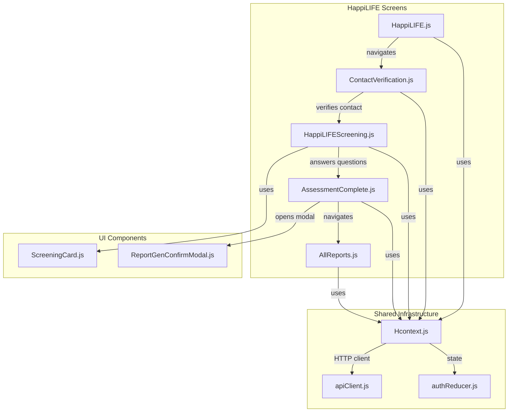
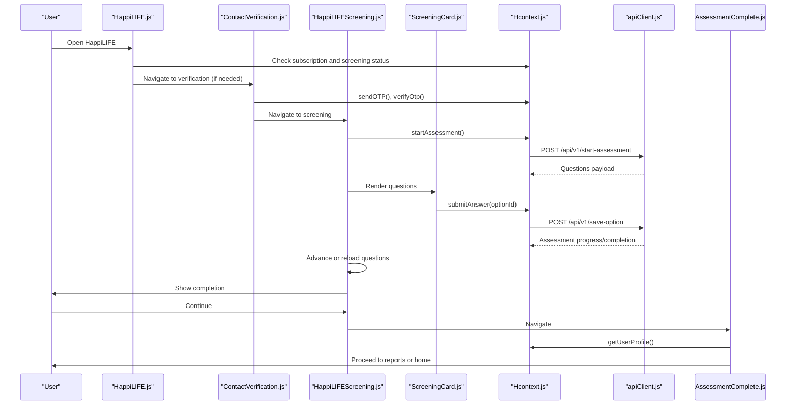
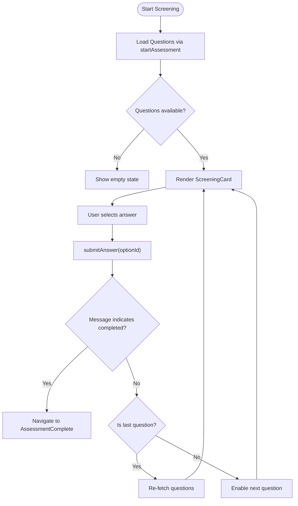
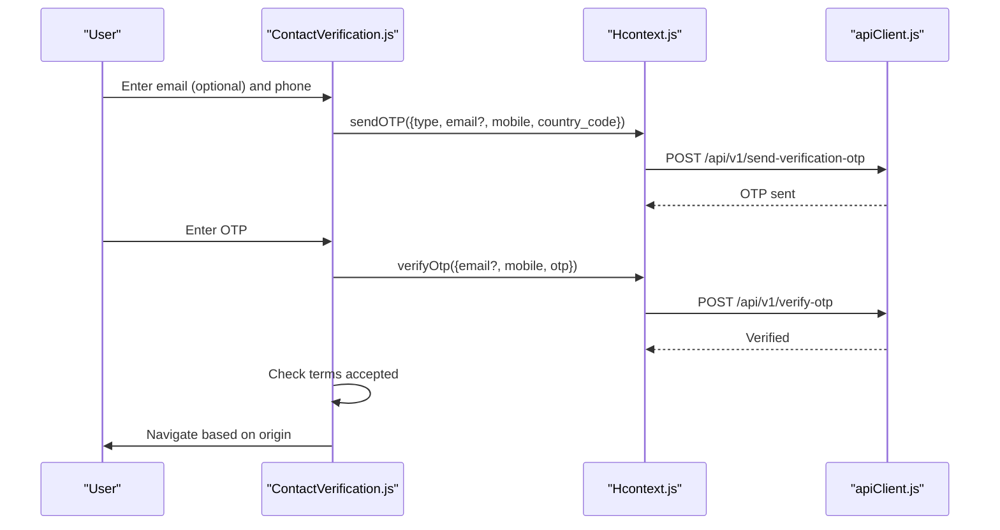
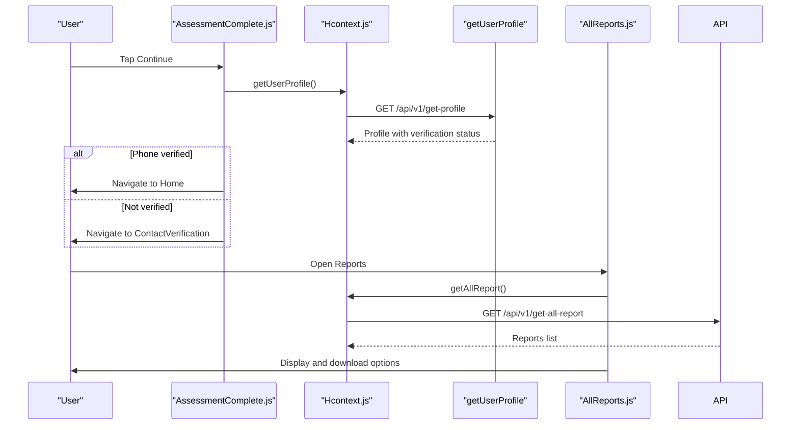
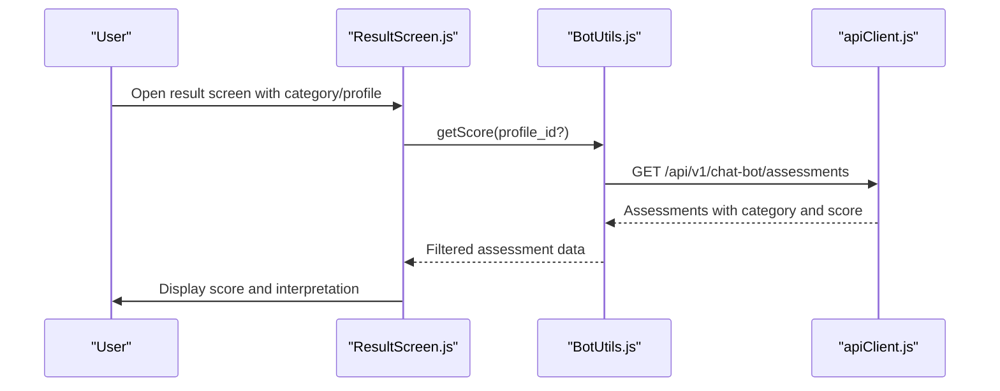
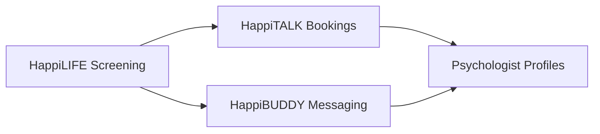
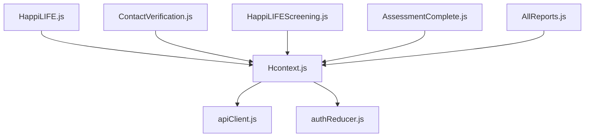

# HappiLIFE - Screening Module

<cite>
**Referenced Files in This Document**
- [HappiLIFEScreening.js](file://src/screens/HappiLIFE/HappiLIFEScreening.js)
- [ContactVerification.js](file://src/screens/HappiLIFE/ContactVerification.js)
- [AssessmentComplete.js](file://src/screens/HappiLIFE/AssessmentComplete.js)
- [AllReports.js](file://src/screens/HappiLIFE/AllReports.js)
- [HappiLIFE.js](file://src/screens/HappiLIFE/HappiLIFE.js)
- [ScreeningCard.js](file://src/components/cards/ScreeningCard.js)
- [Hcontext.js](file://src/context/Hcontext.js)
- [apiClient.js](file://src/context/apiClient.js)
- [authReducer.js](file://src/context/reducers/authReducer.js)
- [ReportGenConfirmModal.js](file://src/components/Modals/ReportGenConfirmModal.js)
- [PrivacyPolicy.js](file://src/screens/shared/PrivacyPolicy.js)
- [Terms.js](file://src/screens/shared/Terms.js)
- [Home.js](file://src/screens/Home/Home.js)
- [ResultScreen.js](file://src/screens/Chat/ResultScreen.js)
- [BotUtils.js](file://src/screens/Chat/BotUtils.js)
</cite>

## Table of Contents
1. [Introduction](#introduction)
2. [Project Structure](#project-structure)
3. [Core Components](#core-components)
4. [Architecture Overview](#architecture-overview)
5. [Detailed Component Analysis](#detailed-component-analysis)
6. [Dependency Analysis](#dependency-analysis)
7. [Performance Considerations](#performance-considerations)
8. [Troubleshooting Guide](#troubleshooting-guide)
9. [Conclusion](#conclusion)
10. [Appendices](#appendices)

## Introduction
This document describes the HappiLIFE screening module, the mental health awareness and assessment component of HappiMynd. It explains the end-to-end user journey from initial contact verification, through questionnaire administration, to result interpretation and report generation. It also documents the integration with healthcare professionals for follow-up care, privacy and security measures for sensitive health data, and compliance-related topics such as data retention and reporting.

## Project Structure
The HappiLIFE screening module is organized around dedicated screens and shared components:
- Screening workflow: HappiLIFE description → Contact verification → Questionnaire → Completion → Reports
- Shared infrastructure: Context provider for API calls and state, API client with interceptors, and reusable UI components
- Healthcare integration: Psychologist assignment and booking pathways are available in other modules and complement the screening experience

**Diagram sources**
- [HappiLIFE.js:120-177](file://src/screens/HappiLIFE/HappiLIFE.js#L120-L177)
- [ContactVerification.js:173-222](file://src/screens/HappiLIFE/ContactVerification.js#L173-L222)
- [HappiLIFEScreening.js:120-228](file://src/screens/HappiLIFE/HappiLIFEScreening.js#L120-L228)
- [AssessmentComplete.js:26-150](file://src/screens/HappiLIFE/AssessmentComplete.js#L26-L150)
- [AllReports.js:30-369](file://src/screens/HappiLIFE/AllReports.js#L30-L369)
- [ScreeningCard.js:21-177](file://src/components/cards/ScreeningCard.js#L21-L177)
- [ReportGenConfirmModal.js:21-121](file://src/components/Modals/ReportGenConfirmModal.js#L21-L121)
- [Hcontext.js:382-451](file://src/context/Hcontext.js#L382-L451)
- [apiClient.js:1-58](file://src/context/apiClient.js#L1-L58)
- [authReducer.js:1-79](file://src/context/reducers/authReducer.js#L1-L79)

**Section sources**
- [HappiLIFE.js:120-177](file://src/screens/HappiLIFE/HappiLIFE.js#L120-L177)
- [HappiLIFEScreening.js:120-228](file://src/screens/HappiLIFE/HappiLIFEScreening.js#L120-L228)
- [ContactVerification.js:173-222](file://src/screens/HappiLIFE/ContactVerification.js#L173-L222)
- [AssessmentComplete.js:26-150](file://src/screens/HappiLIFE/AssessmentComplete.js#L26-L150)
- [AllReports.js:30-369](file://src/screens/HappiLIFE/AllReports.js#L30-L369)
- [ScreeningCard.js:21-177](file://src/components/cards/ScreeningCard.js#L21-L177)
- [ReportGenConfirmModal.js:21-121](file://src/components/Modals/ReportGenConfirmModal.js#L21-L121)
- [Hcontext.js:382-451](file://src/context/Hcontext.js#L382-L451)
- [apiClient.js:1-58](file://src/context/apiClient.js#L1-L58)
- [authReducer.js:1-79](file://src/context/reducers/authReducer.js#L1-L79)

## Core Components
- HappiLIFE description screen: Presents module overview and initiates screening or report access depending on completion and subscription status.
- Contact verification: Collects optional email and required phone number, sends and verifies OTP, enforces terms acceptance, and routes to appropriate follow-up.
- Screening assessment: Loads questions, renders answer options, submits answers, and advances to completion.
- Assessment completion: Confirms completion, checks phone verification, and directs to home or verification.
- Reports: Lists previous reports, supports download and share actions per platform.
- Context provider: Centralizes API endpoints for assessments, OTP, reports, and user profile retrieval.
- API client: Adds bearer token automatically and standardizes error handling.
- Auth reducer: Tracks screening completion and availability flags.

**Section sources**
- [HappiLIFE.js:120-177](file://src/screens/HappiLIFE/HappiLIFE.js#L120-L177)
- [ContactVerification.js:173-222](file://src/screens/HappiLIFE/ContactVerification.js#L173-L222)
- [HappiLIFEScreening.js:120-228](file://src/screens/HappiLIFE/HappiLIFEScreening.js#L120-L228)
- [AssessmentComplete.js:26-150](file://src/screens/HappiLIFE/AssessmentComplete.js#L26-L150)
- [AllReports.js:30-369](file://src/screens/HappiLIFE/AllReports.js#L30-L369)
- [Hcontext.js:382-451](file://src/context/Hcontext.js#L382-L451)
- [apiClient.js:1-58](file://src/context/apiClient.js#L1-L58)
- [authReducer.js:1-79](file://src/context/reducers/authReducer.js#L1-L79)

## Architecture Overview
The screening workflow is driven by a centralized context that encapsulates HTTP interactions and state. The screens orchestrate navigation and user actions, while components encapsulate rendering and interactivity.

**Diagram sources**
- [HappiLIFE.js:120-177](file://src/screens/HappiLIFE/HappiLIFE.js#L120-L177)
- [ContactVerification.js:173-222](file://src/screens/HappiLIFE/ContactVerification.js#L173-L222)
- [HappiLIFEScreening.js:120-228](file://src/screens/HappiLIFE/HappiLIFEScreening.js#L120-L228)
- [ScreeningCard.js:44-97](file://src/components/cards/ScreeningCard.js#L44-L97)
- [Hcontext.js:382-427](file://src/context/Hcontext.js#L382-L427)
- [apiClient.js:1-58](file://src/context/apiClient.js#L1-L58)

## Detailed Component Analysis

### Screening Assessment Workflow
- Initial contact verification: Optional email, required phone with country code, OTP send/verify, terms acceptance, and routing based on origin.
- Questionnaire administration: Dynamically loads questions, disables prior items, enables next item upon selection, and re-fetches questions after the last answer until completion.
- Result interpretation and report generation: Completion screen confirms assessment, opens a confirmation modal, and routes to reports or home depending on phone verification.

**Diagram sources**
- [HappiLIFEScreening.js:120-151](file://src/screens/HappiLIFE/HappiLIFEScreening.js#L120-L151)
- [ScreeningCard.js:44-97](file://src/components/cards/ScreeningCard.js#L44-L97)
- [Hcontext.js:416-427](file://src/context/Hcontext.js#L416-L427)

**Section sources**
- [HappiLIFEScreening.js:120-228](file://src/screens/HappiLIFE/HappiLIFEScreening.js#L120-L228)
- [ScreeningCard.js:21-177](file://src/components/cards/ScreeningCard.js#L21-L177)
- [Hcontext.js:382-427](file://src/context/Hcontext.js#L382-L427)

### Contact Verification and Routing
- Collects optional email and required phone with country picker.
- Sends OTP to email/mobile and verifies OTP.
- Enforces terms acceptance with inline error feedback.
- Routes to appropriate destination based on origin (Talk, Guide, Voice, Bot, or Home).

**Diagram sources**
- [ContactVerification.js:119-222](file://src/screens/HappiLIFE/ContactVerification.js#L119-L222)
- [Hcontext.js:667-698](file://src/context/Hcontext.js#L667-L698)
- [apiClient.js:1-58](file://src/context/apiClient.js#L1-L58)

**Section sources**
- [ContactVerification.js:119-222](file://src/screens/HappiLIFE/ContactVerification.js#L119-L222)
- [Hcontext.js:667-698](file://src/context/Hcontext.js#L667-L698)

### Assessment Completion and Reports
- Completion screen checks phone verification via user profile and routes accordingly.
- Confirmation modal appears on completion; user can continue or cancel.
- Reports screen lists previous reports, formats timestamps, and supports platform-specific download and share.

**Diagram sources**
- [AssessmentComplete.js:26-150](file://src/screens/HappiLIFE/AssessmentComplete.js#L26-L150)
- [AllReports.js:30-369](file://src/screens/HappiLIFE/AllReports.js#L30-L369)
- [Hcontext.js:441-451](file://src/context/Hcontext.js#L441-L451)
- [apiClient.js:1-58](file://src/context/apiClient.js#L1-L58)

**Section sources**
- [AssessmentComplete.js:26-150](file://src/screens/HappiLIFE/AssessmentComplete.js#L26-L150)
- [AllReports.js:30-369](file://src/screens/HappiLIFE/AllReports.js#L30-L369)
- [Hcontext.js:441-451](file://src/context/Hcontext.js#L441-L451)

### Assessment Types and Scoring
- The screening module focuses on awareness summarization and emotional wellbeing parameters. Scoring and interpretation are demonstrated in chat bot assessment screens, which provide category-based scores and interpretations.
- The screening module itself does not expose explicit scoring algorithms; interpretation is delivered via the chat bot result screen and can be linked to categories and profiles.

**Diagram sources**
- [ResultScreen.js:24-94](file://src/screens/Chat/ResultScreen.js#L24-L94)
- [BotUtils.js:61-82](file://src/screens/Chat/BotUtils.js#L61-L82)
- [Hcontext.js:429-439](file://src/context/Hcontext.js#L429-L439)
- [apiClient.js:1-58](file://src/context/apiClient.js#L1-L58)

**Section sources**
- [ResultScreen.js:24-94](file://src/screens/Chat/ResultScreen.js#L24-L94)
- [BotUtils.js:48-82](file://src/screens/Chat/BotUtils.js#L48-L82)

### Healthcare Professional Integration and Follow-up Care
- The screening module integrates with broader HappiMynd services for follow-up care:
  - Psychologist assignment and messaging are available in HappiTALK and HappiBUDDY modules.
  - Booking and management of psychologist sessions are supported in HappiTALK.
- These integrations complement the screening by enabling users to schedule sessions and receive expert interpretation of their awareness summaries.

[No sources needed since this diagram shows conceptual relationships, not specific code structure]

**Section sources**
- [Home.js:91-138](file://src/screens/Home/Home.js#L91-L138)

## Dependency Analysis
- Screens depend on the context provider for API calls and state.
- The API client injects bearer tokens from global or AsyncStorage and centralizes error handling.
- The auth reducer tracks screening completion flags used by screens to decide navigation.

**Diagram sources**
- [HappiLIFE.js:120-177](file://src/screens/HappiLIFE/HappiLIFE.js#L120-L177)
- [ContactVerification.js:173-222](file://src/screens/HappiLIFE/ContactVerification.js#L173-L222)
- [HappiLIFEScreening.js:120-228](file://src/screens/HappiLIFE/HappiLIFEScreening.js#L120-L228)
- [AssessmentComplete.js:26-150](file://src/screens/HappiLIFE/AssessmentComplete.js#L26-L150)
- [AllReports.js:30-369](file://src/screens/HappiLIFE/AllReports.js#L30-L369)
- [Hcontext.js:382-451](file://src/context/Hcontext.js#L382-L451)
- [apiClient.js:1-58](file://src/context/apiClient.js#L1-L58)
- [authReducer.js:1-79](file://src/context/reducers/authReducer.js#L1-L79)

**Section sources**
- [Hcontext.js:382-451](file://src/context/Hcontext.js#L382-L451)
- [apiClient.js:1-58](file://src/context/apiClient.js#L1-L58)
- [authReducer.js:1-79](file://src/context/reducers/authReducer.js#L1-L79)

## Performance Considerations
- Network timeouts: The API client sets a 15-second timeout to prevent hanging requests.
- Token caching: The API client attempts to read the token from AsyncStorage if not present globally, reducing repeated lookups.
- UI responsiveness: The screening screen defers loading until the assessment is fetched, and disables prior questions to avoid accidental re-entry.
- Platform-specific downloads: Reports download and share actions are adapted per platform to optimize user experience.

[No sources needed since this section provides general guidance]

## Troubleshooting Guide
- Authentication errors: The API client logs missing tokens and attaches them when available. Errors are surfaced via snack notifications in screens.
- OTP issues: OTP send/verify endpoints surface user-friendly messages for duplicate emails or mobile numbers.
- Assessment loading failures: The screening screen displays a snackbar and clears the question list if no questions are returned.
- Report fetch/download failures: The reports screen handles server errors and platform-specific download/share failures with alerts.

**Section sources**
- [apiClient.js:1-58](file://src/context/apiClient.js#L1-L58)
- [Hcontext.js:382-451](file://src/context/Hcontext.js#L382-L451)
- [ContactVerification.js:667-698](file://src/screens/HappiLIFE/ContactVerification.js#L667-L698)
- [HappiLIFEScreening.js:120-151](file://src/screens/HappiLIFE/HappiLIFEScreening.js#L120-L151)
- [AllReports.js:118-173](file://src/screens/HappiLIFE/AllReports.js#L118-L173)

## Conclusion
The HappiLIFE screening module provides a streamlined pathway for users to complete an awareness assessment, verify contact details, and access generated reports. It leverages a centralized context for API interactions, robust error handling, and platform-aware download capabilities. Integration with healthcare professionals is facilitated through companion modules for booking and messaging, ensuring continuity of care following screening completion.

## Appendices

### Privacy and Security Measures
- Privacy policy and terms documents outline confidentiality, third-party disclosure, and security measures for protecting personal and health information.
- Users are informed about secure handling of information and recommended best practices for account security.

**Section sources**
- [PrivacyPolicy.js:1-89](file://src/screens/shared/PrivacyPolicy.js#L1-L89)
- [Terms.js:57-67](file://src/screens/shared/Terms.js#L57-L67)

### Compliance and Data Retention
- Terms describe termination of agreements and user obligations regarding information removal upon request.
- Privacy policy emphasizes confidentiality and security safeguards, including staff obligations and exceptions to disclosure.

**Section sources**
- [Terms.js:57-67](file://src/screens/shared/Terms.js#L57-L67)
- [PrivacyPolicy.js:70-89](file://src/screens/shared/PrivacyPolicy.js#L70-L89)

### External Healthcare Systems and Referral Pathways
- Psychologist assignment and messaging are integrated via HappiTALK and HappiBUDDY modules, enabling users to connect with professionals for follow-up care.
- Booking and session management are supported through dedicated screens and components.

**Section sources**
- [Home.js:91-138](file://src/screens/Home/Home.js#L91-L138)