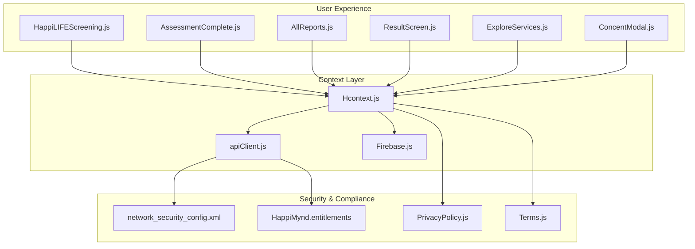
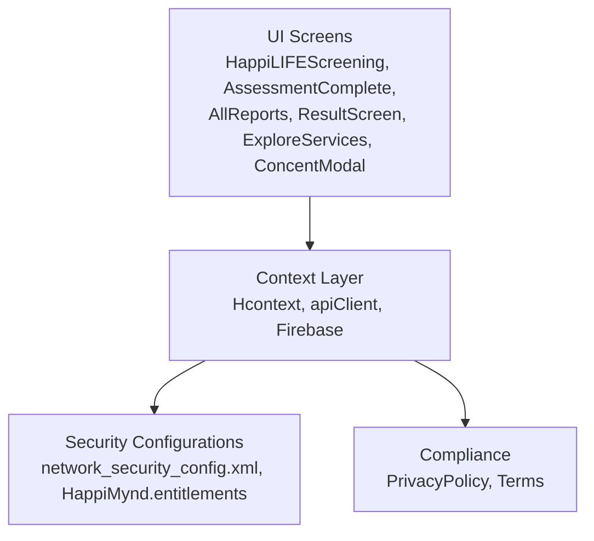
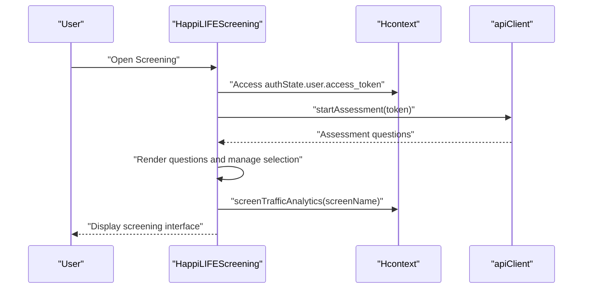
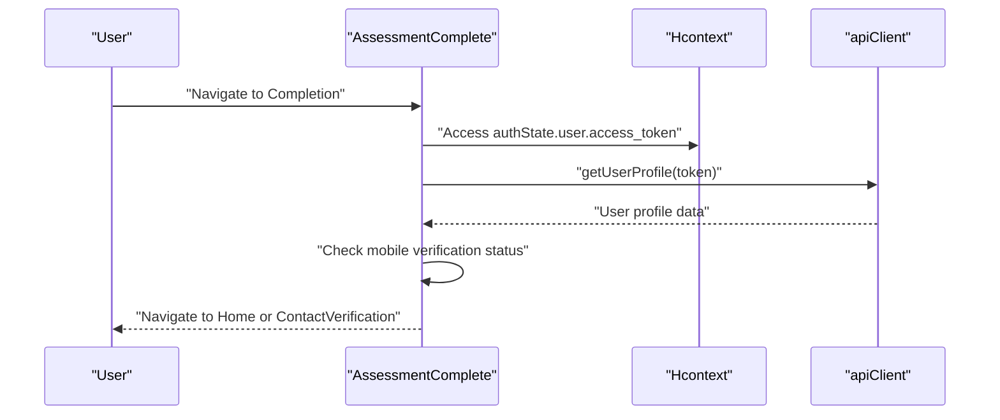
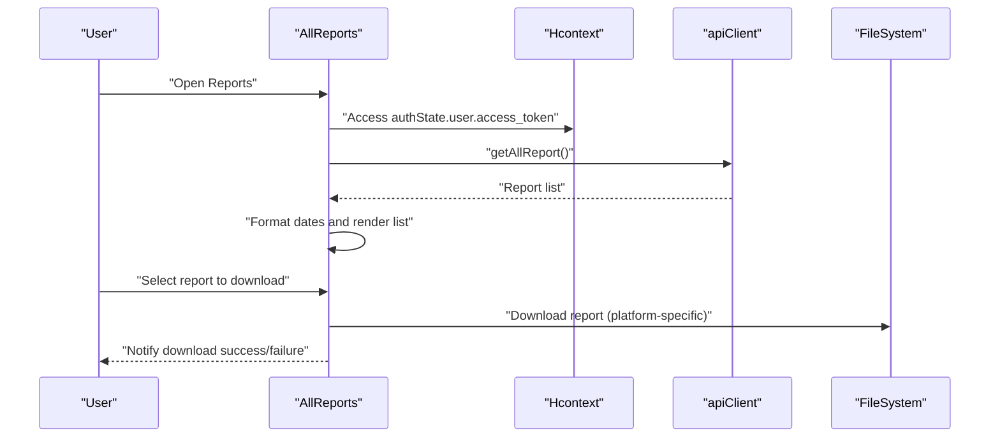
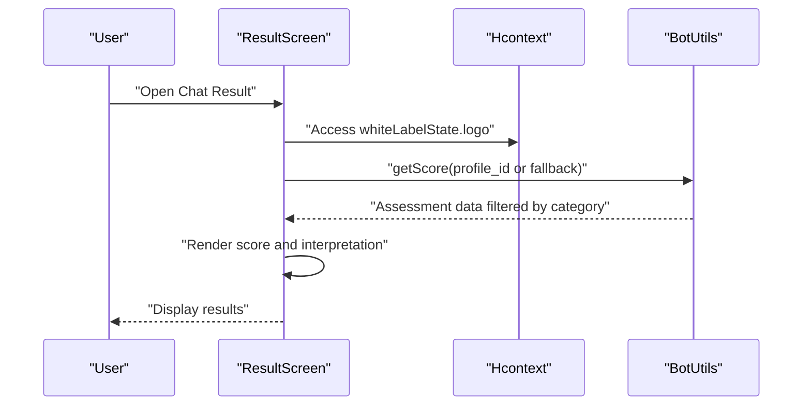
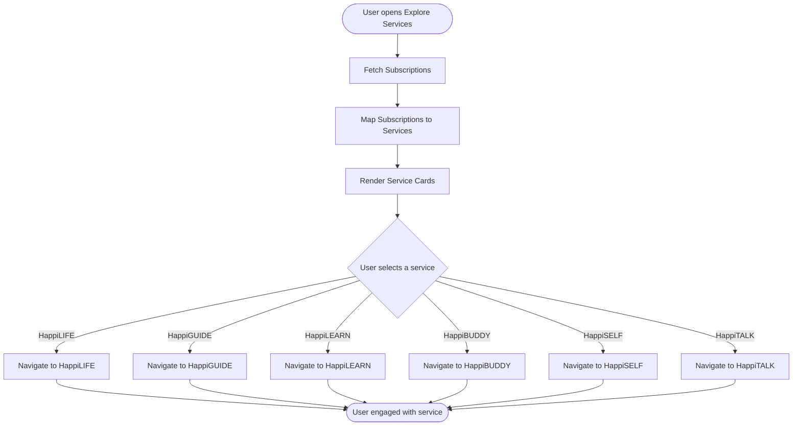
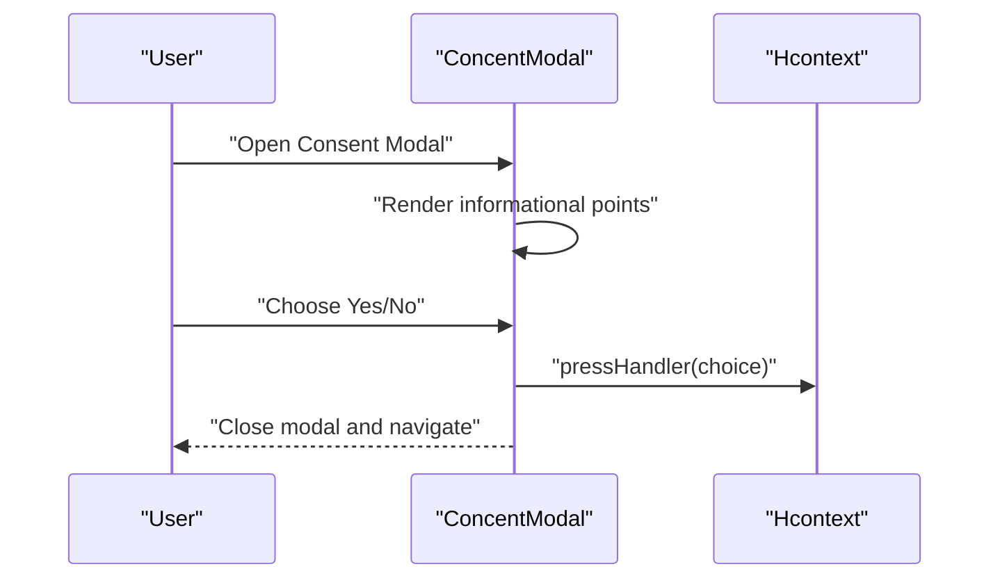
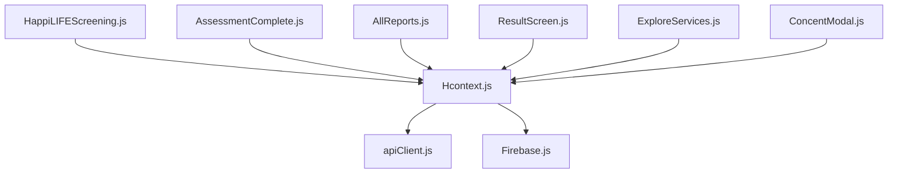
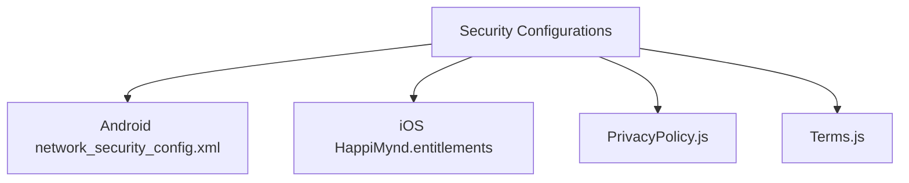

# Healthcare Professional Integration

<cite>
**Referenced Files in This Document**
- [HappiLIFEScreening.js](file://src/screens/HappiLIFE/HappiLIFEScreening.js)
- [AssessmentComplete.js](file://src/screens/HappiLIFE/AssessmentComplete.js)
- [AllReports.js](file://src/screens/HappiLIFE/AllReports.js)
- [ResultScreen.js](file://src/screens/Chat/ResultScreen.js)
- [ExploreServices.js](file://src/screens/Individual/ExploreServices.js)
- [ConcentModal.js](file://src/components/Modals/ConcentModal.js)
- [Hcontext.js](file://src/context/Hcontext.js)
- [Firebase.js](file://src/context/Firebase.js)
- [apiClient.js](file://src/context/apiClient.js)
- [android network_security_config.xml](file://android/app/src/main/res/xml/network_security_config.xml)
- [iOS HappiMynd.entitlements](file://ios/HappiMynd/HappiMynd.entitlements)
- [PrivacyPolicy.js](file://src/screens/shared/PrivacyPolicy.js)
- [Terms.js](file://src/screens/shared/Terms.js)
</cite>

## Table of Contents
1. [Introduction](#introduction)
2. [Project Structure](#project-structure)
3. [Core Components](#core-components)
4. [Architecture Overview](#architecture-overview)
5. [Detailed Component Analysis](#detailed-component-analysis)
6. [Dependency Analysis](#dependency-analysis)
7. [Performance Considerations](#performance-considerations)
8. [Troubleshooting Guide](#troubleshooting-guide)
9. [HIPAA Compliance and Security](#hipaa-compliance-and-security)
10. [Consent Management](#consent-management)
11. [Integration with External Systems](#integration-with-external-systems)
12. [Professional Dashboard Features](#professional-dashboard-features)
13. [Conclusion](#conclusion)

## Introduction
This document provides comprehensive documentation for the healthcare professional integration and referral systems within the HappiMynd application. It explains how screening results are transmitted to healthcare providers, the secure communication channels used, the referral pathways connecting users to mental health services, and the professional dashboard features enabling healthcare providers to manage patient care. It also details privacy and security measures required for HIPAA compliance, integration with external healthcare systems and EHR platforms, and the consent management system for sharing sensitive health information.

## Project Structure
The healthcare integration spans several key areas:
- Screening and assessment workflows for mental health evaluation
- Report generation and distribution
- Referral pathways to specialized services
- Consent management for recording and sharing sessions
- Professional dashboard capabilities for healthcare providers
- Security and privacy configurations for HIPAA compliance

**Diagram sources**
- [HappiLIFEScreening.js](file://src/screens/HappiLIFE/HappiLIFEScreening.js)
- [AssessmentComplete.js](file://src/screens/HappiLIFE/AssessmentComplete.js)
- [AllReports.js](file://src/screens/HappiLIFE/AllReports.js)
- [ResultScreen.js](file://src/screens/Chat/ResultScreen.js)
- [ExploreServices.js](file://src/screens/Individual/ExploreServices.js)
- [ConcentModal.js](file://src/components/Modals/ConcentModal.js)
- [Hcontext.js](file://src/context/Hcontext.js)
- [apiClient.js](file://src/context/apiClient.js)
- [Firebase.js](file://src/context/Firebase.js)
- [android network_security_config.xml](file://android/app/src/main/res/xml/network_security_config.xml)
- [iOS HappiMynd.entitlements](file://ios/HappiMynd/HappiMynd.entitlements)
- [PrivacyPolicy.js](file://src/screens/shared/PrivacyPolicy.js)
- [Terms.js](file://src/screens/shared/Terms.js)

**Section sources**
- [HappiLIFEScreening.js](file://src/screens/HappiLIFE/HappiLIFEScreening.js)
- [AssessmentComplete.js](file://src/screens/HappiLIFE/AssessmentComplete.js)
- [AllReports.js](file://src/screens/HappiLIFE/AllReports.js)
- [ResultScreen.js](file://src/screens/Chat/ResultScreen.js)
- [ExploreServices.js](file://src/screens/Individual/ExploreServices.js)
- [ConcentModal.js](file://src/components/Modals/ConcentModal.js)
- [Hcontext.js](file://src/context/Hcontext.js)
- [apiClient.js](file://src/context/apiClient.js)
- [Firebase.js](file://src/context/Firebase.js)
- [android network_security_config.xml](file://android/app/src/main/res/xml/network_security_config.xml)
- [iOS HappiMynd.entitlements](file://ios/HappiMynd/HappiMynd.entitlements)
- [PrivacyPolicy.js](file://src/screens/shared/PrivacyPolicy.js)
- [Terms.js](file://src/screens/shared/Terms.js)

## Core Components
- Screening and Assessment: Users complete mental health screenings via a structured questionnaire interface, with analytics and traffic logging integrated.
- Report Generation and Distribution: Users can view and download generated reports, with platform-specific handling for iOS and Android.
- Referral Pathways: The Explore Services screen presents available mental health services and directs users to appropriate programs based on their assessment outcomes.
- Consent Management: A dedicated modal allows users to consent to session recording, ensuring transparency and compliance with privacy regulations.
- Professional Dashboard: Healthcare providers can access patient reports and manage follow-up care through integrated reporting and navigation.
- Security and Compliance: Network security configurations and privacy policies support HIPAA-compliant data handling.

**Section sources**
- [HappiLIFEScreening.js](file://src/screens/HappiLIFE/HappiLIFEScreening.js)
- [AssessmentComplete.js](file://src/screens/HappiLIFE/AssessmentComplete.js)
- [AllReports.js](file://src/screens/HappiLIFE/AllReports.js)
- [ExploreServices.js](file://src/screens/Individual/ExploreServices.js)
- [ConcentModal.js](file://src/components/Modals/ConcentModal.js)
- [Hcontext.js](file://src/context/Hcontext.js)

## Architecture Overview
The healthcare integration follows a layered architecture:
- Presentation Layer: Screens for screening, assessment completion, reports, chat results, service exploration, and consent management.
- Context Layer: Centralized state and API client management for authentication, assessment workflows, and report retrieval.
- Security Layer: Platform-specific network security configurations and entitlements for secure communications.
- Compliance Layer: Privacy policy and terms integration to ensure regulatory adherence.

**Diagram sources**
- [HappiLIFEScreening.js](file://src/screens/HappiLIFE/HappiLIFEScreening.js)
- [AssessmentComplete.js](file://src/screens/HappiLIFE/AssessmentComplete.js)
- [AllReports.js](file://src/screens/HappiLIFE/AllReports.js)
- [ResultScreen.js](file://src/screens/Chat/ResultScreen.js)
- [ExploreServices.js](file://src/screens/Individual/ExploreServices.js)
- [ConcentModal.js](file://src/components/Modals/ConcentModal.js)
- [Hcontext.js](file://src/context/Hcontext.js)
- [apiClient.js](file://src/context/apiClient.js)
- [Firebase.js](file://src/context/Firebase.js)
- [android network_security_config.xml](file://android/app/src/main/res/xml/network_security_config.xml)
- [iOS HappiMynd.entitlements](file://ios/HappiMynd/HappiMynd.entitlements)
- [PrivacyPolicy.js](file://src/screens/shared/PrivacyPolicy.js)
- [Terms.js](file://src/screens/shared/Terms.js)

## Detailed Component Analysis

### Screening and Assessment Workflow
The screening workflow enables users to complete mental health assessments with progress tracking and analytics logging. The component initializes by retrieving assessment data using an access token, manages question rendering, and ensures controlled progression through the questionnaire.

**Diagram sources**
- [HappiLIFEScreening.js](file://src/screens/HappiLIFE/HappiLIFEScreening.js)
- [Hcontext.js](file://src/context/Hcontext.js)
- [apiClient.js](file://src/context/apiClient.js)

**Section sources**
- [HappiLIFEScreening.js](file://src/screens/HappiLIFE/HappiLIFEScreening.js)
- [Hcontext.js](file://src/context/Hcontext.js)

### Assessment Completion and Navigation
After completing the assessment, users are directed to a completion screen that verifies phone verification status and navigates to the home screen or contact verification as appropriate. The screen logs analytics and retrieves user profile information to determine next steps.

**Diagram sources**
- [AssessmentComplete.js](file://src/screens/HappiLIFE/AssessmentComplete.js)
- [Hcontext.js](file://src/context/Hcontext.js)
- [apiClient.js](file://src/context/apiClient.js)

**Section sources**
- [AssessmentComplete.js](file://src/screens/HappiLIFE/AssessmentComplete.js)
- [Hcontext.js](file://src/context/Hcontext.js)

### Report Generation and Distribution
The reports screen allows users to view and download their assessment reports. It supports platform-specific download mechanisms for Android and iOS, including file system handling and sharing capabilities.

**Diagram sources**
- [AllReports.js](file://src/screens/HappiLIFE/AllReports.js)
- [Hcontext.js](file://src/context/Hcontext.js)
- [apiClient.js](file://src/context/apiClient.js)

**Section sources**
- [AllReports.js](file://src/screens/HappiLIFE/AllReports.js)
- [Hcontext.js](file://src/context/Hcontext.js)

### Chat Results and Interpretation
The chat result screen displays assessment scores and interpretations, integrating with bot utilities to retrieve and filter assessment data based on category identifiers.

**Diagram sources**
- [ResultScreen.js](file://src/screens/Chat/ResultScreen.js)
- [Hcontext.js](file://src/context/Hcontext.js)

**Section sources**
- [ResultScreen.js](file://src/screens/Chat/ResultScreen.js)
- [Hcontext.js](file://src/context/Hcontext.js)

### Referral Pathways and Service Exploration
The explore services screen presents available mental health services and maps user subscriptions to appropriate navigation targets. It integrates with subscription data to guide users toward relevant programs such as HappiLIFE, HappiGUIDE, HappiLEARN, HappiBUDDY, HappiSELF, and HappiTALK.

**Diagram sources**
- [ExploreServices.js](file://src/screens/Individual/ExploreServices.js)
- [Hcontext.js](file://src/context/Hcontext.js)

**Section sources**
- [ExploreServices.js](file://src/screens/Individual/ExploreServices.js)
- [Hcontext.js](file://src/context/Hcontext.js)

### Consent Management for Recording Sessions
The consent modal provides users with the option to consent to session recording, ensuring transparency and compliance with privacy regulations. The modal renders informational points and captures user choice via callback handlers.

**Diagram sources**
- [ConcentModal.js](file://src/components/Modals/ConcentModal.js)
- [Hcontext.js](file://src/context/Hcontext.js)

**Section sources**
- [ConcentModal.js](file://src/components/Modals/ConcentModal.js)
- [Hcontext.js](file://src/context/Hcontext.js)

## Dependency Analysis
The healthcare integration relies on centralized context management for authentication, assessment workflows, and API interactions. The context layer coordinates with the API client and Firebase for secure communications and state management.

**Diagram sources**
- [Hcontext.js](file://src/context/Hcontext.js)
- [apiClient.js](file://src/context/apiClient.js)
- [Firebase.js](file://src/context/Firebase.js)
- [HappiLIFEScreening.js](file://src/screens/HappiLIFE/HappiLIFEScreening.js)
- [AssessmentComplete.js](file://src/screens/HappiLIFE/AssessmentComplete.js)
- [AllReports.js](file://src/screens/HappiLIFE/AllReports.js)
- [ResultScreen.js](file://src/screens/Chat/ResultScreen.js)
- [ExploreServices.js](file://src/screens/Individual/ExploreServices.js)
- [ConcentModal.js](file://src/components/Modals/ConcentModal.js)

**Section sources**
- [Hcontext.js](file://src/context/Hcontext.js)
- [apiClient.js](file://src/context/apiClient.js)
- [Firebase.js](file://src/context/Firebase.js)
- [HappiLIFEScreening.js](file://src/screens/HappiLIFE/HappiLIFEScreening.js)
- [AssessmentComplete.js](file://src/screens/HappiLIFE/AssessmentComplete.js)
- [AllReports.js](file://src/screens/HappiLIFE/AllReports.js)
- [ResultScreen.js](file://src/screens/Chat/ResultScreen.js)
- [ExploreServices.js](file://src/screens/Individual/ExploreServices.js)
- [ConcentModal.js](file://src/components/Modals/ConcentModal.js)

## Performance Considerations
- Efficient rendering: Use FlatList for report lists and controlled question rendering to minimize re-renders during screening.
- Network optimization: Implement caching for frequently accessed assessment data and limit unnecessary API calls.
- Platform-specific handling: Optimize file downloads for iOS and Android to reduce memory usage and improve user experience.
- Analytics logging: Ensure analytics events are batched and debounced to avoid performance degradation.

## Troubleshooting Guide
- Screening loading issues: Verify access token availability and handle API errors gracefully with user notifications.
- Report download failures: Check platform-specific download paths and permissions; ensure proper error handling for network issues.
- Navigation problems: Confirm subscription mapping logic and navigation targets to prevent incorrect routing.
- Consent modal behavior: Validate callback handlers and ensure modal visibility state is properly managed.

**Section sources**
- [HappiLIFEScreening.js](file://src/screens/HappiLIFE/HappiLIFEScreening.js)
- [AllReports.js](file://src/screens/HappiLIFE/AllReports.js)
- [ExploreServices.js](file://src/screens/Individual/ExploreServices.js)
- [ConcentModal.js](file://src/components/Modals/ConcentModal.js)

## HIPAA Compliance and Security
The application implements platform-specific security configurations to support HIPAA-compliant data handling:
- Android network security: Enforces strict TLS requirements and cleartext policy for secure communications.
- iOS entitlements: Manages app capabilities and security settings for secure data transmission.
- Privacy policy and terms: Integrates legal compliance documents to ensure user consent and regulatory adherence.

**Diagram sources**
- [android network_security_config.xml](file://android/app/src/main/res/xml/network_security_config.xml)
- [iOS HappiMynd.entitlements](file://ios/HappiMynd/HappiMynd.entitlements)
- [PrivacyPolicy.js](file://src/screens/shared/PrivacyPolicy.js)
- [Terms.js](file://src/screens/shared/Terms.js)

**Section sources**
- [android network_security_config.xml](file://android/app/src/main/res/xml/network_security_config.xml)
- [iOS HappiMynd.entitlements](file://ios/HappiMynd/HappiMynd.entitlements)
- [PrivacyPolicy.js](file://src/screens/shared/PrivacyPolicy.js)
- [Terms.js](file://src/screens/shared/Terms.js)

## Consent Management
The consent modal provides a clear interface for users to decide whether to allow session recording. It displays informational points and captures user choice via callback handlers, ensuring transparency and compliance with privacy regulations.

**Section sources**
- [ConcentModal.js](file://src/components/Modals/ConcentModal.js)

## Integration with External Systems
External integrations are managed through the context layer and API client:
- Authentication: Centralized authentication state and token management.
- Assessment APIs: Secure API calls for retrieving assessment data and submitting answers.
- Reporting APIs: Secure API calls for fetching and downloading reports.
- Subscription APIs: Integration with subscription services to guide users to appropriate mental health programs.

**Section sources**
- [Hcontext.js](file://src/context/Hcontext.js)
- [apiClient.js](file://src/context/apiClient.js)

## Professional Dashboard Features
Healthcare providers can leverage the integrated reporting system to:
- Access patient reports for review and follow-up care planning.
- Navigate users to appropriate mental health services based on assessment results.
- Utilize analytics and traffic logging to monitor engagement and outcomes.

**Section sources**
- [AllReports.js](file://src/screens/HappiLIFE/AllReports.js)
- [ExploreServices.js](file://src/screens/Individual/ExploreServices.js)
- [Hcontext.js](file://src/context/Hcontext.js)

## Conclusion
The healthcare professional integration within HappiMynd provides a comprehensive framework for screening, assessment, reporting, and referral pathways. Through secure communication channels, HIPAA-compliant configurations, and robust consent management, the system ensures privacy and regulatory adherence while facilitating seamless connections between users and mental health services. The professional dashboard features enable healthcare providers to effectively manage patient care and support ongoing therapeutic interventions.