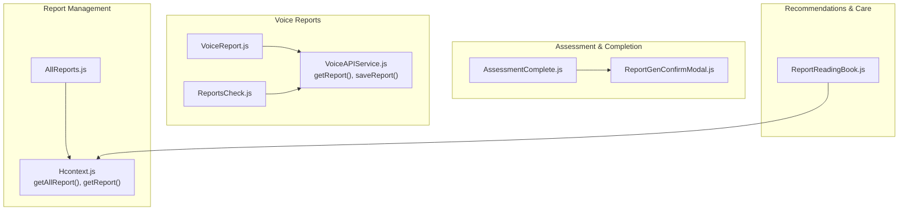
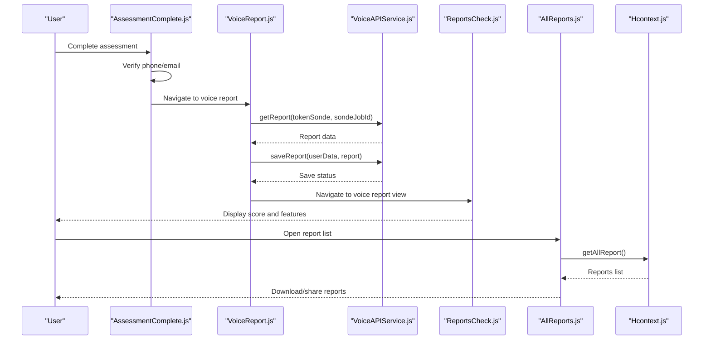
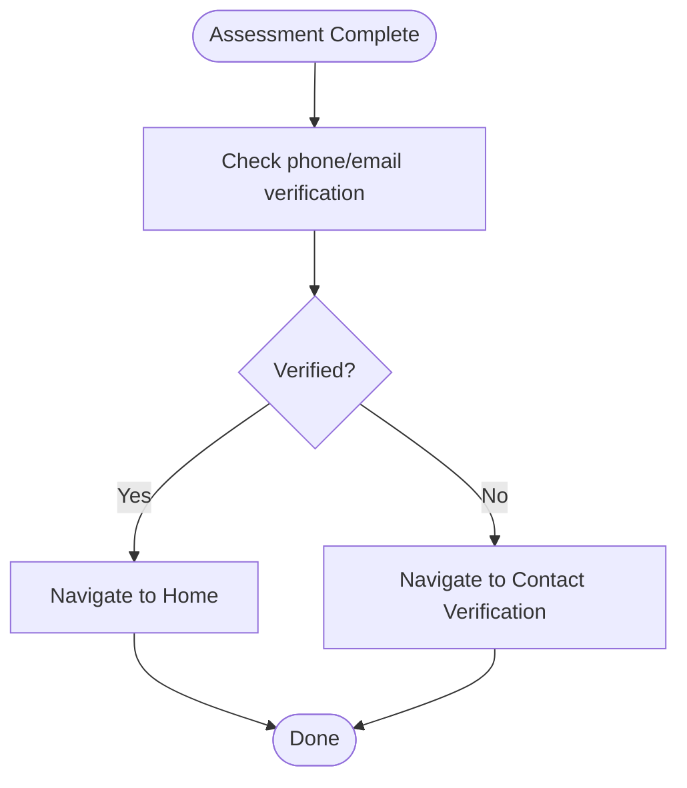
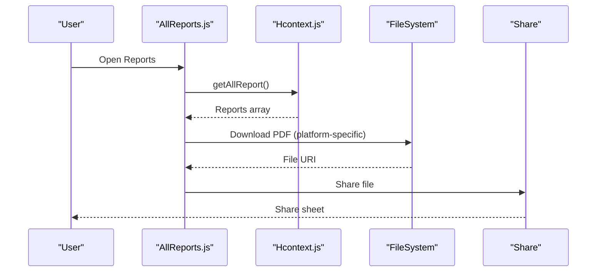
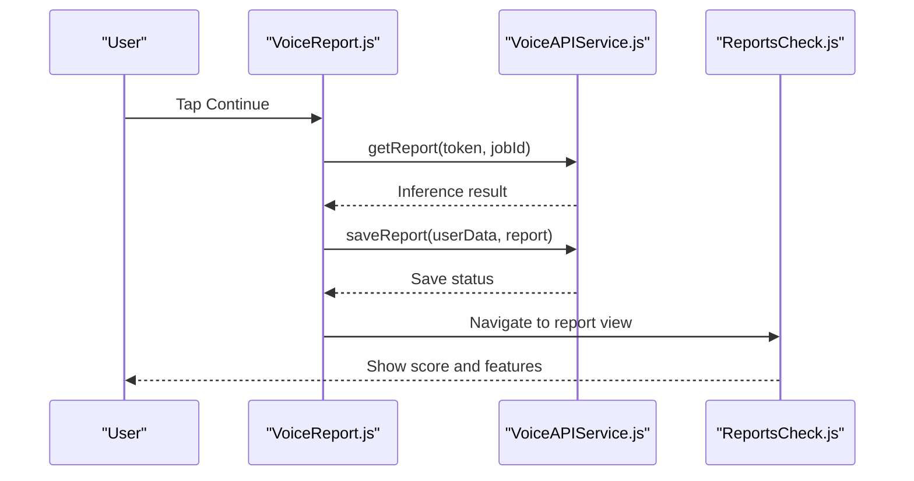
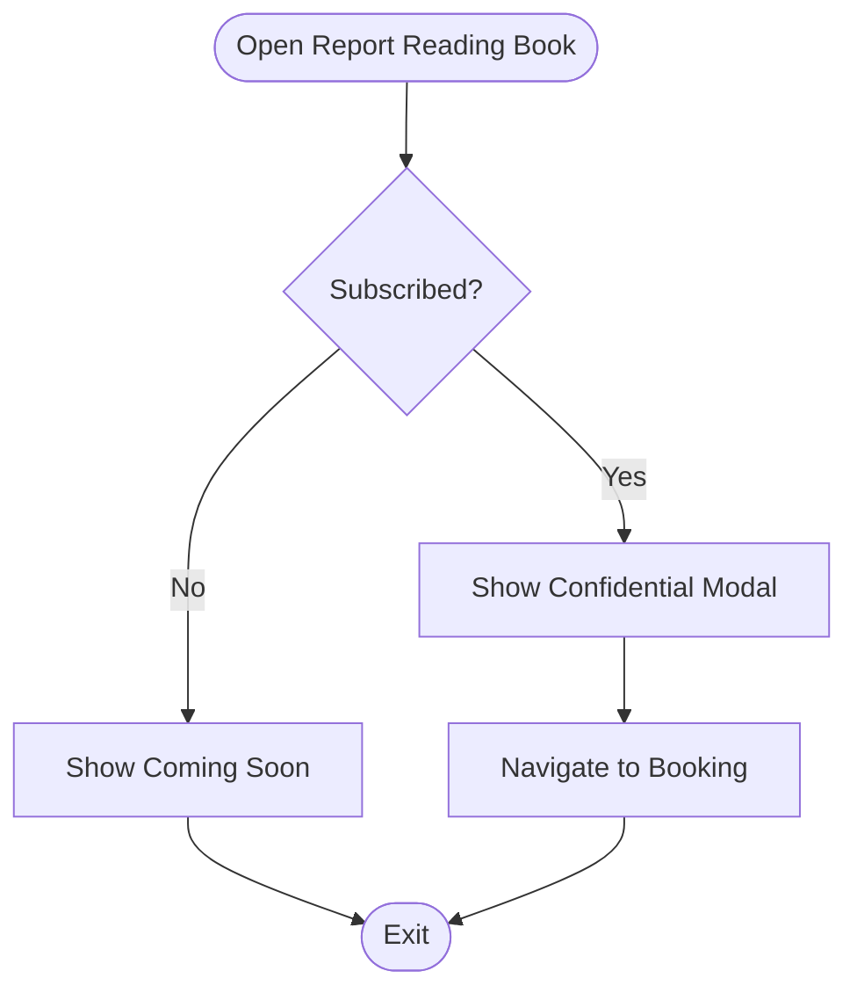
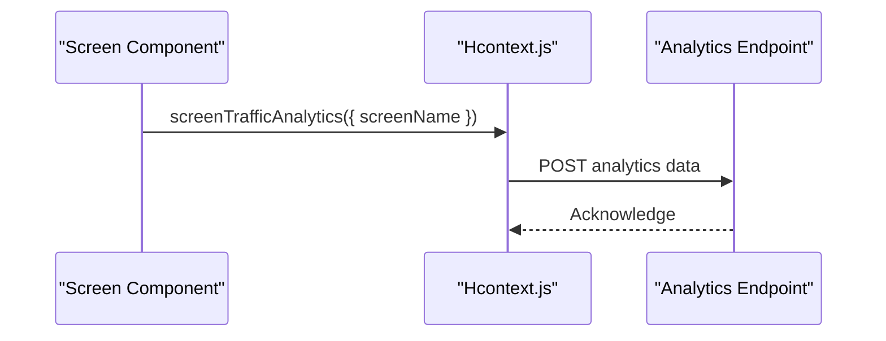
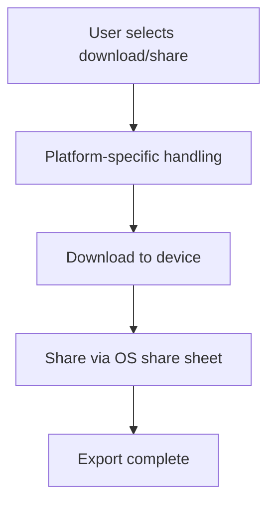
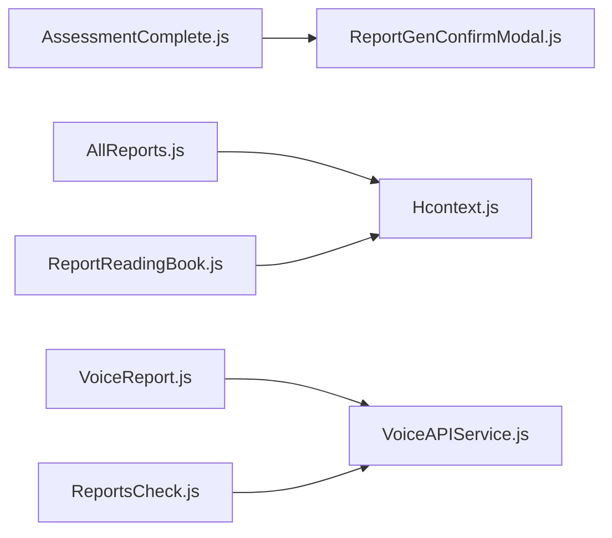

# Report Generation System

<cite>
**Referenced Files in This Document**
- [AllReports.js](file://src/screens/HappiLIFE/AllReports.js)
- [AssessmentComplete.js](file://src/screens/HappiLIFE/AssessmentComplete.js)
- [VoiceReport.js](file://src/screens/HappiVOICE/VoiceReport.js)
- [ReportsCheck.js](file://src/screens/HappiVOICE/ReportsCheck.js)
- [VoiceAPIService.js](file://src/screens/HappiVOICE/VoiceAPIService.js)
- [ReportReadingBook.js](file://src/screens/Individual/ReportReadingBook.js)
- [ReportGenConfirmModal.js](file://src/components/Modals/ReportGenConfirmModal.js)
- [Hcontext.js](file://src/context/Hcontext.js)
- [PrivacyPolicy.js](file://src/screens/shared/PrivacyPolicy.js)
</cite>

## Table of Contents
1. [Introduction](#introduction)
2. [Project Structure](#project-structure)
3. [Core Components](#core-components)
4. [Architecture Overview](#architecture-overview)
5. [Detailed Component Analysis](#detailed-component-analysis)
6. [Dependency Analysis](#dependency-analysis)
7. [Performance Considerations](#performance-considerations)
8. [Troubleshooting Guide](#troubleshooting-guide)
9. [Conclusion](#conclusion)

## Introduction
This document describes the report generation and management system for personalized mental health insights. The system integrates assessment completion, report creation, storage, retrieval, and sharing, while supporting both traditional screening reports and voice-based mental fitness reports. It also outlines how healthcare professional recommendations and follow-up care pathways are surfaced to users, and documents privacy and security measures for sensitive health information.

## Project Structure
The report system spans multiple screens and services:
- Assessment completion and confirmation
- Report listing and retrieval
- Voice-based report generation and presentation
- Healthcare professional recommendation integration
- Storage, sharing, and analytics
- Privacy and security policies

**Diagram sources**
- [AssessmentComplete.js:26-150](file://src/screens/HappiLIFE/AssessmentComplete.js#L26-L150)
- [ReportGenConfirmModal.js:21-122](file://src/components/Modals/ReportGenConfirmModal.js#L21-L122)
- [AllReports.js:30-276](file://src/screens/HappiLIFE/AllReports.js#L30-L276)
- [Hcontext.js:441-451](file://src/context/Hcontext.js#L441-L451)
- [VoiceReport.js:27-200](file://src/screens/HappiVOICE/VoiceReport.js#L27-L200)
- [ReportsCheck.js:14-282](file://src/screens/HappiVOICE/ReportsCheck.js#L14-L282)
- [VoiceAPIService.js:187-264](file://src/screens/HappiVOICE/VoiceAPIService.js#L187-L264)
- [ReportReadingBook.js:40-184](file://src/screens/Individual/ReportReadingBook.js#L40-L184)

**Section sources**
- [AllReports.js:30-276](file://src/screens/HappiLIFE/AllReports.js#L30-L276)
- [AssessmentComplete.js:26-150](file://src/screens/HappiLIFE/AssessmentComplete.js#L26-L150)
- [VoiceReport.js:27-200](file://src/screens/HappiVOICE/VoiceReport.js#L27-L200)
- [ReportsCheck.js:14-282](file://src/screens/HappiVOICE/ReportsCheck.js#L14-L282)
- [VoiceAPIService.js:187-264](file://src/screens/HappiVOICE/VoiceAPIService.js#L187-L264)
- [ReportReadingBook.js:40-184](file://src/screens/Individual/ReportReadingBook.js#L40-L184)
- [Hcontext.js:441-451](file://src/context/Hcontext.js#L441-L451)

## Core Components
- Assessment completion screen with verification gating and confirmation modal
- Report listing screen with download and share capabilities
- Voice report pipeline: audio ingestion, inference, scoring, and presentation
- Healthcare professional recommendation pathway and guided support booking
- Analytics integration for screen traffic
- Privacy and security controls for sensitive health data

Key responsibilities:
- Orchestrate assessment completion and eligibility checks
- Persist and retrieve reports via backend APIs
- Present voice-based mental fitness scores and features
- Facilitate booking of guided support sessions
- Enforce privacy and secure handling of health information

**Section sources**
- [AssessmentComplete.js:26-150](file://src/screens/HappiLIFE/AssessmentComplete.js#L26-L150)
- [ReportGenConfirmModal.js:21-122](file://src/components/Modals/ReportGenConfirmModal.js#L21-L122)
- [AllReports.js:30-276](file://src/screens/HappiLIFE/AllReports.js#L30-L276)
- [VoiceReport.js:27-200](file://src/screens/HappiVOICE/VoiceReport.js#L27-L200)
- [ReportsCheck.js:14-282](file://src/screens/HappiVOICE/ReportsCheck.js#L14-L282)
- [VoiceAPIService.js:187-264](file://src/screens/HappiVOICE/VoiceAPIService.js#L187-L264)
- [ReportReadingBook.js:40-184](file://src/screens/Individual/ReportReadingBook.js#L40-L184)
- [Hcontext.js:1321-1334](file://src/context/Hcontext.js#L1321-L1334)

## Architecture Overview
The system follows a layered architecture:
- UI Layer: Screens for assessment completion, report listing, voice report, and reading book
- Service Layer: Context provider exposes API methods and state for reports and recommendations
- Backend Integration: Calls to internal APIs for report retrieval and external APIs for voice inference
- Storage and Sharing: Local filesystem downloads and cross-platform sharing

**Diagram sources**
- [AssessmentComplete.js:26-150](file://src/screens/HappiLIFE/AssessmentComplete.js#L26-L150)
- [VoiceReport.js:27-200](file://src/screens/HappiVOICE/VoiceReport.js#L27-L200)
- [VoiceAPIService.js:187-264](file://src/screens/HappiVOICE/VoiceAPIService.js#L187-L264)
- [ReportsCheck.js:14-282](file://src/screens/HappiVOICE/ReportsCheck.js#L14-L282)
- [AllReports.js:30-276](file://src/screens/HappiLIFE/AllReports.js#L30-L276)
- [Hcontext.js:441-451](file://src/context/Hcontext.js#L441-L451)

## Detailed Component Analysis

### Assessment Completion and Confirmation
- Handles assessment completion, phone/email verification gating, and navigates to home or verification screens.
- Uses a confirmation modal to guide users after assessment completion.

**Diagram sources**
- [AssessmentComplete.js:26-150](file://src/screens/HappiLIFE/AssessmentComplete.js#L26-L150)
- [ReportGenConfirmModal.js:21-122](file://src/components/Modals/ReportGenConfirmModal.js#L21-L122)

**Section sources**
- [AssessmentComplete.js:26-150](file://src/screens/HappiLIFE/AssessmentComplete.js#L26-L150)
- [ReportGenConfirmModal.js:21-122](file://src/components/Modals/ReportGenConfirmModal.js#L21-L122)

### Report Listing, Retrieval, Download, and Share
- Lists previously generated reports, formats timestamps, and supports platform-aware download and share actions.
- Integrates with analytics for screen traffic.

**Diagram sources**
- [AllReports.js:30-276](file://src/screens/HappiLIFE/AllReports.js#L30-L276)
- [Hcontext.js:441-451](file://src/context/Hcontext.js#L441-L451)

**Section sources**
- [AllReports.js:30-276](file://src/screens/HappiLIFE/AllReports.js#L30-L276)
- [Hcontext.js:441-451](file://src/context/Hcontext.js#L441-L451)

### Voice-Based Report Generation and Presentation
- Orchestrates voice report creation: retrieves inference results, persists score, and presents a detailed view with feature metrics.
- Supports feature detail navigation and radial score visualization.

**Diagram sources**
- [VoiceReport.js:27-200](file://src/screens/HappiVOICE/VoiceReport.js#L27-L200)
- [VoiceAPIService.js:187-264](file://src/screens/HappiVOICE/VoiceAPIService.js#L187-L264)
- [ReportsCheck.js:14-282](file://src/screens/HappiVOICE/ReportsCheck.js#L14-L282)

**Section sources**
- [VoiceReport.js:27-200](file://src/screens/HappiVOICE/VoiceReport.js#L27-L200)
- [VoiceAPIService.js:187-264](file://src/screens/HappiVOICE/VoiceAPIService.js#L187-L264)
- [ReportsCheck.js:14-282](file://src/screens/HappiVOICE/ReportsCheck.js#L14-L282)

### Recommendations and Follow-Up Care Pathways
- Provides a dedicated reading book screen that explains screening summary interpretation by experts and facilitates booking guided support sessions.
- Integrates with subscription and booking flows to gate access to premium content.

**Diagram sources**
- [ReportReadingBook.js:40-184](file://src/screens/Individual/ReportReadingBook.js#L40-L184)

**Section sources**
- [ReportReadingBook.js:40-184](file://src/screens/Individual/ReportReadingBook.js#L40-L184)

### Report Types and Content Structures
- HappiLIFE Awareness Tool: Screening summary accessible via home and reports list.
- HappiVOICE Mental Fitness Report: Composite score and acoustic feature metrics (e.g., Smoothness, Liveliness, Control, Energy Range, Clarity, Crispness, Speech Rate, Pause Duration).
- Recommendations: Guided support pathways and expert-led reading sessions.

Note: The repository does not define separate template files for report generation. Instead, the UI renders report data returned by backend APIs.

**Section sources**
- [AllReports.js:30-276](file://src/screens/HappiLIFE/AllReports.js#L30-L276)
- [ReportsCheck.js:14-282](file://src/screens/HappiVOICE/ReportsCheck.js#L14-L282)
- [VoiceAPIService.js:204-259](file://src/screens/HappiVOICE/VoiceAPIService.js#L204-L259)

### Analytics Dashboard and Reporting History
- Screen traffic analytics are sent to an analytics endpoint on relevant screens.
- Report history is retrieved via an API and presented in a scrollable list with timestamps.

**Diagram sources**
- [Hcontext.js:1321-1334](file://src/context/Hcontext.js#L1321-L1334)

**Section sources**
- [Hcontext.js:1321-1334](file://src/context/Hcontext.js#L1321-L1334)
- [AllReports.js:30-276](file://src/screens/HappiLIFE/AllReports.js#L30-L276)

### Export Functionality and Data Privacy Measures
- Export: Reports are downloaded locally and shared via the platform’s share sheet.
- Privacy: The privacy policy defines confidentiality, third-party disclosures, and security measures for protecting personal information.

**Diagram sources**
- [AllReports.js:118-191](file://src/screens/HappiLIFE/AllReports.js#L118-L191)

**Section sources**
- [AllReports.js:118-191](file://src/screens/HappiLIFE/AllReports.js#L118-L191)
- [PrivacyPolicy.js:63-89](file://src/screens/shared/PrivacyPolicy.js#L63-L89)

## Dependency Analysis
- UI components depend on the context provider for API methods and state.
- Voice report flow depends on external voice inference endpoints and local persistence.
- Report listing depends on backend endpoints for retrieving stored reports.

**Diagram sources**
- [AssessmentComplete.js:26-150](file://src/screens/HappiLIFE/AssessmentComplete.js#L26-L150)
- [ReportGenConfirmModal.js:21-122](file://src/components/Modals/ReportGenConfirmModal.js#L21-L122)
- [AllReports.js:30-276](file://src/screens/HappiLIFE/AllReports.js#L30-L276)
- [Hcontext.js:441-451](file://src/context/Hcontext.js#L441-L451)
- [VoiceReport.js:27-200](file://src/screens/HappiVOICE/VoiceReport.js#L27-L200)
- [ReportsCheck.js:14-282](file://src/screens/HappiVOICE/ReportsCheck.js#L14-L282)
- [VoiceAPIService.js:187-264](file://src/screens/HappiVOICE/VoiceAPIService.js#L187-L264)
- [ReportReadingBook.js:40-184](file://src/screens/Individual/ReportReadingBook.js#L40-L184)

**Section sources**
- [Hcontext.js:1408-1549](file://src/context/Hcontext.js#L1408-L1549)

## Performance Considerations
- Minimize repeated API calls by caching report lists and leveraging refresh controls.
- Defer heavy computations to background threads where applicable.
- Use platform-specific download paths to avoid unnecessary network overhead.
- Keep UI responsive by avoiding long-running synchronous operations in render cycles.

## Troubleshooting Guide
Common issues and resolutions:
- Reports fail to load: Verify network connectivity and retry the fetch operation. Check error alerts and logs.
- Download fails: Confirm device storage permissions and available disk space. Retry download and share operations.
- Voice report not ready: Poll the inference endpoint until status indicates completion, then persist and present results.
- Privacy concerns: Ensure compliance with the privacy policy and avoid exposing sensitive data outside secure contexts.

**Section sources**
- [AllReports.js:50-66](file://src/screens/HappiLIFE/AllReports.js#L50-L66)
- [VoiceReport.js:117-155](file://src/screens/HappiVOICE/VoiceReport.js#L117-L155)
- [VoiceAPIService.js:187-201](file://src/screens/HappiVOICE/VoiceAPIService.js#L187-L201)
- [PrivacyPolicy.js:63-89](file://src/screens/shared/PrivacyPolicy.js#L63-L89)

## Conclusion
The report generation and management system integrates assessment completion, voice-based mental fitness reporting, and curated recommendations. It provides secure storage, retrieval, and sharing of reports, while maintaining strong privacy and security practices. The modular architecture enables clear separation of concerns and scalable enhancements for future report types and integrations.