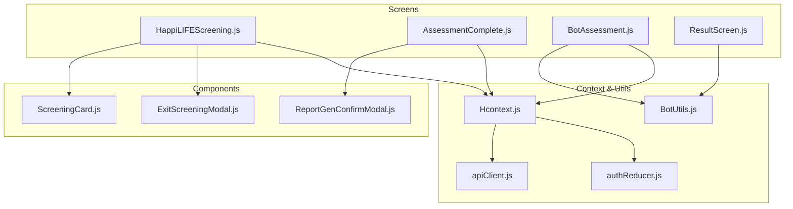
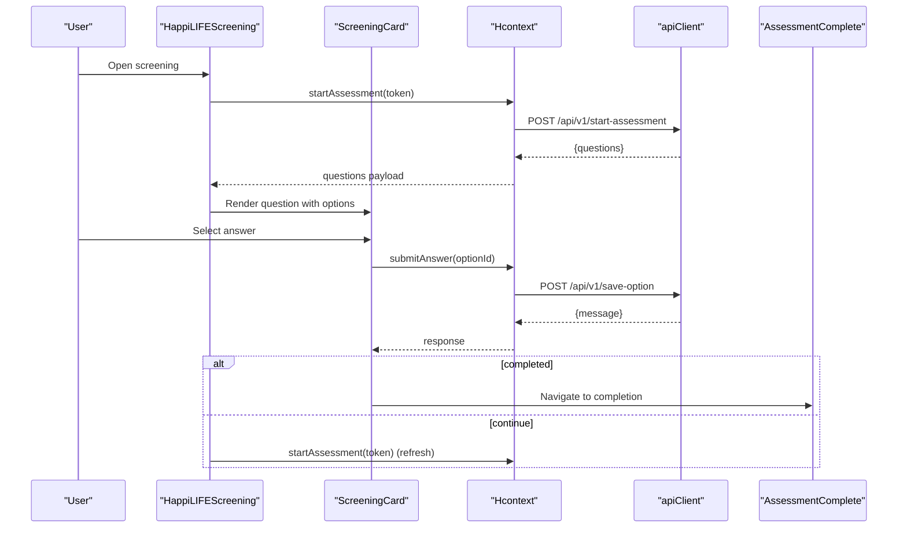
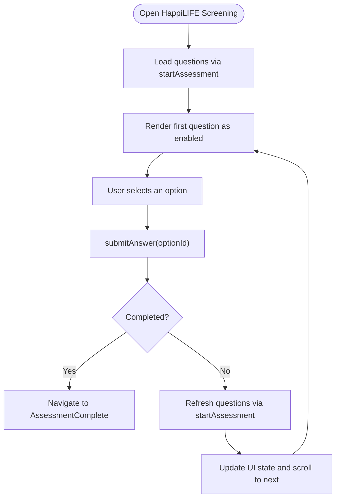
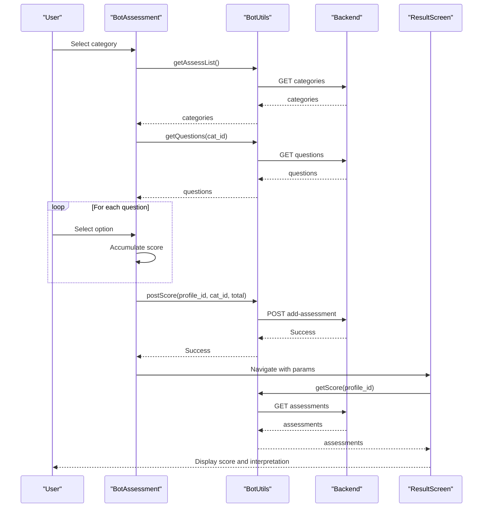
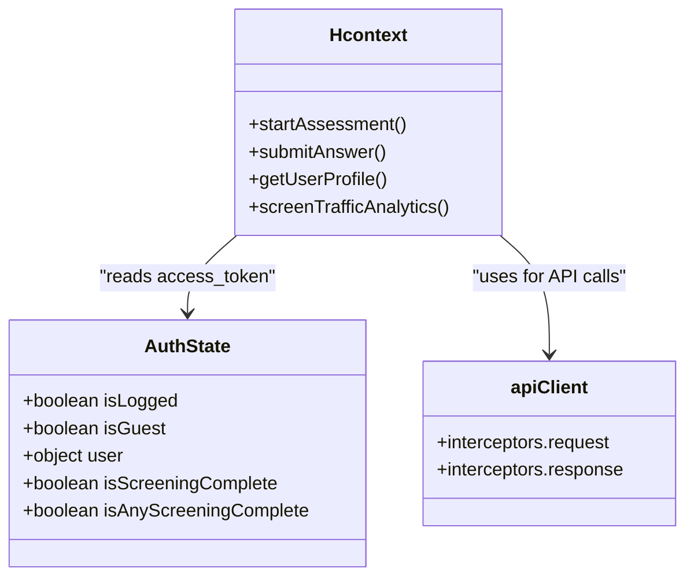
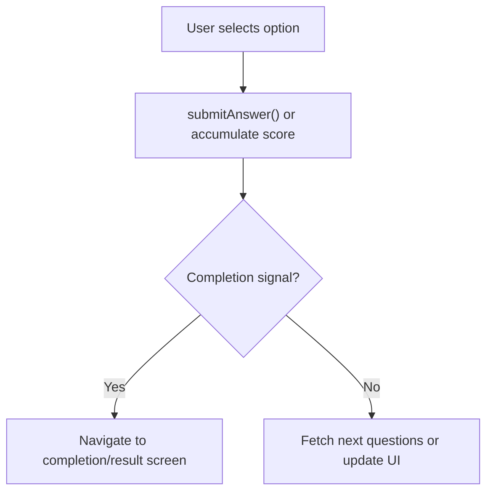
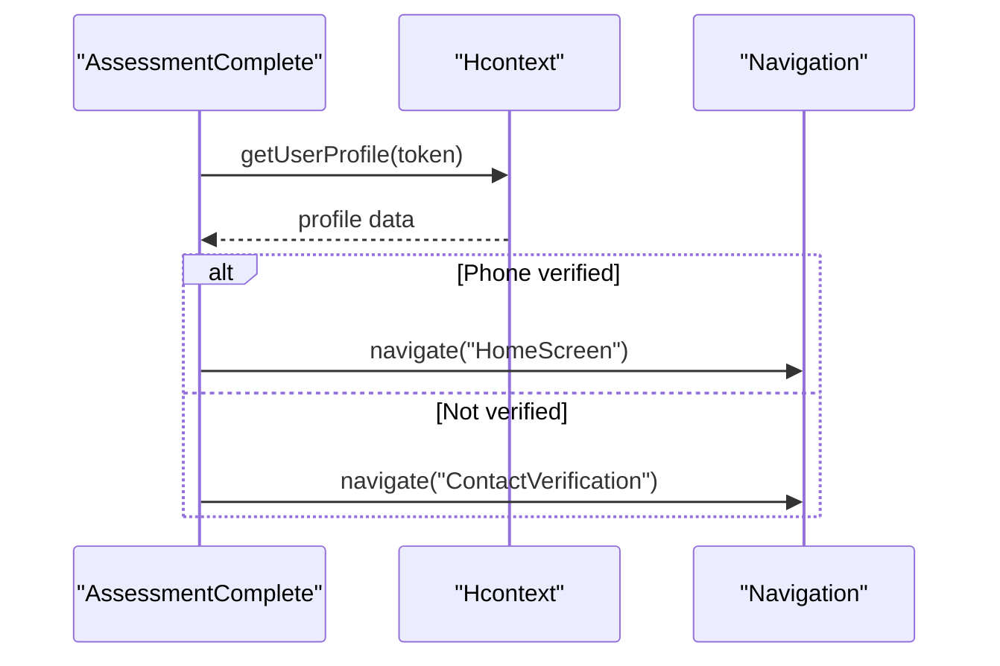
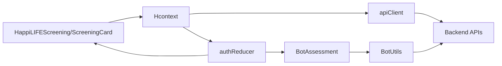

# Screening Assessment Workflow

<cite>
**Referenced Files in This Document**
- [HappiLIFEScreening.js](file://src/screens/HappiLIFE/HappiLIFEScreening.js)
- [AssessmentComplete.js](file://src/screens/HappiLIFE/AssessmentComplete.js)
- [ScreeningCard.js](file://src/components/cards/ScreeningCard.js)
- [ExitScreeningModal.js](file://src/components/Modals/ExitScreeningModal.js)
- [ReportGenConfirmModal.js](file://src/components/Modals/ReportGenConfirmModal.js)
- [BotAssessment.js](file://src/screens/Chat/BotAssessment.js)
- [BotUtils.js](file://src/screens/Chat/BotUtils.js)
- [ResultScreen.js](file://src/screens/Chat/ResultScreen.js)
- [Hcontext.js](file://src/context/Hcontext.js)
- [authReducer.js](file://src/context/reducers/authReducer.js)
- [apiClient.js](file://src/context/apiClient.js)
</cite>

## Table of Contents
1. [Introduction](#introduction)
2. [Project Structure](#project-structure)
3. [Core Components](#core-components)
4. [Architecture Overview](#architecture-overview)
5. [Detailed Component Analysis](#detailed-component-analysis)
6. [Dependency Analysis](#dependency-analysis)
7. [Performance Considerations](#performance-considerations)
8. [Troubleshooting Guide](#troubleshooting-guide)
9. [Conclusion](#conclusion)

## Introduction
This document describes the screening assessment workflow used by the application’s users to complete psychological health screenings. It covers the end-to-end process from initiation to completion, including questionnaire administration, real-time response submission, scoring and result processing, and the integration with authentication state to ensure secure and seamless progression. Two distinct assessment pathways are implemented:
- HappiLIFE Awareness Tool (sequential question cards with real-time validation)
- Chat Bot Assessment (categorized assessments with cumulative scoring)

The documentation also outlines the available assessment categories and how results are presented and followed up with next steps.

## Project Structure
The screening workflow spans several screens, components, and context utilities:
- Screens: HappiLIFE screening and completion screens, Chat Bot assessment and result screens
- Components: ScreeningCard for question display and response handling, modals for exit and report confirmation
- Context: Hcontext orchestrates API calls, authentication state, and analytics
- Utilities: BotUtils encapsulates chat bot assessment endpoints

**Diagram sources**
- [HappiLIFEScreening.js:53-228](file://src/screens/HappiLIFE/HappiLIFEScreening.js#L53-L228)
- [AssessmentComplete.js:26-150](file://src/screens/HappiLIFE/AssessmentComplete.js#L26-L150)
- [ScreeningCard.js:21-177](file://src/components/cards/ScreeningCard.js#L21-L177)
- [ExitScreeningModal.js:13-107](file://src/components/Modals/ExitScreeningModal.js#L13-L107)
- [ReportGenConfirmModal.js:21-122](file://src/components/Modals/ReportGenConfirmModal.js#L21-L122)
- [BotAssessment.js:28-291](file://src/screens/Chat/BotAssessment.js#L28-L291)
- [ResultScreen.js:17-126](file://src/screens/Chat/ResultScreen.js#L17-L126)
- [Hcontext.js:382-427](file://src/context/Hcontext.js#L382-L427)
- [BotUtils.js:48-119](file://src/screens/Chat/BotUtils.js#L48-L119)
- [authReducer.js:5-79](file://src/context/reducers/authReducer.js#L5-L79)
- [apiClient.js:1-58](file://src/context/apiClient.js#L1-L58)

**Section sources**
- [HappiLIFEScreening.js:53-228](file://src/screens/HappiLIFE/HappiLIFEScreening.js#L53-L228)
- [AssessmentComplete.js:26-150](file://src/screens/HappiLIFE/AssessmentComplete.js#L26-L150)
- [ScreeningCard.js:21-177](file://src/components/cards/ScreeningCard.js#L21-L177)
- [BotAssessment.js:28-291](file://src/screens/Chat/BotAssessment.js#L28-L291)
- [ResultScreen.js:17-126](file://src/screens/Chat/ResultScreen.js#L17-L126)
- [Hcontext.js:382-427](file://src/context/Hcontext.js#L382-L427)
- [BotUtils.js:48-119](file://src/screens/Chat/BotUtils.js#L48-L119)
- [authReducer.js:5-79](file://src/context/reducers/authReducer.js#L5-L79)
- [apiClient.js:1-58](file://src/context/apiClient.js#L1-L58)

## Core Components
- HappiLIFEScreening: Loads and displays screening questions, manages pagination, and handles exit prompts.
- ScreeningCard: Renders a single question with options, captures user selection, submits answers, and updates UI state.
- AssessmentComplete: Final screen after completion, checks verification status, and navigates to home or contact verification.
- BotAssessment: Manages categorized assessments with real-time scoring and submission.
- ResultScreen: Displays assessment results and interpretation.
- Hcontext: Provides startAssessment, submitAnswer, getUserProfile, and analytics functions.
- BotUtils: Encapsulates chat bot assessment endpoints (categories, questions, scoring).
- Modals: ExitScreeningModal and ReportGenConfirmModal provide UX controls during assessment.

**Section sources**
- [HappiLIFEScreening.js:53-228](file://src/screens/HappiLIFE/HappiLIFEScreening.js#L53-L228)
- [ScreeningCard.js:21-177](file://src/components/cards/ScreeningCard.js#L21-L177)
- [AssessmentComplete.js:26-150](file://src/screens/HappiLIFE/AssessmentComplete.js#L26-L150)
- [BotAssessment.js:28-291](file://src/screens/Chat/BotAssessment.js#L28-L291)
- [ResultScreen.js:17-126](file://src/screens/Chat/ResultScreen.js#L17-L126)
- [Hcontext.js:382-427](file://src/context/Hcontext.js#L382-L427)
- [BotUtils.js:48-119](file://src/screens/Chat/BotUtils.js#L48-L119)
- [ExitScreeningModal.js:13-107](file://src/components/Modals/ExitScreeningModal.js#L13-L107)
- [ReportGenConfirmModal.js:21-122](file://src/components/Modals/ReportGenConfirmModal.js#L21-L122)

## Architecture Overview
The workflow integrates authentication state, UI components, and backend APIs through a centralized context provider. Authentication ensures secure access to assessment endpoints, while the UI components manage user interactions and real-time updates.

**Diagram sources**
- [HappiLIFEScreening.js:120-151](file://src/screens/HappiLIFE/HappiLIFEScreening.js#L120-L151)
- [ScreeningCard.js:44-97](file://src/components/cards/ScreeningCard.js#L44-L97)
- [Hcontext.js:382-427](file://src/context/Hcontext.js#L382-L427)
- [apiClient.js:11-44](file://src/context/apiClient.js#L11-L44)
- [AssessmentComplete.js:26-150](file://src/screens/HappiLIFE/AssessmentComplete.js#L26-L150)

## Detailed Component Analysis

### HappiLIFE Awareness Tool (Sequential Screening)
- Initialization: Retrieves access token from authentication state and calls startAssessment to fetch questions. Sets the first question as enabled and others as disabled.
- Pagination: Uses a FlatList-like scroll behavior to auto-scroll to the next question upon selection. Maintains selectedIndex and updates question order to reflect progress.
- Real-time submission: On selecting an option, submits the answer via submitAnswer and receives a response indicating completion or continuation. If completion is signaled, navigates to AssessmentComplete; otherwise refreshes questions to load the next set.
- Exit handling: Presents ExitScreeningModal to guide users to either continue or exit.

**Diagram sources**
- [HappiLIFEScreening.js:120-151](file://src/screens/HappiLIFE/HappiLIFEScreening.js#L120-L151)
- [ScreeningCard.js:44-97](file://src/components/cards/ScreeningCard.js#L44-L97)
- [AssessmentComplete.js:26-150](file://src/screens/HappiLIFE/AssessmentComplete.js#L26-L150)

**Section sources**
- [HappiLIFEScreening.js:53-228](file://src/screens/HappiLIFE/HappiLIFEScreening.js#L53-L228)
- [ScreeningCard.js:21-177](file://src/components/cards/ScreeningCard.js#L21-L177)
- [ExitScreeningModal.js:13-107](file://src/components/Modals/ExitScreeningModal.js#L13-L107)

### Chat Bot Assessment (Categorized Scoring)
- Categories: Retrieves assessment categories and presents them to the user.
- Question flow: Loads questions for the selected category and renders them one at a time with visual emphasis on the current question.
- Scoring: Accumulates scores as the user progresses and submits the total to the backend upon completion.
- Result presentation: Fetches assessment results and displays category name, score, and interpretation.

**Diagram sources**
- [BotAssessment.js:28-291](file://src/screens/Chat/BotAssessment.js#L28-L291)
- [BotUtils.js:48-119](file://src/screens/Chat/BotUtils.js#L48-L119)
- [ResultScreen.js:17-126](file://src/screens/Chat/ResultScreen.js#L17-L126)

**Section sources**
- [BotAssessment.js:28-291](file://src/screens/Chat/BotAssessment.js#L28-L291)
- [BotUtils.js:48-119](file://src/screens/Chat/BotUtils.js#L48-L119)
- [ResultScreen.js:17-126](file://src/screens/Chat/ResultScreen.js#L17-L126)

### Authentication and State Integration
- Authentication state: Hcontext exposes authState with access_token and dispatch actions for login, logout, and screening completion flags.
- Token propagation: apiClient injects Authorization headers using the stored token from global or AsyncStorage.
- Analytics: screenTrafficAnalytics logs screen views for monitoring.

**Diagram sources**
- [authReducer.js:5-79](file://src/context/reducers/authReducer.js#L5-L79)
- [Hcontext.js:382-427](file://src/context/Hcontext.js#L382-L427)
- [apiClient.js:11-44](file://src/context/apiClient.js#L11-L44)

**Section sources**
- [authReducer.js:5-79](file://src/context/reducers/authReducer.js#L5-L79)
- [Hcontext.js:1321-1327](file://src/context/Hcontext.js#L1321-L1327)
- [apiClient.js:11-44](file://src/context/apiClient.js#L11-L44)

### Assessment Types and Questionnaires
- HappiLIFE Awareness Tool: Sequential questions rendered via ScreeningCard with real-time submission and progress tracking.
- Chat Bot Assessment: Categorized assessments with multiple-choice questions. Categories include topics such as stress, anxiety, depression, burnout, happiness, internet addiction, personality, self-esteem, resilience, job satisfaction, substance abuse, emotional regulation, peer pressure, gaming disorder, attention and concentration, relationship issues, body image, and well-being.

Note: The specific question lists are fetched from backend endpoints and rendered dynamically.

**Section sources**
- [HappiLIFEScreening.js:120-151](file://src/screens/HappiLIFE/HappiLIFEScreening.js#L120-L151)
- [ScreeningCard.js:44-97](file://src/components/cards/ScreeningCard.js#L44-L97)
- [BotAssessment.js:28-291](file://src/screens/Chat/BotAssessment.js#L28-L291)
- [BotUtils.js:74-85](file://src/screens/Chat/BotUtils.js#L74-L85)

### Real-time Scoring and Validation
- HappiLIFE: submitAnswer returns a response indicating completion or continuation. The UI updates immediately to reflect the next question and disables previous items.
- Chat Bot: Scores accumulate per selected option; total is posted upon submission. Results are retrieved and filtered by category for display.

**Diagram sources**
- [ScreeningCard.js:44-97](file://src/components/cards/ScreeningCard.js#L44-L97)
- [BotAssessment.js:95-121](file://src/screens/Chat/BotAssessment.js#L95-L121)

**Section sources**
- [ScreeningCard.js:44-97](file://src/components/cards/ScreeningCard.js#L44-L97)
- [BotAssessment.js:95-121](file://src/screens/Chat/BotAssessment.js#L95-L121)

### Completion Flow and Next Steps
- HappiLIFE: After completion, AssessmentComplete checks user verification status and navigates to Home or ContactVerification accordingly. A ReportGenConfirmModal confirms report generation.
- Chat Bot: After submission, ResultScreen displays the score and interpretation, then routes to appropriate next steps based on verification status.

**Diagram sources**
- [AssessmentComplete.js:26-150](file://src/screens/HappiLIFE/AssessmentComplete.js#L26-L150)

**Section sources**
- [AssessmentComplete.js:26-150](file://src/screens/HappiLIFE/AssessmentComplete.js#L26-L150)
- [ReportGenConfirmModal.js:21-122](file://src/components/Modals/ReportGenConfirmModal.js#L21-L122)

## Dependency Analysis
- UI to Context: HappiLIFEScreening and ScreeningCard depend on Hcontext for API calls and state updates.
- Context to API: Hcontext uses apiClient, which injects Authorization headers automatically.
- Chat Bot: BotAssessment depends on BotUtils for endpoint calls and ResultScreen for displaying outcomes.
- Authentication: authReducer maintains user state and screening completion flags.

**Diagram sources**
- [HappiLIFEScreening.js:53-228](file://src/screens/HappiLIFE/HappiLIFEScreening.js#L53-L228)
- [ScreeningCard.js:21-177](file://src/components/cards/ScreeningCard.js#L21-L177)
- [Hcontext.js:382-427](file://src/context/Hcontext.js#L382-L427)
- [apiClient.js:11-44](file://src/context/apiClient.js#L11-L44)
- [BotAssessment.js:28-291](file://src/screens/Chat/BotAssessment.js#L28-L291)
- [BotUtils.js:48-119](file://src/screens/Chat/BotUtils.js#L48-L119)
- [authReducer.js:5-79](file://src/context/reducers/authReducer.js#L5-L79)

**Section sources**
- [HappiLIFEScreening.js:53-228](file://src/screens/HappiLIFE/HappiLIFEScreening.js#L53-L228)
- [ScreeningCard.js:21-177](file://src/components/cards/ScreeningCard.js#L21-L177)
- [Hcontext.js:382-427](file://src/context/Hcontext.js#L382-L427)
- [apiClient.js:11-44](file://src/context/apiClient.js#L11-L44)
- [BotAssessment.js:28-291](file://src/screens/Chat/BotAssessment.js#L28-L291)
- [BotUtils.js:48-119](file://src/screens/Chat/BotUtils.js#L48-L119)
- [authReducer.js:5-79](file://src/context/reducers/authReducer.js#L5-L79)

## Performance Considerations
- Network timeouts: apiClient sets a 15-second timeout to prevent hanging requests.
- UI responsiveness: Auto-scroll uses measureLayout and controlled state updates to avoid layout thrashing.
- Conditional rendering: Loading indicators and empty-state messages improve perceived performance.
- Token caching: Global and AsyncStorage token retrieval reduces redundant lookups.

[No sources needed since this section provides general guidance]

## Troubleshooting Guide
- No questions loaded: HappiLIFEScreening displays a snackbar and clears the question list if the backend returns no questions.
- Submission failures: Both ScreeningCard and Hcontext log errors and surface user-friendly messages via snackDispatch.
- Authentication issues: Ensure access_token exists in authState; apiClient attaches Authorization headers automatically.
- Navigation after completion: AssessmentComplete checks verification status before navigating to Home or ContactVerification.

**Section sources**
- [HappiLIFEScreening.js:127-150](file://src/screens/HappiLIFE/HappiLIFEScreening.js#L127-L150)
- [ScreeningCard.js:93-97](file://src/components/cards/ScreeningCard.js#L93-L97)
- [Hcontext.js:395-399](file://src/context/Hcontext.js#L395-L399)
- [AssessmentComplete.js:42-70](file://src/screens/HappiLIFE/AssessmentComplete.js#L42-L70)

## Conclusion
The screening assessment workflow integrates authentication, real-time response submission, and result delivery across two assessment modes. The HappiLIFE Awareness Tool emphasizes sequential, real-time validation with immediate UI updates, while the Chat Bot Assessment supports categorized, cumulative scoring with clear result presentation. Robust error handling, state management, and navigation ensure a smooth user experience from initiation to completion and into follow-up steps.