# Course Enrollment and Learning

<cite>
**Referenced Files in This Document**
- [HappiLEARN.js](file://src/screens/HappiLEARN/HappiLEARN.js)
- [HappiLEARNDescription.js](file://src/screens/HappiLEARN/HappiLEARNDescription.js)
- [SearchResults.js](file://src/screens/HappiLEARN/SearchResults.js)
- [SubCourses.js](file://src/screens/HappiSELF/SubCourses.js)
- [LibrarySub.js](file://src/screens/HappiSELF/LibrarySub.js)
- [TaskScreen.js](file://src/screens/HappiSELF/TaskScreen.js)
- [CourseComplete.js](file://src/screens/HappiSELF/Tasks/CourseComplete.js)
- [TaskSelector.js](file://src/screens/HappiSELF/Tasks/TaskSelector.js)
- [Hcontext.js](file://src/context/Hcontext.js)
- [happiSelfReducer.js](file://src/context/reducers/happiSelfReducer.js)
- [apiClient.js](file://src/context/apiClient.js)
- [CourseCard.js](file://src/components/cards/CourseCard.js)
- [HappiLEARNCard.js](file://src/components/cards/HappiLEARNCard.js)
</cite>

## Table of Contents
1. [Introduction](#introduction)
2. [Project Structure](#project-structure)
3. [Core Components](#core-components)
4. [Architecture Overview](#architecture-overview)
5. [Detailed Component Analysis](#detailed-component-analysis)
6. [Dependency Analysis](#dependency-analysis)
7. [Performance Considerations](#performance-considerations)
8. [Troubleshooting Guide](#troubleshooting-guide)
9. [Conclusion](#conclusion)

## Introduction
This document explains the course enrollment and learning management system within the HappiMynd application. It covers how users browse and subscribe to HappiLEARN content, how enrolled courses are accessed via the HappiSELF ecosystem, and how learning progress is tracked and completed. It also documents the integration with backend APIs for content delivery, progress updates, and reward systems, along with user-facing visualizations such as progress indicators and completion badges.

## Project Structure
The learning system spans three primary areas:
- HappiLEARN: Public content discovery and subscription gating
- HappiSELF: Enrolled course management, sub-course navigation, task-taking, and progress tracking
- Context and API layer: Shared state management, reducers, and HTTP client for backend integration

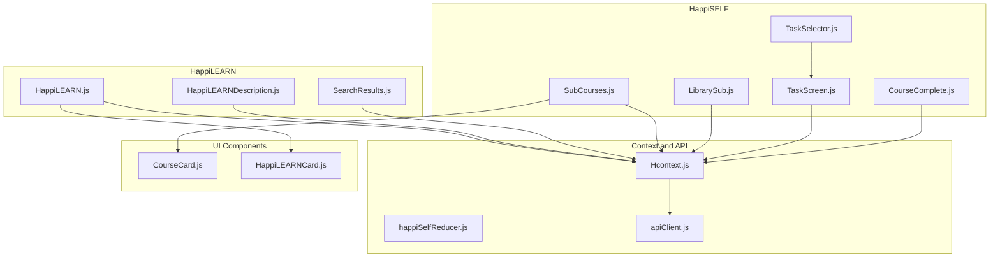

**Diagram sources**
- [HappiLEARN.js:66-226](file://src/screens/HappiLEARN/HappiLEARN.js#L66-L226)
- [HappiLEARNDescription.js:24-167](file://src/screens/HappiLEARN/HappiLEARNDescription.js#L24-L167)
- [SearchResults.js:67-270](file://src/screens/HappiLEARN/SearchResults.js#L67-L270)
- [SubCourses.js:33-173](file://src/screens/HappiSELF/SubCourses.js#L33-L173)
- [LibrarySub.js:23-103](file://src/screens/HappiSELF/LibrarySub.js#L23-L103)
- [TaskScreen.js:27-261](file://src/screens/HappiSELF/TaskScreen.js#L27-L261)
- [CourseComplete.js:26-174](file://src/screens/HappiSELF/Tasks/CourseComplete.js#L26-L174)
- [TaskSelector.js:14-37](file://src/screens/HappiSELF/Tasks/TaskSelector.js#L14-L37)
- [Hcontext.js:26-1551](file://src/context/Hcontext.js#L26-L1551)
- [happiSelfReducer.js:1-45](file://src/context/reducers/happiSelfReducer.js#L1-L45)
- [apiClient.js:1-58](file://src/context/apiClient.js#L1-L58)
- [CourseCard.js:128-297](file://src/components/cards/CourseCard.js#L128-L297)
- [HappiLEARNCard.js:21-192](file://src/components/cards/HappiLEARNCard.js#L21-L192)

**Section sources**
- [HappiLEARN.js:66-226](file://src/screens/HappiLEARN/HappiLEARN.js#L66-L226)
- [SubCourses.js:33-173](file://src/screens/HappiSELF/SubCourses.js#L33-L173)
- [TaskScreen.js:27-261](file://src/screens/HappiSELF/TaskScreen.js#L27-L261)
- [Hcontext.js:26-1551](file://src/context/Hcontext.js#L26-L1551)

## Core Components
- HappiLEARN content discovery and subscription gating
  - Users can search and filter HappiLEARN content and see “Most Relevant” and “Recently Viewed” lists.
  - Subscription eligibility is checked before allowing access to HappiLEARN content.
- HappiSELF enrolled course management
  - Courses are listed, sub-courses are browsed, and tasks are taken per sub-course.
  - Progress is tracked per sub-course; completion triggers rewards and unlocks subsequent modules.
- Context and API integration
  - Centralized state via Hcontext provides access to backend endpoints for content, subscriptions, course metadata, and progress.
  - apiClient injects authentication tokens automatically for protected endpoints.

Key responsibilities:
- Content discovery and filtering: HappiLEARN.js, SearchResults.js
- Subscription checks and pricing flow: HappiLEARNDescription.js
- Course catalog and sub-course navigation: SubCourses.js
- Library access for enrolled items: LibrarySub.js
- Task-taking and completion: TaskScreen.js, CourseComplete.js, TaskSelector.js
- State and API orchestration: Hcontext.js, apiClient.js, happiSelfReducer.js
- UI cards for content and courses: HappiLEARNCard.js, CourseCard.js

**Section sources**
- [HappiLEARN.js:66-226](file://src/screens/HappiLEARN/HappiLEARN.js#L66-L226)
- [HappiLEARNDescription.js:24-167](file://src/screens/HappiLEARN/HappiLEARNDescription.js#L24-L167)
- [SearchResults.js:67-270](file://src/screens/HappiLEARN/SearchResults.js#L67-L270)
- [SubCourses.js:33-173](file://src/screens/HappiSELF/SubCourses.js#L33-L173)
- [LibrarySub.js:23-103](file://src/screens/HappiSELF/LibrarySub.js#L23-L103)
- [TaskScreen.js:27-261](file://src/screens/HappiSELF/TaskScreen.js#L27-L261)
- [CourseComplete.js:26-174](file://src/screens/HappiSELF/Tasks/CourseComplete.js#L26-L174)
- [TaskSelector.js:14-37](file://src/screens/HappiSELF/Tasks/TaskSelector.js#L14-L37)
- [Hcontext.js:547-962](file://src/context/Hcontext.js#L547-L962)
- [apiClient.js:1-58](file://src/context/apiClient.js#L1-L58)
- [happiSelfReducer.js:1-45](file://src/context/reducers/happiSelfReducer.js#L1-L45)
- [CourseCard.js:128-297](file://src/components/cards/CourseCard.js#L128-L297)
- [HappiLEARNCard.js:21-192](file://src/components/cards/HappiLEARNCard.js#L21-L192)

## Architecture Overview
The system follows a layered architecture:
- UI Screens: Render content, collect user actions, and navigate between views.
- Context Layer: Provides centralized state and orchestrates API calls.
- API Client: Handles authentication and request/response interception.
- Backend Services: Deliver HappiLEARN content, course metadata, progress, and rewards.

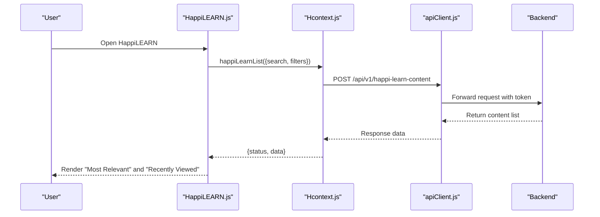

**Diagram sources**
- [HappiLEARN.js:97-110](file://src/screens/HappiLEARN/HappiLEARN.js#L97-L110)
- [Hcontext.js:547-568](file://src/context/Hcontext.js#L547-L568)
- [apiClient.js:11-44](file://src/context/apiClient.js#L11-L44)

**Section sources**
- [HappiLEARN.js:66-226](file://src/screens/HappiLEARN/HappiLEARN.js#L66-L226)
- [Hcontext.js:547-568](file://src/context/Hcontext.js#L547-L568)
- [apiClient.js:1-58](file://src/context/apiClient.js#L1-L58)

## Detailed Component Analysis

### HappiLEARN Content Discovery
- Fetches and displays content lists with search and filter support.
- Renders two curated sections: “Most Relevant” and “Recently Viewed.”
- Integrates with Hcontext for content retrieval and analytics.

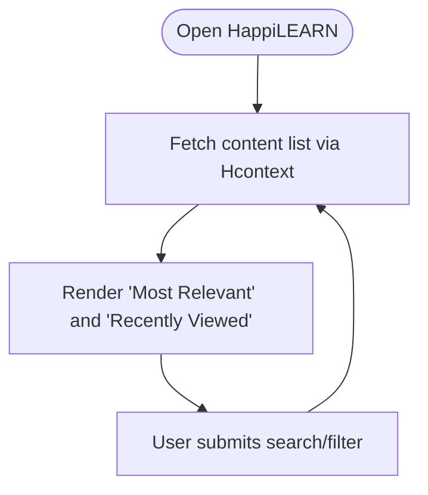

**Diagram sources**
- [HappiLEARN.js:87-110](file://src/screens/HappiLEARN/HappiLEARN.js#L87-L110)
- [HappiLEARN.js:156-222](file://src/screens/HappiLEARN/HappiLEARN.js#L156-L222)

**Section sources**
- [HappiLEARN.js:66-226](file://src/screens/HappiLEARN/HappiLEARN.js#L66-L226)

### HappiLEARN Subscription and Access Control
- Checks user subscription eligibility before granting access to HappiLEARN content.
- Routes users to pricing or subscribed services depending on subscription status.

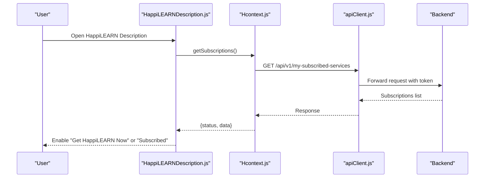

**Diagram sources**
- [HappiLEARNDescription.js:37-60](file://src/screens/HappiLEARN/HappiLEARNDescription.js#L37-L60)
- [Hcontext.js:639-647](file://src/context/Hcontext.js#L639-L647)
- [apiClient.js:11-44](file://src/context/apiClient.js#L11-L44)

**Section sources**
- [HappiLEARNDescription.js:24-167](file://src/screens/HappiLEARN/HappiLEARNDescription.js#L24-L167)
- [Hcontext.js:639-647](file://src/context/Hcontext.js#L639-L647)

### Course Catalog and Sub-Course Navigation
- Lists top-level courses and navigates to sub-courses.
- Displays sub-course cards with status (open, ongoing, completed, locked).
- Supports starting a sub-course and proceeding to tasks.

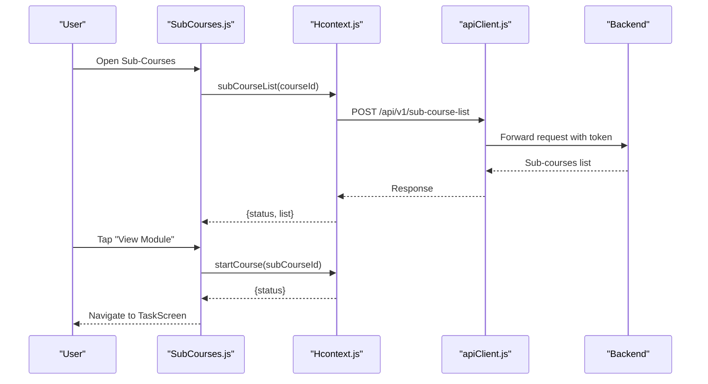

**Diagram sources**
- [SubCourses.js:58-87](file://src/screens/HappiSELF/SubCourses.js#L58-L87)
- [Hcontext.js:889-900](file://src/context/Hcontext.js#L889-L900)
- [Hcontext.js:939-950](file://src/context/Hcontext.js#L939-L950)
- [CourseCard.js:128-226](file://src/components/cards/CourseCard.js#L128-L226)

**Section sources**
- [SubCourses.js:33-173](file://src/screens/HappiSELF/SubCourses.js#L33-L173)
- [CourseCard.js:128-297](file://src/components/cards/CourseCard.js#L128-L297)

### Library Access for Enrolled Items
- Displays enrolled libraries and allows direct navigation to content items as tasks.

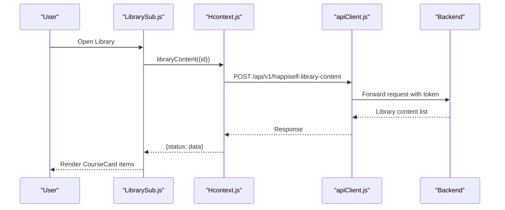

**Diagram sources**
- [LibrarySub.js:43-55](file://src/screens/HappiSELF/LibrarySub.js#L43-L55)
- [Hcontext.js:1020-1031](file://src/context/Hcontext.js#L1020-L1031)
- [CourseCard.js:128-226](file://src/components/cards/CourseCard.js#L128-L226)

**Section sources**
- [LibrarySub.js:23-103](file://src/screens/HappiSELF/LibrarySub.js#L23-L103)

### Task-Taking and Progress Tracking
- Loads sub-course content and selects the next incomplete task.
- Presents task UI based on content type and tracks answers.
- Completes a sub-course and triggers rewards and notifications.

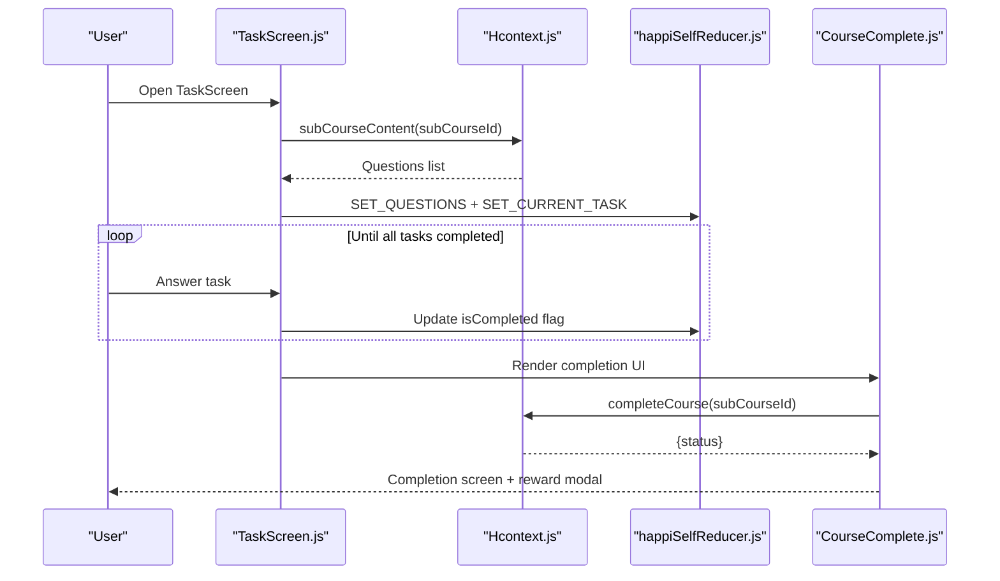

**Diagram sources**
- [TaskScreen.js:92-119](file://src/screens/HappiSELF/TaskScreen.js#L92-L119)
- [TaskScreen.js:121-146](file://src/screens/HappiSELF/TaskScreen.js#L121-L146)
- [TaskScreen.js:167-182](file://src/screens/HappiSELF/TaskScreen.js#L167-L182)
- [CourseComplete.js:94-107](file://src/screens/HappiSELF/Tasks/CourseComplete.js#L94-L107)
- [happiSelfReducer.js:9-44](file://src/context/reducers/happiSelfReducer.js#L9-L44)

**Section sources**
- [TaskScreen.js:27-261](file://src/screens/HappiSELF/TaskScreen.js#L27-L261)
- [CourseComplete.js:26-174](file://src/screens/HappiSELF/Tasks/CourseComplete.js#L26-L174)
- [TaskSelector.js:14-37](file://src/screens/HappiSELF/Tasks/TaskSelector.js#L14-L37)
- [happiSelfReducer.js:1-45](file://src/context/reducers/happiSelfReducer.js#L1-L45)

### Course Completion Criteria and Milestone Tracking
- Completion is triggered when all tasks in a sub-course are marked complete.
- Rewards are fetched and displayed upon completion.
- Notifications are sent to acknowledge completion.

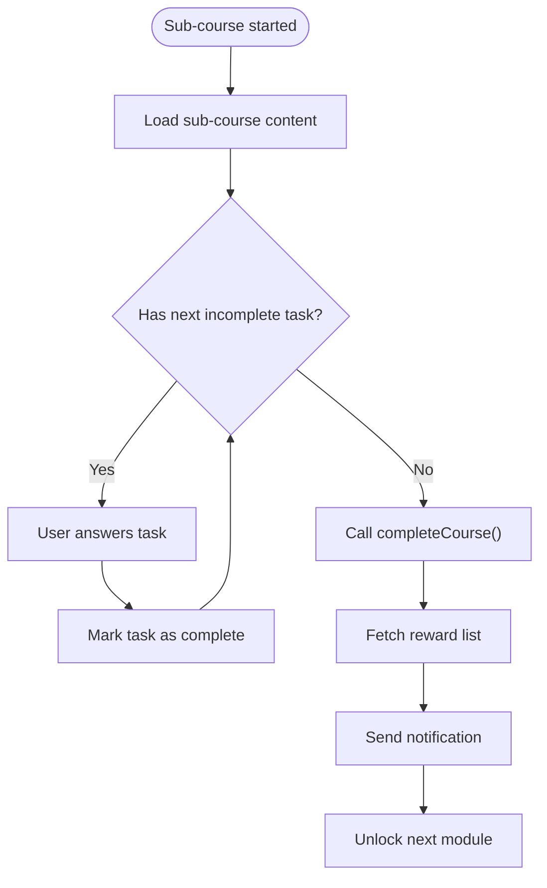

**Diagram sources**
- [TaskScreen.js:63-79](file://src/screens/HappiSELF/TaskScreen.js#L63-L79)
- [CourseComplete.js:63-107](file://src/screens/HappiSELF/Tasks/CourseComplete.js#L63-L107)
- [Hcontext.js:951-962](file://src/context/Hcontext.js#L951-L962)

**Section sources**
- [TaskScreen.js:27-261](file://src/screens/HappiSELF/TaskScreen.js#L27-L261)
- [CourseComplete.js:26-174](file://src/screens/HappiSELF/Tasks/CourseComplete.js#L26-L174)
- [Hcontext.js:951-962](file://src/context/Hcontext.js#L951-L962)

### Certification and Badges
- Completion of a sub-course triggers a completion screen and a reward modal indicating points.
- The system fetches reward instances to determine badge/point awards.

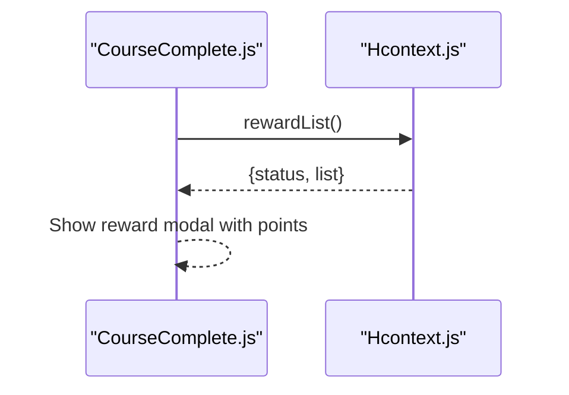

**Diagram sources**
- [CourseComplete.js:63-79](file://src/screens/HappiSELF/Tasks/CourseComplete.js#L63-L79)
- [Hcontext.js:1335-1343](file://src/context/Hcontext.js#L1335-L1343)

**Section sources**
- [CourseComplete.js:26-174](file://src/screens/HappiSELF/Tasks/CourseComplete.js#L26-L174)
- [Hcontext.js:1335-1343](file://src/context/Hcontext.js#L1335-L1343)

### Relationship Between Tasks and Course Completion
- Each sub-course contains a list of tasks. Completion requires marking all tasks as complete.
- The reducer maintains the active task and the list of questions, enabling sequential progression.

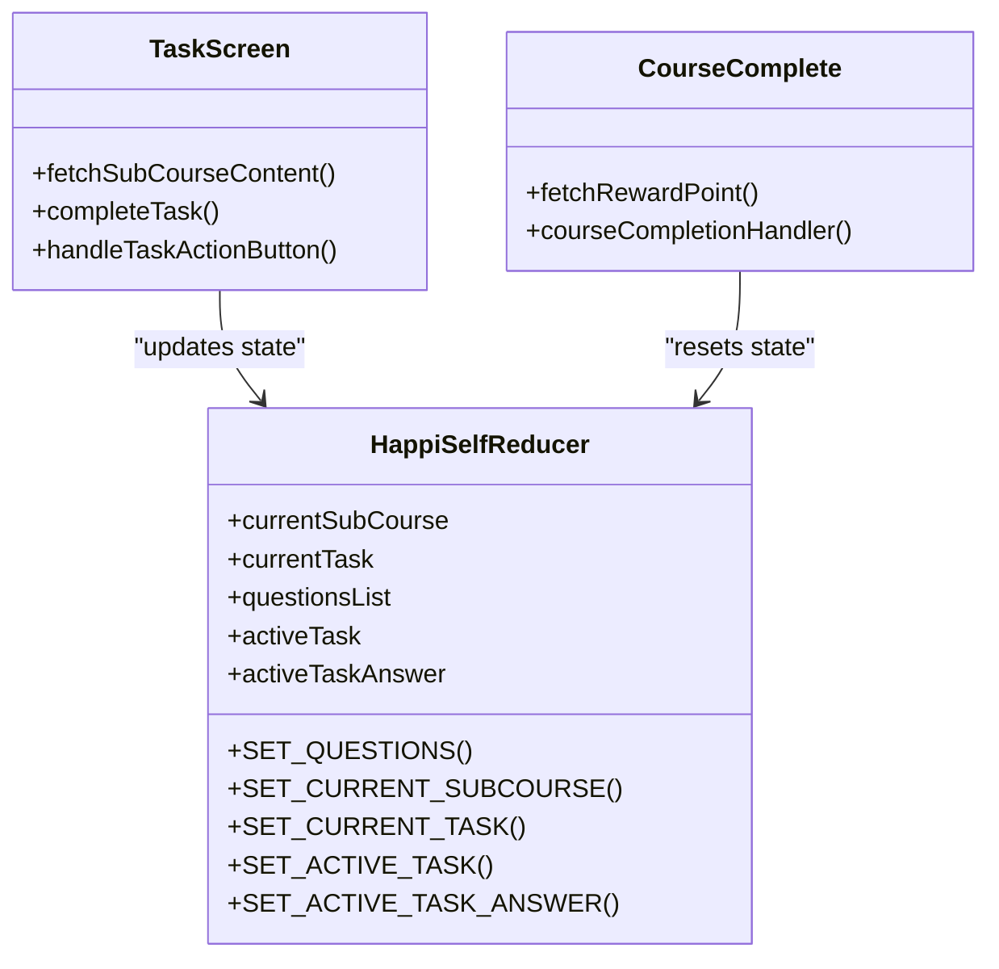

**Diagram sources**
- [happiSelfReducer.js:1-45](file://src/context/reducers/happiSelfReducer.js#L1-L45)
- [TaskScreen.js:121-146](file://src/screens/HappiSELF/TaskScreen.js#L121-L146)
- [CourseComplete.js:94-107](file://src/screens/HappiSELF/Tasks/CourseComplete.js#L94-L107)

**Section sources**
- [happiSelfReducer.js:1-45](file://src/context/reducers/happiSelfReducer.js#L1-L45)
- [TaskScreen.js:27-261](file://src/screens/HappiSELF/TaskScreen.js#L27-L261)
- [CourseComplete.js:26-174](file://src/screens/HappiSELF/Tasks/CourseComplete.js#L26-L174)

## Dependency Analysis
- UI screens depend on Hcontext for data and actions.
- Hcontext encapsulates API endpoints and state updates.
- apiClient centralizes authentication and request/response handling.

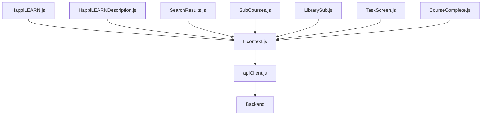

**Diagram sources**
- [HappiLEARN.js:66-226](file://src/screens/HappiLEARN/HappiLEARN.js#L66-L226)
- [HappiLEARNDescription.js:24-167](file://src/screens/HappiLEARN/HappiLEARNDescription.js#L24-L167)
- [SearchResults.js:67-270](file://src/screens/HappiLEARN/SearchResults.js#L67-L270)
- [SubCourses.js:33-173](file://src/screens/HappiSELF/SubCourses.js#L33-L173)
- [LibrarySub.js:23-103](file://src/screens/HappiSELF/LibrarySub.js#L23-L103)
- [TaskScreen.js:27-261](file://src/screens/HappiSELF/TaskScreen.js#L27-L261)
- [CourseComplete.js:26-174](file://src/screens/HappiSELF/Tasks/CourseComplete.js#L26-L174)
- [Hcontext.js:26-1551](file://src/context/Hcontext.js#L26-L1551)
- [apiClient.js:1-58](file://src/context/apiClient.js#L1-L58)

**Section sources**
- [Hcontext.js:26-1551](file://src/context/Hcontext.js#L26-L1551)
- [apiClient.js:1-58](file://src/context/apiClient.js#L1-L58)

## Performance Considerations
- Pagination in search results reduces initial load and improves responsiveness.
- Lazy loading of sub-course content minimizes unnecessary network requests.
- Centralized token injection avoids redundant authentication overhead.

[No sources needed since this section provides general guidance]

## Troubleshooting Guide
- Authentication failures: apiClient logs missing tokens and errors; ensure the user is logged in and the token is present.
- Network timeouts: apiClient sets a timeout to prevent hanging requests; retry or verify connectivity.
- Subscription checks: If subscription status is not reflected, verify the backend response and ensure the correct service name is used.
- Task completion: If tasks do not mark complete, verify reducer updates and that the correct sub-course ID is being used.

**Section sources**
- [apiClient.js:11-44](file://src/context/apiClient.js#L11-L44)
- [HappiLEARNDescription.js:42-60](file://src/screens/HappiLEARN/HappiLEARNDescription.js#L42-L60)
- [TaskScreen.js:121-146](file://src/screens/HappiSELF/TaskScreen.js#L121-L146)

## Conclusion
The HappiMynd learning system integrates HappiLEARN content discovery with HappiSELF course management and task completion. Through Hcontext and apiClient, the app provides a seamless experience for browsing, subscribing, enrolling, progressing, and completing courses, with rewards and notifications reinforcing milestones. The modular UI components and centralized state management enable scalable enhancements for progress visualization, learning path recommendations, and certification badges.