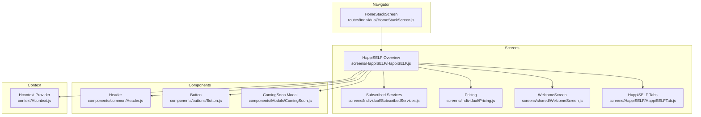
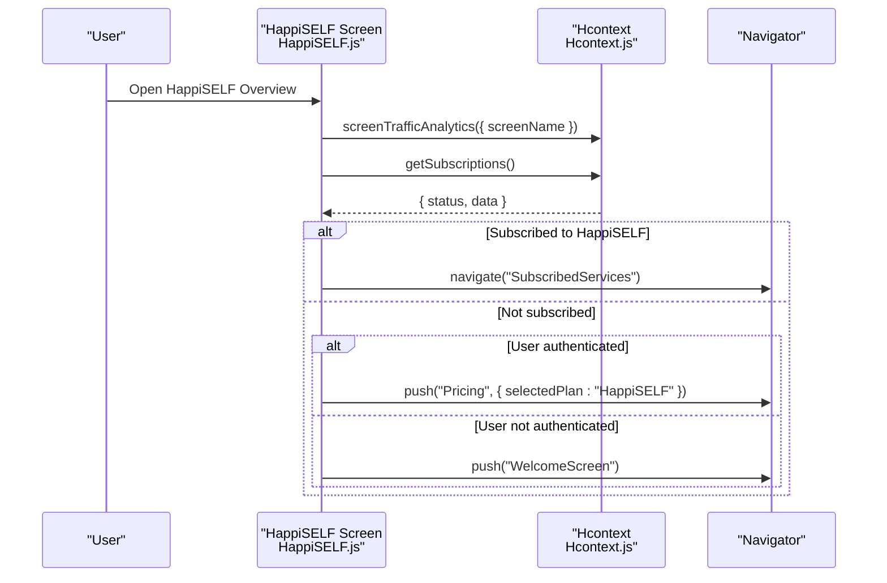
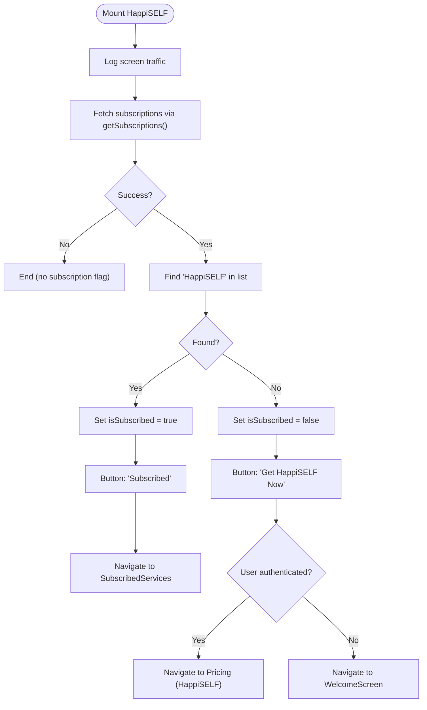
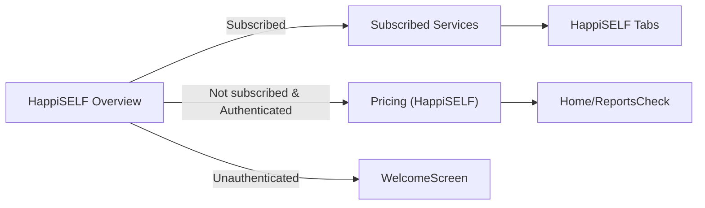
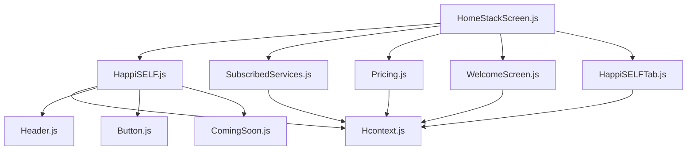

# Dashboard and Overview

<cite>
**Referenced Files in This Document**
- [HappiSELF.js](file://src/screens/HappiSELF/HappiSELF.js)
- [Header.js](file://src/components/common/Header.js)
- [Button.js](file://src/components/buttons/Button.js)
- [ComingSoon.js](file://src/components/Modals/ComingSoon.js)
- [SubscribedServices.js](file://src/screens/Individual/SubscribedServices.js)
- [Pricing.js](file://src/screens/Individual/Pricing.js)
- [WelcomeScreen.js](file://src/screens/shared/WelcomeScreen.js)
- [HappiSELFTab.js](file://src/screens/HappiSELF/HappiSELFTab.js)
- [HomeStackScreen.js](file://src/routes/Individual/HomeStackScreen.js)
- [Hcontext.js](file://src/context/Hcontext.js)
- [happiSelfReducer.js](file://src/context/reducers/happiSelfReducer.js)
</cite>

## Table of Contents
1. [Introduction](#introduction)
2. [Project Structure](#project-structure)
3. [Core Components](#core-components)
4. [Architecture Overview](#architecture-overview)
5. [Detailed Component Analysis](#detailed-component-analysis)
6. [Dependency Analysis](#dependency-analysis)
7. [Performance Considerations](#performance-considerations)
8. [Troubleshooting Guide](#troubleshooting-guide)
9. [Conclusion](#conclusion)

## Introduction
This document explains the HappiSELF dashboard and overview interface, focusing on the main landing page layout, subscription status display, navigation flow, and the integration of subscription verification via the getSubscriptions() API. It also covers the header component integration, responsive design using react-native-responsive-screen, visual hierarchy, button states (Subscribed vs Get HappiSELF Now), analytics integration for screen traffic tracking, and the modal system for future feature announcements.

## Project Structure
The HappiSELF overview screen is part of the Home stack navigator and integrates with shared components and context providers. The overview screen renders a header, descriptive content, a responsive image banner, a details section, and a primary action button. It conditionally navigates to either the pricing flow or the HappiSELF module tabs depending on the user’s subscription status.

**Diagram sources**
- [HomeStackScreen.js:84-401](file://src/routes/Individual/HomeStackScreen.js#L84-L401)
- [HappiSELF.js:25-138](file://src/screens/HappiSELF/HappiSELF.js#L25-L138)
- [Header.js:17-121](file://src/components/common/Header.js#L17-L121)
- [Button.js:18-58](file://src/components/buttons/Button.js#L18-L58)
- [ComingSoon.js:21-111](file://src/components/Modals/ComingSoon.js#L21-L111)
- [SubscribedServices.js:107-285](file://src/screens/Individual/SubscribedServices.js#L107-L285)
- [Pricing.js:389-496](file://src/screens/Individual/Pricing.js#L389-L496)
- [WelcomeScreen.js:21-92](file://src/screens/shared/WelcomeScreen.js#L21-L92)
- [HappiSELFTab.js:201-223](file://src/screens/HappiSELF/HappiSELFTab.js#L201-L223)
- [Hcontext.js:1408-1551](file://src/context/Hcontext.js#L1408-L1551)

**Section sources**
- [HomeStackScreen.js:84-401](file://src/routes/Individual/HomeStackScreen.js#L84-L401)
- [HappiSELF.js:25-138](file://src/screens/HappiSELF/HappiSELF.js#L25-L138)

## Core Components
- HappiSELF overview screen: Renders the landing page, checks subscription status, displays analytics, and controls navigation.
- Header component: Provides consistent navigation affordances and branding.
- Button component: Presents the primary action with loading and disabled states.
- ComingSoon modal: Placeholder modal for future feature announcements.
- Subscribed Services screen: Aggregates and displays user subscriptions, including HappiSELF.
- Pricing screen: Handles subscription purchase flow for HappiSELF.
- WelcomeScreen: Entry point for unauthenticated users.
- HappiSELF Tabs: Module and Library views for subscribed users.

**Section sources**
- [HappiSELF.js:25-138](file://src/screens/HappiSELF/HappiSELF.js#L25-L138)
- [Header.js:17-121](file://src/components/common/Header.js#L17-L121)
- [Button.js:18-58](file://src/components/buttons/Button.js#L18-L58)
- [ComingSoon.js:21-111](file://src/components/Modals/ComingSoon.js#L21-L111)
- [SubscribedServices.js:107-285](file://src/screens/Individual/SubscribedServices.js#L107-L285)
- [Pricing.js:389-496](file://src/screens/Individual/Pricing.js#L389-L496)
- [WelcomeScreen.js:21-92](file://src/screens/shared/WelcomeScreen.js#L21-L92)
- [HappiSELFTab.js:201-223](file://src/screens/HappiSELF/HappiSELFTab.js#L201-L223)

## Architecture Overview
The HappiSELF overview screen orchestrates subscription verification and navigation decisions. It relies on Hcontext for:
- getSubscriptions(): Fetches the user’s subscribed services.
- screenTrafficAnalytics(): Logs screen visits to analytics.
- Navigation: Routes to pricing, subscribed services, or welcome screen based on authentication and subscription status.

**Diagram sources**
- [HappiSELF.js:39-57](file://src/screens/HappiSELF/HappiSELF.js#L39-L57)
- [HappiSELF.js:118-129](file://src/screens/HappiSELF/HappiSELF.js#L118-L129)
- [Hcontext.js:639-647](file://src/context/Hcontext.js#L639-L647)
- [Hcontext.js:1321-1334](file://src/context/Hcontext.js#L1321-L1334)

## Detailed Component Analysis

### HappiSELF Overview Screen
Responsibilities:
- Mounts and logs screen traffic.
- Verifies subscription status using getSubscriptions().
- Updates UI state (isSubscribed) to toggle button text and behavior.
- Integrates Header, Button, and a placeholder modal.

Key behaviors:
- Subscription verification: Iterates through returned subscriptions to detect HappiSELF.
- Button states:
  - Subscribed: navigates to SubscribedServices.
  - Not subscribed: navigates to Pricing with HappiSELF preselected.
  - Unauthenticated: navigates to WelcomeScreen.

Responsive design:
- Uses react-native-responsive-screen for widthPercentageToDP and heightPercentageToDP to scale layout elements.

Visual hierarchy:
- Title and subtitle introduce the service.
- Banner image visually anchors the overview.
- Details section communicates value.
- Prominent primary button drives conversion.

Analytics:
- Calls screenTrafficAnalytics on mount to track visits.

Modal integration:
- A placeholder modal (ComingSoon) is rendered but not triggered by the current button logic.

**Diagram sources**
- [HappiSELF.js:39-57](file://src/screens/HappiSELF/HappiSELF.js#L39-L57)
- [HappiSELF.js:108-129](file://src/screens/HappiSELF/HappiSELF.js#L108-L129)
- [HappiSELF.js:135](file://src/screens/HappiSELF/HappiSELF.js#L135)

**Section sources**
- [HappiSELF.js:25-138](file://src/screens/HappiSELF/HappiSELF.js#L25-L138)

### Header Component Integration
- Accepts navigation prop and toggles between back and drawer actions based on showBack.
- Supports white-label logo rendering via Hcontext state.
- Provides optional points display area.

Usage in HappiSELF:
- Rendered at the top with showBack enabled to allow returning to the previous screen.

**Section sources**
- [Header.js:17-121](file://src/components/common/Header.js#L17-L121)
- [HappiSELF.js:61](file://src/screens/HappiSELF/HappiSELF.js#L61)

### Responsive Design Implementation
- Width and height percentages are used consistently for spacing, sizing, and typography scaling.
- Typography scales via react-native-responsive-fontsize.

Evidence:
- widthPercentageToDP and heightPercentageToDP used across layout elements.
- RFPercentage and RFValue applied to font sizes.

**Section sources**
- [HappiSELF.js:10-14](file://src/screens/HappiSELF/HappiSELF.js#L10-L14)
- [Header.js:3-7](file://src/components/common/Header.js#L3-L7)
- [Button.js:9-13](file://src/components/buttons/Button.js#L9-L13)

### Button States and Navigation Behaviors
- Button text dynamically reflects subscription status.
- Press handler routes:
  - Subscribed: to SubscribedServices.
  - Not subscribed and authenticated: to Pricing with HappiSELF preselected.
  - Not authenticated: to WelcomeScreen.

Accessibility and UX:
- Loading state is supported by the Button component.
- Disabled state is configurable.

**Section sources**
- [Button.js:18-58](file://src/components/buttons/Button.js#L18-L58)
- [HappiSELF.js:108-129](file://src/screens/HappiSELF/HappiSELF.js#L108-L129)

### Subscription Verification Process Using getSubscriptions()
- Called during mount and after successful verification updates the isSubscribed state.
- The API returns a list of subscribed services; the overview screen filters for HappiSELF.

Integration points:
- Hcontext.getSubscriptions() is invoked.
- SubscribedServices screen also uses getSubscriptions() to render the subscribed services list.

**Section sources**
- [HappiSELF.js:44-57](file://src/screens/HappiSELF/HappiSELF.js#L44-L57)
- [Hcontext.js:639-647](file://src/context/Hcontext.js#L639-L647)
- [SubscribedServices.js:127-212](file://src/screens/Individual/SubscribedServices.js#L127-L212)

### Analytics Integration for Screen Traffic Tracking
- HappiSELF overview calls screenTrafficAnalytics on mount.
- Hcontext.screenTrafficAnalytics posts screenName to the configured analytics endpoint.

**Section sources**
- [HappiSELF.js:41](file://src/screens/HappiSELF/HappiSELF.js#L41)
- [HappiSELF.js:124](file://src/screens/HappiSELF/HappiSELF.js#L124)
- [Hcontext.js:1321-1334](file://src/context/Hcontext.js#L1321-L1334)

### Modal System for Future Feature Announcements
- A placeholder modal component (ComingSoon) is integrated into the HappiSELF overview.
- The current button logic does not trigger the modal; it remains available for future use.

**Section sources**
- [ComingSoon.js:21-111](file://src/components/Modals/ComingSoon.js#L21-L111)
- [HappiSELF.js:135](file://src/screens/HappiSELF/HappiSELF.js#L135)

### Navigation Flow to Different Sections
- From HappiSELF overview:
  - Subscribed → SubscribedServices
  - Not subscribed (authenticated) → Pricing (preselect HappiSELF)
  - Unauthenticated → WelcomeScreen
- SubscribedServices aggregates subscriptions and routes to HappiSELF tabs when selected.
- Pricing handles payment and redirects to Home or ReportsCheck depending on origin.

**Diagram sources**
- [HappiSELF.js:118-129](file://src/screens/HappiSELF/HappiSELF.js#L118-L129)
- [SubscribedServices.js:107-285](file://src/screens/Individual/SubscribedServices.js#L107-L285)
- [Pricing.js:389-496](file://src/screens/Individual/Pricing.js#L389-L496)
- [WelcomeScreen.js:21-92](file://src/screens/shared/WelcomeScreen.js#L21-L92)
- [HappiSELFTab.js:201-223](file://src/screens/HappiSELF/HappiSELFTab.js#L201-L223)

## Dependency Analysis
- HappiSELF depends on:
  - Hcontext for getSubscriptions(), screenTrafficAnalytics(), and navigation.
  - Header for consistent navigation affordances.
  - Button for primary action.
  - ComingSoon modal for future feature announcements.
- SubscribedServices and Pricing depend on Hcontext for subscription and payment flows.
- Navigator defines the routing surface for these screens.

**Diagram sources**
- [HappiSELF.js:25-138](file://src/screens/HappiSELF/HappiSELF.js#L25-L138)
- [Header.js:17-121](file://src/components/common/Header.js#L17-L121)
- [Button.js:18-58](file://src/components/buttons/Button.js#L18-L58)
- [ComingSoon.js:21-111](file://src/components/Modals/ComingSoon.js#L21-L111)
- [SubscribedServices.js:107-285](file://src/screens/Individual/SubscribedServices.js#L107-L285)
- [Pricing.js:389-496](file://src/screens/Individual/Pricing.js#L389-L496)
- [WelcomeScreen.js:21-92](file://src/screens/shared/WelcomeScreen.js#L21-L92)
- [HappiSELFTab.js:201-223](file://src/screens/HappiSELF/HappiSELFTab.js#L201-L223)
- [HomeStackScreen.js:84-401](file://src/routes/Individual/HomeStackScreen.js#L84-L401)
- [Hcontext.js:1408-1551](file://src/context/Hcontext.js#L1408-L1551)

**Section sources**
- [HappiSELF.js:25-138](file://src/screens/HappiSELF/HappiSELF.js#L25-L138)
- [HomeStackScreen.js:84-401](file://src/routes/Individual/HomeStackScreen.js#L84-L401)
- [Hcontext.js:1408-1551](file://src/context/Hcontext.js#L1408-L1551)

## Performance Considerations
- Subscription checks are performed once on mount; cache or memoization could prevent redundant calls if reused elsewhere.
- Prefer lazy-loading heavy assets (e.g., banner image) to reduce initial render cost.
- Debounce search inputs in related screens (e.g., HappiSELF tabs) to avoid frequent re-renders.

## Troubleshooting Guide
- Subscription verification failures:
  - Ensure getSubscriptions() is reachable and returns a success status with a data array.
  - Confirm the HappiSELF name matches the expected identifier used in filtering.
- Navigation issues:
  - Verify that the selected route names exist in HomeStackScreen and that navigation.push/navigate are used appropriately.
- Analytics logging:
  - Confirm ANALYTICS_URL and credentials are configured in config and that the endpoint accepts the posted fields.

**Section sources**
- [HappiSELF.js:44-57](file://src/screens/HappiSELF/HappiSELF.js#L44-L57)
- [HomeStackScreen.js:84-401](file://src/routes/Individual/HomeStackScreen.js#L84-L401)
- [Hcontext.js:1321-1334](file://src/context/Hcontext.js#L1321-L1334)

## Conclusion
The HappiSELF overview screen provides a responsive, analytics-aware entry point that dynamically adapts to user subscription status. It integrates a reusable header, a flexible button component, and a placeholder modal for future enhancements. The screen’s navigation logic cleanly routes authenticated subscribers to the module tabs, while guiding unauthenticated users to onboarding and pricing flows. The underlying Hcontext centralizes subscription and analytics operations, ensuring consistent behavior across screens.