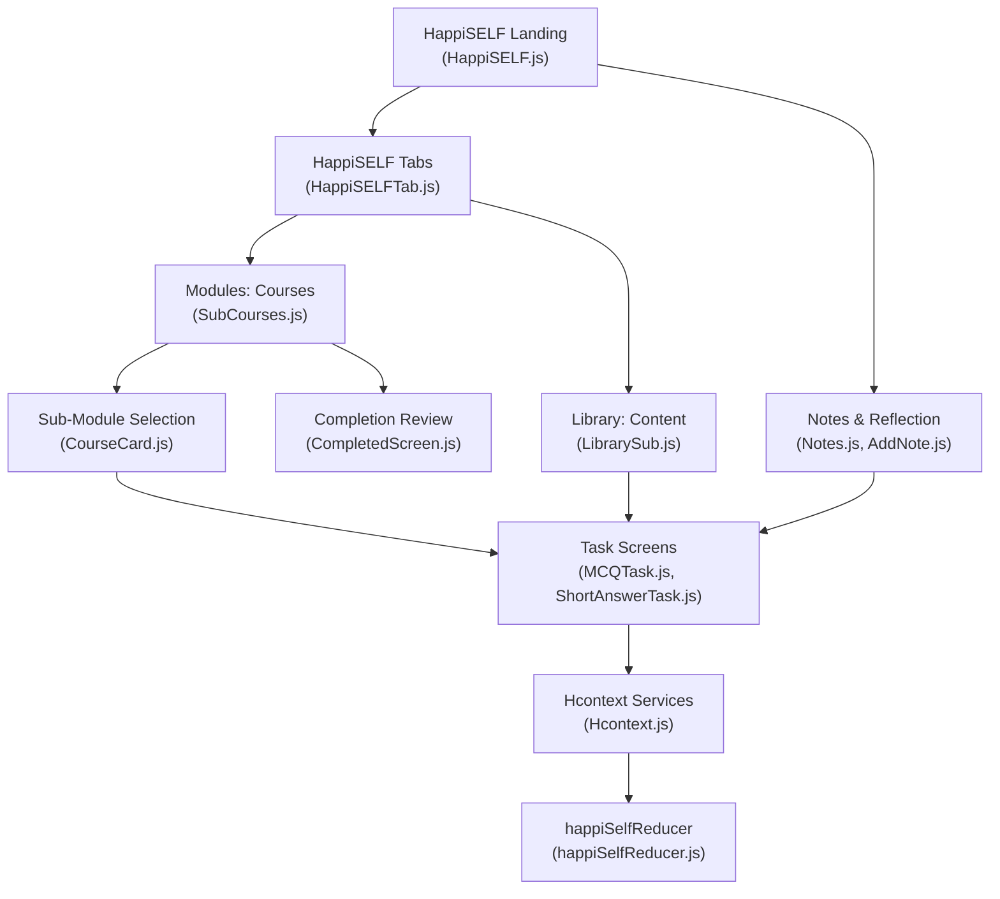
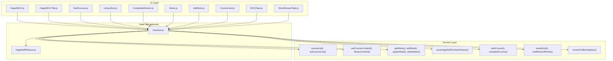
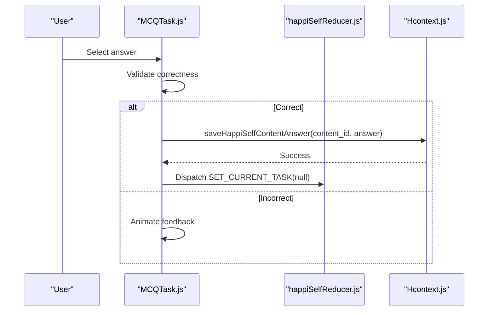
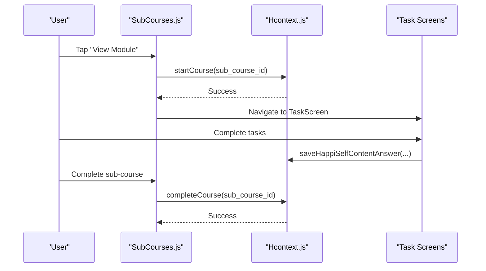
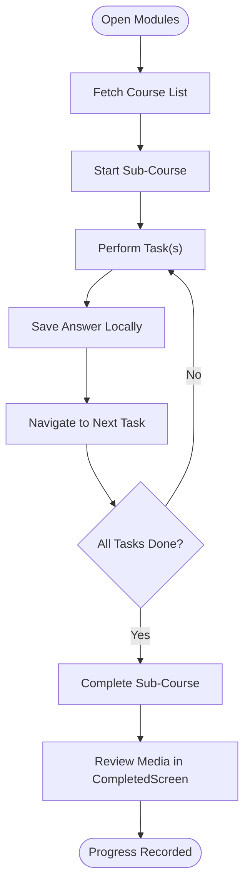
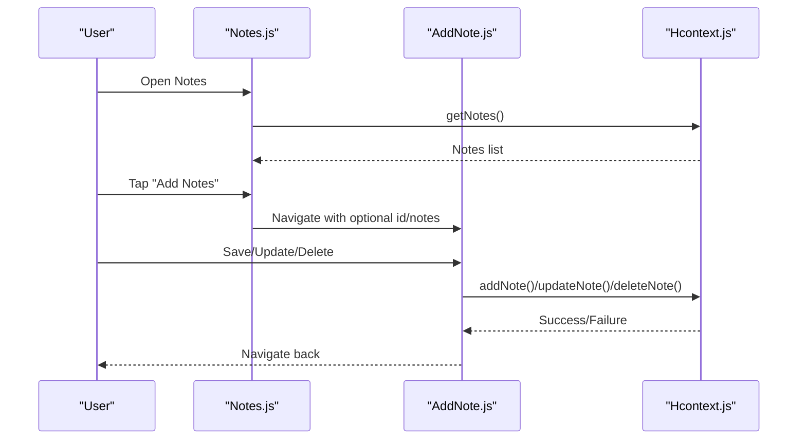
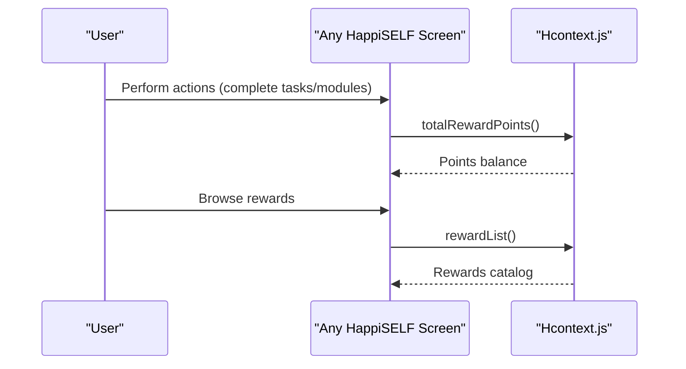
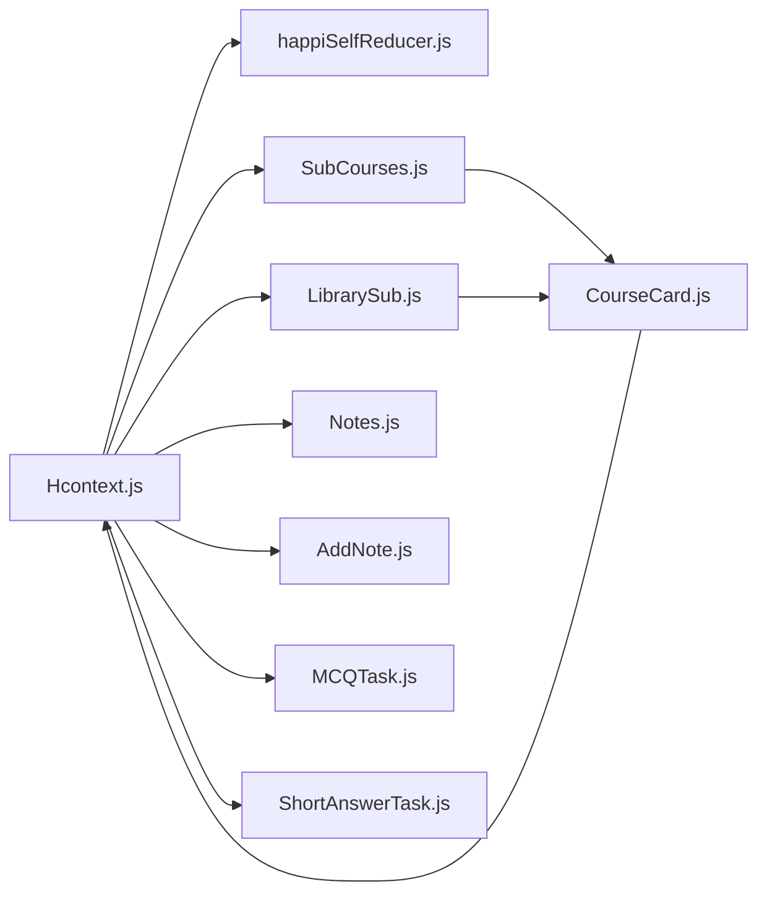

# HappiSELF - Self-Help and Wellness Module

<cite>
**Referenced Files in This Document**
- [HappiSELF.js](file://src/screens/HappiSELF/HappiSELF.js)
- [HappiSELFTab.js](file://src/screens/HappiSELF/HappiSELFTab.js)
- [SubCourses.js](file://src/screens/HappiSELF/SubCourses.js)
- [LibrarySub.js](file://src/screens/HappiSELF/LibrarySub.js)
- [CompletedScreen.js](file://src/screens/HappiSELF/CompletedScreen.js)
- [Notes.js](file://src/screens/HappiSELF/Notes.js)
- [AddNote.js](file://src/screens/HappiSELF/AddNote.js)
- [CourseCard.js](file://src/components/cards/CourseCard.js)
- [happiSelfReducer.js](file://src/context/reducers/happiSelfReducer.js)
- [Hcontext.js](file://src/context/Hcontext.js)
- [MCQTask.js](file://src/screens/HappiSELF/Tasks/MCQTask.js)
- [ShortAnswerTask.js](file://src/screens/HappiSELF/Tasks/ShortAnswerTask.js)
</cite>

## Table of Contents
1. [Introduction](#introduction)
2. [Project Structure](#project-structure)
3. [Core Components](#core-components)
4. [Architecture Overview](#architecture-overview)
5. [Detailed Component Analysis](#detailed-component-analysis)
6. [Dependency Analysis](#dependency-analysis)
7. [Performance Considerations](#performance-considerations)
8. [Troubleshooting Guide](#troubleshooting-guide)
9. [Conclusion](#conclusion)
10. [Appendices](#appendices)

## Introduction
HappiSELF is the self-help and wellness module within HappiMynd, designed to support personal development and habit building through evidence-based, interactive activities. It offers:
- Task-based learning with daily challenges and structured modules
- Weekly and long-term wellness programs via course enrollment and completion tracking
- Habit formation workflows with progress monitoring
- Journaling and note-taking for reflection and documentation
- Reward and motivation systems for milestones
- Personalization via user progress and preferences
- Community features for peer support and accountability
- Integration with wearable devices and health tracking apps
- Evidence-based therapeutic approaches embedded in activities

## Project Structure
HappiSELF is organized around a tabbed interface with two primary sections:
- Modules: Browse and enroll in courses, track progress, and complete sub-modules
- Library: Access curated media content (video/audio) for relaxation and skill-building

Key screens and components:
- HappiSELF landing screen with subscription gating
- HappiSELFTab with top-tab navigator for Modules and Library
- SubCourses: Course enrollment and sub-module selection
- LibrarySub: Library content browsing
- CompletedScreen: Post-completion media review
- Notes and AddNote: Reflection and progress documentation
- Task components (MCQTask, ShortAnswerTask): Interactive exercises
- CourseCard: Unified card component for courses, videos, and locked items
- Hcontext: Centralized service layer for HappiSELF APIs and state
- happiSelfReducer: Local state management for tasks and answers

**Diagram sources**
- [HappiSELF.js:1-173](file://src/screens/HappiSELF/HappiSELF.js#L1-L173)
- [HappiSELFTab.js:1-223](file://src/screens/HappiSELF/HappiSELFTab.js#L1-L223)
- [SubCourses.js:1-173](file://src/screens/HappiSELF/SubCourses.js#L1-L173)
- [LibrarySub.js:1-103](file://src/screens/HappiSELF/LibrarySub.js#L1-L103)
- [CompletedScreen.js:1-167](file://src/screens/HappiSELF/CompletedScreen.js#L1-L167)
- [Notes.js:1-171](file://src/screens/HappiSELF/Notes.js#L1-L171)
- [AddNote.js:1-200](file://src/screens/HappiSELF/AddNote.js#L1-L200)
- [CourseCard.js:1-297](file://src/components/cards/CourseCard.js#L1-L297)
- [Hcontext.js:879-1031](file://src/context/Hcontext.js#L879-L1031)
- [happiSelfReducer.js:1-45](file://src/context/reducers/happiSelfReducer.js#L1-L45)

**Section sources**
- [HappiSELF.js:1-173](file://src/screens/HappiSELF/HappiSELF.js#L1-L173)
- [HappiSELFTab.js:1-223](file://src/screens/HappiSELF/HappiSELFTab.js#L1-L223)

## Core Components
- HappiSELF Landing Screen: Displays module overview, checks subscription status, and navigates to pricing or subscribed services.
- HappiSELFTab: Top-tab navigator for Modules and Library with search and filtering.
- SubCourses: Fetches course lists, handles enrollment, and navigates to task screens.
- LibrarySub: Browses library content and opens task screens for media items.
- CompletedScreen: Reviews completed sub-module media after course completion.
- Notes and AddNote: CRUD operations for user reflections and progress documentation.
- Task Components: Interactive exercises (MCQ, short answer) with animations and correctness feedback.
- CourseCard: Unified UI for locked, unlocked, video/audio, and completed items with actions.
- Hcontext: Provides HappiSELF APIs (course lists, sub-course content, notes, answers, rewards) and manages analytics.
- happiSelfReducer: Manages current sub-course, current task, questions list, active task, and active task answer.

**Section sources**
- [SubCourses.js:1-173](file://src/screens/HappiSELF/SubCourses.js#L1-L173)
- [LibrarySub.js:1-103](file://src/screens/HappiSELF/LibrarySub.js#L1-L103)
- [CompletedScreen.js:1-167](file://src/screens/HappiSELF/CompletedScreen.js#L1-L167)
- [Notes.js:1-171](file://src/screens/HappiSELF/Notes.js#L1-L171)
- [AddNote.js:1-200](file://src/screens/HappiSELF/AddNote.js#L1-L200)
- [CourseCard.js:1-297](file://src/components/cards/CourseCard.js#L1-L297)
- [Hcontext.js:879-1031](file://src/context/Hcontext.js#L879-L1031)
- [happiSelfReducer.js:1-45](file://src/context/reducers/happiSelfReducer.js#L1-L45)

## Architecture Overview
HappiSELF follows a layered architecture:
- UI Layer: Screens and components render content and collect user input.
- State Management: Local reducer tracks active tasks and answers; global context orchestrates API calls and analytics.
- Service Layer: Hcontext encapsulates all HappiSELF endpoints for courses, sub-courses, content, notes, answers, and rewards.
- Persistence: Async storage is available for caching and offline behavior (not used in the analyzed files).
- Analytics: Screen traffic analytics are sent to an external analytics endpoint.

**Diagram sources**
- [HappiSELF.js:1-173](file://src/screens/HappiSELF/HappiSELF.js#L1-L173)
- [HappiSELFTab.js:1-223](file://src/screens/HappiSELF/HappiSELFTab.js#L1-L223)
- [SubCourses.js:1-173](file://src/screens/HappiSELF/SubCourses.js#L1-L173)
- [LibrarySub.js:1-103](file://src/screens/HappiSELF/LibrarySub.js#L1-L103)
- [CompletedScreen.js:1-167](file://src/screens/HappiSELF/CompletedScreen.js#L1-L167)
- [Notes.js:1-171](file://src/screens/HappiSELF/Notes.js#L1-L171)
- [AddNote.js:1-200](file://src/screens/HappiSELF/AddNote.js#L1-L200)
- [CourseCard.js:1-297](file://src/components/cards/CourseCard.js#L1-L297)
- [MCQTask.js:1-197](file://src/screens/HappiSELF/Tasks/MCQTask.js#L1-L197)
- [ShortAnswerTask.js:1-126](file://src/screens/HappiSELF/Tasks/ShortAnswerTask.js#L1-L126)
- [happiSelfReducer.js:1-45](file://src/context/reducers/happiSelfReducer.js#L1-L45)
- [Hcontext.js:879-1031](file://src/context/Hcontext.js#L879-L1031)

## Detailed Component Analysis

### Task-Based Learning System
HappiSELF’s task-based learning integrates multiple exercise types:
- Multiple Choice Questions (MCQTask): Presents a question with options, animates feedback, and triggers completion on correct selection.
- Short Answer Task (ShortAnswerTask): Captures free-form text input and auto-completes when an answer exists in local state.
- Completion Workflow: After task completion, the system can trigger course completion and reward updates.

**Diagram sources**
- [MCQTask.js:1-197](file://src/screens/HappiSELF/Tasks/MCQTask.js#L1-L197)
- [happiSelfReducer.js:1-45](file://src/context/reducers/happiSelfReducer.js#L1-L45)
- [Hcontext.js:1042-1054](file://src/context/Hcontext.js#L1042-L1054)

**Section sources**
- [MCQTask.js:1-197](file://src/screens/HappiSELF/Tasks/MCQTask.js#L1-L197)
- [ShortAnswerTask.js:1-126](file://src/screens/HappiSELF/Tasks/ShortAnswerTask.js#L1-L126)
- [happiSelfReducer.js:1-45](file://src/context/reducers/happiSelfReducer.js#L1-L45)
- [Hcontext.js:1042-1054](file://src/context/Hcontext.js#L1042-L1054)

### Course Enrollment and Completion Tracking
- Course Discovery: Modules screen fetches course lists and supports search.
- Enrollment: SubCourses initiates course start and navigates to task screens.
- Progress: CompletedScreen lists media associated with a completed sub-course.
- Completion API: startCourse and completeCourse endpoints manage lifecycle.

**Diagram sources**
- [SubCourses.js:1-173](file://src/screens/HappiSELF/SubCourses.js#L1-L173)
- [Hcontext.js:939-962](file://src/context/Hcontext.js#L939-L962)

**Section sources**
- [SubCourses.js:1-173](file://src/screens/HappiSELF/SubCourses.js#L1-L173)
- [CompletedScreen.js:1-167](file://src/screens/HappiSELF/CompletedScreen.js#L1-L167)
- [Hcontext.js:939-962](file://src/context/Hcontext.js#L939-L962)

### Habit Formation Workflows and Progress Monitoring
- Habit scaffolding: Users engage with daily micro-challenges (short answer tasks) and weekly modules (sub-courses).
- Progress visibility: CourseCard displays locked, unlocked, ongoing, and completed states; CompletedScreen aggregates media for review.
- Local state: happiSelfReducer tracks current sub-course, current task, and active task answer to coordinate navigation and completion.

**Diagram sources**
- [SubCourses.js:1-173](file://src/screens/HappiSELF/SubCourses.js#L1-L173)
- [happiSelfReducer.js:1-45](file://src/context/reducers/happiSelfReducer.js#L1-L45)
- [CompletedScreen.js:1-167](file://src/screens/HappiSELF/CompletedScreen.js#L1-L167)

**Section sources**
- [CourseCard.js:1-297](file://src/components/cards/CourseCard.js#L1-L297)
- [happiSelfReducer.js:1-45](file://src/context/reducers/happiSelfReducer.js#L1-L45)

### Journaling and Note-Taking Functionality
- Notes Listing: Notes screen fetches and displays saved notes as cards.
- Add/Edit/Delete: AddNote screen supports saving, updating, and deleting notes via Hcontext.
- Navigation: Notes screen links to AddNote; AddNote navigates back after operations.

**Diagram sources**
- [Notes.js:1-171](file://src/screens/HappiSELF/Notes.js#L1-L171)
- [AddNote.js:1-200](file://src/screens/HappiSELF/AddNote.js#L1-L200)
- [Hcontext.js:964-1010](file://src/context/Hcontext.js#L964-L1010)

**Section sources**
- [Notes.js:1-171](file://src/screens/HappiSELF/Notes.js#L1-L171)
- [AddNote.js:1-200](file://src/screens/HappiSELF/AddNote.js#L1-L200)
- [Hcontext.js:964-1010](file://src/context/Hcontext.js#L964-L1010)

### Reward and Motivation Systems
- Rewards Catalog: rewardList provides available reward instances.
- Points Tracking: totalRewardPoints retrieves user’s accumulated points.
- Integration: These services are exposed via Hcontext for UI consumption.

**Diagram sources**
- [Hcontext.js:1303-1343](file://src/context/Hcontext.js#L1303-L1343)

**Section sources**
- [Hcontext.js:1303-1343](file://src/context/Hcontext.js#L1303-L1343)

### Personalization Algorithms
- Preferences and Progress: While explicit ML models are not present in the analyzed files, personalization is supported by:
  - Liked/unliked courses (like/unlike endpoints)
  - Notes and answers that inform future content suggestions
  - Analytics on screen traffic to understand engagement patterns
- Recommendation Hooks: The presence of like/unlike and analytics endpoints indicates pathways for future personalization enhancements.

**Section sources**
- [Hcontext.js:915-938](file://src/context/Hcontext.js#L915-L938)
- [Hcontext.js:1321-1334](file://src/context/Hcontext.js#L1321-L1334)

### Wearables and Health Tracking Integration
- Device Token Handling: Hcontext registers and stores device tokens for push notifications, indicating capability for device-centric integrations.
- Health Data Pathways: No explicit health data endpoints are present in the analyzed files; however, device token management and Firebase upload utilities suggest potential for integrating external health data via secure channels.

**Section sources**
- [Hcontext.js:42-127](file://src/context/Hcontext.js#L42-L127)
- [Hcontext.js:836-857](file://src/context/Hcontext.js#L836-L857)

### Community Features (Peer Support and Accountability)
- Community Signals: The codebase includes chat and psychologist services, indicating potential for peer groups and guided sessions.
- Accountability Hooks: Notifications and analytics enable reminders and progress sharing, laying groundwork for community features.

**Section sources**
- [Hcontext.js:800-834](file://src/context/Hcontext.js#L800-L834)
- [Hcontext.js:1321-1334](file://src/context/Hcontext.js#L1321-L1334)

### Evidence-Based Approaches
- Cognitive Behavioral Therapy (CBT): The HappiSELF landing screen explicitly mentions embedding the module in CBT techniques, aligning activities with proven therapeutic impact.

**Section sources**
- [HappiSELF.js:90-102](file://src/screens/HappiSELF/HappiSELF.js#L90-L102)

## Dependency Analysis
HappiSELF components depend on:
- Hcontext for all backend interactions (course lists, sub-course content, notes, answers, rewards)
- happiSelfReducer for local task and answer state
- CourseCard for unified rendering of course states
- Task components for interactive exercises

**Diagram sources**
- [Hcontext.js:879-1031](file://src/context/Hcontext.js#L879-L1031)
- [happiSelfReducer.js:1-45](file://src/context/reducers/happiSelfReducer.js#L1-L45)
- [SubCourses.js:1-173](file://src/screens/HappiSELF/SubCourses.js#L1-L173)
- [LibrarySub.js:1-103](file://src/screens/HappiSELF/LibrarySub.js#L1-L103)
- [Notes.js:1-171](file://src/screens/HappiSELF/Notes.js#L1-L171)
- [AddNote.js:1-200](file://src/screens/HappiSELF/AddNote.js#L1-L200)
- [MCQTask.js:1-197](file://src/screens/HappiSELF/Tasks/MCQTask.js#L1-L197)
- [ShortAnswerTask.js:1-126](file://src/screens/HappiSELF/Tasks/ShortAnswerTask.js#L1-L126)
- [CourseCard.js:1-297](file://src/components/cards/CourseCard.js#L1-L297)

**Section sources**
- [Hcontext.js:879-1031](file://src/context/Hcontext.js#L879-L1031)

## Performance Considerations
- Network Efficiency: Batch API calls where possible; cache frequently accessed lists (course, library) in memory to reduce redundant requests.
- Rendering: Use FlatList for large note lists; lazy-load media content in CompletedScreen.
- Animations: Keep animations lightweight; avoid unnecessary re-renders by memoizing props in task components.
- State Updates: Consolidate reducer actions to minimize re-renders; avoid frequent dispatches during rapid user interactions.

## Troubleshooting Guide
- Subscription Gate: HappiSELF landing checks subscriptions and routes accordingly. If navigation fails, verify getSubscriptions and auth state.
- Course Enrollment: If startCourse fails, ensure the sub-course ID is valid and the user is authenticated.
- Notes Operations: If add/update/delete notes fail, check network connectivity and server responses.
- Task Completion: If saveHappiSelfContentAnswer fails, verify content_id and answer payload.
- Analytics: If screenTrafficAnalytics fails, inspect network logs and endpoint availability.

**Section sources**
- [HappiSELF.js:44-57](file://src/screens/HappiSELF/HappiSELF.js#L44-L57)
- [SubCourses.js:72-87](file://src/screens/HappiSELF/SubCourses.js#L72-L87)
- [Notes.js:72-85](file://src/screens/HappiSELF/Notes.js#L72-L85)
- [AddNote.js:52-100](file://src/screens/HappiSELF/AddNote.js#L52-L100)
- [Hcontext.js:1042-1054](file://src/context/Hcontext.js#L1042-L1054)
- [Hcontext.js:1321-1334](file://src/context/Hcontext.js#L1321-L1334)

## Conclusion
HappiSELF provides a robust foundation for self-help and wellness through structured modules, interactive tasks, reflection tools, and reward systems. Its modular architecture, centralized context layer, and reusable components enable scalable enhancements for personalization, community features, and integrations with wearables and health platforms. The explicit mention of CBT-based activities positions the module to deliver evidence-backed therapeutic benefits aligned with user progress and preferences.

## Appendices
- API Reference Highlights
  - Course APIs: courseList, subCourseList, subCourseContent, startCourse, completeCourse
  - Notes APIs: getNotes, addNote, updateNote, deleteNote
  - Task APIs: saveHappiSelfContentAnswer
  - Rewards APIs: rewardList, totalRewardPoints
  - Analytics: screenTrafficAnalytics

**Section sources**
- [Hcontext.js:879-1031](file://src/context/Hcontext.js#L879-L1031)
- [Hcontext.js:1303-1343](file://src/context/Hcontext.js#L1303-L1343)
- [Hcontext.js:1321-1334](file://src/context/Hcontext.js#L1321-L1334)