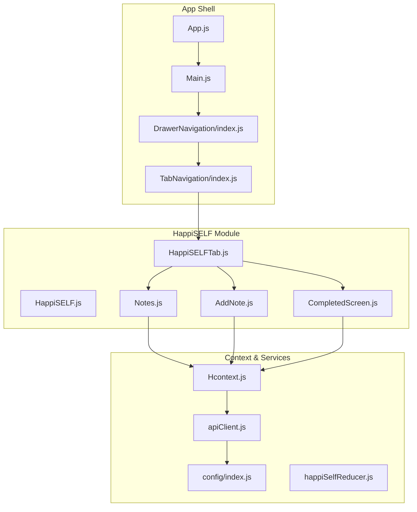
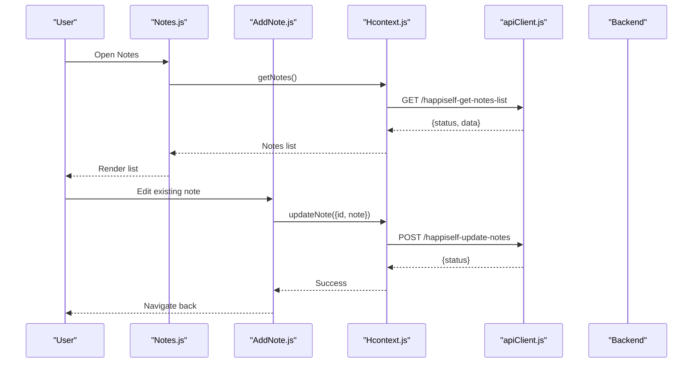
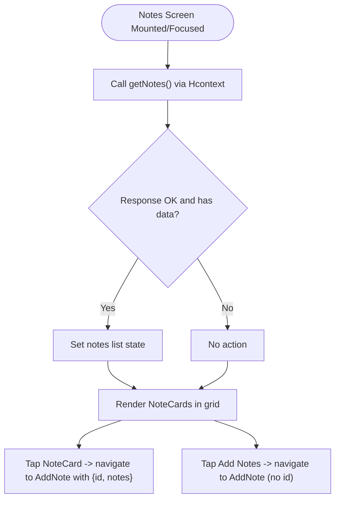
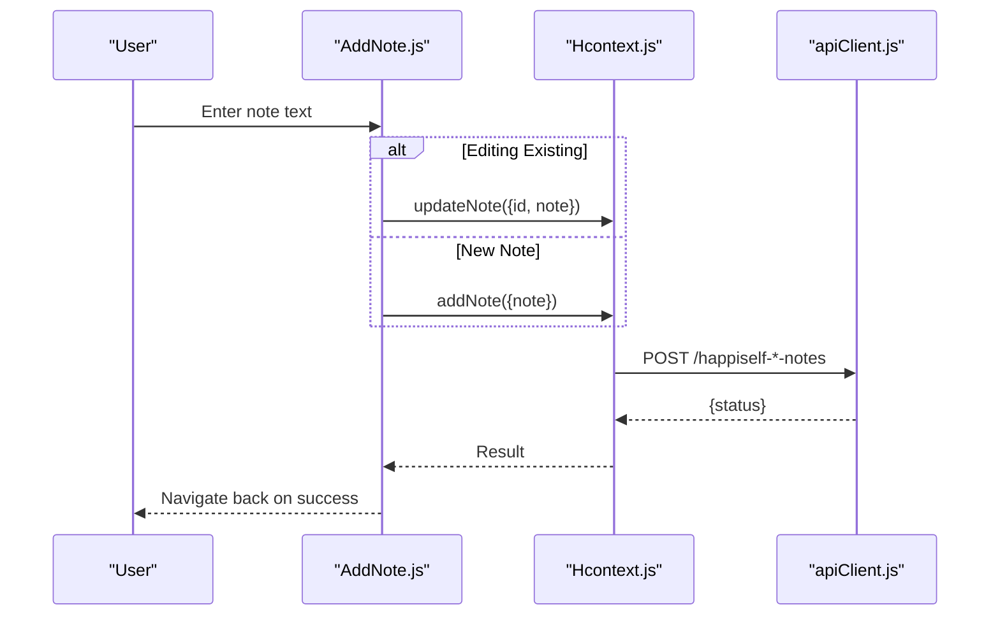
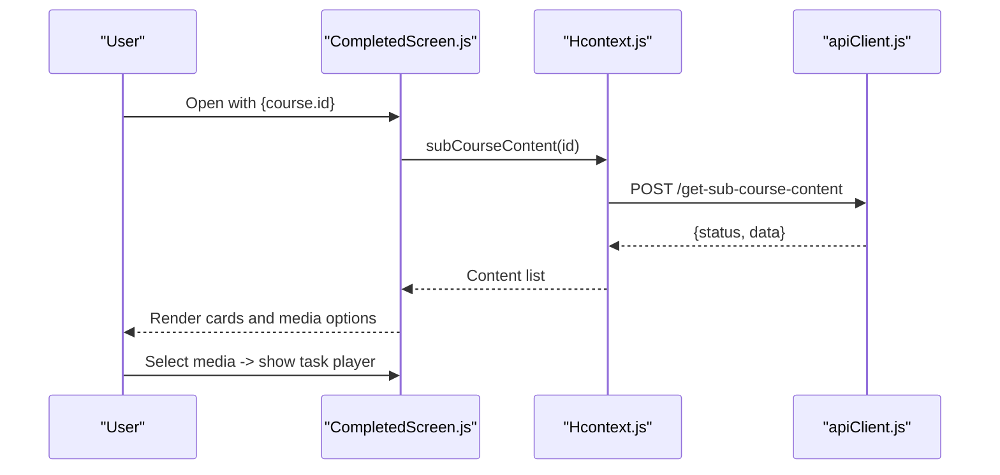
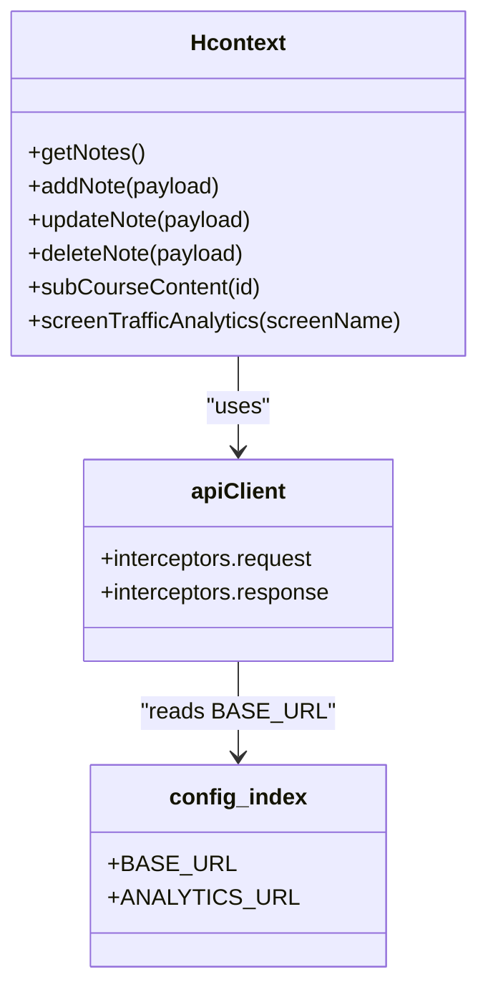
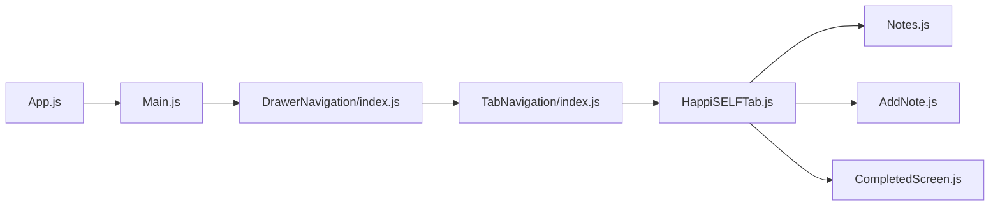
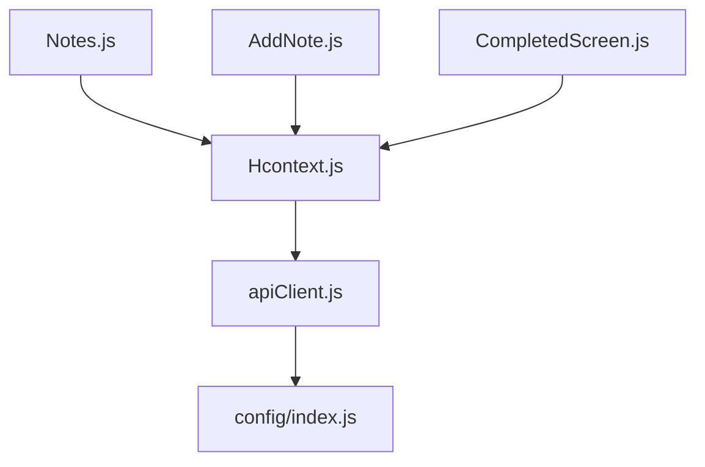

# Journaling and Reflection Tools

<cite>
**Referenced Files in This Document**
- [AddNote.js](file://src/screens/HappiSELF/AddNote.js)
- [Notes.js](file://src/screens/HappiSELF/Notes.js)
- [CompletedScreen.js](file://src/screens/HappiSELF/CompletedScreen.js)
- [HappiSELF.js](file://src/screens/HappiSELF/HappiSELF.js)
- [HappiSELFTab.js](file://src/screens/HappiSELF/HappiSELFTab.js)
- [Hcontext.js](file://src/context/Hcontext.js)
- [apiClient.js](file://src/context/apiClient.js)
- [config/index.js](file://src/config/index.js)
- [happiSelfReducer.js](file://src/context/reducers/happiSelfReducer.js)
- [App.js](file://App.js)
- [Main.js](file://src/screens/Main.js)
- [DrawerNavigation/index.js](file://src/routes/DrawerNavigation/index.js)
- [TabNavigation/index.js](file://src/routes/TabNavigation/index.js)
</cite>

## Table of Contents
1. [Introduction](#introduction)
2. [Project Structure](#project-structure)
3. [Core Components](#core-components)
4. [Architecture Overview](#architecture-overview)
5. [Detailed Component Analysis](#detailed-component-analysis)
6. [Dependency Analysis](#dependency-analysis)
7. [Performance Considerations](#performance-considerations)
8. [Troubleshooting Guide](#troubleshooting-guide)
9. [Conclusion](#conclusion)
10. [Appendices](#appendices)

## Introduction
This document explains the journaling and reflection tools within HappiSELF, focusing on:
- Viewing and managing personal reflections via the Notes screen
- Creating and editing journal entries through the AddNote interface
- Reviewing completed activities and associated media via the CompletedScreen
It also covers the note-taking workflow, content formatting options, storage mechanisms, integration with mood tracking and habit logging, progress monitoring, privacy controls, export capabilities, and the relationship between journaling and therapeutic outcomes grounded in reflective writing and self-awareness-building.

## Project Structure
HappiSELF’s journaling features are implemented as React Native screens under src/screens/HappiSELF and orchestrated by a centralized context provider. The screens are navigable from the main app shell and integrate with backend APIs for persistence and analytics.

**Diagram sources**
- [App.js:1-59](file://App.js#L1-L59)
- [Main.js:1-172](file://src/screens/Main.js#L1-L172)
- [DrawerNavigation/index.js:1-298](file://src/routes/DrawerNavigation/index.js#L1-L298)
- [TabNavigation/index.js:1-83](file://src/routes/TabNavigation/index.js#L1-L83)
- [HappiSELF.js:1-173](file://src/screens/HappiSELF/HappiSELF.js#L1-L173)
- [HappiSELFTab.js:1-223](file://src/screens/HappiSELF/HappiSELFTab.js#L1-L223)
- [Notes.js:1-171](file://src/screens/HappiSELF/Notes.js#L1-L171)
- [AddNote.js:1-200](file://src/screens/HappiSELF/AddNote.js#L1-L200)
- [CompletedScreen.js:1-167](file://src/screens/HappiSELF/CompletedScreen.js#L1-L167)
- [Hcontext.js:1-1568](file://src/context/Hcontext.js#L1-L1568)
- [apiClient.js:1-58](file://src/context/apiClient.js#L1-L58)
- [config/index.js:1-13](file://src/config/index.js#L1-L13)
- [happiSelfReducer.js:1-45](file://src/context/reducers/happiSelfReducer.js#L1-L45)

**Section sources**
- [App.js:1-59](file://App.js#L1-L59)
- [Main.js:1-172](file://src/screens/Main.js#L1-L172)
- [DrawerNavigation/index.js:1-298](file://src/routes/DrawerNavigation/index.js#L1-L298)
- [TabNavigation/index.js:1-83](file://src/routes/TabNavigation/index.js#L1-L83)
- [HappiSELF.js:1-173](file://src/screens/HappiSELF/HappiSELF.js#L1-L173)
- [HappiSELFTab.js:1-223](file://src/screens/HappiSELF/HappiSELFTab.js#L1-L223)

## Core Components
- Notes screen: Lists saved reflections, truncates previews, and navigates to AddNote for editing.
- AddNote screen: Provides a text area for free-form journaling, supports save/update/delete, and integrates with analytics.
- CompletedScreen: Displays course media (video/audio) associated with completed activities and allows playback selection.

Key behaviors:
- Notes retrieval and CRUD operations are exposed via Hcontext methods.
- Navigation is handled by React Navigation stacks and tab navigators.
- Backend integration uses axios with interceptors for token injection and standardized error handling.

**Section sources**
- [Notes.js:1-171](file://src/screens/HappiSELF/Notes.js#L1-L171)
- [AddNote.js:1-200](file://src/screens/HappiSELF/AddNote.js#L1-L200)
- [CompletedScreen.js:1-167](file://src/screens/HappiSELF/CompletedScreen.js#L1-L167)
- [Hcontext.js:981-1027](file://src/context/Hcontext.js#L981-L1027)

## Architecture Overview
The journaling workflow connects UI screens to a central context that encapsulates:
- API client with automatic bearer token injection
- Backend endpoints for notes CRUD and analytics
- Local state management for HappiSELF tasks and answers

**Diagram sources**
- [Notes.js:72-85](file://src/screens/HappiSELF/Notes.js#L72-L85)
- [AddNote.js:68-83](file://src/screens/HappiSELF/AddNote.js#L68-L83)
- [Hcontext.js:981-1027](file://src/context/Hcontext.js#L981-L1027)
- [apiClient.js:11-56](file://src/context/apiClient.js#L11-L56)

## Detailed Component Analysis

### Notes Screen
Purpose:
- Display a paginated grid of note previews
- Trigger creation or editing via AddNote
- Fetch notes on focus with loading states

Implementation highlights:
- Uses a focus effect to refresh data when the screen gains focus
- Truncates long notes for compact display
- Navigates to AddNote with optional id/notes payload for editing

**Diagram sources**
- [Notes.js:59-85](file://src/screens/HappiSELF/Notes.js#L59-L85)
- [Notes.js:118-133](file://src/screens/HappiSELF/Notes.js#L118-L133)

**Section sources**
- [Notes.js:1-171](file://src/screens/HappiSELF/Notes.js#L1-L171)

### AddNote Screen
Purpose:
- Capture free-form journal entries
- Save new notes or update existing ones
- Delete notes after confirmation
- Track screen traffic analytics

Implementation highlights:
- Single text area for note content
- Conditional rendering of Update/Delete vs Save based on presence of id
- Loading indicators during async operations
- Calls to Hcontext.addNote, updateNote, deleteNote

**Diagram sources**
- [AddNote.js:52-100](file://src/screens/HappiSELF/AddNote.js#L52-L100)
- [Hcontext.js:991-1027](file://src/context/Hcontext.js#L991-L1027)
- [apiClient.js:11-56](file://src/context/apiClient.js#L11-L56)

**Section sources**
- [AddNote.js:1-200](file://src/screens/HappiSELF/AddNote.js#L1-L200)

### CompletedScreen
Purpose:
- Present course media (video/audio) linked to completed activities
- Allow users to select and play content
- Provide a top bar to return to the list

Implementation highlights:
- Fetches subcourse content via subCourseContent
- Renders CourseCard items for eligible content types
- Supports dynamic selection of video or audio tasks

**Diagram sources**
- [CompletedScreen.js:52-66](file://src/screens/HappiSELF/CompletedScreen.js#L52-L66)
- [Hcontext.js:919-930](file://src/context/Hcontext.js#L919-L930)
- [apiClient.js:11-56](file://src/context/apiClient.js#L11-L56)

**Section sources**
- [CompletedScreen.js:1-167](file://src/screens/HappiSELF/CompletedScreen.js#L1-L167)

### Context and Storage Mechanisms
- Hcontext exposes:
  - getNotes, addNote, updateNote, deleteNote for journaling
  - subCourseContent for retrieving media-linked activities
  - screenTrafficAnalytics for usage insights
- apiClient injects Authorization headers automatically and standardizes error responses
- Backend base URL configured centrally

**Diagram sources**
- [Hcontext.js:981-1027](file://src/context/Hcontext.js#L981-L1027)
- [Hcontext.js:1338-1351](file://src/context/Hcontext.js#L1338-L1351)
- [apiClient.js:1-58](file://src/context/apiClient.js#L1-L58)
- [config/index.js:1-13](file://src/config/index.js#L1-L13)

**Section sources**
- [Hcontext.js:1-1568](file://src/context/Hcontext.js#L1-L1568)
- [apiClient.js:1-58](file://src/context/apiClient.js#L1-L58)
- [config/index.js:1-13](file://src/config/index.js#L1-L13)

### Navigation Integration
- App initializes Hprovider and renders Main
- Main selects Auth stack or Drawer based on onboarding and login state
- DrawerNavigation hosts TabNavigation with Home, ExploreServices, Notification, Offers
- HappiSELFTab organizes Modules/Library tabs; Notes and AddNote are reachable from this tab
- CompletedScreen is navigable from course content flows

**Diagram sources**
- [App.js:1-59](file://App.js#L1-L59)
- [Main.js:96-146](file://src/screens/Main.js#L96-L146)
- [DrawerNavigation/index.js:39-283](file://src/routes/DrawerNavigation/index.js#L39-L283)
- [TabNavigation/index.js:18-82](file://src/routes/TabNavigation/index.js#L18-L82)
- [HappiSELFTab.js:201-223](file://src/screens/HappiSELF/HappiSELFTab.js#L201-L223)

**Section sources**
- [App.js:1-59](file://App.js#L1-L59)
- [Main.js:1-172](file://src/screens/Main.js#L1-L172)
- [DrawerNavigation/index.js:1-298](file://src/routes/DrawerNavigation/index.js#L1-L298)
- [TabNavigation/index.js:1-83](file://src/routes/TabNavigation/index.js#L1-L83)
- [HappiSELFTab.js:1-223](file://src/screens/HappiSELF/HappiSELFTab.js#L1-L223)

## Dependency Analysis
- UI screens depend on Hcontext for data and actions
- Hcontext depends on apiClient for HTTP communication
- apiClient depends on config for base URLs
- Notes and AddNote share the same CRUD contract for notes
- CompletedScreen leverages subCourseContent for media retrieval

**Diagram sources**
- [Notes.js:52-53](file://src/screens/HappiSELF/Notes.js#L52-L53)
- [AddNote.js:44](file://src/screens/HappiSELF/AddNote.js#L44)
- [CompletedScreen.js:38](file://src/screens/HappiSELF/CompletedScreen.js#L38)
- [Hcontext.js:981-1027](file://src/context/Hcontext.js#L981-L1027)
- [apiClient.js:1-58](file://src/context/apiClient.js#L1-L58)
- [config/index.js:1-13](file://src/config/index.js#L1-L13)

**Section sources**
- [Notes.js:1-171](file://src/screens/HappiSELF/Notes.js#L1-L171)
- [AddNote.js:1-200](file://src/screens/HappiSELF/AddNote.js#L1-L200)
- [CompletedScreen.js:1-167](file://src/screens/HappiSELF/CompletedScreen.js#L1-L167)
- [Hcontext.js:1-1568](file://src/context/Hcontext.js#L1-L1568)
- [apiClient.js:1-58](file://src/context/apiClient.js#L1-L58)
- [config/index.js:1-13](file://src/config/index.js#L1-L13)

## Performance Considerations
- Network calls are asynchronous; ensure loading states are visible to users
- Notes list rendering uses a grid layout; consider virtualization for large lists
- Media playback in CompletedScreen should be optimized for smooth UX
- Analytics calls are lightweight; avoid excessive frequency

## Troubleshooting Guide
Common issues and remedies:
- Authentication failures: apiClient attaches Authorization headers automatically; verify token availability and network connectivity
- Empty notes list: ensure getNotes returns data; check backend endpoint availability
- Update/Delete failures: confirm id is present and endpoint responses include status
- Media loading errors: verify subCourseContent returns expected content types

Operational logs and interceptors:
- apiClient logs request attempts and errors
- Hcontext methods wrap API calls and log errors for each operation

**Section sources**
- [apiClient.js:11-56](file://src/context/apiClient.js#L11-L56)
- [Hcontext.js:981-1027](file://src/context/Hcontext.js#L981-L1027)

## Conclusion
HappiSELF’s journaling tools provide a streamlined workflow for capturing, reviewing, and acting upon personal reflections. The Notes and AddNote screens integrate seamlessly with the broader HappiSELF navigation, while Hcontext centralizes data access and analytics. The CompletedScreen extends the experience by linking reflections to guided media content. Together, these components support reflective writing and self-awareness-building practices within a secure, privacy-conscious framework.

## Appendices

### Note-Taking Workflow and Content Formatting
- Workflow: Create/Edit/Delete notes via AddNote; browse and manage via Notes; link reflections to activities via CompletedScreen
- Content formatting: The AddNote screen uses a text area for free-form input; no built-in rich text formatting is present in the current implementation
- Storage: Notes are persisted server-side through Hcontext methods; local state is minimal and scoped to UI

**Section sources**
- [AddNote.js:139-143](file://src/screens/HappiSELF/AddNote.js#L139-L143)
- [Notes.js:26-46](file://src/screens/HappiSELF/Notes.js#L26-L46)
- [Hcontext.js:981-1027](file://src/context/Hcontext.js#L981-L1027)

### Integration with Mood Tracking and Habit Logging
- Mood tracking: Hcontext exposes mood emoji list and user mood submission endpoints; these can be paired with journal prompts to encourage reflective entries tied to mood
- Habit logging: While dedicated habit logging is not shown in the journaling screens, the task/answer saving mechanism supports embedding reflective prompts within structured activities

**Section sources**
- [Hcontext.js:1298-1319](file://src/context/Hcontext.js#L1298-L1319)
- [Hcontext.js:1059-1071](file://src/context/Hcontext.js#L1059-L1071)

### Progress Monitoring and Export Capabilities
- Progress monitoring: Notes list and task answer saving enable longitudinal tracking of reflection engagement
- Export: No explicit export functionality is present in the journaling screens; any export would require backend support and UI extension

**Section sources**
- [Notes.js:72-85](file://src/screens/HappiSELF/Notes.js#L72-L85)
- [Hcontext.js:1059-1071](file://src/context/Hcontext.js#L1059-L1071)

### Privacy Controls for Personal Reflections
- Authentication: apiClient injects bearer tokens; ensure secure token handling and storage
- Data handling: Hcontext methods operate over HTTPS; configure appropriate backend policies for data retention and deletion
- Recommendations: Implement granular privacy settings at the note level if needed, and provide user controls for data export/deletion

**Section sources**
- [apiClient.js:11-56](file://src/context/apiClient.js#L11-L56)
- [Hcontext.js:981-1027](file://src/context/Hcontext.js#L981-L1027)

### Relationship to Therapeutic Outcomes
Reflective writing and self-awareness-building are grounded in:
- Cognitive Behavioral Therapy (CBT): Structured reflection can mirror CBT techniques by identifying thoughts and behaviors
- Expressive writing: Encouraging regular journaling supports emotional processing and insight generation
- Habit formation: Linking reflections to daily activities reinforces positive behavioral changes

These approaches align with HappiSELF’s evidence-based self-help tools and can be integrated by pairing journal prompts with mood tracking and guided activities.