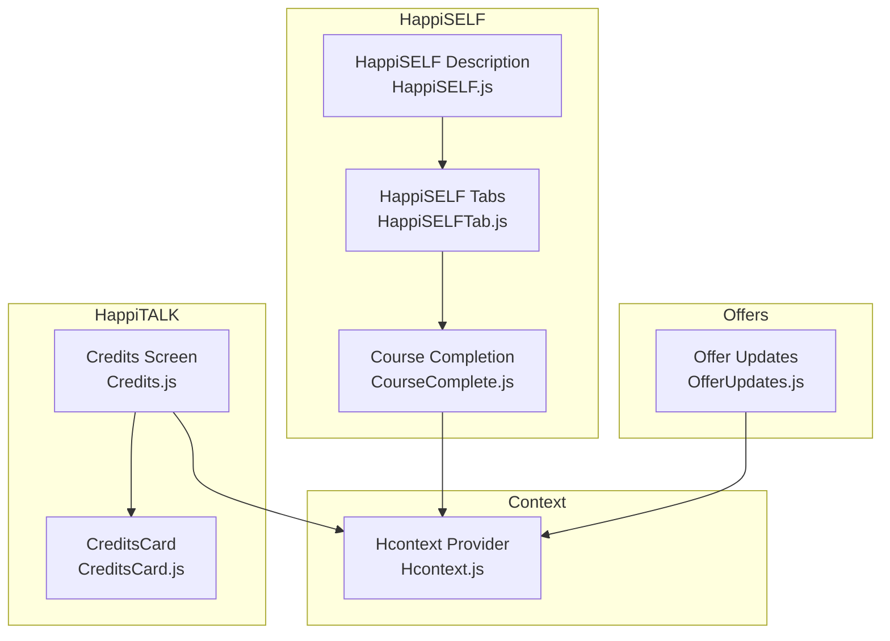
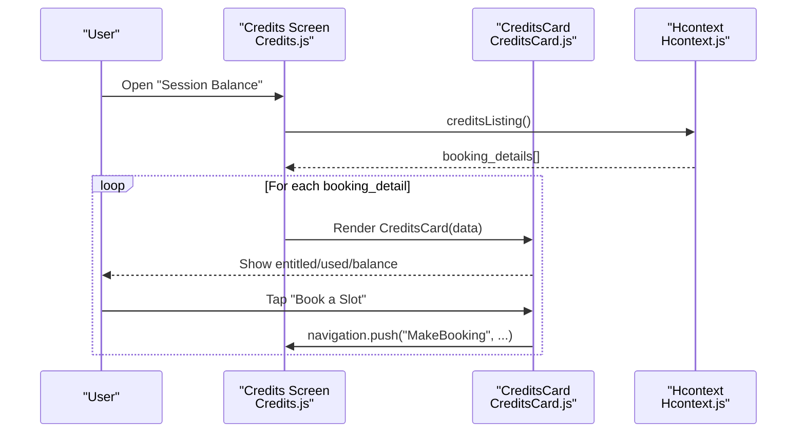
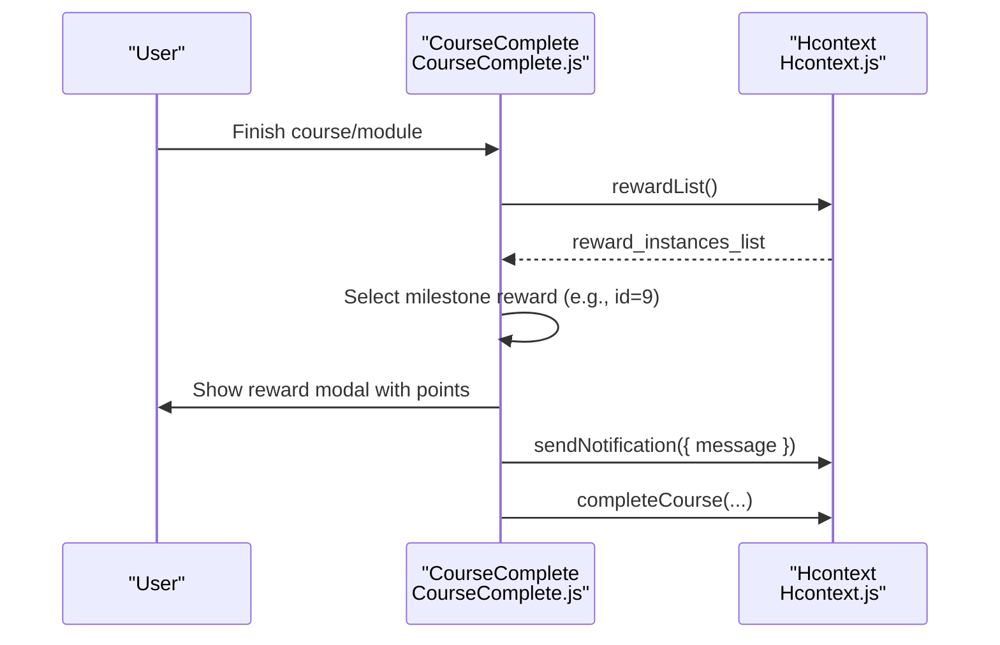
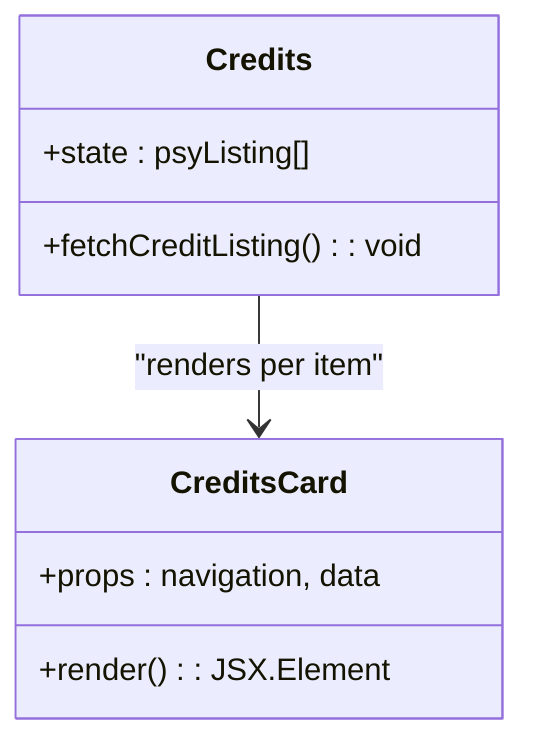
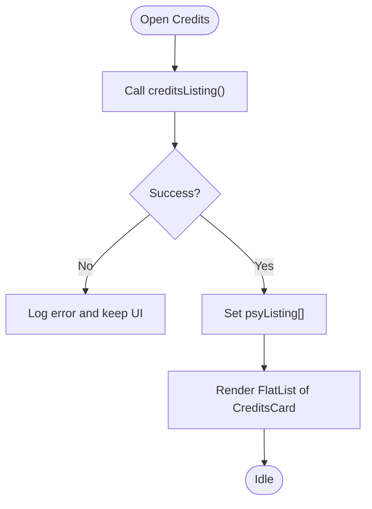
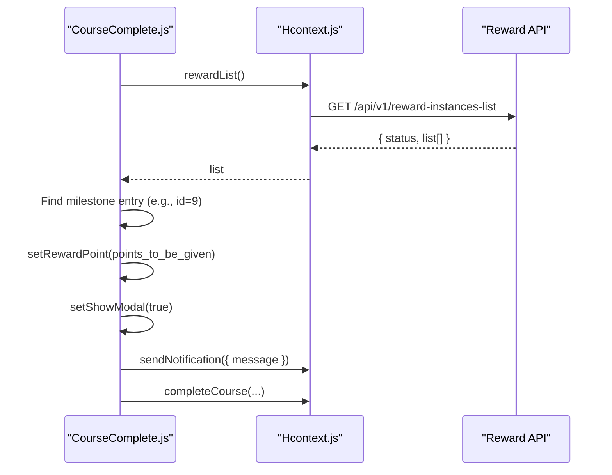
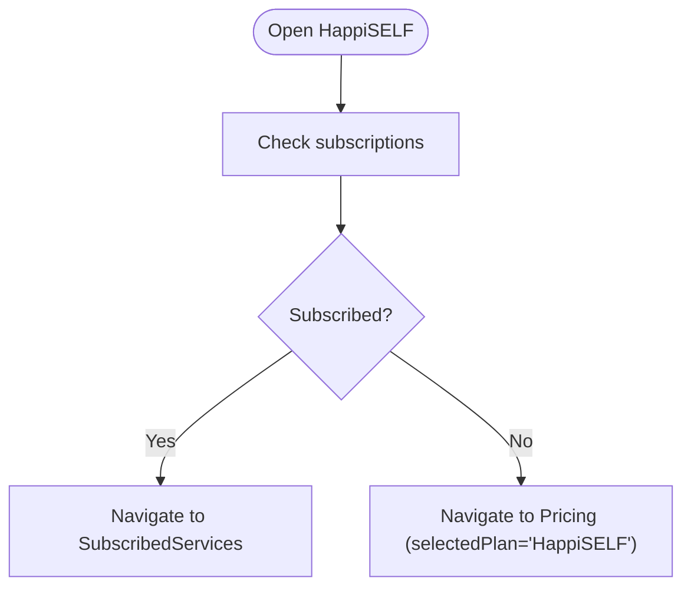
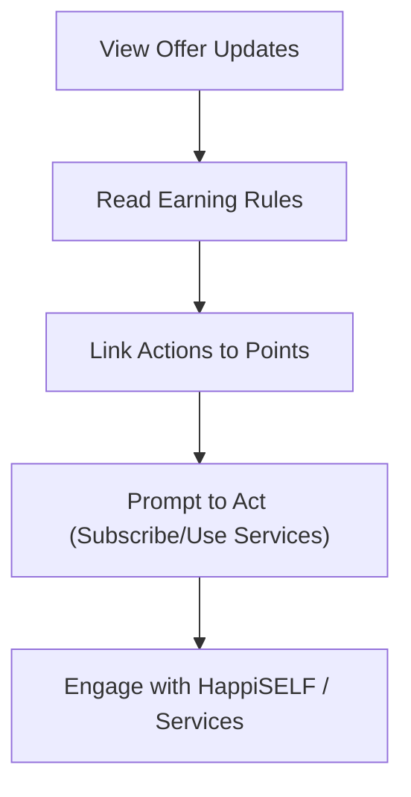
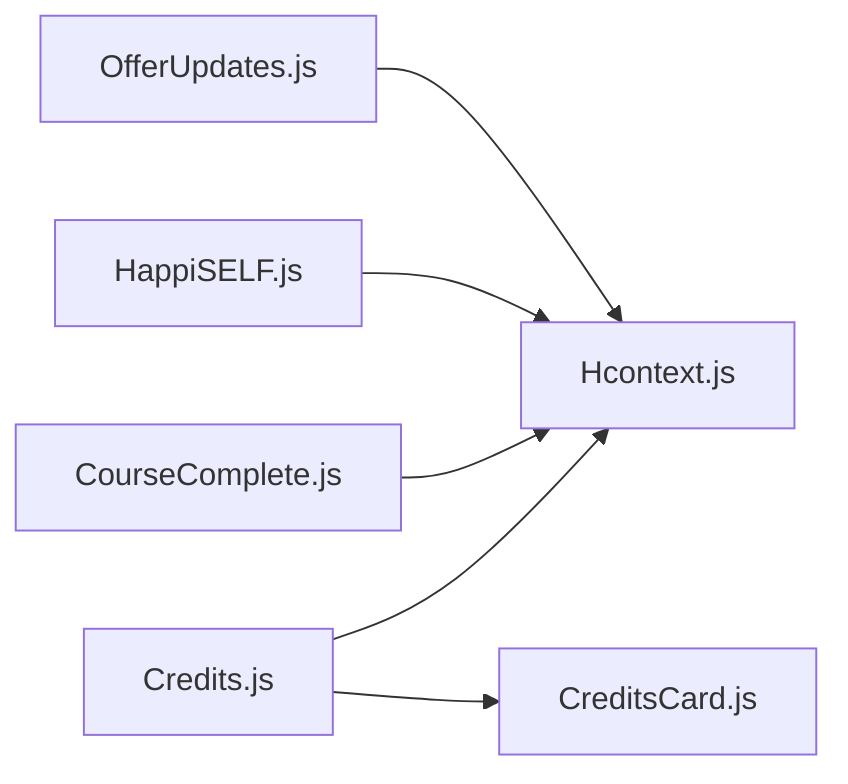

# Rewards and Motivation System

<cite>
**Referenced Files in This Document**
- [CreditsCard.js](file://src/components/cards/CreditsCard.js)
- [Credits.js](file://src/screens/HappiTALK/Credits.js)
- [Hcontext.js](file://src/context/Hcontext.js)
- [CourseComplete.js](file://src/screens/HappiSELF/Tasks/CourseComplete.js)
- [HappiSELF.js](file://src/screens/HappiSELF/HappiSELF.js)
- [HappiSELFTab.js](file://src/screens/HappiSELF/HappiSELFTab.js)
- [OfferUpdates.js](file://src/screens/shared/OfferUpdates.js)
</cite>

## Table of Contents
1. [Introduction](#introduction)
2. [Project Structure](#project-structure)
3. [Core Components](#core-components)
4. [Architecture Overview](#architecture-overview)
5. [Detailed Component Analysis](#detailed-component-analysis)
6. [Dependency Analysis](#dependency-analysis)
7. [Performance Considerations](#performance-considerations)
8. [Troubleshooting Guide](#troubleshooting-guide)
9. [Conclusion](#conclusion)

## Introduction
This document explains the rewards and motivation system within HappiSELF, focusing on the credit-based reward mechanism, achievement tracking, gamification elements, and behavioral reinforcement strategies. It documents how user progress and rewards are surfaced via the CreditsCard component, how milestones and completion triggers are integrated into the HappiSELF learning modules, and how the broader ecosystem supports long-term engagement through positive reinforcement and social motivation cues.

## Project Structure
The rewards and motivation system spans three primary areas:
- Credit-based reward display and booking integration via HappiTALK Credits screen and CreditsCard component
- Achievement and milestone tracking via HappiSELF tasks and reward list retrieval
- Offer-driven motivation via promotional content that ties actions to points

**Diagram sources**
- [Credits.js:26-94](file://src/screens/HappiTALK/Credits.js#L26-L94)
- [CreditsCard.js:12-88](file://src/components/cards/CreditsCard.js#L12-L88)
- [HappiSELFTab.js:201-223](file://src/screens/HappiSELF/HappiSELFTab.js#L201-L223)
- [HappiSELF.js:25-138](file://src/screens/HappiSELF/HappiSELF.js#L25-L138)
- [CourseComplete.js:26-92](file://src/screens/HappiSELF/Tasks/CourseComplete.js#L26-L92)
- [Hcontext.js:1335-1343](file://src/context/Hcontext.js#L1335-L1343)
- [OfferUpdates.js:130-178](file://src/screens/shared/OfferUpdates.js#L130-L178)

**Section sources**
- [Credits.js:26-94](file://src/screens/HappiTALK/Credits.js#L26-L94)
- [CreditsCard.js:12-88](file://src/components/cards/CreditsCard.js#L12-L88)
- [HappiSELFTab.js:201-223](file://src/screens/HappiSELF/HappiSELFTab.js#L201-L223)
- [HappiSELF.js:25-138](file://src/screens/HappiSELF/HappiSELF.js#L25-L138)
- [CourseComplete.js:26-92](file://src/screens/HappiSELF/Tasks/CourseComplete.js#L26-L92)
- [Hcontext.js:1335-1343](file://src/context/Hcontext.js#L1335-L1343)
- [OfferUpdates.js:130-178](file://src/screens/shared/OfferUpdates.js#L130-L178)

## Core Components
- CreditsCard: Displays psychologist profile, entitled/used/balance sessions, and enables booking via navigation.
- Credits Screen: Lists booking-enabled psychologists and renders CreditsCard instances.
- Reward List API: Provides reward instances (including milestone-based point values) consumed by task completion.
- CourseComplete: Fetches reward list, determines earned points, triggers notifications, and handles course completion flow.
- HappiSELF Tabs: Entry to HappiSELF modules and library; integrates with analytics and course discovery.
- Offer Updates: Promotional messaging that ties actions to points and payback opportunities.

Key responsibilities:
- Credit-based reward display and progression tracking
- Milestone-triggered reward delivery upon task/course completion
- Positive reinforcement via notifications and celebratory modals
- Behavioral reinforcement through visible progress and actionable next steps

**Section sources**
- [CreditsCard.js:12-88](file://src/components/cards/CreditsCard.js#L12-L88)
- [Credits.js:26-94](file://src/screens/HappiTALK/Credits.js#L26-L94)
- [CourseComplete.js:26-92](file://src/screens/HappiSELF/Tasks/CourseComplete.js#L26-L92)
- [HappiSELFTab.js:201-223](file://src/screens/HappiSELF/HappiSELFTab.js#L201-L223)
- [HappiSELF.js:25-138](file://src/screens/HappiSELF/HappiSELF.js#L25-L138)
- [OfferUpdates.js:130-178](file://src/screens/shared/OfferUpdates.js#L130-L178)
- [Hcontext.js:1335-1343](file://src/context/Hcontext.js#L1335-L1343)

## Architecture Overview
The system integrates three layers:
- Presentation Layer: Screens and cards surface progress and actions to the user.
- Business Logic Layer: Context methods orchestrate data retrieval and side effects.
- Backend Integration: APIs supply reward lists, credits, and offer content.

**Diagram sources**
- [Credits.js:26-94](file://src/screens/HappiTALK/Credits.js#L26-L94)
- [CreditsCard.js:12-88](file://src/components/cards/CreditsCard.js#L12-L88)
- [Hcontext.js:1490-1490](file://src/context/Hcontext.js#L1490-L1490)

**Diagram sources**
- [CourseComplete.js:26-92](file://src/screens/HappiSELF/Tasks/CourseComplete.js#L26-L92)
- [Hcontext.js:1335-1343](file://src/context/Hcontext.js#L1335-L1343)
- [Hcontext.js:1473-1473](file://src/context/Hcontext.js#L1473-L1473)

## Detailed Component Analysis

### CreditsCard Component
Purpose:
- Present psychologist profile and specialization
- Display session entitlement, usage, and balance
- Enable quick booking action

Behavior:
- Receives booking detail props (id, psychologist, totals)
- Renders profile image, name, and specialization
- Computes used sessions from totals
- Navigates to booking screen on button press

**Diagram sources**
- [CreditsCard.js:12-88](file://src/components/cards/CreditsCard.js#L12-L88)
- [Credits.js:26-94](file://src/screens/HappiTALK/Credits.js#L26-L94)

**Section sources**
- [CreditsCard.js:12-88](file://src/components/cards/CreditsCard.js#L12-L88)
- [Credits.js:26-94](file://src/screens/HappiTALK/Credits.js#L26-L94)

### Credits Screen and Listing
Purpose:
- Aggregate and present available booking slots with associated credits
- Drive user toward next action (booking)

Behavior:
- Calls creditsListing via context
- Handles loading and empty states
- Iterates over returned booking details and renders CreditsCard

**Diagram sources**
- [Credits.js:26-94](file://src/screens/HappiTALK/Credits.js#L26-L94)
- [Hcontext.js:1490-1490](file://src/context/Hcontext.js#L1490-L1490)

**Section sources**
- [Credits.js:26-94](file://src/screens/HappiTALK/Credits.js#L26-L94)
- [Hcontext.js:1490-1490](file://src/context/Hcontext.js#L1490-L1490)

### Reward List Retrieval and Milestone-Based Rewards
Purpose:
- Provide the catalog of reward instances (milestones, badges, point values)
- Power achievement tracking and positive reinforcement after tasks

Behavior:
- HappiSELF task screens call rewardList
- Locate the milestone reward (e.g., id=9) and extract points_to_be_given
- Trigger a notification and optional modal to celebrate completion
- Proceed with course completion handler

**Diagram sources**
- [CourseComplete.js:26-92](file://src/screens/HappiSELF/Tasks/CourseComplete.js#L26-L92)
- [Hcontext.js:1335-1343](file://src/context/Hcontext.js#L1335-L1343)
- [Hcontext.js:1473-1473](file://src/context/Hcontext.js#L1473-L1473)

**Section sources**
- [CourseComplete.js:26-92](file://src/screens/HappiSELF/Tasks/CourseComplete.js#L26-L92)
- [Hcontext.js:1335-1343](file://src/context/Hcontext.js#L1335-L1343)
- [Hcontext.js:1473-1473](file://src/context/Hcontext.js#L1473-L1473)

### HappiSELF Entry and Module Navigation
Purpose:
- Gate access to HappiSELF modules based on subscription status
- Surface module/library tabs and integrate analytics

Behavior:
- HappiSELF description screen checks subscriptions and routes accordingly
- HappiSELFTab provides top-tab navigation between Modules and Library
- Analytics are recorded for screen views

**Diagram sources**
- [HappiSELF.js:25-138](file://src/screens/HappiSELF/HappiSELF.js#L25-L138)
- [HappiSELFTab.js:201-223](file://src/screens/HappiSELF/HappiSELFTab.js#L201-L223)

**Section sources**
- [HappiSELF.js:25-138](file://src/screens/HappiSELF/HappiSELF.js#L25-L138)
- [HappiSELFTab.js:201-223](file://src/screens/HappiSELF/HappiSELFTab.js#L201-L223)

### Offer Updates and Behavioral Reinforcement
Purpose:
- Drive engagement by linking actions to points and payback
- Reinforce desired behaviors (subscription, usage) with tangible rewards

Behavior:
- Offer updates screen enumerates earning opportunities (e.g., subscription tiers)
- Communicates point-to-INR equivalence and promotional payback schemes
- Serves as a motivator for continued participation

**Diagram sources**
- [OfferUpdates.js:130-178](file://src/screens/shared/OfferUpdates.js#L130-L178)

**Section sources**
- [OfferUpdates.js:130-178](file://src/screens/shared/OfferUpdates.js#L130-L178)

## Dependency Analysis
- Credits.js depends on Hcontext for creditsListing and renders CreditsCard for each booking detail.
- CourseComplete depends on Hcontext for rewardList and sendNotification, and coordinates with completeCourse.
- HappiSELF.js orchestrates subscription checks and navigation to either pricing or subscribed services.
- OfferUpdates provides motivational content that complements the reward system.

**Diagram sources**
- [Credits.js:26-94](file://src/screens/HappiTALK/Credits.js#L26-L94)
- [CreditsCard.js:12-88](file://src/components/cards/CreditsCard.js#L12-L88)
- [CourseComplete.js:26-92](file://src/screens/HappiSELF/Tasks/CourseComplete.js#L26-L92)
- [HappiSELF.js:25-138](file://src/screens/HappiSELF/HappiSELF.js#L25-L138)
- [OfferUpdates.js:130-178](file://src/screens/shared/OfferUpdates.js#L130-L178)
- [Hcontext.js:1335-1343](file://src/context/Hcontext.js#L1335-L1343)

**Section sources**
- [Credits.js:26-94](file://src/screens/HappiTALK/Credits.js#L26-L94)
- [CourseComplete.js:26-92](file://src/screens/HappiSELF/Tasks/CourseComplete.js#L26-L92)
- [HappiSELF.js:25-138](file://src/screens/HappiSELF/HappiSELF.js#L25-L138)
- [OfferUpdates.js:130-178](file://src/screens/shared/OfferUpdates.js#L130-L178)
- [Hcontext.js:1335-1343](file://src/context/Hcontext.js#L1335-L1343)

## Performance Considerations
- Minimize redundant API calls by caching reward lists and booking details where appropriate.
- Debounce search/filter operations in module/library tabs to reduce render churn.
- Lazy-load heavy content (e.g., course videos) to maintain smooth navigation.
- Use FlatList efficiently with keyExtractor and onRefresh to avoid unnecessary re-renders.

## Troubleshooting Guide
- Reward list fetch failures: Ensure rewardList endpoint availability and handle errors gracefully in task screens.
- Notification triggers: Confirm sendNotification is available in context and permissions are granted.
- Credits listing issues: Validate creditsListing response shape and handle empty states in the Credits screen.
- Navigation to booking: Verify navigation params passed to MakeBooking align with expected schema.

**Section sources**
- [CourseComplete.js:26-92](file://src/screens/HappiSELF/Tasks/CourseComplete.js#L26-L92)
- [Credits.js:26-94](file://src/screens/HappiTALK/Credits.js#L26-L94)
- [Hcontext.js:1335-1343](file://src/context/Hcontext.js#L1335-L1343)

## Conclusion
The HappiSELF rewards and motivation system combines a credit-based display layer with milestone-driven achievements and contextual offers to reinforce positive behavior. The CreditsCard and Credits screen provide immediate visibility into progress and next steps, while task completion integrates with reward lists and notifications to deliver timely reinforcement. Together, these elements support long-term engagement by making progress visible, actionable, and rewarding.