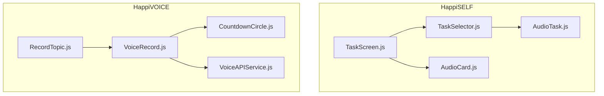
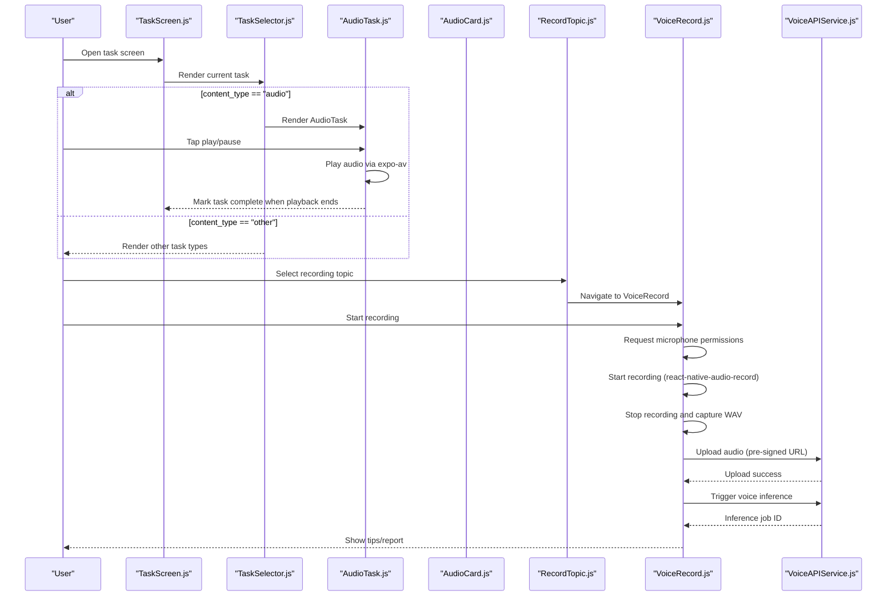
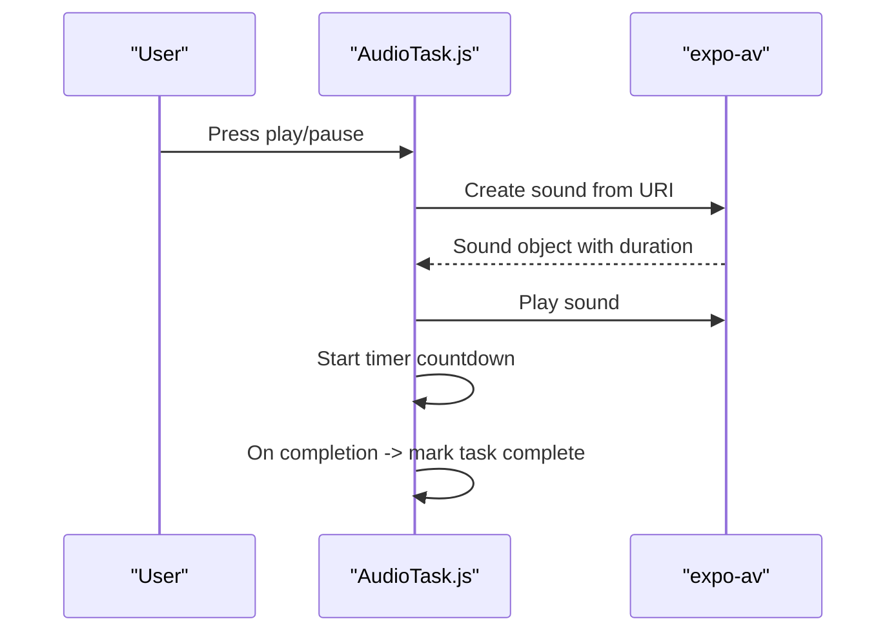
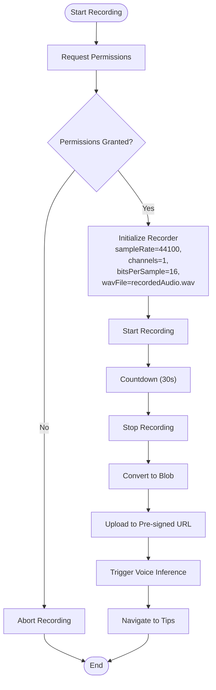
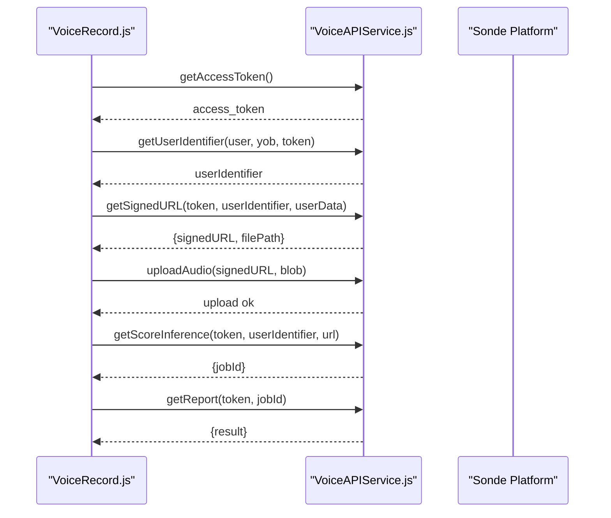
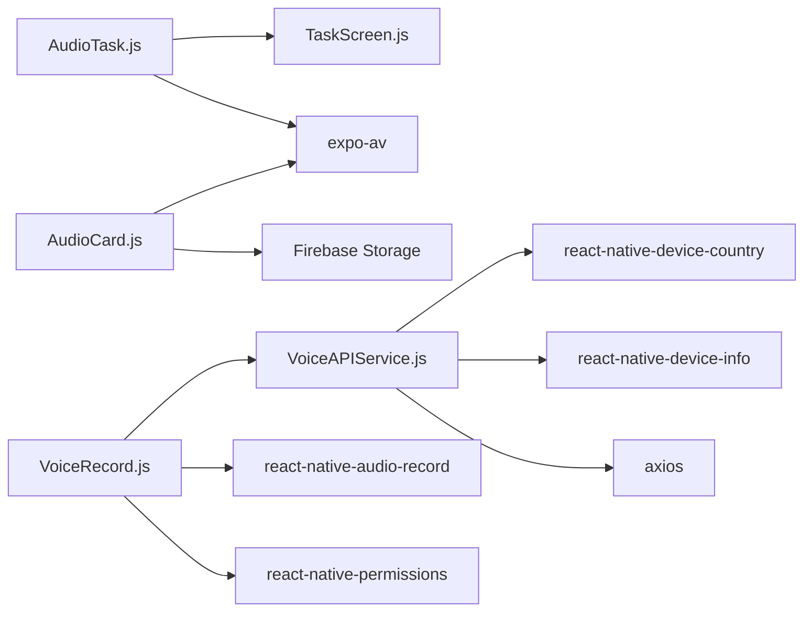

# Audio Tasks

<cite>
**Referenced Files in This Document**
- [AudioTask.js](file://src/screens/HappiSELF/Tasks/AudioTask.js)
- [TaskSelector.js](file://src/screens/HappiSELF/Tasks/TaskSelector.js)
- [TaskScreen.js](file://src/screens/HappiSELF/TaskScreen.js)
- [AudioCard.js](file://src/components/cards/AudioCard.js)
- [VoiceRecord.js](file://src/screens/HappiVOICE/VoiceRecord.js)
- [VoiceAPIService.js](file://src/screens/HappiVOICE/VoiceAPIService.js)
- [RecordTopic.js](file://src/screens/HappiVOICE/RecordTopic.js)
- [CountdownCircle.js](file://src/screens/HappiVOICE/CountdownCircle.js)
</cite>

## Table of Contents
1. [Introduction](#introduction)
2. [Project Structure](#project-structure)
3. [Core Components](#core-components)
4. [Architecture Overview](#architecture-overview)
5. [Detailed Component Analysis](#detailed-component-analysis)
6. [Dependency Analysis](#dependency-analysis)
7. [Performance Considerations](#performance-considerations)
8. [Troubleshooting Guide](#troubleshooting-guide)
9. [Conclusion](#conclusion)
10. [Appendices](#appendices)

## Introduction
This document describes the Audio Task component within HappiSELF and related voice recording and analysis features in HappiVOICE. It covers:
- Audio playback in HappiSELF tasks
- Microphone permissions and recording pipeline in HappiVOICE
- Recording quality settings and file management
- Integration with voice analysis APIs for speech pattern assessment
- UI components for recording, preview, and submission
- Error handling for device access and recording failures
- Examples of audio task configurations and validation rules for completed recordings

## Project Structure
The audio-related functionality spans two primary areas:
- HappiSELF: audio playback for guided listening tasks
- HappiVOICE: end-to-end voice recording, upload, and analysis

**Diagram sources**
- [TaskScreen.js:1-261](file://src/screens/HappiSELF/TaskScreen.js#L1-L261)
- [TaskSelector.js:1-37](file://src/screens/HappiSELF/Tasks/TaskSelector.js#L1-L37)
- [AudioTask.js:1-209](file://src/screens/HappiSELF/Tasks/AudioTask.js#L1-L209)
- [AudioCard.js:1-106](file://src/components/cards/AudioCard.js#L1-L106)
- [RecordTopic.js:1-257](file://src/screens/HappiVOICE/RecordTopic.js#L1-L257)
- [VoiceRecord.js:1-245](file://src/screens/HappiVOICE/VoiceRecord.js#L1-L245)
- [CountdownCircle.js:1-48](file://src/screens/HappiVOICE/CountdownCircle.js#L1-L48)
- [VoiceAPIService.js:1-264](file://src/screens/HappiVOICE/VoiceAPIService.js#L1-L264)

**Section sources**
- [TaskScreen.js:1-261](file://src/screens/HappiSELF/TaskScreen.js#L1-L261)
- [TaskSelector.js:1-37](file://src/screens/HappiSELF/Tasks/TaskSelector.js#L1-L37)
- [AudioTask.js:1-209](file://src/screens/HappiSELF/Tasks/AudioTask.js#L1-L209)
- [AudioCard.js:1-106](file://src/components/cards/AudioCard.js#L1-L106)
- [RecordTopic.js:1-257](file://src/screens/HappiVOICE/RecordTopic.js#L1-L257)
- [VoiceRecord.js:1-245](file://src/screens/HappiVOICE/VoiceRecord.js#L1-L245)
- [CountdownCircle.js:1-48](file://src/screens/HappiVOICE/CountdownCircle.js#L1-L48)
- [VoiceAPIService.js:1-264](file://src/screens/HappiVOICE/VoiceAPIService.js#L1-L264)

## Core Components
- HappiSELF AudioTask: Presents a timer UI and a play/pause button to play audio content associated with a task. It tracks playback duration and triggers task completion when appropriate.
- HappiVOICE VoiceRecord: Orchestrates countdown, permission requests, recording, and submission. It captures audio via react-native-audio-record, uploads to a pre-signed URL, and initiates voice analysis.
- VoiceAPIService: Provides functions to fetch topics, obtain access tokens, register user identifiers, get signed URLs, upload audio, trigger inference, poll results, and persist reports.
- AudioCard: A reusable component to play audio messages from Firebase storage with a simple UI.

Key responsibilities:
- AudioTask: Playback control, timer display, completion signaling
- VoiceRecord: Permissions, recording lifecycle, binary conversion, submit flow
- VoiceAPIService: API orchestration for voice analysis pipeline
- AudioCard: Download and play audio from cloud storage

**Section sources**
- [AudioTask.js:28-184](file://src/screens/HappiSELF/Tasks/AudioTask.js#L28-L184)
- [VoiceRecord.js:20-198](file://src/screens/HappiVOICE/VoiceRecord.js#L20-L198)
- [VoiceAPIService.js:11-264](file://src/screens/HappiVOICE/VoiceAPIService.js#L11-L264)
- [AudioCard.js:21-79](file://src/components/cards/AudioCard.js#L21-L79)

## Architecture Overview
End-to-end audio task flow in HappiSELF and HappiVOICE:

**Diagram sources**
- [TaskScreen.js:184-226](file://src/screens/HappiSELF/TaskScreen.js#L184-L226)
- [TaskSelector.js:14-32](file://src/screens/HappiSELF/Tasks/TaskSelector.js#L14-L32)
- [AudioTask.js:88-121](file://src/screens/HappiSELF/Tasks/AudioTask.js#L88-L121)
- [RecordTopic.js:148-154](file://src/screens/HappiVOICE/RecordTopic.js#L148-L154)
- [VoiceRecord.js:36-51](file://src/screens/HappiVOICE/VoiceRecord.js#L36-L51)
- [VoiceAPIService.js:129-151](file://src/screens/HappiVOICE/VoiceAPIService.js#L129-L151)
- [VoiceAPIService.js:154-185](file://src/screens/HappiVOICE/VoiceAPIService.js#L154-L185)

## Detailed Component Analysis

### HappiSELF AudioTask
Purpose:
- Play audio content linked to a task
- Display a timer derived from audio duration
- Signal completion upon playback end

Key behaviors:
- Uses expo-av to load and play audio from a URI
- Computes minutes and seconds from sound duration
- Toggles play/pause state and updates UI accordingly
- Completes the task when playback finishes (unless the task is part of a library)

UI elements:
- Timer overlay with minutes:seconds or “GO”
- Large play/pause button with activity indicator during load

Playback flow:

**Diagram sources**
- [AudioTask.js:88-121](file://src/screens/HappiSELF/Tasks/AudioTask.js#L88-L121)

**Section sources**
- [AudioTask.js:28-184](file://src/screens/HappiSELF/Tasks/AudioTask.js#L28-L184)

### HappiVOICE VoiceRecord
Purpose:
- Manage the recording flow from countdown to submission
- Handle permissions for microphone/audio recording
- Capture audio, convert to binary, upload, and trigger analysis

Recording pipeline:
- Countdown timer (default 30 seconds)
- Permission checks for iOS and Android
- Start/stop recording using react-native-audio-record
- Convert recorded file to Blob for upload
- Upload to pre-signed URL
- Trigger voice feature inference
- Navigate to tips/report screen

UI elements:
- Back button, logo, topic text, countdown circle, status text, action buttons

**Diagram sources**
- [VoiceRecord.js:55-102](file://src/screens/HappiVOICE/VoiceRecord.js#L55-L102)
- [VoiceRecord.js:104-127](file://src/screens/HappiVOICE/VoiceRecord.js#L104-L127)
- [VoiceAPIService.js:129-151](file://src/screens/HappiVOICE/VoiceAPIService.js#L129-L151)
- [VoiceAPIService.js:154-185](file://src/screens/HappiVOICE/VoiceAPIService.js#L154-L185)

**Section sources**
- [VoiceRecord.js:20-198](file://src/screens/HappiVOICE/VoiceRecord.js#L20-L198)
- [CountdownCircle.js:6-38](file://src/screens/HappiVOICE/CountdownCircle.js#L6-L38)

### VoiceAPIService
Purpose:
- Encapsulate all backend interactions for voice analysis:
  - Fetch topics
  - OAuth token acquisition
  - User registration
  - Signed URL generation
  - Audio upload
  - Inference initiation and polling
  - Report saving

Key functions:
- getTopics: Retrieve available prompts
- getAccessToken: Obtain platform token
- getUserIdentifier: Register user profile and device metadata
- getSignedURL: Request pre-signed URL for upload
- uploadAudio: PUT audio to S3-compatible endpoint
- getScoreInference: Submit job for voice feature scoring
- getReport: Poll for inference results
- saveReport: Persist report locally

**Diagram sources**
- [VoiceAPIService.js:26-50](file://src/screens/HappiVOICE/VoiceAPIService.js#L26-L50)
- [VoiceAPIService.js:52-88](file://src/screens/HappiVOICE/VoiceAPIService.js#L52-L88)
- [VoiceAPIService.js:89-126](file://src/screens/HappiVOICE/VoiceAPIService.js#L89-L126)
- [VoiceAPIService.js:129-151](file://src/screens/HappiVOICE/VoiceAPIService.js#L129-L151)
- [VoiceAPIService.js:154-185](file://src/screens/HappiVOICE/VoiceAPIService.js#L154-L185)
- [VoiceAPIService.js:187-201](file://src/screens/HappiVOICE/VoiceAPIService.js#L187-L201)
- [VoiceAPIService.js:204-259](file://src/screens/HappiVOICE/VoiceAPIService.js#L204-L259)

**Section sources**
- [VoiceAPIService.js:11-264](file://src/screens/HappiVOICE/VoiceAPIService.js#L11-L264)

### AudioCard (HappiSELF)
Purpose:
- Allow users to play audio messages attached to chats
- Indicate loading state and playback status

Behavior:
- Downloads audio URL from Firebase storage
- Plays via expo-av and resets state after playback

**Section sources**
- [AudioCard.js:21-79](file://src/components/cards/AudioCard.js#L21-L79)

### TaskSelector and TaskScreen
Purpose:
- Route tasks by content_type
- Render AudioTask for audio content
- Coordinate task completion and navigation

**Section sources**
- [TaskSelector.js:14-32](file://src/screens/HappiSELF/Tasks/TaskSelector.js#L14-L32)
- [TaskScreen.js:184-226](file://src/screens/HappiSELF/TaskScreen.js#L184-L226)

## Dependency Analysis
- AudioTask depends on:
  - expo-av for playback
  - TaskScreen for completion signaling
- VoiceRecord depends on:
  - react-native-permissions for microphone/audio permissions
  - react-native-audio-record for capturing
  - VoiceAPIService for backend orchestration
- VoiceAPIService depends on:
  - axios for HTTP requests
  - react-native-device-info and react-native-device-country for metadata
- AudioCard depends on:
  - Firebase storage for download URLs
  - expo-av for playback

**Diagram sources**
- [AudioTask.js:16-26](file://src/screens/HappiSELF/Tasks/AudioTask.js#L16-L26)
- [TaskScreen.js:19-20](file://src/screens/HappiSELF/TaskScreen.js#L19-L20)
- [VoiceRecord.js:9-17](file://src/screens/HappiVOICE/VoiceRecord.js#L9-L17)
- [VoiceAPIService.js:1-8](file://src/screens/HappiVOICE/VoiceAPIService.js#L1-L8)
- [AudioCard.js:15-16](file://src/components/cards/AudioCard.js#L15-L16)

**Section sources**
- [AudioTask.js:16-26](file://src/screens/HappiSELF/Tasks/AudioTask.js#L16-L26)
- [VoiceRecord.js:9-17](file://src/screens/HappiVOICE/VoiceRecord.js#L9-L17)
- [VoiceAPIService.js:1-8](file://src/screens/HappiVOICE/VoiceAPIService.js#L1-L8)
- [AudioCard.js:15-16](file://src/components/cards/AudioCard.js#L15-L16)

## Performance Considerations
- AudioTask playback:
  - Uses expo-av’s Sound.createAsync to avoid blocking UI thread
  - Unloads sound on unmount to free resources
- VoiceRecord:
  - Recording settings configured for high-quality PCM (44.1 kHz, mono, 16-bit)
  - Converts file to Blob before upload to minimize memory overhead
- VoiceAPIService:
  - Uses pre-signed URLs to offload upload to CDN/S3
  - Asynchronous inference with polling for results
- AudioCard:
  - Lazy loading with activity indicator to improve perceived performance

[No sources needed since this section provides general guidance]

## Troubleshooting Guide
Common issues and resolutions:
- Microphone permission denied:
  - Ensure permissions are requested before starting recording
  - Provide fallback UI to guide users to enable permissions in system settings
- Recording fails silently:
  - Wrap start/stop calls with try/catch and log errors
  - Validate file path and ensure storage availability
- Upload failure:
  - Confirm pre-signed URL validity and network connectivity
  - Retry mechanism recommended for transient errors
- Inference timeout:
  - Implement retry with exponential backoff and user feedback
- Playback errors:
  - Verify audio URI and network accessibility
  - Handle unload on component unmount to prevent resource leaks

**Section sources**
- [VoiceRecord.js:65-78](file://src/screens/HappiVOICE/VoiceRecord.js#L65-L78)
- [VoiceRecord.js:99-102](file://src/screens/HappiVOICE/VoiceRecord.js#L99-L102)
- [VoiceAPIService.js:129-151](file://src/screens/HappiVOICE/VoiceAPIService.js#L129-L151)
- [VoiceAPIService.js:154-185](file://src/screens/HappiVOICE/VoiceAPIService.js#L154-L185)
- [AudioTask.js:50-59](file://src/screens/HappiSELF/Tasks/AudioTask.js#L50-L59)

## Conclusion
The HappiSELF AudioTask provides a focused playback experience for guided audio content, seamlessly integrating with the task completion flow. The HappiVOICE stack delivers a robust recording pipeline with permission handling, high-quality capture, secure upload, and asynchronous voice analysis. Together, these components form a cohesive audio task ecosystem supporting both passive listening and active voice assessments.

[No sources needed since this section summarizes without analyzing specific files]

## Appendices

### Audio Task Configuration Examples
- Task routing:
  - content_type: "audio" → AudioTask
- Task completion:
  - AudioTask signals completion when playback ends (unless the task belongs to a library)

**Section sources**
- [TaskSelector.js:18](file://src/screens/HappiSELF/Tasks/TaskSelector.js#L18)
- [AudioTask.js:111-119](file://src/screens/HappiSELF/Tasks/AudioTask.js#L111-L119)

### Validation Rules for Completed Recordings
- Recording duration:
  - Default countdown is 30 seconds; ensure recording completes within the window
- Permissions:
  - Microphone permission must be granted before starting
- Upload:
  - Pre-signed URL must be valid and accessible
- Inference:
  - Job ID must be returned; poll until result is ready
- Submission:
  - After successful inference, navigate to tips/report screen

**Section sources**
- [VoiceRecord.js:27](file://src/screens/HappiVOICE/VoiceRecord.js#L27)
- [VoiceRecord.js:65-78](file://src/screens/HappiVOICE/VoiceRecord.js#L65-L78)
- [VoiceAPIService.js:129-151](file://src/screens/HappiVOICE/VoiceAPIService.js#L129-L151)
- [VoiceAPIService.js:154-185](file://src/screens/HappiVOICE/VoiceAPIService.js#L154-L185)