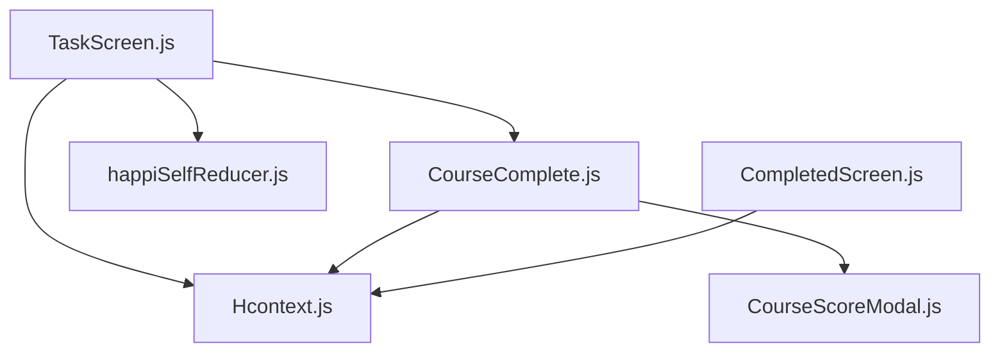
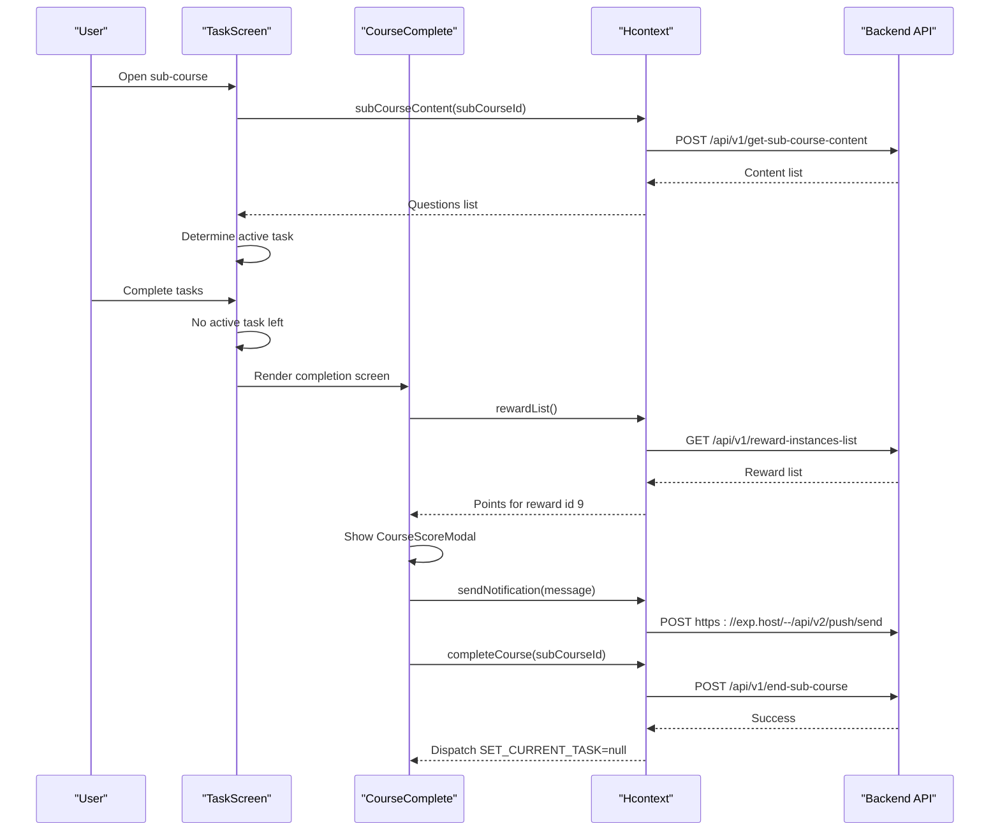
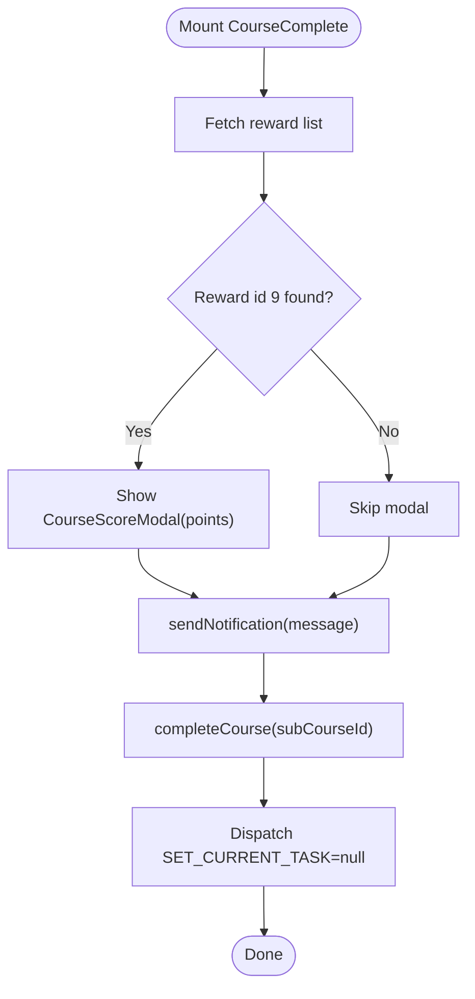
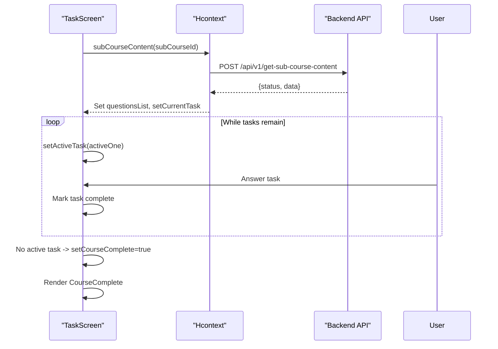
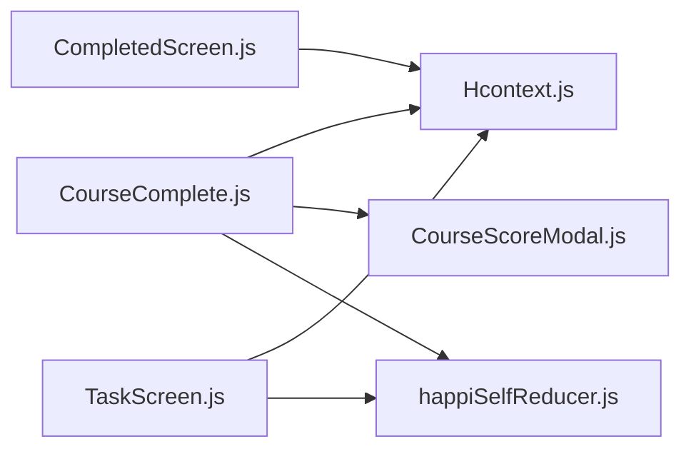

# Course Completion and Assessment

<cite>
**Referenced Files in This Document**
- [CourseComplete.js](file://src/screens/HappiSELF/Tasks/CourseComplete.js)
- [TaskScreen.js](file://src/screens/HappiSELF/TaskScreen.js)
- [CompletedScreen.js](file://src/screens/HappiSELF/CompletedScreen.js)
- [Hcontext.js](file://src/context/Hcontext.js)
- [happiSelfReducer.js](file://src/context/reducers/happiSelfReducer.js)
- [CourseScoreModal.js](file://src/components/Modals/CourseScoreModal.js)
</cite>

## Table of Contents
1. [Introduction](#introduction)
2. [Project Structure](#project-structure)
3. [Core Components](#core-components)
4. [Architecture Overview](#architecture-overview)
5. [Detailed Component Analysis](#detailed-component-analysis)
6. [Dependency Analysis](#dependency-analysis)
7. [Performance Considerations](#performance-considerations)
8. [Troubleshooting Guide](#troubleshooting-guide)
9. [Conclusion](#conclusion)

## Introduction
This document explains the HappiSELF course completion system and assessment mechanisms. It covers how learners complete modules, how completion is validated, how rewards are computed and displayed, and how the system integrates with backend APIs for course enrollment, task completion tracking, and notifications. It also outlines the UI for displaying completion status, earned points, and next steps, and describes the backend integration points for course completion and notifications.

## Project Structure
The HappiSELF course completion flow spans several screens and the central context provider:
- TaskScreen orchestrates task progression and transitions to CourseComplete when all tasks are finished.
- CourseComplete displays completion status, triggers notifications, and marks the sub-course as complete via the backend.
- Hcontext provides centralized actions for course lifecycle operations (start, complete, fetch content) and notifications.
- The HappiSELF reducer manages in-memory state for current tasks, questions list, and active task.
- CompletedScreen surfaces media content for completed sub-courses.
- CourseScoreModal presents reward points after successful completion.

**Diagram sources**
- [TaskScreen.js:27-261](file://src/screens/HappiSELF/TaskScreen.js#L27-L261)
- [CourseComplete.js:26-175](file://src/screens/HappiSELF/Tasks/CourseComplete.js#L26-L175)
- [Hcontext.js:889-962](file://src/context/Hcontext.js#L889-L962)
- [happiSelfReducer.js:1-45](file://src/context/reducers/happiSelfReducer.js#L1-L45)
- [CourseScoreModal.js:21-118](file://src/components/Modals/CourseScoreModal.js#L21-L118)
- [CompletedScreen.js:29-167](file://src/screens/HappiSELF/CompletedScreen.js#L29-L167)

**Section sources**
- [TaskScreen.js:27-261](file://src/screens/HappiSELF/TaskScreen.js#L27-L261)
- [CourseComplete.js:26-175](file://src/screens/HappiSELF/Tasks/CourseComplete.js#L26-L175)
- [Hcontext.js:889-962](file://src/context/Hcontext.js#L889-L962)
- [happiSelfReducer.js:1-45](file://src/context/reducers/happiSelfReducer.js#L1-L45)
- [CourseScoreModal.js:21-118](file://src/components/Modals/CourseScoreModal.js#L21-L118)
- [CompletedScreen.js:29-167](file://src/screens/HappiSELF/CompletedScreen.js#L29-L167)

## Core Components
- TaskScreen: Fetches sub-course content, tracks active tasks, and renders either a task selector or the CourseComplete screen upon finishing.
- CourseComplete: Triggers a reward lookup, shows a score modal, sends a local notification, and completes the sub-course via the backend.
- Hcontext: Provides actions for course lifecycle (start, complete, content retrieval), reward list retrieval, and push notifications.
- HappiSELF Reducer: Manages current sub-course, current task identifier, questions list, and active task.
- CompletedScreen: Lists media content for a completed sub-course.
- CourseScoreModal: Renders a modal to display points earned after completion.

Key backend endpoints used:
- GET /api/v1/reward-instances-list
- POST /api/v1/end-sub-course
- POST /api/v1/get-sub-course-content
- POST /api/v1/start-sub-course
- POST /api/v1/save-happiself-content-answer
- POST https://exp.host/--/api/v2/push/send

**Section sources**
- [TaskScreen.js:92-119](file://src/screens/HappiSELF/TaskScreen.js#L92-L119)
- [CourseComplete.js:63-92](file://src/screens/HappiSELF/Tasks/CourseComplete.js#L63-L92)
- [Hcontext.js:1335-1343](file://src/context/Hcontext.js#L1335-L1343)
- [Hcontext.js:951-962](file://src/context/Hcontext.js#L951-L962)
- [Hcontext.js:902-913](file://src/context/Hcontext.js#L902-L913)
- [Hcontext.js:939-950](file://src/context/Hcontext.js#L939-L950)
- [Hcontext.js:1042-1054](file://src/context/Hcontext.js#L1042-L1054)
- [Hcontext.js:814-834](file://src/context/Hcontext.js#L814-L834)

## Architecture Overview
The completion flow is driven by the HappiSELF reducer and Hcontext actions. TaskScreen loads sub-course content and determines whether to render tasks or the completion screen. CourseComplete triggers a reward lookup, shows a modal, sends a push notification, and calls the backend to end the sub-course.

**Diagram sources**
- [TaskScreen.js:63-79](file://src/screens/HappiSELF/TaskScreen.js#L63-L79)
- [CourseComplete.js:63-107](file://src/screens/HappiSELF/Tasks/CourseComplete.js#L63-L107)
- [Hcontext.js:1335-1343](file://src/context/Hcontext.js#L1335-L1343)
- [Hcontext.js:814-834](file://src/context/Hcontext.js#L814-L834)
- [Hcontext.js:951-962](file://src/context/Hcontext.js#L951-L962)

## Detailed Component Analysis

### CourseComplete Screen
CourseComplete handles the finalization of a sub-course:
- Fetches reward points associated with a fixed reward id (9) from the reward instances list.
- Displays a modal with the points earned.
- Sends a push notification to the device token.
- Calls the backend to end the sub-course and clears the current task from state.

**Diagram sources**
- [CourseComplete.js:48-107](file://src/screens/HappiSELF/Tasks/CourseComplete.js#L48-L107)
- [CourseComplete.js:63-79](file://src/screens/HappiSELF/Tasks/CourseComplete.js#L63-L79)
- [CourseComplete.js:81-92](file://src/screens/HappiSELF/Tasks/CourseComplete.js#L81-L92)
- [CourseComplete.js:94-107](file://src/screens/HappiSELF/Tasks/CourseComplete.js#L94-L107)
- [Hcontext.js:1335-1343](file://src/context/Hcontext.js#L1335-L1343)
- [Hcontext.js:814-834](file://src/context/Hcontext.js#L814-L834)
- [Hcontext.js:951-962](file://src/context/Hcontext.js#L951-L962)

**Section sources**
- [CourseComplete.js:26-175](file://src/screens/HappiSELF/Tasks/CourseComplete.js#L26-L175)
- [CourseScoreModal.js:21-118](file://src/components/Modals/CourseScoreModal.js#L21-L118)
- [Hcontext.js:814-834](file://src/context/Hcontext.js#L814-L834)
- [Hcontext.js:951-962](file://src/context/Hcontext.js#L951-L962)
- [Hcontext.js:1335-1343](file://src/context/Hcontext.js#L1335-L1343)

### TaskScreen and Task Progression
TaskScreen controls task loading and completion:
- Loads sub-course content and initializes the questions list in state.
- Determines the next active task and transitions to CourseComplete when all tasks are marked complete.
- Supports saving answers for specific content types and moving to the next task.

**Diagram sources**
- [TaskScreen.js:47-79](file://src/screens/HappiSELF/TaskScreen.js#L47-L79)
- [TaskScreen.js:92-119](file://src/screens/HappiSELF/TaskScreen.js#L92-L119)
- [TaskScreen.js:167-182](file://src/screens/HappiSELF/TaskScreen.js#L167-L182)
- [Hcontext.js:902-913](file://src/context/Hcontext.js#L902-L913)

**Section sources**
- [TaskScreen.js:27-261](file://src/screens/HappiSELF/TaskScreen.js#L27-L261)
- [happiSelfReducer.js:9-44](file://src/context/reducers/happiSelfReducer.js#L9-L44)
- [Hcontext.js:902-913](file://src/context/Hcontext.js#L902-L913)

### Backend Integration Points
- Sub-course content retrieval: POST /api/v1/get-sub-course-content
- Sub-course start: POST /api/v1/start-sub-course
- Sub-course completion: POST /api/v1/end-sub-course
- Reward list: GET /api/v1/reward-instances-list
- Save answer for content: POST /api/v1/save-happiself-content-answer
- Push notification delivery: POST https://exp.host/--/api/v2/push/send

These endpoints are invoked via Hcontext methods exposed to components.

**Section sources**
- [Hcontext.js:902-913](file://src/context/Hcontext.js#L902-L913)
- [Hcontext.js:939-950](file://src/context/Hcontext.js#L939-L950)
- [Hcontext.js:951-962](file://src/context/Hcontext.js#L951-L962)
- [Hcontext.js:1335-1343](file://src/context/Hcontext.js#L1335-L1343)
- [Hcontext.js:1042-1054](file://src/context/Hcontext.js#L1042-L1054)
- [Hcontext.js:814-834](file://src/context/Hcontext.js#L814-L834)

### User Interface for Completion Status and Rewards
- CourseComplete displays a completion image and a Continue button.
- CourseScoreModal shows the points earned after completion.
- CompletedScreen lists media content for a completed sub-course and supports navigating back to the task view.

**Section sources**
- [CourseComplete.js:109-141](file://src/screens/HappiSELF/Tasks/CourseComplete.js#L109-L141)
- [CourseScoreModal.js:21-118](file://src/components/Modals/CourseScoreModal.js#L21-L118)
- [CompletedScreen.js:81-143](file://src/screens/HappiSELF/CompletedScreen.js#L81-L143)

## Dependency Analysis
CourseComplete depends on:
- Hcontext for reward list retrieval, notification dispatch, and course completion.
- HappiSELF reducer to clear the current task after completion.
- CourseScoreModal for reward presentation.

TaskScreen depends on:
- Hcontext for sub-course content retrieval and state updates.
- HappiSELF reducer for managing questions list and active task.

**Diagram sources**
- [CourseComplete.js:26-38](file://src/screens/HappiSELF/Tasks/CourseComplete.js#L26-L38)
- [TaskScreen.js:27-39](file://src/screens/HappiSELF/TaskScreen.js#L27-L39)
- [Hcontext.js:1408-1549](file://src/context/Hcontext.js#L1408-L1549)
- [happiSelfReducer.js:1-45](file://src/context/reducers/happiSelfReducer.js#L1-L45)
- [CourseScoreModal.js:21-118](file://src/components/Modals/CourseScoreModal.js#L21-L118)
- [CompletedScreen.js:29-38](file://src/screens/HappiSELF/CompletedScreen.js#L29-L38)

**Section sources**
- [CourseComplete.js:26-38](file://src/screens/HappiSELF/Tasks/CourseComplete.js#L26-L38)
- [TaskScreen.js:27-39](file://src/screens/HappiSELF/TaskScreen.js#L27-L39)
- [Hcontext.js:1408-1549](file://src/context/Hcontext.js#L1408-L1549)
- [happiSelfReducer.js:1-45](file://src/context/reducers/happiSelfReducer.js#L1-L45)
- [CourseScoreModal.js:21-118](file://src/components/Modals/CourseScoreModal.js#L21-L118)
- [CompletedScreen.js:29-38](file://src/screens/HappiSELF/CompletedScreen.js#L29-L38)

## Performance Considerations
- Minimize repeated network calls by caching sub-course content per session and clearing state appropriately when leaving the screen.
- Debounce or throttle notification triggers to avoid redundant pushes.
- Batch UI updates after state changes to prevent unnecessary re-renders.

## Troubleshooting Guide
Common issues and remedies:
- Reward lookup failure: Ensure the reward list endpoint returns a success status and contains the expected reward id. Validate the id mapping and modal visibility logic.
- Notification delivery errors: Confirm device token availability and network connectivity for the push notification endpoint.
- Course completion errors: Verify the sub-course id passed to the completion endpoint and handle backend errors gracefully with user feedback.
- Task progression stalls: Confirm the questions list is populated and active task selection logic runs when tasks are completed.

**Section sources**
- [CourseComplete.js:63-79](file://src/screens/HappiSELF/Tasks/CourseComplete.js#L63-L79)
- [CourseComplete.js:81-92](file://src/screens/HappiSELF/Tasks/CourseComplete.js#L81-L92)
- [CourseComplete.js:94-107](file://src/screens/HappiSELF/Tasks/CourseComplete.js#L94-L107)
- [Hcontext.js:814-834](file://src/context/Hcontext.js#L814-L834)
- [Hcontext.js:951-962](file://src/context/Hcontext.js#L951-L962)

## Conclusion
The HappiSELF course completion system integrates frontend state management with backend APIs to finalize sub-courses, compute rewards, and notify users. TaskScreen orchestrates task progression, CourseComplete finalizes the module, and Hcontext centralizes all backend interactions. The UI clearly communicates completion status and rewards, while the backend ensures accurate tracking of course enrollment and task completion.