# Interactive Task Types

<cite>
**Referenced Files in This Document**
- [TaskScreen.js](file://src/screens/HappiSELF/TaskScreen.js)
- [TaskSelector.js](file://src/screens/HappiSELF/Tasks/TaskSelector.js)
- [MCQTask.js](file://src/screens/HappiSELF/Tasks/MCQTask.js)
- [ShortAnswerTask.js](file://src/screens/HappiSELF/Tasks/ShortAnswerTask.js)
- [TextTask.js](file://src/screens/HappiSELF/Tasks/TextTask.js)
- [LinearScaleTask.js](file://src/screens/HappiSELF/Tasks/LinearScaleTask.js)
- [CheckBoxTask.js](file://src/screens/HappiSELF/Tasks/CheckBoxTask.js)
- [MatchFollowingTask.js](file://src/screens/HappiSELF/Tasks/MatchFollowingTask.js)
- [AudioTask.js](file://src/screens/HappiSELF/Tasks/AudioTask.js)
- [VideoTask.js](file://src/screens/HappiSELF/Tasks/VideoTask.js)
- [TaskScreenHeader.js](file://src/screens/HappiSELF/Tasks/TaskScreenHeader.js)
- [MultiCheckbox.js](file://src/components/input/MultiCheckbox.js)
- [Hcontext.js](file://src/context/Hcontext.js)
- [happiSelfReducer.js](file://src/context/reducers/happiSelfReducer.js)
- [index.js](file://src/assets/constants/index.js)
</cite>

## Table of Contents
1. [Introduction](#introduction)
2. [Project Structure](#project-structure)
3. [Core Components](#core-components)
4. [Architecture Overview](#architecture-overview)
5. [Detailed Component Analysis](#detailed-component-analysis)
6. [Dependency Analysis](#dependency-analysis)
7. [Performance Considerations](#performance-considerations)
8. [Troubleshooting Guide](#troubleshooting-guide)
9. [Conclusion](#conclusion)
10. [Appendices](#appendices)

## Introduction
This document explains the interactive task types in HappiSELF, focusing on Multiple Choice Questions (MCQ), Short Answer, Text Input, Linear Scale, Checkboxes, and Matching tasks. It covers how questions are rendered, how answers are collected, validation and scoring mechanisms, UI components, feedback, branching logic via answers, and integration with progress tracking and completion validation. The goal is to provide a clear understanding for both developers and stakeholders.

## Project Structure
HappiSELF task orchestration centers around a single screen that loads subcourse content, selects the next active task, and renders the appropriate task component based on content type. Task-specific components manage input, validation, and completion signaling back to the orchestrator.

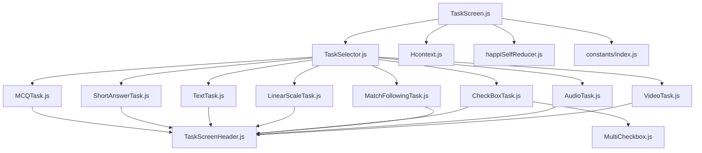

**Diagram sources**
- [TaskScreen.js:1-261](file://src/screens/HappiSELF/TaskScreen.js#L1-L261)
- [TaskSelector.js:1-37](file://src/screens/HappiSELF/Tasks/TaskSelector.js#L1-L37)
- [MCQTask.js:1-197](file://src/screens/HappiSELF/Tasks/MCQTask.js#L1-L197)
- [ShortAnswerTask.js:1-126](file://src/screens/HappiSELF/Tasks/ShortAnswerTask.js#L1-L126)
- [TextTask.js:1-98](file://src/screens/HappiSELF/Tasks/TextTask.js#L1-L98)
- [LinearScaleTask.js:1-126](file://src/screens/HappiSELF/Tasks/LinearScaleTask.js#L1-L126)
- [CheckBoxTask.js:1-167](file://src/screens/HappiSELF/Tasks/CheckBoxTask.js#L1-L167)
- [MatchFollowingTask.js:1-171](file://src/screens/HappiSELF/Tasks/MatchFollowingTask.js#L1-L171)
- [AudioTask.js:1-209](file://src/screens/HappiSELF/Tasks/AudioTask.js#L1-L209)
- [VideoTask.js:1-173](file://src/screens/HappiSELF/Tasks/VideoTask.js#L1-L173)
- [TaskScreenHeader.js:1-69](file://src/screens/HappiSELF/Tasks/TaskScreenHeader.js#L1-L69)
- [MultiCheckbox.js:1-79](file://src/components/input/MultiCheckbox.js#L1-L79)
- [Hcontext.js:1-800](file://src/context/Hcontext.js#L1-L800)
- [happiSelfReducer.js:1-45](file://src/context/reducers/happiSelfReducer.js#L1-L45)
- [index.js:1-195](file://src/assets/constants/index.js#L1-L195)

**Section sources**
- [TaskScreen.js:1-261](file://src/screens/HappiSELF/TaskScreen.js#L1-L261)
- [TaskSelector.js:1-37](file://src/screens/HappiSELF/Tasks/TaskSelector.js#L1-L37)

## Core Components
- TaskScreen orchestrates loading subcourse content, selecting the next active task, rendering the task component, and moving to the next task upon completion.
- TaskSelector routes to the correct task component based on content_type.
- Task components encapsulate rendering, input collection, validation, and completion signaling.
- Hcontext manages HappiSELF state and exposes actions like saving answers and completing courses.
- Reducer maintains the in-memory task list and active answer buffer.
- Shared UI constants define colors and typography used across tasks.

Key responsibilities:
- Rendering: Each task component renders its UI and handles user input.
- Answer collection: Inputs update the HappiSELF state (e.g., active task answer buffer).
- Validation and scoring: Implemented per task type; correctness is signaled to the orchestrator.
- Completion: Tasks mark themselves complete and signal TaskScreen to advance.

**Section sources**
- [TaskScreen.js:1-261](file://src/screens/HappiSELF/TaskScreen.js#L1-L261)
- [TaskSelector.js:1-37](file://src/screens/HappiSELF/Tasks/TaskSelector.js#L1-L37)
- [Hcontext.js:1-800](file://src/context/Hcontext.js#L1-L800)
- [happiSelfReducer.js:1-45](file://src/context/reducers/happiSelfReducer.js#L1-L45)
- [index.js:1-195](file://src/assets/constants/index.js#L1-L195)

## Architecture Overview
The task system follows a unidirectional flow:
- TaskScreen loads content and selects the next incomplete task.
- TaskSelector chooses the component based on content_type.
- The task component collects input, validates locally where applicable, and signals completion.
- TaskScreen updates the in-memory task list and resets the active answer buffer.
- Global actions (via Hcontext) persist answers and progress.

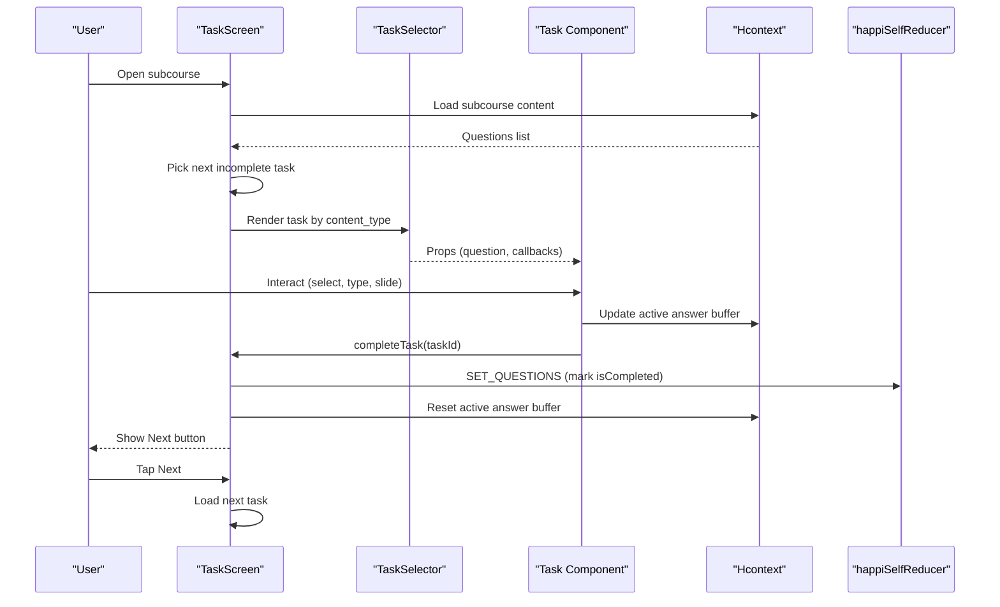

**Diagram sources**
- [TaskScreen.js:121-146](file://src/screens/HappiSELF/TaskScreen.js#L121-L146)
- [TaskSelector.js:14-32](file://src/screens/HappiSELF/Tasks/TaskSelector.js#L14-L32)
- [Hcontext.js:1-800](file://src/context/Hcontext.js#L1-L800)
- [happiSelfReducer.js:9-44](file://src/context/reducers/happiSelfReducer.js#L9-L44)

## Detailed Component Analysis

### Multiple Choice Question (MCQ)
- Rendering: Displays the question and options; animates on selection to indicate feedback.
- Answer collection: Stores selected option in component state.
- Validation and scoring: Compares selected option to correct_answer; sets correctness flag.
- Completion: Calls completeTask with question id when correctness is determined.
- UI feedback: Uses animations and color changes to reflect correctness.

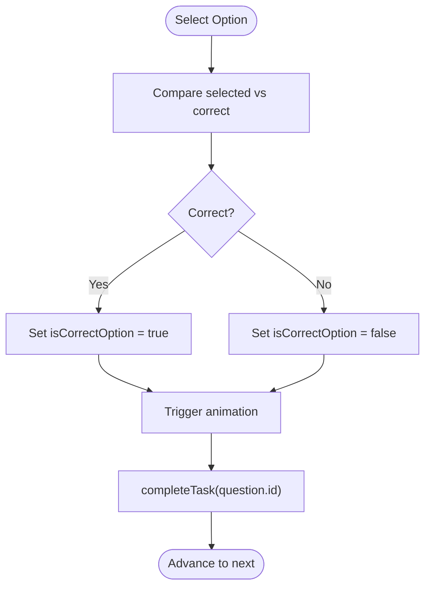

**Diagram sources**
- [MCQTask.js:44-57](file://src/screens/HappiSELF/Tasks/MCQTask.js#L44-L57)
- [MCQTask.js:102-144](file://src/screens/HappiSELF/Tasks/MCQTask.js#L102-L144)

**Section sources**
- [MCQTask.js:1-197](file://src/screens/HappiSELF/Tasks/MCQTask.js#L1-L197)

### Short Answer
- Rendering: Presents a scrollable question box with a multi-line text input.
- Answer collection: Updates the active task answer buffer in HappiSELF state.
- Validation and scoring: No strict correctness; marks task complete when an answer exists.
- Completion: Calls completeTask immediately upon detecting an answer in state.

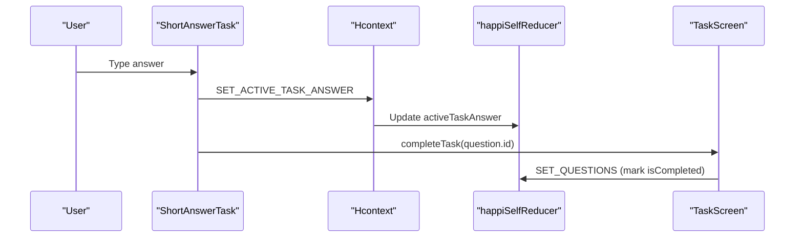

**Diagram sources**
- [ShortAnswerTask.js:24-41](file://src/screens/HappiSELF/Tasks/ShortAnswerTask.js#L24-L41)
- [ShortAnswerTask.js:77-89](file://src/screens/HappiSELF/Tasks/ShortAnswerTask.js#L77-L89)
- [happiSelfReducer.js:36-40](file://src/context/reducers/happiSelfReducer.js#L36-L40)

**Section sources**
- [ShortAnswerTask.js:1-126](file://src/screens/HappiSELF/Tasks/ShortAnswerTask.js#L1-L126)
- [happiSelfReducer.js:1-45](file://src/context/reducers/happiSelfReducer.js#L1-L45)

### Text Input (Non-interactive text)
- Rendering: Displays title and content inside a bordered container.
- Answer collection: Not applicable; answer buffer remains empty.
- Validation and scoring: Not applicable.
- Completion: Immediately marks task complete and sets correctness flag.

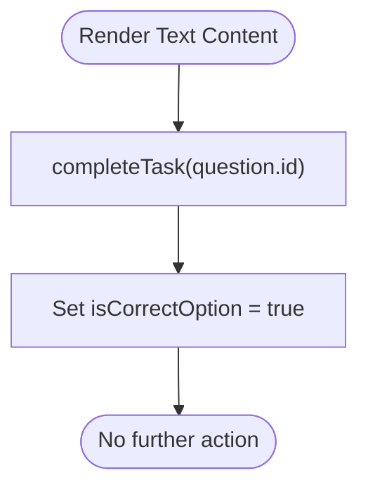

**Diagram sources**
- [TextTask.js:23-37](file://src/screens/HappiSELF/Tasks/TextTask.js#L23-L37)

**Section sources**
- [TextTask.js:1-98](file://src/screens/HappiSELF/Tasks/TextTask.js#L1-L98)

### Linear Scale
- Rendering: Displays a question and a slider with discrete steps and a mood label synchronized to the slider value.
- Answer collection: Tracks slider value and derived mood text.
- Validation and scoring: Not applicable.
- Completion: Immediately marks task complete and sets correctness flag.

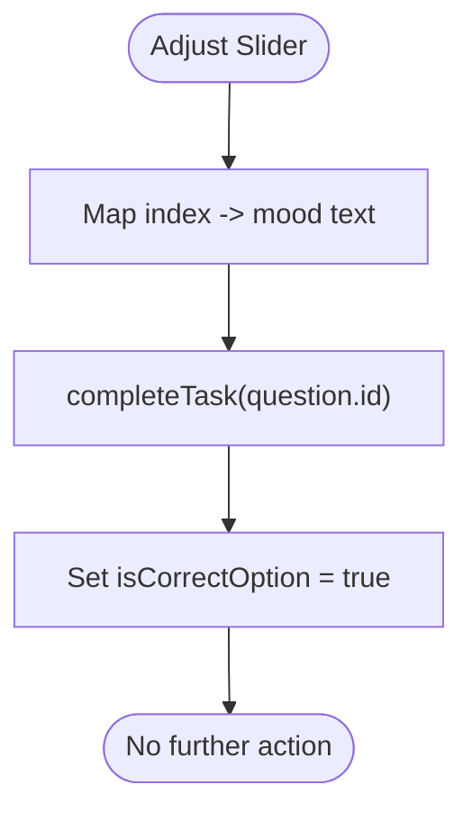

**Diagram sources**
- [LinearScaleTask.js:24-49](file://src/screens/HappiSELF/Tasks/LinearScaleTask.js#L24-L49)
- [LinearScaleTask.js:66-76](file://src/screens/HappiSELF/Tasks/LinearScaleTask.js#L66-L76)

**Section sources**
- [LinearScaleTask.js:1-126](file://src/screens/HappiSELF/Tasks/LinearScaleTask.js#L1-L126)

### Checkboxes
- Rendering: Lists options as selectable checkboxes.
- Answer collection: Uses a reusable MultiCheckbox component to toggle selections and maintain a selected options array.
- Validation and scoring: Marks task complete when any option is selected; correctness flag set accordingly.
- Completion: Calls completeTask and sets correctness when selection changes.

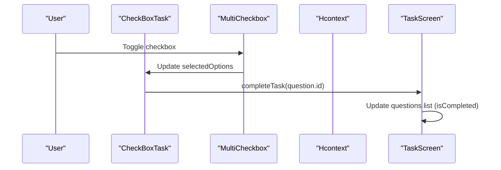

**Diagram sources**
- [CheckBoxTask.js:19-48](file://src/screens/HappiSELF/Tasks/CheckBoxTask.js#L19-L48)
- [MultiCheckbox.js:13-32](file://src/components/input/MultiCheckbox.js#L13-L32)

**Section sources**
- [CheckBoxTask.js:1-167](file://src/screens/HappiSELF/Tasks/CheckBoxTask.js#L1-L167)
- [MultiCheckbox.js:1-79](file://src/components/input/MultiCheckbox.js#L1-L79)

### Matching
- Rendering: Displays a matching layout with draggable answers (using a drag-and-drop library).
- Answer collection: Extracts question items and correct answers from nested option structure.
- Validation and scoring: Not applicable in current implementation.
- Completion: Immediately marks task complete and sets correctness flag.

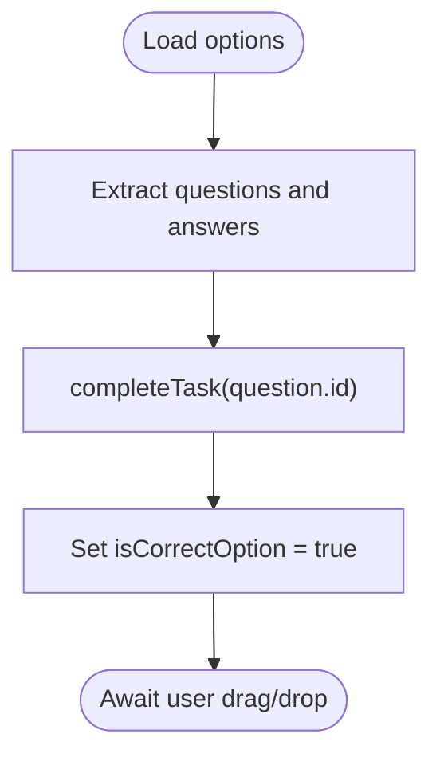

**Diagram sources**
- [MatchFollowingTask.js:17-50](file://src/screens/HappiSELF/Tasks/MatchFollowingTask.js#L17-L50)

**Section sources**
- [MatchFollowingTask.js:1-171](file://src/screens/HappiSELF/Tasks/MatchFollowingTask.js#L1-L171)

### Audio Task
- Rendering: Shows a timer overlay and a play/pause control.
- Answer collection: Not applicable; answer buffer remains empty.
- Validation and scoring: Not applicable.
- Completion: Completes automatically when audio finishes playing (unless part of a library).

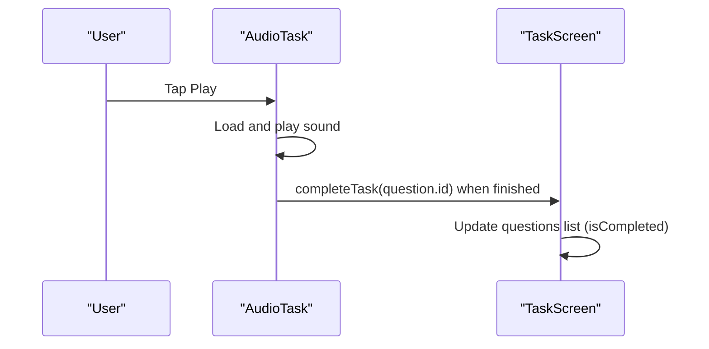

**Diagram sources**
- [AudioTask.js:28-121](file://src/screens/HappiSELF/Tasks/AudioTask.js#L28-L121)

**Section sources**
- [AudioTask.js:1-209](file://src/screens/HappiSELF/Tasks/AudioTask.js#L1-L209)

### Video Task
- Rendering: Embeds a video player with native controls.
- Answer collection: Not applicable; answer buffer remains empty.
- Validation and scoring: Not applicable.
- Completion: Completes when the video finishes playback (unless part of a library).

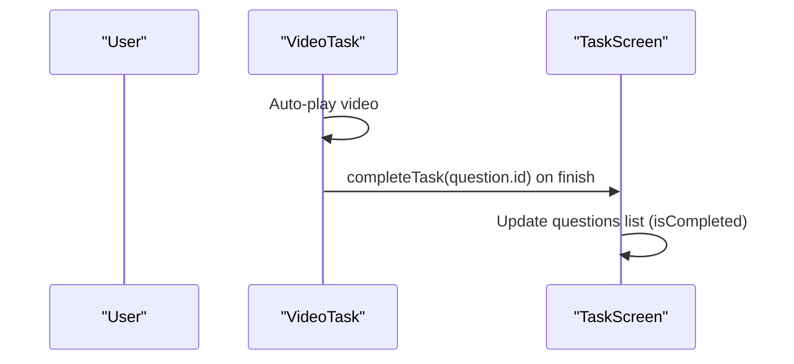

**Diagram sources**
- [VideoTask.js:26-122](file://src/screens/HappiSELF/Tasks/VideoTask.js#L26-L122)

**Section sources**
- [VideoTask.js:1-173](file://src/screens/HappiSELF/Tasks/VideoTask.js#L1-L173)

### TaskScreen Orchestration and Progress Tracking
- Loads subcourse content and initializes the questions list with an isCompleted flag.
- Selects the next incomplete task and renders the appropriate component.
- Receives completion signals from tasks and updates the in-memory list.
- Resets the active answer buffer after advancing.
- Integrates with global actions for persistence and reporting.

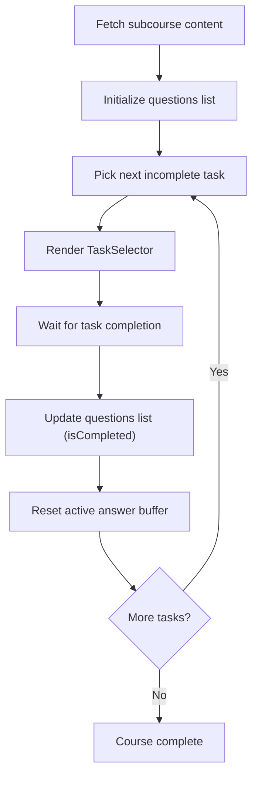

**Diagram sources**
- [TaskScreen.js:47-119](file://src/screens/HappiSELF/TaskScreen.js#L47-L119)
- [TaskScreen.js:121-146](file://src/screens/HappiSELF/TaskScreen.js#L121-L146)

**Section sources**
- [TaskScreen.js:1-261](file://src/screens/HappiSELF/TaskScreen.js#L1-L261)

## Dependency Analysis
- TaskSelector depends on content_type to choose the correct task component.
- Task components depend on Hcontext for state updates and on shared UI constants for styling.
- TaskScreen depends on Hcontext for loading content, marking completion, and resetting buffers.
- MultiCheckbox is a shared input component used by CheckBoxTask.

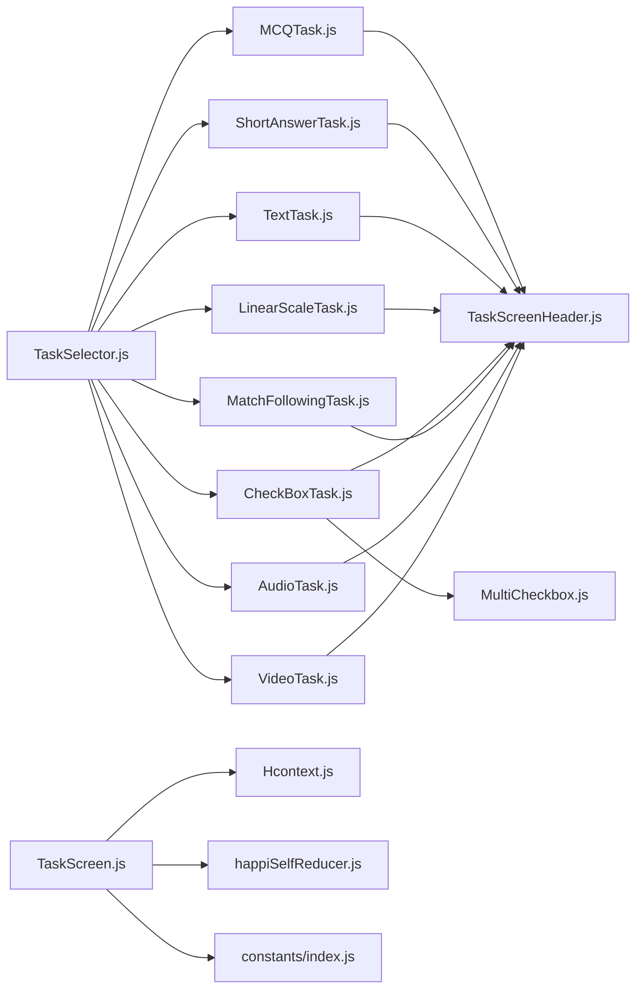

**Diagram sources**
- [TaskSelector.js:14-32](file://src/screens/HappiSELF/Tasks/TaskSelector.js#L14-L32)
- [CheckBoxTask.js:17-17](file://src/screens/HappiSELF/Tasks/CheckBoxTask.js#L17-L17)
- [MultiCheckbox.js:1-79](file://src/components/input/MultiCheckbox.js#L1-L79)
- [TaskScreen.js:19-39](file://src/screens/HappiSELF/TaskScreen.js#L19-L39)
- [happiSelfReducer.js:1-45](file://src/context/reducers/happiSelfReducer.js#L1-L45)
- [index.js:1-195](file://src/assets/constants/index.js#L1-L195)

**Section sources**
- [TaskSelector.js:1-37](file://src/screens/HappiSELF/Tasks/TaskSelector.js#L1-L37)
- [CheckBoxTask.js:1-167](file://src/screens/HappiSELF/Tasks/CheckBoxTask.js#L1-L167)
- [MultiCheckbox.js:1-79](file://src/components/input/MultiCheckbox.js#L1-L79)
- [TaskScreen.js:1-261](file://src/screens/HappiSELF/TaskScreen.js#L1-L261)
- [happiSelfReducer.js:1-45](file://src/context/reducers/happiSelfReducer.js#L1-L45)
- [index.js:1-195](file://src/assets/constants/index.js#L1-L195)

## Performance Considerations
- Minimize re-renders by keeping task components focused and avoiding unnecessary state propagation.
- Use native components (e.g., Slider, Video) efficiently; avoid heavy computations in render loops.
- Debounce or throttle input handlers where applicable (e.g., text input).
- Keep animations lightweight; prefer native driver for smoother UX.
- Persist answers and progress asynchronously to avoid blocking UI.

## Troubleshooting Guide
Common issues and resolutions:
- Task does not advance after interaction:
  - Ensure completeTask is called with the correct task id and that the orchestrator updates the questions list.
  - Verify that isCorrectOption is toggled appropriately in task components.
- Incorrect answer not recognized:
  - Confirm that correctness comparisons (e.g., MCQ) are performed against the intended field (correct_answer).
  - For text-based tasks, ensure the active answer buffer is being updated and detected.
- Audio/Video tasks do not auto-complete:
  - Check playback completion callbacks and conditions (e.g., didJustFinish).
  - Confirm that library-bound tasks bypass auto-completion intentionally.
- Drag-and-drop matching not working:
  - Verify the drag-and-drop provider is initialized and data arrays are populated from options.

**Section sources**
- [MCQTask.js:44-57](file://src/screens/HappiSELF/Tasks/MCQTask.js#L44-L57)
- [ShortAnswerTask.js:32-41](file://src/screens/HappiSELF/Tasks/ShortAnswerTask.js#L32-L41)
- [AudioTask.js:111-121](file://src/screens/HappiSELF/Tasks/AudioTask.js#L111-L121)
- [VideoTask.js:115-122](file://src/screens/HappiSELF/Tasks/VideoTask.js#L115-L122)
- [MatchFollowingTask.js:40-50](file://src/screens/HappiSELF/Tasks/MatchFollowingTask.js#L40-L50)

## Conclusion
HappiSELF’s interactive task system is modular and extensible. Each task type encapsulates its rendering, input handling, and completion logic, while TaskScreen coordinates progression and state updates. Immediate completion is used for non-graded tasks, while correctness flags enable feedback for MCQ. The system integrates with a centralized context and reducer for consistent progress tracking. Extending with branching or adaptive difficulty would require augmenting content metadata and adding routing logic in TaskSelector and TaskScreen.

## Appendices

### Scoring and Feedback Mechanisms
- MCQ: Correctness determined by comparing selected option to correct_answer; visual feedback via animation and color.
- Short Answer: Immediate completion upon answer presence; correctness flag set.
- Text Input: No scoring; immediate completion.
- Linear Scale: No scoring; immediate completion.
- Checkboxes: Immediate completion upon selection; correctness flag set.
- Matching: No scoring; immediate completion.
- Audio/Video: No scoring; completion on playback finish.

**Section sources**
- [MCQTask.js:44-57](file://src/screens/HappiSELF/Tasks/MCQTask.js#L44-L57)
- [ShortAnswerTask.js:32-41](file://src/screens/HappiSELF/Tasks/ShortAnswerTask.js#L32-L41)
- [TextTask.js:30-37](file://src/screens/HappiSELF/Tasks/TextTask.js#L30-L37)
- [LinearScaleTask.js:36-42](file://src/screens/HappiSELF/Tasks/LinearScaleTask.js#L36-L42)
- [CheckBoxTask.js:42-48](file://src/screens/HappiSELF/Tasks/CheckBoxTask.js#L42-L48)
- [MatchFollowingTask.js:40-50](file://src/screens/HappiSELF/Tasks/MatchFollowingTask.js#L40-L50)
- [AudioTask.js:111-121](file://src/screens/HappiSELF/Tasks/AudioTask.js#L111-L121)
- [VideoTask.js:115-122](file://src/screens/HappiSELF/Tasks/VideoTask.js#L115-L122)

### Branching Logic Based on Answers
- Current implementation does not include branching logic in the provided files.
- To implement branching:
  - Extend question metadata to include conditional next-task identifiers keyed by answer.
  - Modify TaskScreen to select the next task based on the active answer buffer after completion.
  - Ensure TaskSelector routes to the correct component based on resolved content_type.

[No sources needed since this section provides general guidance]

### Adaptive Difficulty Adjustments
- Current implementation does not include adaptive difficulty logic in the provided files.
- To implement adaptive difficulty:
  - Track user performance metrics (e.g., correctness, time).
  - Adjust subsequent tasks’ content_type, complexity, or parameters based on thresholds.
  - Integrate with content loading to fetch adjusted subcourses or tasks dynamically.

[No sources needed since this section provides general guidance]