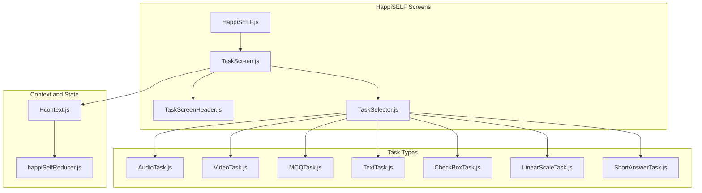
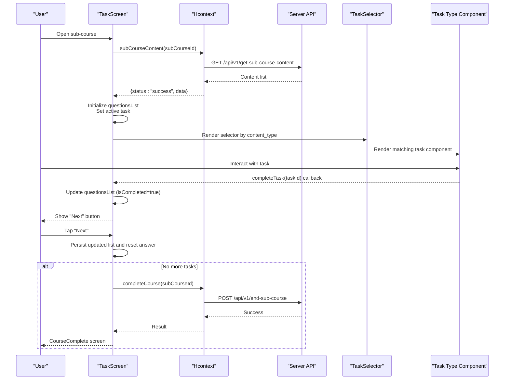
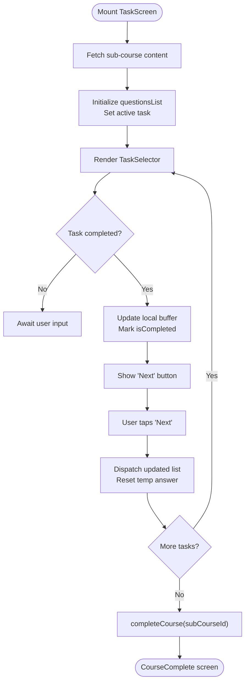
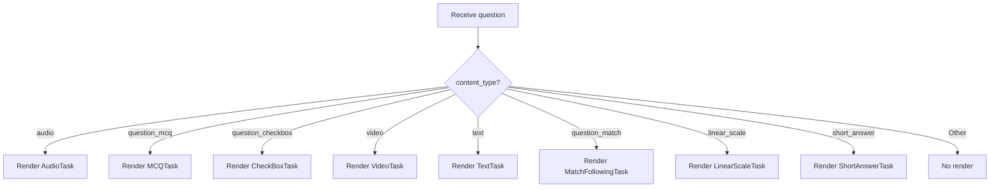
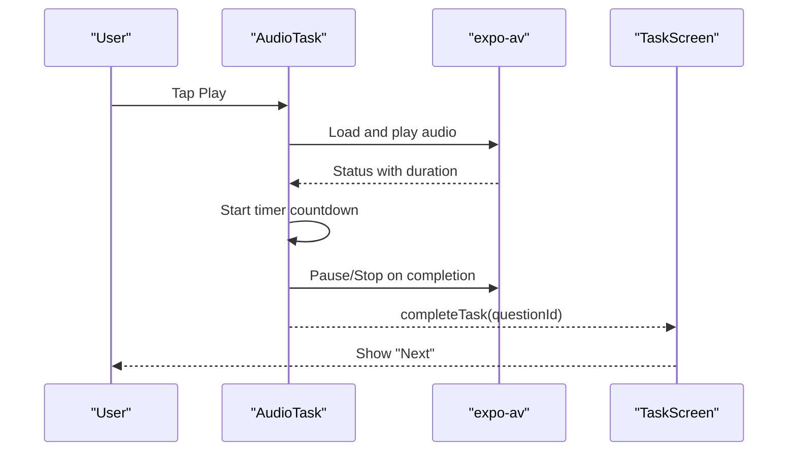
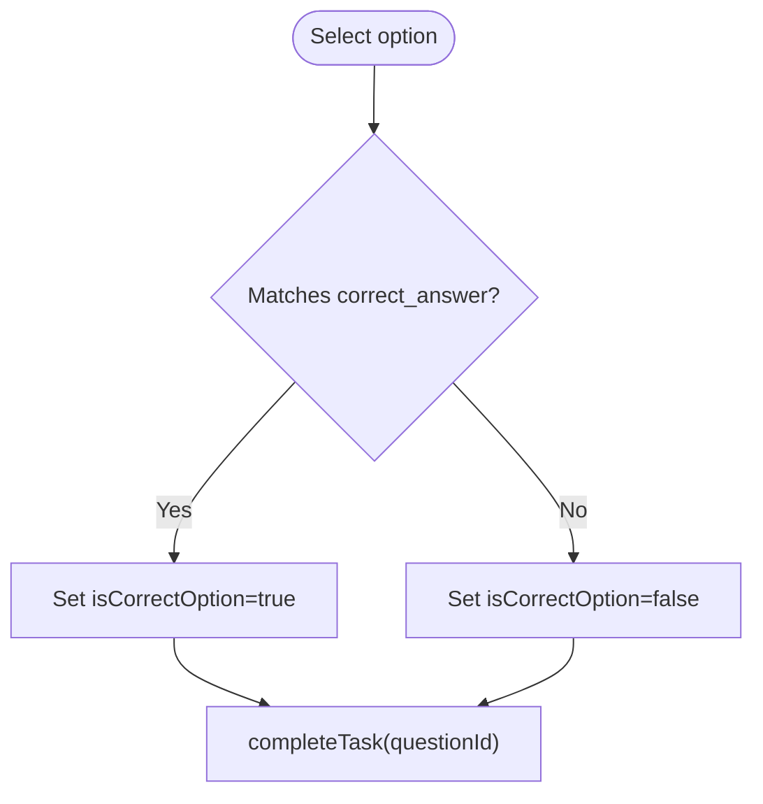
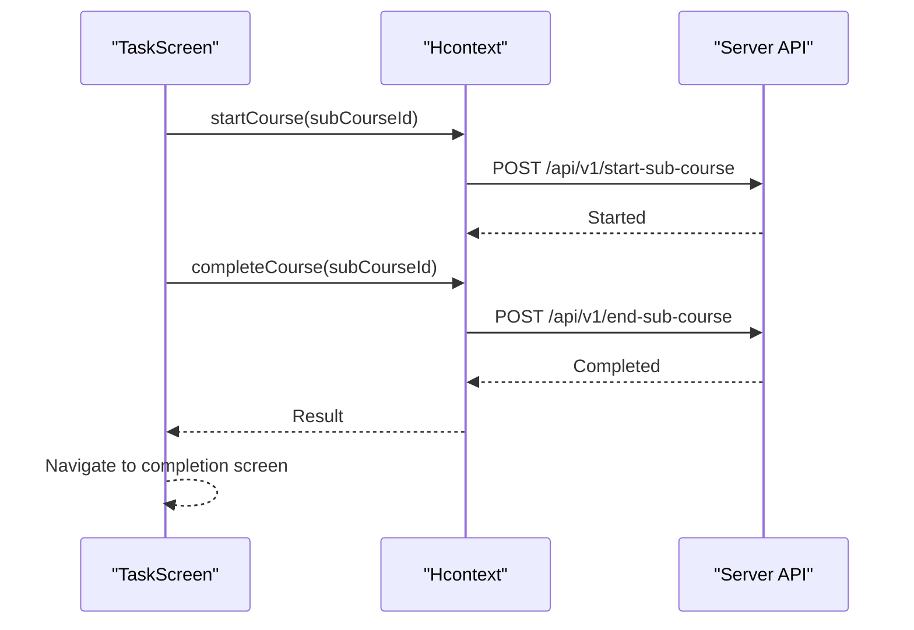
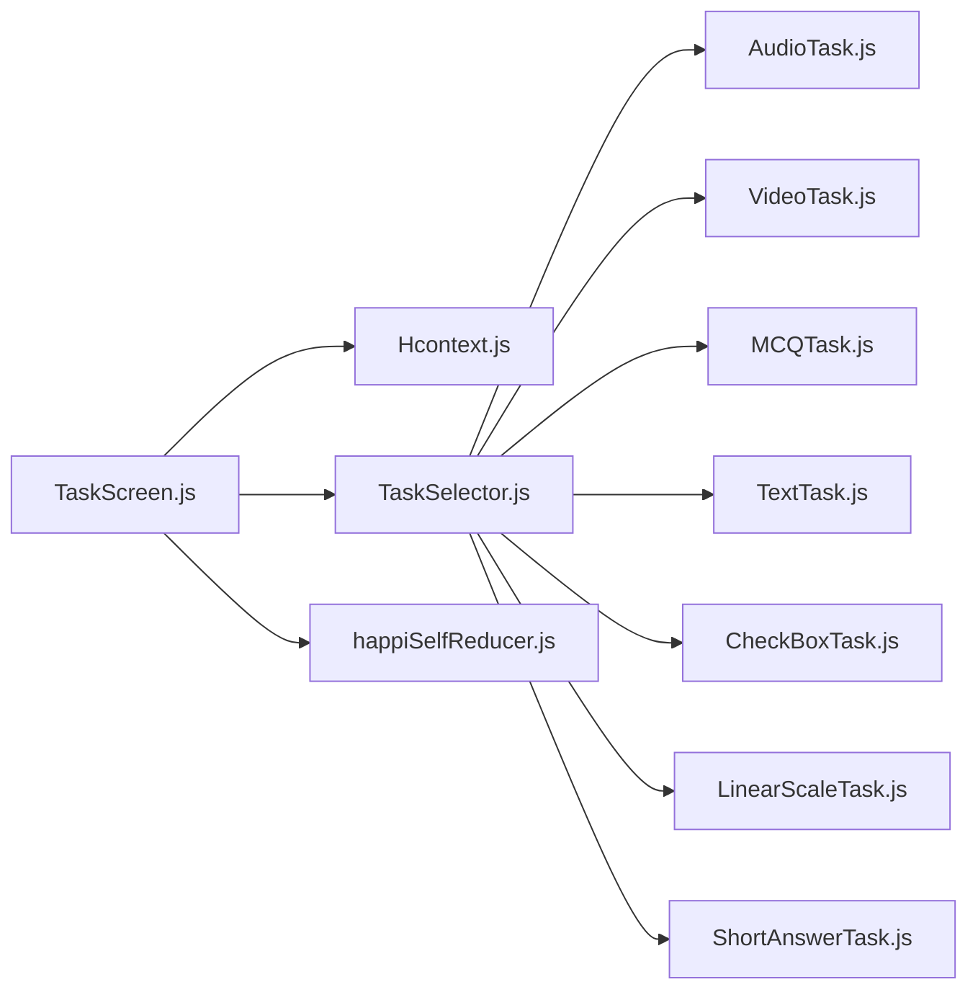

# Task Management and Activities

<cite>
**Referenced Files in This Document**
- [HappiSELF.js](file://src/screens/HappiSELF/HappiSELF.js)
- [TaskScreen.js](file://src/screens/HappiSELF/TaskScreen.js)
- [TaskSelector.js](file://src/screens/HappiSELF/Tasks/TaskSelector.js)
- [TaskScreenHeader.js](file://src/screens/HappiSELF/Tasks/TaskScreenHeader.js)
- [AudioTask.js](file://src/screens/HappiSELF/Tasks/AudioTask.js)
- [VideoTask.js](file://src/screens/HappiSELF/Tasks/VideoTask.js)
- [MCQTask.js](file://src/screens/HappiSELF/Tasks/MCQTask.js)
- [TextTask.js](file://src/screens/HappiSELF/Tasks/TextTask.js)
- [CheckBoxTask.js](file://src/screens/HappiSELF/Tasks/CheckBoxTask.js)
- [LinearScaleTask.js](file://src/screens/HappiSELF/Tasks/LinearScaleTask.js)
- [ShortAnswerTask.js](file://src/screens/HappiSELF/Tasks/ShortAnswerTask.js)
- [Hcontext.js](file://src/context/Hcontext.js)
- [happiSelfReducer.js](file://src/context/reducers/happiSelfReducer.js)
</cite>

## Table of Contents
1. [Introduction](#introduction)
2. [Project Structure](#project-structure)
3. [Core Components](#core-components)
4. [Architecture Overview](#architecture-overview)
5. [Detailed Component Analysis](#detailed-component-analysis)
6. [Dependency Analysis](#dependency-analysis)
7. [Performance Considerations](#performance-considerations)
8. [Troubleshooting Guide](#troubleshooting-guide)
9. [Conclusion](#conclusion)

## Introduction
This document explains the task management and activity system within HappiSELF. It covers how tasks are selected, executed, validated, and tracked; how progress is indicated; and how tasks integrate with course enrollment and completion. It also outlines the different task types (AudioTask, VideoTask, MCQTask, TextTask, and others), the task navigation flow, and how the system supports course progression and completion.

## Project Structure
The HappiSELF task system is organized around:
- A task orchestration screen that loads sub-course content and manages navigation and completion
- A selector component that routes to the appropriate task type
- Task-specific components for audio, video, multiple choice, checkbox, linear scale, and short answer interactions
- A shared header component for consistent progress and navigation cues
- A centralized context/provider that manages HappiSELF state and exposes APIs for content retrieval, completion, and answers

**Diagram sources**
- [HappiSELF.js:1-173](file://src/screens/HappiSELF/HappiSELF.js#L1-L173)
- [TaskScreen.js:1-261](file://src/screens/HappiSELF/TaskScreen.js#L1-L261)
- [TaskSelector.js:1-37](file://src/screens/HappiSELF/Tasks/TaskSelector.js#L1-L37)
- [TaskScreenHeader.js:1-69](file://src/screens/HappiSELF/Tasks/TaskScreenHeader.js#L1-L69)
- [AudioTask.js:1-209](file://src/screens/HappiSELF/Tasks/AudioTask.js#L1-L209)
- [VideoTask.js:1-173](file://src/screens/HappiSELF/Tasks/VideoTask.js#L1-L173)
- [MCQTask.js:1-197](file://src/screens/HappiSELF/Tasks/MCQTask.js#L1-L197)
- [TextTask.js:1-98](file://src/screens/HappiSELF/Tasks/TextTask.js#L1-L98)
- [CheckBoxTask.js:1-167](file://src/screens/HappiSELF/Tasks/CheckBoxTask.js#L1-L167)
- [LinearScaleTask.js:1-126](file://src/screens/HappiSELF/Tasks/LinearScaleTask.js#L1-L126)
- [ShortAnswerTask.js:1-126](file://src/screens/HappiSELF/Tasks/ShortAnswerTask.js#L1-L126)
- [Hcontext.js:1-1551](file://src/context/Hcontext.js#L1-L1551)
- [happiSelfReducer.js:1-45](file://src/context/reducers/happiSelfReducer.js#L1-L45)

**Section sources**
- [HappiSELF.js:1-173](file://src/screens/HappiSELF/HappiSELF.js#L1-L173)
- [TaskScreen.js:1-261](file://src/screens/HappiSELF/TaskScreen.js#L1-L261)
- [TaskSelector.js:1-37](file://src/screens/HappiSELF/Tasks/TaskSelector.js#L1-L37)
- [TaskScreenHeader.js:1-69](file://src/screens/HappiSELF/Tasks/TaskScreenHeader.js#L1-L69)
- [Hcontext.js:1-1551](file://src/context/Hcontext.js#L1-L1551)
- [happiSelfReducer.js:1-45](file://src/context/reducers/happiSelfReducer.js#L1-L45)

## Core Components
- TaskScreen orchestrates loading sub-course content, selecting the next active task, and coordinating completion actions. It conditionally renders either a library-backed sub-course or a task-driven active task and exposes a “Next” action to advance after validation.
- TaskSelector routes to the correct task component based on content_type.
- TaskScreenHeader provides consistent title/subtitle and a Notes shortcut.
- Task components encapsulate the UI and interaction model per task type and coordinate completion via callbacks and state updates.
- Hcontext provides APIs for sub-course content retrieval, starting and completing sub-courses, saving answers, and managing HappiSELF state via a reducer.

Key responsibilities:
- Task selection and routing
- Completion validation and state updates
- Progress indication and navigation
- Integration with course enrollment and completion
- Saving answers for applicable task types

**Section sources**
- [TaskScreen.js:1-261](file://src/screens/HappiSELF/TaskScreen.js#L1-L261)
- [TaskSelector.js:1-37](file://src/screens/HappiSELF/Tasks/TaskSelector.js#L1-L37)
- [TaskScreenHeader.js:1-69](file://src/screens/HappiSELF/Tasks/TaskScreenHeader.js#L1-L69)
- [Hcontext.js:899-962](file://src/context/Hcontext.js#L899-L962)
- [happiSelfReducer.js:1-45](file://src/context/reducers/happiSelfReducer.js#L1-L45)

## Architecture Overview
The system follows a predictable flow:
- A user navigates to a sub-course
- TaskScreen loads content for the sub-course and sets the first incomplete task as active
- TaskSelector renders the appropriate task component based on content_type
- Task components collect user input, validate locally where applicable, and signal completion
- On completion, TaskScreen updates the in-memory questions list and exposes a “Next” action to move forward
- When all tasks are completed, TaskScreen displays a completion screen and invokes the course completion API

**Diagram sources**
- [TaskScreen.js:92-146](file://src/screens/HappiSELF/TaskScreen.js#L92-L146)
- [Hcontext.js:902-913](file://src/context/Hcontext.js#L902-L913)
- [Hcontext.js:951-962](file://src/context/Hcontext.js#L951-L962)
- [TaskSelector.js:14-32](file://src/screens/HappiSELF/Tasks/TaskSelector.js#L14-L32)

## Detailed Component Analysis

### TaskScreen: Orchestration, Navigation, and Completion
Responsibilities:
- Load sub-course content via subCourseContent
- Initialize questionsList and set the first incomplete task as active
- Track completion via a local updatedTasks buffer and dispatch SET_QUESTIONS to persist
- Expose a “Next” action to finalize completion and reset temporary state
- Route to CourseComplete when all tasks are finished

Completion flow highlights:
- After a task signals completion, TaskScreen updates the in-memory list and shows “Next”
- On “Next”, it dispatches the updated list and clears temporary answer buffer
- If no active task exists, it considers the sub-course complete and triggers completeCourse

**Diagram sources**
- [TaskScreen.js:48-146](file://src/screens/HappiSELF/TaskScreen.js#L48-L146)
- [Hcontext.js:951-962](file://src/context/Hcontext.js#L951-L962)

**Section sources**
- [TaskScreen.js:1-261](file://src/screens/HappiSELF/TaskScreen.js#L1-L261)
- [Hcontext.js:902-913](file://src/context/Hcontext.js#L902-L913)
- [Hcontext.js:951-962](file://src/context/Hcontext.js#L951-L962)

### TaskSelector: Dynamic Routing by Task Type
Responsibilities:
- Inspect question.content_type and render the matching task component
- Supported types include audio, question_mcq, question_checkbox, video, text, question_match, linear_scale, short_answer

**Diagram sources**
- [TaskSelector.js:14-32](file://src/screens/HappiSELF/Tasks/TaskSelector.js#L14-L32)

**Section sources**
- [TaskSelector.js:1-37](file://src/screens/HappiSELF/Tasks/TaskSelector.js#L1-L37)

### Task Types

#### AudioTask
- Loads and plays an audio asset
- Tracks playback duration and auto-completes upon finish
- Provides a play/pause control and a timer overlay

Validation and completion:
- On successful playback completion, marks the task as completed and signals “Next”

**Diagram sources**
- [AudioTask.js:88-121](file://src/screens/HappiSELF/Tasks/AudioTask.js#L88-L121)
- [TaskScreen.js:122-132](file://src/screens/HappiSELF/TaskScreen.js#L122-L132)

**Section sources**
- [AudioTask.js:1-209](file://src/screens/HappiSELF/Tasks/AudioTask.js#L1-L209)
- [TaskScreen.js:122-132](file://src/screens/HappiSELF/TaskScreen.js#L122-L132)

#### VideoTask
- Renders a native-controlled video player
- Completes automatically when playback finishes
- Shows loading and buffering states

Validation and completion:
- Completion triggered on didJustFinish event when not part of a library-backed sub-course

**Section sources**
- [VideoTask.js:1-173](file://src/screens/HappiSELF/Tasks/VideoTask.js#L1-L173)

#### MCQTask
- Presents a single-choice question with animated feedback
- Validates against correct_answer and toggles isCorrectOption accordingly
- Signals completion immediately upon selection

**Diagram sources**
- [MCQTask.js:44-57](file://src/screens/HappiSELF/Tasks/MCQTask.js#L44-L57)
- [TaskScreen.js:122-132](file://src/screens/HappiSELF/TaskScreen.js#L122-L132)

**Section sources**
- [MCQTask.js:1-197](file://src/screens/HappiSELF/Tasks/MCQTask.js#L1-L197)
- [TaskScreen.js:122-132](file://src/screens/HappiSELF/TaskScreen.js#L122-L132)

#### TextTask
- Non-interactive reading task
- Immediately marks as completed and enables “Next”

**Section sources**
- [TextTask.js:1-98](file://src/screens/HappiSELF/Tasks/TextTask.js#L1-L98)

#### CheckBoxTask
- Allows multiple selections
- Completes when any selection is made

**Section sources**
- [CheckBoxTask.js:1-167](file://src/screens/HappiSELF/Tasks/CheckBoxTask.js#L1-L167)

#### LinearScaleTask
- Uses a slider to capture a rating along a linear scale
- Completes immediately on mount and updates a mood label based on slider value

**Section sources**
- [LinearScaleTask.js:1-126](file://src/screens/HappiSELF/Tasks/LinearScaleTask.js#L1-L126)

#### ShortAnswerTask
- Captures free-form text input
- Completes when an answer is present in global state (activeTaskAnswer)
- Persists answer via SET_ACTIVE_TASK_ANSWER

**Section sources**
- [ShortAnswerTask.js:1-126](file://src/screens/HappiSELF/Tasks/ShortAnswerTask.js#L1-L126)
- [happiSelfReducer.js:36-40](file://src/context/reducers/happiSelfReducer.js#L36-L40)

### Task Header Component
- Provides a consistent title and subtitle area
- Includes a “Notes” button that navigates to the notes screen
- Used by most task components to maintain UI uniformity

**Section sources**
- [TaskScreenHeader.js:1-69](file://src/screens/HappiSELF/Tasks/TaskScreenHeader.js#L1-L69)

### Course Enrollment and Completion Integration
- Sub-course content is fetched via subCourseContent and stored in the HappiSELF reducer
- Starting and ending sub-courses is handled by startCourse and completeCourse
- TaskScreen coordinates completion and invokes completeCourse when the last task is finished

**Diagram sources**
- [Hcontext.js:939-962](file://src/context/Hcontext.js#L939-L962)
- [TaskScreen.js:167-182](file://src/screens/HappiSELF/TaskScreen.js#L167-L182)

**Section sources**
- [Hcontext.js:899-962](file://src/context/Hcontext.js#L899-L962)
- [TaskScreen.js:167-182](file://src/screens/HappiSELF/TaskScreen.js#L167-L182)

### Scoring and Validation Mechanisms
- Local validation:
  - MCQTask compares selected option to correct_answer and sets isCorrectOption
  - AudioTask and VideoTask auto-complete on playback finish
  - CheckBoxTask, LinearScaleTask, and TextTask auto-complete on interaction
  - ShortAnswerTask completes when an answer exists in global state
- Global persistence:
  - TaskScreen updates questionsList with isCompleted and persists via SET_QUESTIONS
  - Short answer answers are saved via saveHappiSelfContentAnswer when applicable
- Completion trigger:
  - TaskScreen’s “Next” action finalizes the current task and advances to the next

**Section sources**
- [MCQTask.js:44-57](file://src/screens/HappiSELF/Tasks/MCQTask.js#L44-L57)
- [AudioTask.js:111-121](file://src/screens/HappiSELF/Tasks/AudioTask.js#L111-L121)
- [VideoTask.js:115-122](file://src/screens/HappiSELF/Tasks/VideoTask.js#L115-L122)
- [CheckBoxTask.js:42-48](file://src/screens/HappiSELF/Tasks/CheckBoxTask.js#L42-L48)
- [LinearScaleTask.js:36-42](file://src/screens/HappiSELF/Tasks/LinearScaleTask.js#L36-L42)
- [TextTask.js:31-37](file://src/screens/HappiSELF/Tasks/TextTask.js#L31-L37)
- [ShortAnswerTask.js:32-41](file://src/screens/HappiSELF/Tasks/ShortAnswerTask.js#L32-L41)
- [TaskScreen.js:122-146](file://src/screens/HappiSELF/TaskScreen.js#L122-L146)
- [Hcontext.js:1042-1054](file://src/context/Hcontext.js#L1042-L1054)

### Adaptive Difficulty and Personalized Recommendations
- The current implementation does not expose explicit adaptive difficulty or recommendation logic in the files reviewed
- Recommendation and difficulty adjustments would typically be driven by backend APIs and persisted in user state; no such endpoints or state updates were identified in the examined files

[No sources needed since this section provides general guidance]

## Dependency Analysis
- TaskScreen depends on Hcontext for:
  - Loading sub-course content (subCourseContent)
  - Completing sub-courses (completeCourse)
  - Saving answers (saveHappiSelfContentAnswer)
  - Managing HappiSELF state (happiSelfState, happiSelfDispatch)
- TaskSelector depends on TaskScreen props and imports all task components
- Task components depend on TaskScreenHeader for consistent UI and Hcontext for state
- HappiSELF reducer stores questionsList, activeTask, and activeTaskAnswer

**Diagram sources**
- [TaskScreen.js:1-261](file://src/screens/HappiSELF/TaskScreen.js#L1-L261)
- [TaskSelector.js:1-37](file://src/screens/HappiSELF/Tasks/TaskSelector.js#L1-L37)
- [Hcontext.js:1-1551](file://src/context/Hcontext.js#L1-L1551)
- [happiSelfReducer.js:1-45](file://src/context/reducers/happiSelfReducer.js#L1-L45)

**Section sources**
- [TaskScreen.js:1-261](file://src/screens/HappiSELF/TaskScreen.js#L1-L261)
- [TaskSelector.js:1-37](file://src/screens/HappiSELF/Tasks/TaskSelector.js#L1-L37)
- [Hcontext.js:1-1551](file://src/context/Hcontext.js#L1-L1551)
- [happiSelfReducer.js:1-45](file://src/context/reducers/happiSelfReducer.js#L1-L45)

## Performance Considerations
- AudioTask keeps the screen awake during playback to avoid interruptions; ensure cleanup of sound resources on unmount
- VideoTask uses native controls and tracks buffering; minimize unnecessary re-renders by relying on onPlaybackStatusUpdate
- MCQTask applies animations only when needed; keep animation sequences concise
- ShortAnswerTask uses a keyboard-aware scroll view; ensure input handling does not block the UI thread

[No sources needed since this section provides general guidance]

## Troubleshooting Guide
Common issues and resolutions:
- Playback does not start or stops unexpectedly:
  - Verify audio/video URLs and network connectivity
  - Ensure proper resource cleanup in useEffect return handlers
- Task does not mark as completed:
  - Confirm that completeTask is invoked with the correct taskId
  - For MCQTask, ensure correct_answer matches the selected option
  - For ShortAnswerTask, ensure activeTaskAnswer is populated before completion
- “Next” button not appearing:
  - Ensure updatedTasks is populated and handleTaskActionButton is called
  - Verify that SET_QUESTIONS is dispatched with the updated list
- Course completion not recorded:
  - Confirm completeCourse is called and the server responds successfully

**Section sources**
- [AudioTask.js:51-59](file://src/screens/HappiSELF/Tasks/AudioTask.js#L51-L59)
- [VideoTask.js:103-122](file://src/screens/HappiSELF/Tasks/VideoTask.js#L103-L122)
- [MCQTask.js:44-57](file://src/screens/HappiSELF/Tasks/MCQTask.js#L44-L57)
- [ShortAnswerTask.js:32-41](file://src/screens/HappiSELF/Tasks/ShortAnswerTask.js#L32-L41)
- [TaskScreen.js:122-146](file://src/screens/HappiSELF/TaskScreen.js#L122-L146)
- [Hcontext.js:951-962](file://src/context/Hcontext.js#L951-L962)

## Conclusion
The HappiSELF task management system provides a robust, modular framework for delivering interactive learning activities. TaskScreen centralizes orchestration, TaskSelector routes to specialized components, and Hcontext supplies state and API integrations. Completion is validated locally where appropriate and persisted globally, culminating in course completion when all tasks are finished. While the current implementation focuses on execution and completion, future enhancements could incorporate adaptive difficulty and personalized recommendations through backend-driven logic and state updates.