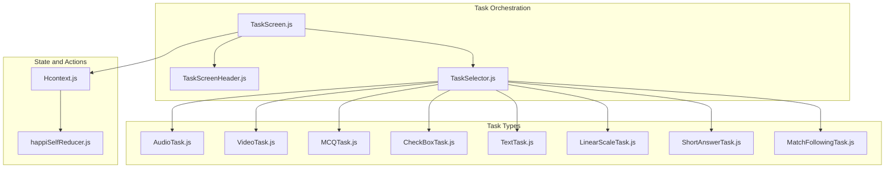
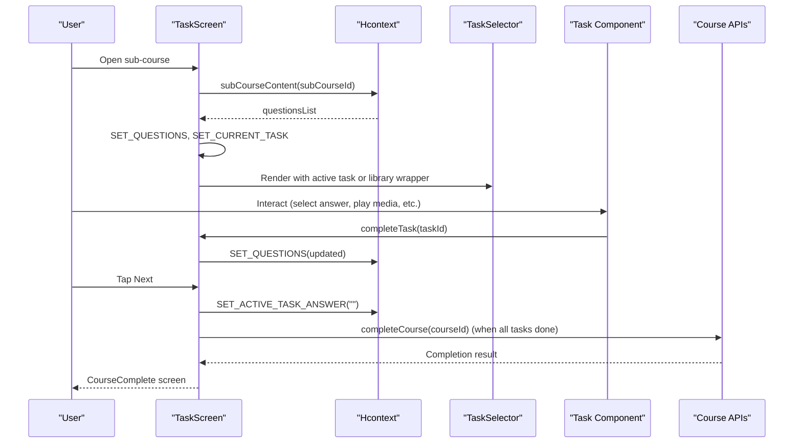
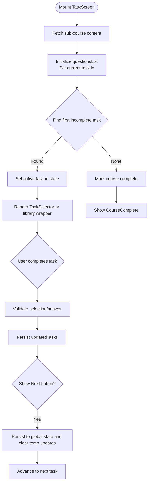
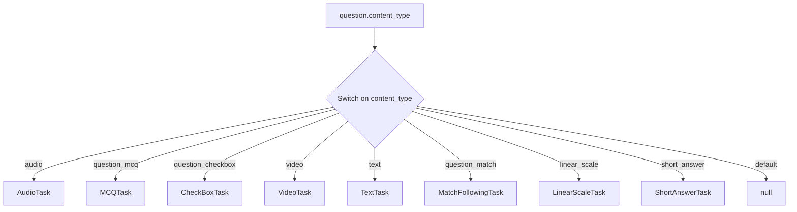
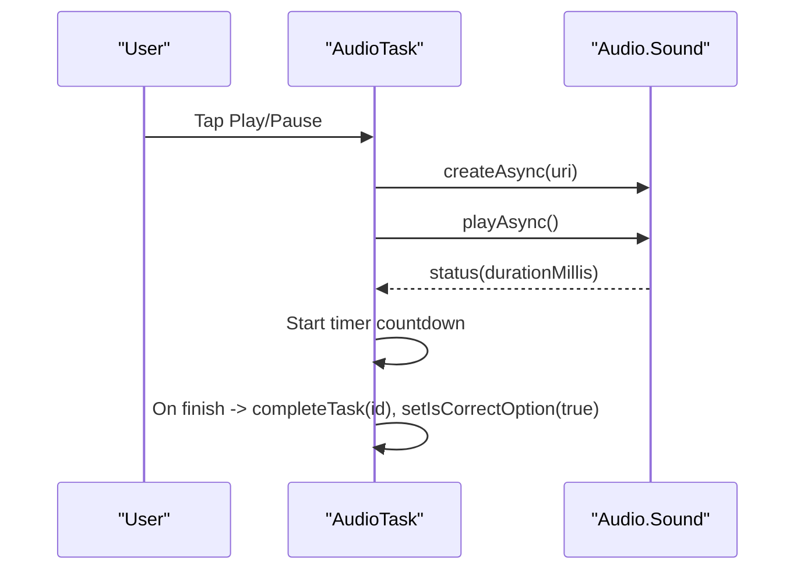
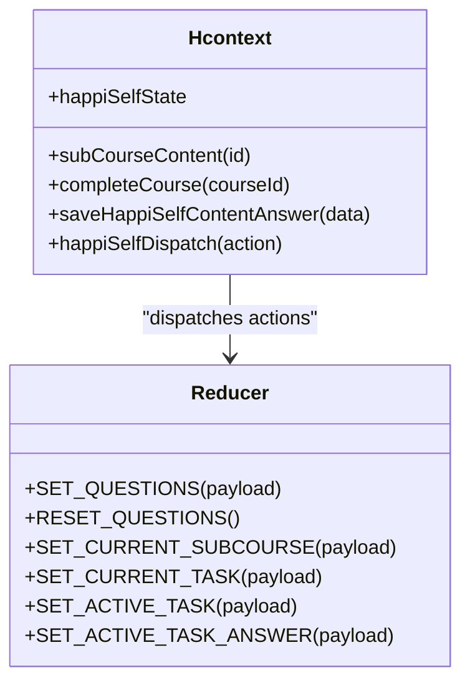
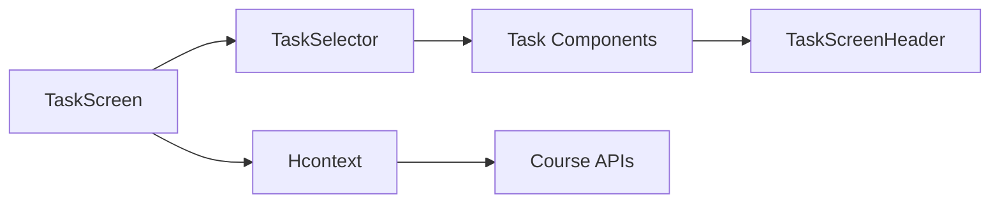

# Task Navigation and Workflow

<cite>
**Referenced Files in This Document**
- [TaskScreen.js](file://src/screens/HappiSELF/TaskScreen.js)
- [TaskSelector.js](file://src/screens/HappiSELF/Tasks/TaskSelector.js)
- [TaskScreenHeader.js](file://src/screens/HappiSELF/Tasks/TaskScreenHeader.js)
- [AudioTask.js](file://src/screens/HappiSELF/Tasks/AudioTask.js)
- [MCQTask.js](file://src/screens/HappiSELF/Tasks/MCQTask.js)
- [CheckBoxTask.js](file://src/screens/HappiSELF/Tasks/CheckBoxTask.js)
- [VideoTask.js](file://src/screens/HappiSELF/Tasks/VideoTask.js)
- [TextTask.js](file://src/screens/HappiSELF/Tasks/TextTask.js)
- [LinearScaleTask.js](file://src/screens/HappiSELF/Tasks/LinearScaleTask.js)
- [ShortAnswerTask.js](file://src/screens/HappiSELF/Tasks/ShortAnswerTask.js)
- [MatchFollowingTask.js](file://src/screens/HappiSELF/Tasks/MatchFollowingTask.js)
- [Hcontext.js](file://src/context/Hcontext.js)
- [happiSelfReducer.js](file://src/context/reducers/happiSelfReducer.js)
</cite>

## Table of Contents
1. [Introduction](#introduction)
2. [Project Structure](#project-structure)
3. [Core Components](#core-components)
4. [Architecture Overview](#architecture-overview)
5. [Detailed Component Analysis](#detailed-component-analysis)
6. [Dependency Analysis](#dependency-analysis)
7. [Performance Considerations](#performance-considerations)
8. [Troubleshooting Guide](#troubleshooting-guide)
9. [Conclusion](#conclusion)

## Introduction
This document explains the task navigation system and workflow management in HappiSELF. It focuses on how tasks are presented, validated, sequenced, and tracked toward course completion. It also documents the integration with course enrollment APIs, progress visualization, and adaptive routing based on user performance and content type.

## Project Structure
The task navigation is centered around:
- TaskScreen: orchestrates loading, sequencing, and rendering of tasks
- TaskSelector: dispatches the appropriate task component based on content type
- Task components: specialized UIs for each content type (audio, video, MCQ, checkbox, text, linear scale, short answer, match-following)
- TaskScreenHeader: renders page title and navigation affordances
- Hcontext: provides state and actions for HappiSELF including course content retrieval, task completion, and course lifecycle

**Diagram sources**
- [TaskScreen.js:1-261](file://src/screens/HappiSELF/TaskScreen.js#L1-L261)
- [TaskSelector.js:1-37](file://src/screens/HappiSELF/Tasks/TaskSelector.js#L1-L37)
- [TaskScreenHeader.js:1-69](file://src/screens/HappiSELF/Tasks/TaskScreenHeader.js#L1-L69)
- [AudioTask.js:1-209](file://src/screens/HappiSELF/Tasks/AudioTask.js#L1-L209)
- [VideoTask.js:1-173](file://src/screens/HappiSELF/Tasks/VideoTask.js#L1-L173)
- [MCQTask.js:1-197](file://src/screens/HappiSELF/Tasks/MCQTask.js#L1-L197)
- [CheckBoxTask.js:1-167](file://src/screens/HappiSELF/Tasks/CheckBoxTask.js#L1-L167)
- [TextTask.js:1-98](file://src/screens/HappiSELF/Tasks/TextTask.js#L1-L98)
- [LinearScaleTask.js:1-126](file://src/screens/HappiSELF/Tasks/LinearScaleTask.js#L1-L126)
- [ShortAnswerTask.js:1-126](file://src/screens/HappiSELF/Tasks/ShortAnswerTask.js#L1-L126)
- [MatchFollowingTask.js:1-171](file://src/screens/HappiSELF/Tasks/MatchFollowingTask.js#L1-L171)
- [Hcontext.js:899-962](file://src/context/Hcontext.js#L899-L962)
- [happiSelfReducer.js:1-45](file://src/context/reducers/happiSelfReducer.js#L1-L45)

**Section sources**
- [TaskScreen.js:1-261](file://src/screens/HappiSELF/TaskScreen.js#L1-L261)
- [TaskSelector.js:1-37](file://src/screens/HappiSELF/Tasks/TaskSelector.js#L1-L37)
- [TaskScreenHeader.js:1-69](file://src/screens/HappiSELF/Tasks/TaskScreenHeader.js#L1-L69)
- [Hcontext.js:899-962](file://src/context/Hcontext.js#L899-L962)
- [happiSelfReducer.js:1-45](file://src/context/reducers/happiSelfReducer.js#L1-L45)

## Core Components
- TaskScreen: loads sub-course content, sets the active task, tracks completion, and renders either a library wrapper or the active task component. It exposes a “Next” button to advance after validation.
- TaskSelector: a content-type router that selects the correct task component based on question.content_type.
- TaskScreenHeader: displays page title and a Notes shortcut.
- Task components: implement content-specific interactions and trigger completion via callbacks.
- Hcontext: exposes subCourseContent, completeCourse, saveHappiSelfContentAnswer, and the reducer state/actions for HappiSELF.

Key responsibilities:
- Loading and sequencing tasks
- Prerequisite validation (e.g., selecting an MCQ option)
- Progress tracking and completion
- Navigation controls and back/forward affordances
- Integration with course enrollment and completion APIs

**Section sources**
- [TaskScreen.js:27-226](file://src/screens/HappiSELF/TaskScreen.js#L27-L226)
- [TaskSelector.js:14-32](file://src/screens/HappiSELF/Tasks/TaskSelector.js#L14-L32)
- [TaskScreenHeader.js:13-35](file://src/screens/HappiSELF/Tasks/TaskScreenHeader.js#L13-L35)
- [Hcontext.js:902-962](file://src/context/Hcontext.js#L902-L962)
- [happiSelfReducer.js:9-44](file://src/context/reducers/happiSelfReducer.js#L9-L44)

## Architecture Overview
The task workflow integrates UI components, state management, and backend APIs:

**Diagram sources**
- [TaskScreen.js:92-146](file://src/screens/HappiSELF/TaskScreen.js#L92-L146)
- [Hcontext.js:902-962](file://src/context/Hcontext.js#L902-L962)
- [TaskSelector.js:14-32](file://src/screens/HappiSELF/Tasks/TaskSelector.js#L14-L32)

## Detailed Component Analysis

### TaskScreen
Responsibilities:
- Loads sub-course content via subCourseContent and initializes the task list
- Selects the first incomplete task as active
- Tracks completion via updatedTasks and a flag isCorrectOption
- Renders either a library wrapper or the active task component
- Exposes a “Next” button to persist answers and move forward

**Diagram sources**
- [TaskScreen.js:48-119](file://src/screens/HappiSELF/TaskScreen.js#L48-L119)
- [TaskScreen.js:121-146](file://src/screens/HappiSELF/TaskScreen.js#L121-L146)

**Section sources**
- [TaskScreen.js:27-226](file://src/screens/HappiSELF/TaskScreen.js#L27-L226)

### TaskSelector
Responsibilities:
- Routes to the correct task component based on question.content_type

**Diagram sources**
- [TaskSelector.js:14-32](file://src/screens/HappiSELF/Tasks/TaskSelector.js#L14-L32)

**Section sources**
- [TaskSelector.js:14-32](file://src/screens/HappiSELF/Tasks/TaskSelector.js#L14-L32)

### TaskScreenHeader
Responsibilities:
- Displays page title and subtitle
- Provides a “Notes” navigation button

**Section sources**
- [TaskScreenHeader.js:13-35](file://src/screens/HappiSELF/Tasks/TaskScreenHeader.js#L13-L35)

### Task Components

#### AudioTask
- Plays audio and auto-completes when playback finishes (unless part of a library)
- Shows a timer derived from audio duration

**Diagram sources**
- [AudioTask.js:88-121](file://src/screens/HappiSELF/Tasks/AudioTask.js#L88-L121)

**Section sources**
- [AudioTask.js:28-184](file://src/screens/HappiSELF/Tasks/AudioTask.js#L28-L184)

#### VideoTask
- Streams video natively; auto-completes on playback finish (unless part of a library)
- Shows loading and buffering states

**Section sources**
- [VideoTask.js:26-134](file://src/screens/HappiSELF/Tasks/VideoTask.js#L26-L134)

#### MCQTask
- Presents multiple-choice options
- Validates against correct_answer and triggers completion

**Section sources**
- [MCQTask.js:22-149](file://src/screens/HappiSELF/Tasks/MCQTask.js#L22-L149)

#### CheckBoxTask
- Collects multiple selections; auto-completes on selection change

**Section sources**
- [CheckBoxTask.js:19-114](file://src/screens/HappiSELF/Tasks/CheckBoxTask.js#L19-L114)

#### TextTask
- Auto-completes immediately upon focus

**Section sources**
- [TextTask.js:23-68](file://src/screens/HappiSELF/Tasks/TextTask.js#L23-L68)

#### LinearScaleTask
- Uses a slider to capture a mood/level; auto-completes on mount

**Section sources**
- [LinearScaleTask.js:24-87](file://src/screens/HappiSELF/Tasks/LinearScaleTask.js#L24-L87)

#### ShortAnswerTask
- Captures free-form text; completion occurs when an answer exists in state

**Section sources**
- [ShortAnswerTask.js:24-95](file://src/screens/HappiSELF/Tasks/ShortAnswerTask.js#L24-L95)

#### MatchFollowingTask
- Drag-and-drop matching; auto-completes on mount

**Section sources**
- [MatchFollowingTask.js:17-106](file://src/screens/HappiSELF/Tasks/MatchFollowingTask.js#L17-L106)

### State and Actions (Hcontext and Reducer)
- HappiSELF state includes currentSubCourse, currentTask, questionsList, activeTask, and activeTaskAnswer
- Actions include SET_QUESTIONS, RESET_QUESTIONS, SET_CURRENT_SUBCOURSE, SET_CURRENT_TASK, SET_ACTIVE_TASK, SET_ACTIVE_TASK_ANSWER
- Backend actions include subCourseContent, completeCourse, saveHappiSelfContentAnswer

**Diagram sources**
- [Hcontext.js:902-962](file://src/context/Hcontext.js#L902-L962)
- [happiSelfReducer.js:9-44](file://src/context/reducers/happiSelfReducer.js#L9-L44)

**Section sources**
- [Hcontext.js:902-962](file://src/context/Hcontext.js#L902-L962)
- [happiSelfReducer.js:1-45](file://src/context/reducers/happiSelfReducer.js#L1-L45)

## Dependency Analysis
- TaskScreen depends on Hcontext for state and API actions
- TaskSelector depends on task components
- Task components depend on TaskScreenHeader and Hcontext for state updates
- Hcontext encapsulates API calls for course content and completion

**Diagram sources**
- [TaskScreen.js:27-226](file://src/screens/HappiSELF/TaskScreen.js#L27-L226)
- [TaskSelector.js:14-32](file://src/screens/HappiSELF/Tasks/TaskSelector.js#L14-L32)
- [TaskScreenHeader.js:13-35](file://src/screens/HappiSELF/Tasks/TaskScreenHeader.js#L13-L35)
- [Hcontext.js:902-962](file://src/context/Hcontext.js#L902-L962)

**Section sources**
- [TaskScreen.js:27-226](file://src/screens/HappiSELF/TaskScreen.js#L27-L226)
- [TaskSelector.js:14-32](file://src/screens/HappiSELF/Tasks/TaskSelector.js#L14-L32)
- [TaskScreenHeader.js:13-35](file://src/screens/HappiSELF/Tasks/TaskScreenHeader.js#L13-L35)
- [Hcontext.js:902-962](file://src/context/Hcontext.js#L902-L962)

## Performance Considerations
- Minimize re-renders by consolidating state updates (e.g., batching SET_QUESTIONS and SET_ACTIVE_TASK_ANSWER)
- Avoid unnecessary API calls by checking currentTask before refetching content
- For media tasks, preload durations and avoid redundant sound/video instances
- Debounce or throttle frequent state updates in interactive tasks (e.g., sliders)

## Troubleshooting Guide
Common issues and resolutions:
- No tasks displayed: verify subCourseContent returned a non-empty list and that SET_QUESTIONS was dispatched
- Task does not advance: ensure completeTask was called and updatedTasks were persisted; confirm isCorrectOption is true
- Auto-completion not triggering: check content type logic (e.g., library vs standalone tasks) and playback status events
- Course completion not recorded: confirm completeCourse is invoked after all tasks are marked complete

**Section sources**
- [TaskScreen.js:92-146](file://src/screens/HappiSELF/TaskScreen.js#L92-L146)
- [AudioTask.js:111-121](file://src/screens/HappiSELF/Tasks/AudioTask.js#L111-L121)
- [VideoTask.js:115-122](file://src/screens/HappiSELF/Tasks/VideoTask.js#L115-L122)
- [Hcontext.js:951-962](file://src/context/Hcontext.js#L951-L962)

## Conclusion
The HappiSELF task navigation system combines a robust orchestration layer (TaskScreen), a flexible content router (TaskSelector), and specialized task components to deliver a seamless learning experience. Through Hcontext-backed state and API actions, it supports task sequencing, validation, and course completion. The modular design enables easy extension for new content types and integrates cleanly with course enrollment and progress tracking.