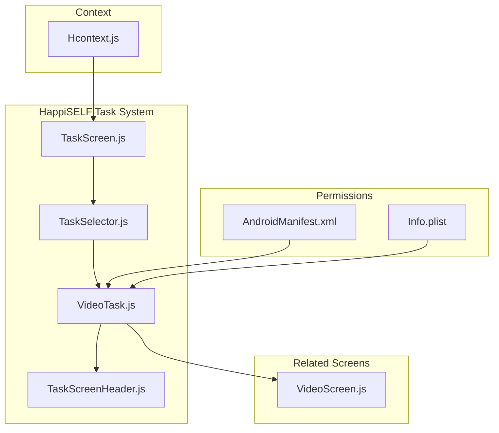
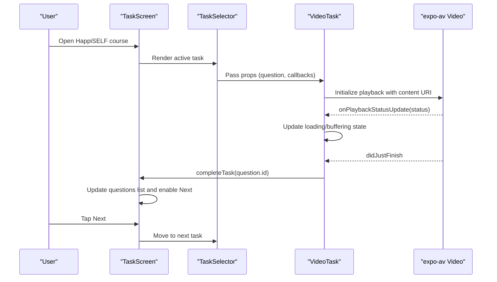
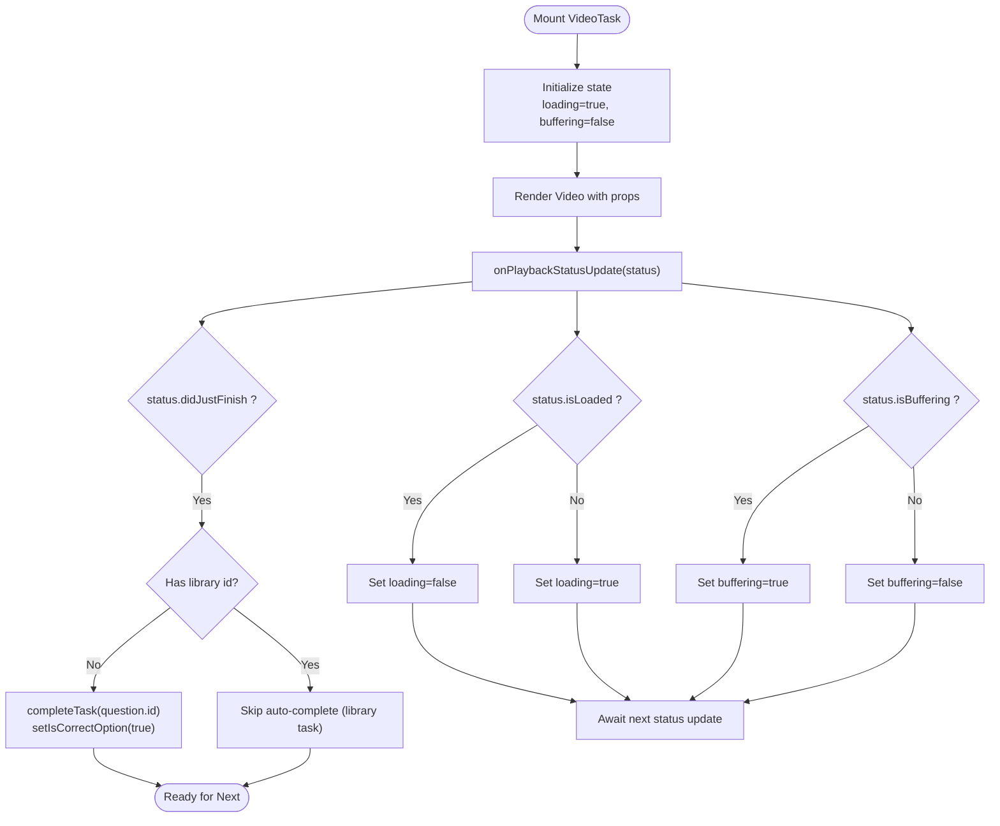
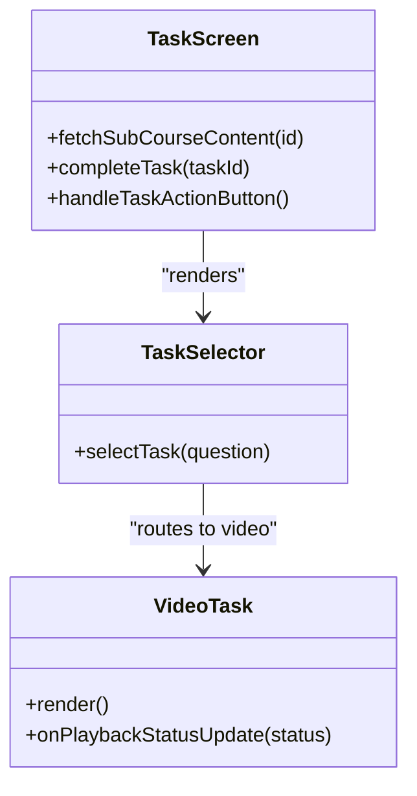
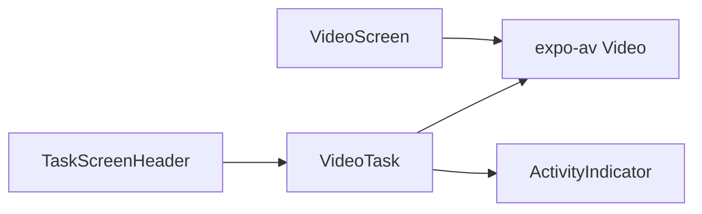
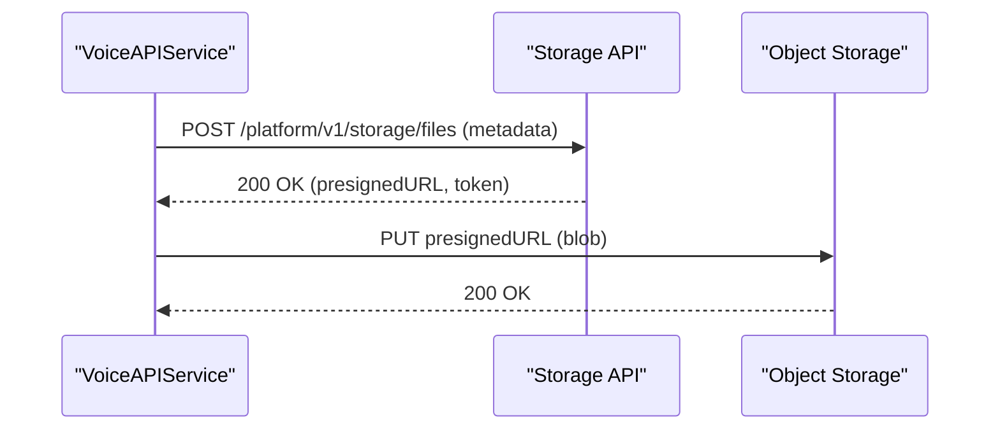
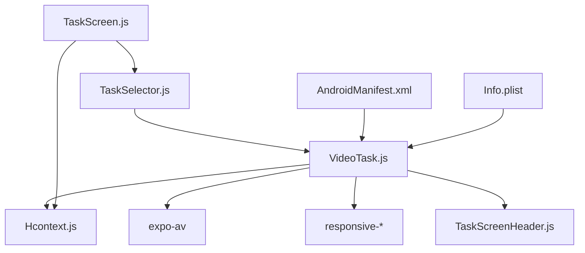

# Video Tasks

<cite>
**Referenced Files in This Document**
- [VideoTask.js](file://src/screens/HappiSELF/Tasks/VideoTask.js)
- [TaskScreenHeader.js](file://src/screens/HappiSELF/Tasks/TaskScreenHeader.js)
- [TaskScreen.js](file://src/screens/HappiSELF/TaskScreen.js)
- [TaskSelector.js](file://src/screens/HappiSELF/Tasks/TaskSelector.js)
- [VideoScreen.js](file://src/screens/Chat/VideoScreen.js)
- [AndroidManifest.xml](file://android/app/src/main/AndroidManifest.xml)
- [Info.plist](file://ios/HappiMynd/Info.plist)
- [Hcontext.js](file://src/context/Hcontext.js)
</cite>

## Table of Contents
1. [Introduction](#introduction)
2. [Project Structure](#project-structure)
3. [Core Components](#core-components)
4. [Architecture Overview](#architecture-overview)
5. [Detailed Component Analysis](#detailed-component-analysis)
6. [Dependency Analysis](#dependency-analysis)
7. [Performance Considerations](#performance-considerations)
8. [Troubleshooting Guide](#troubleshooting-guide)
9. [Conclusion](#conclusion)

## Introduction
This document describes the Video Task component in HappiSELF. It explains how the system presents instructional or demonstration videos to learners, how the playback experience is managed, and how completion criteria are enforced. It also documents the camera permissions and microphone permissions required for related features elsewhere in the app, and outlines the upload mechanism used for audio content. The goal is to help developers and stakeholders understand the current video task behavior, UI, and integration points.

## Project Structure
The HappiSELF video task is part of a modular task system. The primary files involved are:
- Task routing and selection
- The video task screen
- Playback and completion logic
- Permission declarations for camera and microphone
- Upload flow for audio content

**Diagram sources**
- [TaskScreen.js:184-226](file://src/screens/HappiSELF/TaskScreen.js#L184-L226)
- [TaskSelector.js:14-32](file://src/screens/HappiSELF/Tasks/TaskSelector.js#L14-L32)
- [VideoTask.js:26-134](file://src/screens/HappiSELF/Tasks/VideoTask.js#L26-L134)
- [TaskScreenHeader.js:13-36](file://src/screens/HappiSELF/Tasks/TaskScreenHeader.js#L13-L36)
- [VideoScreen.js:50-83](file://src/screens/Chat/VideoScreen.js#L50-L83)
- [AndroidManifest.xml:15-18](file://android/app/src/main/AndroidManifest.xml#L15-L18)
- [Info.plist:64-67](file://ios/HappiMynd/Info.plist#L64-L67)
- [Hcontext.js:33-40](file://src/context/Hcontext.js#L33-L40)

**Section sources**
- [TaskScreen.js:184-226](file://src/screens/HappiSELF/TaskScreen.js#L184-L226)
- [TaskSelector.js:14-32](file://src/screens/HappiSELF/Tasks/TaskSelector.js#L14-L32)
- [VideoTask.js:26-134](file://src/screens/HappiSELF/Tasks/VideoTask.js#L26-L134)
- [TaskScreenHeader.js:13-36](file://src/screens/HappiSELF/Tasks/TaskScreenHeader.js#L13-L36)
- [VideoScreen.js:50-83](file://src/screens/Chat/VideoScreen.js#L50-L83)
- [AndroidManifest.xml:15-18](file://android/app/src/main/AndroidManifest.xml#L15-L18)
- [Info.plist:64-67](file://ios/HappiMynd/Info.plist#L64-L67)
- [Hcontext.js:33-40](file://src/context/Hcontext.js#L33-L40)

## Core Components
- TaskScreen orchestrates the task lifecycle, loading questions, tracking completion, and rendering the active task via TaskSelector.
- TaskSelector routes to the appropriate task component based on content_type, including video.
- VideoTask renders a video player using the expo-av library, displays metadata, and marks the task complete upon playback finish when applicable.
- TaskScreenHeader provides the screen header with navigation and notes access.
- VideoScreen demonstrates a similar playback pattern for chat-related video viewing.
- Permissions for camera and microphone are declared in Android and iOS configuration files.
- Hcontext holds global state and dispatch functions used by TaskScreen.

Key responsibilities:
- Video playback and buffering indicators
- Completion trigger on playback finish
- Metadata display (title, description)
- Navigation to next task after completion

**Section sources**
- [TaskScreen.js:121-147](file://src/screens/HappiSELF/TaskScreen.js#L121-L147)
- [TaskSelector.js:18-24](file://src/screens/HappiSELF/Tasks/TaskSelector.js#L18-L24)
- [VideoTask.js:26-134](file://src/screens/HappiSELF/Tasks/VideoTask.js#L26-L134)
- [TaskScreenHeader.js:13-36](file://src/screens/HappiSELF/Tasks/TaskScreenHeader.js#L13-L36)
- [VideoScreen.js:50-83](file://src/screens/Chat/VideoScreen.js#L50-L83)
- [Hcontext.js:33-40](file://src/context/Hcontext.js#L33-L40)

## Architecture Overview
The video task integrates with the task framework and media playback libraries. The flow below shows how a video task is selected, rendered, and completed.

**Diagram sources**
- [TaskScreen.js:121-147](file://src/screens/HappiSELF/TaskScreen.js#L121-L147)
- [TaskSelector.js:18-24](file://src/screens/HappiSELF/Tasks/TaskSelector.js#L18-L24)
- [VideoTask.js:103-121](file://src/screens/HappiSELF/Tasks/VideoTask.js#L103-L121)

## Detailed Component Analysis

### VideoTask Component
VideoTask handles:
- Rendering the video player with native controls
- Tracking loading and buffering states
- Triggering task completion on playback finish
- Displaying title and description metadata
- Integrating with TaskScreen via callbacks

**Diagram sources**
- [VideoTask.js:26-134](file://src/screens/HappiSELF/Tasks/VideoTask.js#L26-L134)

**Section sources**
- [VideoTask.js:26-134](file://src/screens/HappiSELF/Tasks/VideoTask.js#L26-L134)

### TaskScreen and TaskSelector
TaskScreen manages the task list and completion state. TaskSelector routes to VideoTask when content_type equals video.

**Diagram sources**
- [TaskScreen.js:92-147](file://src/screens/HappiSELF/TaskScreen.js#L92-L147)
- [TaskSelector.js:14-32](file://src/screens/HappiSELF/Tasks/TaskSelector.js#L14-L32)
- [VideoTask.js:26-134](file://src/screens/HappiSELF/Tasks/VideoTask.js#L26-L134)

**Section sources**
- [TaskScreen.js:92-147](file://src/screens/HappiSELF/TaskScreen.js#L92-L147)
- [TaskSelector.js:14-32](file://src/screens/HappiSELF/Tasks/TaskSelector.js#L14-L32)

### UI Elements and Controls
- TaskScreenHeader: Provides title, subtitle, and a Notes action.
- VideoTask: Renders the video player with native controls and shows a loader during buffering.
- VideoScreen: Demonstrates a similar playback pattern for chat videos.

**Diagram sources**
- [TaskScreenHeader.js:13-36](file://src/screens/HappiSELF/Tasks/TaskScreenHeader.js#L13-L36)
- [VideoTask.js:63-134](file://src/screens/HappiSELF/Tasks/VideoTask.js#L63-L134)
- [VideoScreen.js:50-83](file://src/screens/Chat/VideoScreen.js#L50-L83)

**Section sources**
- [TaskScreenHeader.js:13-36](file://src/screens/HappiSELF/Tasks/TaskScreenHeader.js#L13-L36)
- [VideoTask.js:63-134](file://src/screens/HappiSELF/Tasks/VideoTask.js#L63-L134)
- [VideoScreen.js:50-83](file://src/screens/Chat/VideoScreen.js#L50-L83)

### Camera and Microphone Permissions
The app declares camera and microphone usage in platform configuration files. These permissions are required for features such as voice recording elsewhere in the app.

- Android: CAMERA, RECORD_AUDIO
- iOS: NSCameraUsageDescription, NSMicrophoneUsageDescription

These declarations support future video recording features and audio recording flows.

**Section sources**
- [AndroidManifest.xml:15-18](file://android/app/src/main/AndroidManifest.xml#L15-L18)
- [Info.plist:64-67](file://ios/HappiMynd/Info.plist#L64-L67)

### Upload Mechanism (Audio)
While the video task itself plays videos, the app includes an upload flow for audio content. This flow obtains a pre-signed URL and uploads a blob to storage.

**Diagram sources**
- [VoiceAPIService.js:91-139](file://src/screens/HappiVOICE/VoiceAPIService.js#L91-L139)

**Section sources**
- [VoiceAPIService.js:91-139](file://src/screens/HappiVOICE/VoiceAPIService.js#L91-L139)

## Dependency Analysis
- VideoTask depends on:
  - expo-av for video playback
  - react-native-responsive-* for responsive sizing
  - TaskScreenHeader for UI
  - Hcontext for global state and dispatch
- TaskScreen depends on:
  - Hcontext for task state and completion handlers
  - TaskSelector for routing tasks
- Permissions are external to the JS code and defined in platform manifests.

**Diagram sources**
- [VideoTask.js:1-25](file://src/screens/HappiSELF/Tasks/VideoTask.js#L1-L25)
- [TaskScreen.js:19-40](file://src/screens/HappiSELF/TaskScreen.js#L19-L40)
- [TaskSelector.js:14-32](file://src/screens/HappiSELF/Tasks/TaskSelector.js#L14-L32)
- [AndroidManifest.xml:15-18](file://android/app/src/main/AndroidManifest.xml#L15-L18)
- [Info.plist:64-67](file://ios/HappiMynd/Info.plist#L64-L67)

**Section sources**
- [VideoTask.js:1-25](file://src/screens/HappiSELF/Tasks/VideoTask.js#L1-L25)
- [TaskScreen.js:19-40](file://src/screens/HappiSELF/TaskScreen.js#L19-L40)
- [TaskSelector.js:14-32](file://src/screens/HappiSELF/Tasks/TaskSelector.js#L14-L32)
- [AndroidManifest.xml:15-18](file://android/app/src/main/AndroidManifest.xml#L15-L18)
- [Info.plist:64-67](file://ios/HappiMynd/Info.plist#L64-L67)

## Performance Considerations
- Video buffering: The component tracks buffering state and visually dims the player to indicate loading. This improves perceived performance and user feedback.
- Native controls: Using native controls reduces overhead and leverages platform optimizations.
- Completion timing: Completion occurs on playback finish, ensuring the learner has watched the full content before advancing.

[No sources needed since this section provides general guidance]

## Troubleshooting Guide
Common issues and resolutions:
- Video fails to load
  - Verify the content URI is accessible and reachable.
  - Check network connectivity and permissions.
  - Inspect onPlaybackStatusUpdate logs for errors.
- Playback stuck on buffering
  - Confirm the device is not throttling the app.
  - Reduce video resolution or bitrate on the server side.
- Auto-completion not triggered
  - Ensure the question does not have a library ID that bypasses auto-completion.
  - Confirm didJustFinish fires and completeTask is invoked.

**Section sources**
- [VideoTask.js:103-121](file://src/screens/HappiSELF/Tasks/VideoTask.js#L103-L121)
- [TaskScreen.js:121-147](file://src/screens/HappiSELF/TaskScreen.js#L121-L147)

## Conclusion
The HappiSELF video task provides a straightforward playback experience with clear loading and buffering indicators, and automatic completion upon playback finish. It integrates cleanly into the task framework and relies on platform permissions for camera and microphone, enabling future recording features. The upload flow for audio content is implemented and can serve as a reference for extending video upload capabilities if needed.