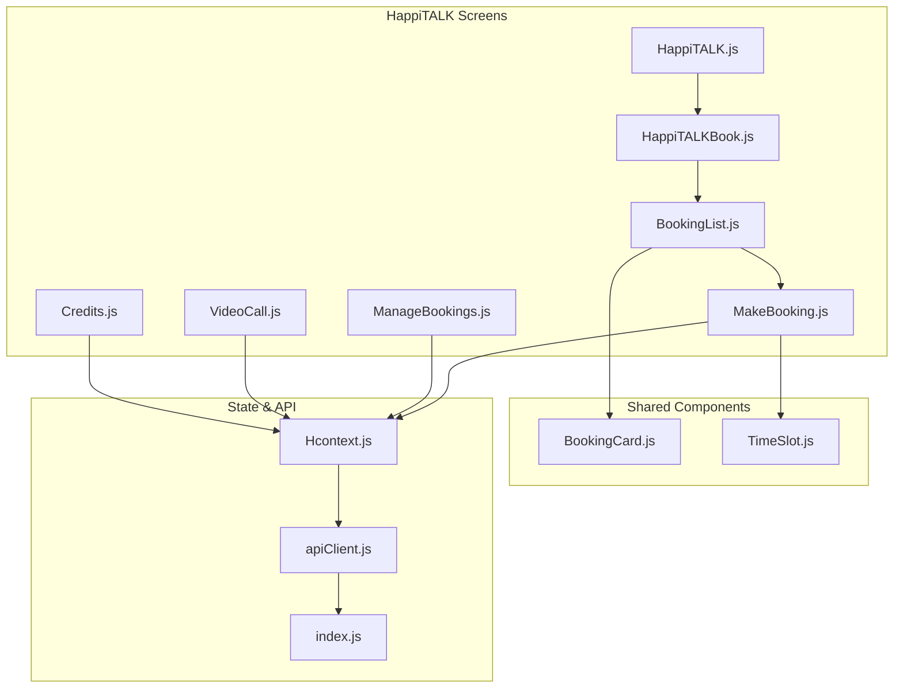
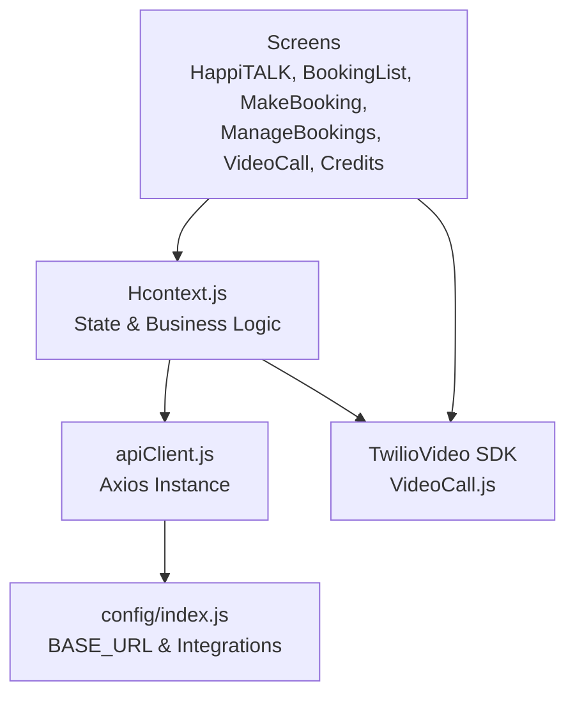
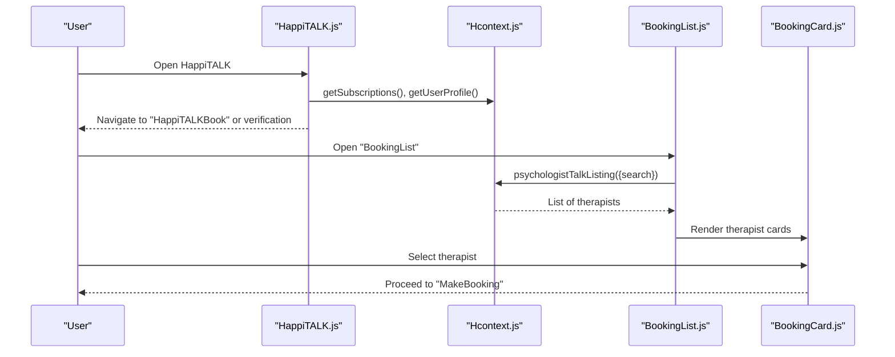
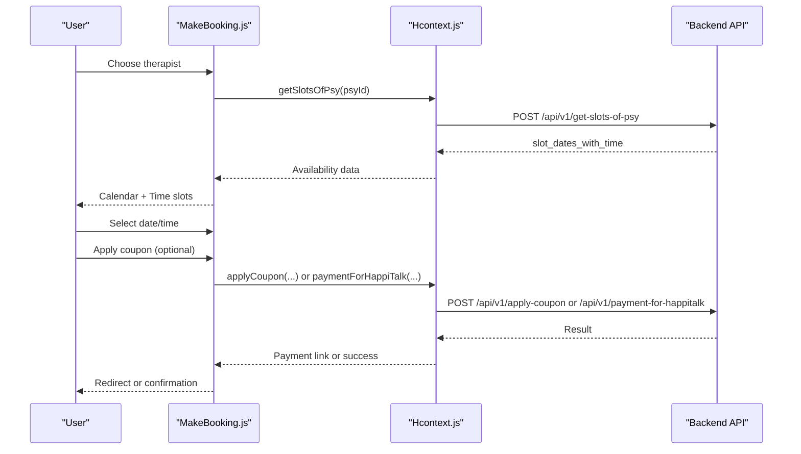
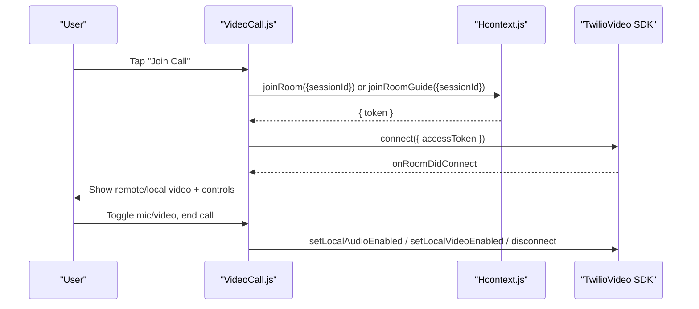
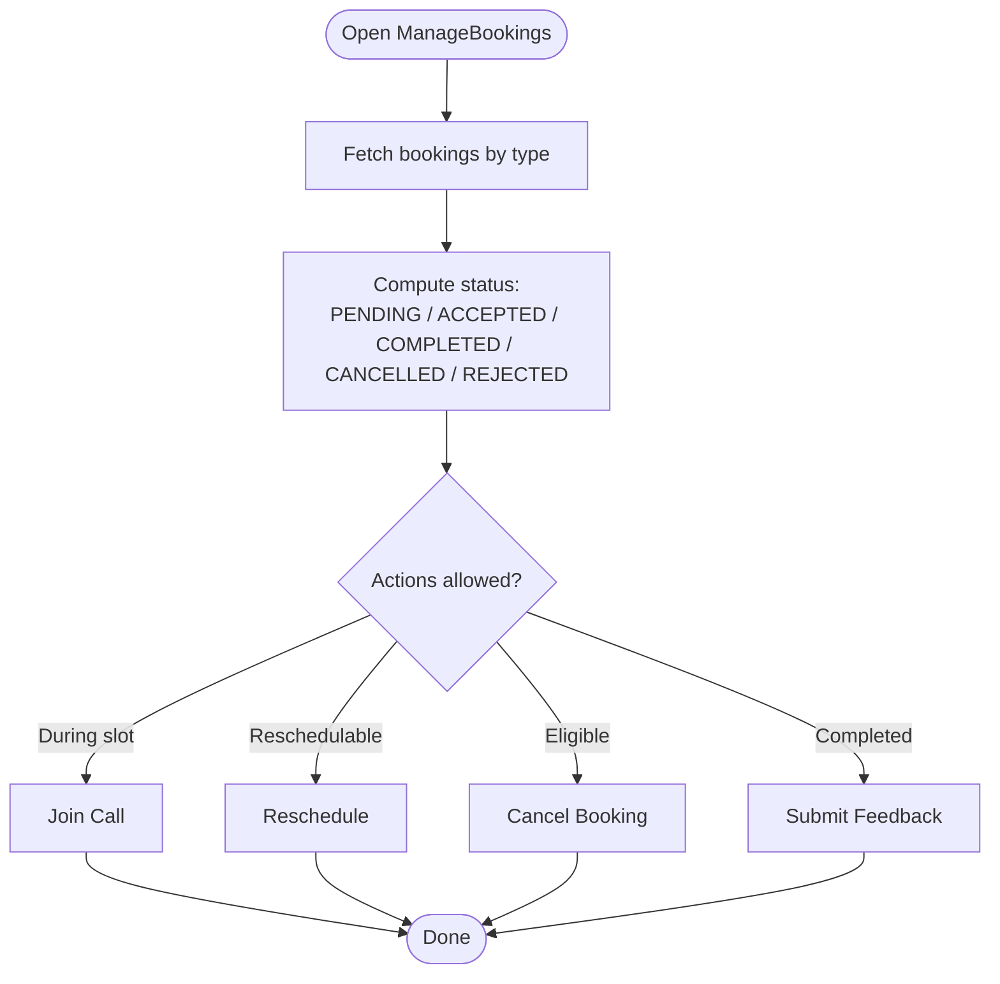
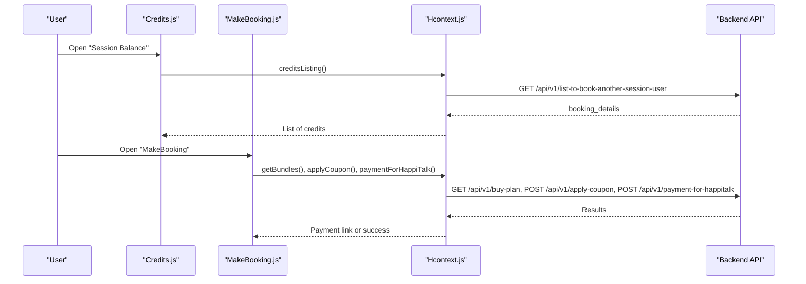
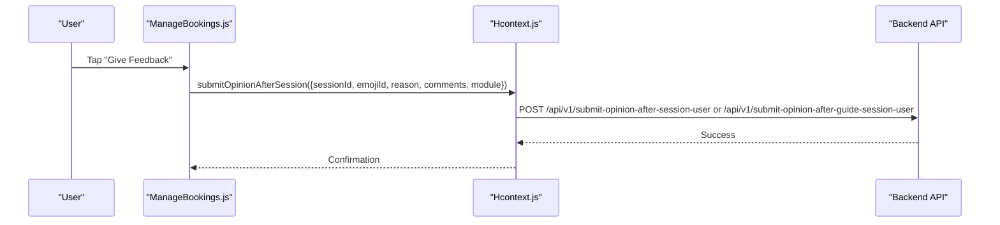
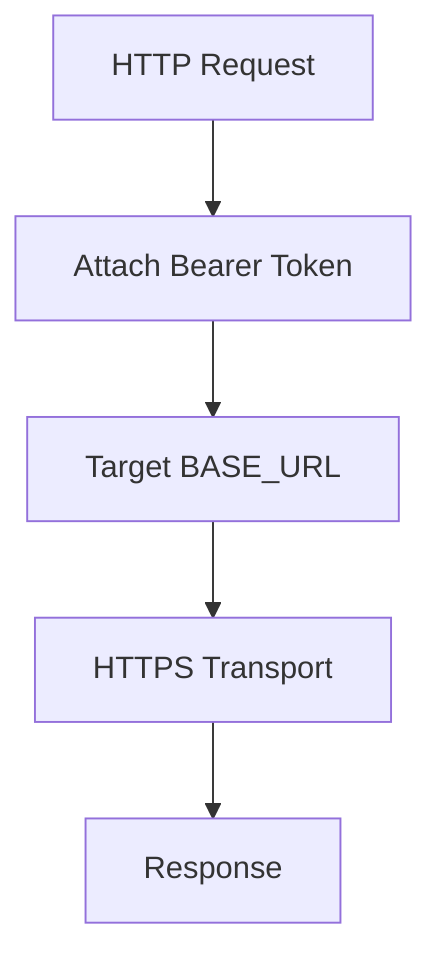
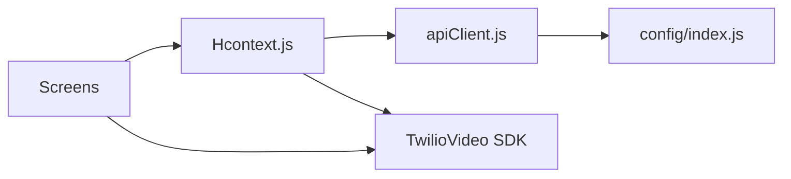

# HappiTALK - Therapy and Counseling Module

<cite>
**Referenced Files in This Document**
- [HappiTALK.js](file://src/screens/HappiTALK/HappiTALK.js)
- [HappiTALKBook.js](file://src/screens/HappiTALK/HappiTALKBook.js)
- [BookingList.js](file://src/screens/HappiTALK/BookingList.js)
- [MakeBooking.js](file://src/screens/HappiTALK/MakeBooking.js)
- [ManageBookings.js](file://src/screens/HappiTALK/ManageBookings.js)
- [VideoCall.js](file://src/screens/HappiTALK/VideoCall.js)
- [Credits.js](file://src/screens/HappiTALK/Credits.js)
- [Hcontext.js](file://src/context/Hcontext.js)
- [apiClient.js](file://src/context/apiClient.js)
- [index.js](file://src/config/index.js)
- [BookingCard.js](file://src/components/cards/BookingCard.js)
- [TimeSlot.js](file://src/components/Modals/TimeSlot.js)
</cite>

## Table of Contents
1. [Introduction](#introduction)
2. [Project Structure](#project-structure)
3. [Core Components](#core-components)
4. [Architecture Overview](#architecture-overview)
5. [Detailed Component Analysis](#detailed-component-analysis)
6. [Dependency Analysis](#dependency-analysis)
7. [Performance Considerations](#performance-considerations)
8. [Troubleshooting Guide](#troubleshooting-guide)
9. [Conclusion](#conclusion)
10. [Appendices](#appendices)

## Introduction
This document describes the HappiTALK therapy and counseling module within HappiMynd, focusing on the professional therapy session lifecycle: therapist discovery and selection, availability and scheduling, video session orchestration, session management workflows, credit and payment processing, feedback and ratings, and compliance considerations. It synthesizes the frontend implementation present in the repository to explain how users discover therapists, book sessions, participate in video calls, manage bookings, and provide feedback.

## Project Structure
The HappiTALK module is organized around several screens and shared components:
- Entry and discovery: HappiTALK, HappiTALKBook, BookingList
- Scheduling and payment: MakeBooking, Credits
- Session management: ManageBookings
- Video session: VideoCall
- Shared UI: BookingCard, TimeSlot
- State and API: Hcontext, apiClient, config

**Diagram sources**
- [HappiTALK.js:1-202](file://src/screens/HappiTALK/HappiTALK.js#L1-L202)
- [HappiTALKBook.js:1-233](file://src/screens/HappiTALK/HappiTALKBook.js#L1-L233)
- [BookingList.js:1-154](file://src/screens/HappiTALK/BookingList.js#L1-L154)
- [MakeBooking.js:1-945](file://src/screens/HappiTALK/MakeBooking.js#L1-L945)
- [ManageBookings.js:1-674](file://src/screens/HappiTALK/ManageBookings.js#L1-L674)
- [VideoCall.js:1-431](file://src/screens/HappiTALK/VideoCall.js#L1-L431)
- [Credits.js:1-114](file://src/screens/HappiTALK/Credits.js#L1-L114)
- [BookingCard.js:1-307](file://src/components/cards/BookingCard.js#L1-L307)
- [TimeSlot.js:1-211](file://src/components/Modals/TimeSlot.js#L1-L211)
- [Hcontext.js:1-1551](file://src/context/Hcontext.js#L1-L1551)
- [apiClient.js:1-58](file://src/context/apiClient.js#L1-L58)
- [index.js:1-13](file://src/config/index.js#L1-L13)

**Section sources**
- [HappiTALK.js:1-202](file://src/screens/HappiTALK/HappiTALK.js#L1-L202)
- [HappiTALKBook.js:1-233](file://src/screens/HappiTALK/HappiTALKBook.js#L1-L233)
- [BookingList.js:1-154](file://src/screens/HappiTALK/BookingList.js#L1-L154)
- [MakeBooking.js:1-945](file://src/screens/HappiTALK/MakeBooking.js#L1-L945)
- [ManageBookings.js:1-674](file://src/screens/HappiTALK/ManageBookings.js#L1-L674)
- [VideoCall.js:1-431](file://src/screens/HappiTALK/VideoCall.js#L1-L431)
- [Credits.js:1-114](file://src/screens/HappiTALK/Credits.js#L1-L114)
- [BookingCard.js:1-307](file://src/components/cards/BookingCard.js#L1-L307)
- [TimeSlot.js:1-211](file://src/components/Modals/TimeSlot.js#L1-L211)
- [Hcontext.js:1-1551](file://src/context/Hcontext.js#L1-L1551)
- [apiClient.js:1-58](file://src/context/apiClient.js#L1-L58)
- [index.js:1-13](file://src/config/index.js#L1-L13)

## Core Components
- HappiTALK entry screen orchestrates subscription and verification checks before directing users to booking.
- BookingList lists therapists and supports search; BookingCard renders therapist details and pricing.
- MakeBooking handles date/time selection, availability retrieval, coupon application, and payment initiation.
- ManageBookings displays upcoming/past/future sessions, allows joining calls, rescheduling, cancellation, and feedback submission.
- VideoCall integrates Twilio Video for session connectivity, controls audio/video toggles, and manages participant views.
- Credits shows session balances for additional bookings.
- Hcontext centralizes API calls, state, and session-related business logic.
- apiClient injects authentication tokens and standardizes HTTP behavior.
- config defines base URLs and third-party integrations.

**Section sources**
- [HappiTALK.js:25-167](file://src/screens/HappiTALK/HappiTALK.js#L25-L167)
- [BookingList.js:28-126](file://src/screens/HappiTALK/BookingList.js#L28-L126)
- [BookingCard.js:16-224](file://src/components/cards/BookingCard.js#L16-L224)
- [MakeBooking.js:32-325](file://src/screens/HappiTALK/MakeBooking.js#L32-L325)
- [ManageBookings.js:75-451](file://src/screens/HappiTALK/ManageBookings.js#L75-L451)
- [VideoCall.js:27-358](file://src/screens/HappiTALK/VideoCall.js#L27-L358)
- [Credits.js:26-94](file://src/screens/HappiTALK/Credits.js#L26-L94)
- [Hcontext.js:1408-1551](file://src/context/Hcontext.js#L1408-L1551)
- [apiClient.js:11-58](file://src/context/apiClient.js#L11-L58)
- [index.js:1-13](file://src/config/index.js#L1-L13)

## Architecture Overview
The module follows a React Native + Context Provider pattern:
- UI screens trigger actions via Hcontext methods.
- Hcontext composes axios-based apiClient to call backend endpoints.
- apiClient attaches Bearer tokens and standardizes responses.
- Twilio Video SDK powers the video session experience.

**Diagram sources**
- [Hcontext.js:1408-1551](file://src/context/Hcontext.js#L1408-L1551)
- [apiClient.js:11-58](file://src/context/apiClient.js#L11-L58)
- [index.js:1-13](file://src/config/index.js#L1-L13)
- [VideoCall.js:104-127](file://src/screens/HappiTALK/VideoCall.js#L104-L127)

**Section sources**
- [Hcontext.js:1408-1551](file://src/context/Hcontext.js#L1408-L1551)
- [apiClient.js:11-58](file://src/context/apiClient.js#L11-L58)
- [index.js:1-13](file://src/config/index.js#L1-L13)
- [VideoCall.js:104-127](file://src/screens/HappiTALK/VideoCall.js#L104-L127)

## Detailed Component Analysis

### Therapist Discovery and Selection
- HappiTALK entry screen verifies subscription and user verification status before navigating to booking.
- BookingList fetches therapist listings and supports search; BookingCard renders therapist profiles, languages, specializations, pricing, and session slots.

**Diagram sources**
- [HappiTALK.js:42-86](file://src/screens/HappiTALK/HappiTALK.js#L42-L86)
- [BookingList.js:47-63](file://src/screens/HappiTALK/BookingList.js#L47-L63)
- [BookingCard.js:16-224](file://src/components/cards/BookingCard.js#L16-L224)

**Section sources**
- [HappiTALK.js:42-86](file://src/screens/HappiTALK/HappiTALK.js#L42-L86)
- [BookingList.js:47-63](file://src/screens/HappiTALK/BookingList.js#L47-L63)
- [BookingCard.js:16-224](file://src/components/cards/BookingCard.js#L16-L224)

### Availability Checking and Appointment Scheduling
- MakeBooking retrieves therapist availability, formats selectable dates, and presents time slots.
- Users select date and time, optionally apply coupons, and initiate payment or free booking.
- Payment flows support both paid plans and zero-amount promotions.

**Diagram sources**
- [MakeBooking.js:234-257](file://src/screens/HappiTALK/MakeBooking.js#L234-L257)
- [MakeBooking.js:159-192](file://src/screens/HappiTALK/MakeBooking.js#L159-L192)
- [MakeBooking.js:292-325](file://src/screens/HappiTALK/MakeBooking.js#L292-L325)
- [Hcontext.js:1130-1141](file://src/context/Hcontext.js#L1130-L1141)
- [Hcontext.js:649-665](file://src/context/Hcontext.js#L649-L665)
- [Hcontext.js:1143-1170](file://src/context/Hcontext.js#L1143-L1170)

**Section sources**
- [MakeBooking.js:234-257](file://src/screens/HappiTALK/MakeBooking.js#L234-L257)
- [MakeBooking.js:159-192](file://src/screens/HappiTALK/MakeBooking.js#L159-L192)
- [MakeBooking.js:292-325](file://src/screens/HappiTALK/MakeBooking.js#L292-L325)
- [Hcontext.js:1130-1141](file://src/context/Hcontext.js#L1130-L1141)
- [Hcontext.js:649-665](file://src/context/Hcontext.js#L649-L665)
- [Hcontext.js:1143-1170](file://src/context/Hcontext.js#L1143-L1170)

### Video Session Infrastructure
- VideoCall obtains a room access token via Hcontext and connects to Twilio Video.
- Controls include mute, flip camera, toggle video, and end call.
- Permissions are requested for camera and microphone prior to connecting.

**Diagram sources**
- [VideoCall.js:105-127](file://src/screens/HappiTALK/VideoCall.js#L105-L127)
- [VideoCall.js:130-142](file://src/screens/HappiTALK/VideoCall.js#L130-L142)
- [VideoCall.js:144-201](file://src/screens/HappiTALK/VideoCall.js#L144-L201)
- [Hcontext.js:1079-1102](file://src/context/Hcontext.js#L1079-L1102)

**Section sources**
- [VideoCall.js:105-127](file://src/screens/HappiTALK/VideoCall.js#L105-L127)
- [VideoCall.js:130-142](file://src/screens/HappiTALK/VideoCall.js#L130-L142)
- [VideoCall.js:144-201](file://src/screens/HappiTALK/VideoCall.js#L144-L201)
- [Hcontext.js:1079-1102](file://src/context/Hcontext.js#L1079-L1102)

### Session Management Workflows
- ManageBookings aggregates past/today/future sessions, determines status, and enables actions:
  - Join call during the scheduled window
  - Reschedule
  - Cancel booking
  - Submit feedback after completion

**Diagram sources**
- [ManageBookings.js:105-125](file://src/screens/HappiTALK/ManageBookings.js#L105-L125)
- [ManageBookings.js:317-327](file://src/screens/HappiTALK/ManageBookings.js#L317-L327)
- [ManageBookings.js:347-374](file://src/screens/HappiTALK/ManageBookings.js#L347-L374)
- [ManageBookings.js:407-446](file://src/screens/HappiTALK/ManageBookings.js#L407-L446)

**Section sources**
- [ManageBookings.js:105-125](file://src/screens/HappiTALK/ManageBookings.js#L105-L125)
- [ManageBookings.js:317-327](file://src/screens/HappiTALK/ManageBookings.js#L317-L327)
- [ManageBookings.js:347-374](file://src/screens/HappiTALK/ManageBookings.js#L347-L374)
- [ManageBookings.js:407-446](file://src/screens/HappiTALK/ManageBookings.js#L407-L446)

### Credit System and Payment Processing
- Credits screen lists session balances for additional bookings.
- MakeBooking integrates coupon application and payment initiation for HappiTALK sessions.
- Hcontext exposes methods for payment flows and booking management.

**Diagram sources**
- [Credits.js:42-54](file://src/screens/HappiTALK/Credits.js#L42-L54)
- [MakeBooking.js:205-231](file://src/screens/HappiTALK/MakeBooking.js#L205-L231)
- [MakeBooking.js:159-192](file://src/screens/HappiTALK/MakeBooking.js#L159-L192)
- [MakeBooking.js:292-325](file://src/screens/HappiTALK/MakeBooking.js#L292-L325)
- [Hcontext.js:1186-1194](file://src/context/Hcontext.js#L1186-L1194)
- [Hcontext.js:609-617](file://src/context/Hcontext.js#L609-L617)
- [Hcontext.js:649-665](file://src/context/Hcontext.js#L649-L665)
- [Hcontext.js:1143-1170](file://src/context/Hcontext.js#L1143-L1170)

**Section sources**
- [Credits.js:42-54](file://src/screens/HappiTALK/Credits.js#L42-L54)
- [MakeBooking.js:205-231](file://src/screens/HappiTALK/MakeBooking.js#L205-L231)
- [MakeBooking.js:159-192](file://src/screens/HappiTALK/MakeBooking.js#L159-L192)
- [MakeBooking.js:292-325](file://src/screens/HappiTALK/MakeBooking.js#L292-L325)
- [Hcontext.js:1186-1194](file://src/context/Hcontext.js#L1186-L1194)
- [Hcontext.js:609-617](file://src/context/Hcontext.js#L609-L617)
- [Hcontext.js:649-665](file://src/context/Hcontext.js#L649-L665)
- [Hcontext.js:1143-1170](file://src/context/Hcontext.js#L1143-L1170)

### Session Feedback and Rating Systems
- After a session, users can submit feedback and ratings via dedicated endpoints exposed in Hcontext.
- The ManageBookings screen provides a “Give Feedback” action when eligible.

**Diagram sources**
- [ManageBookings.js:379-406](file://src/screens/HappiTALK/ManageBookings.js#L379-L406)
- [Hcontext.js:750-775](file://src/context/Hcontext.js#L750-L775)

**Section sources**
- [ManageBookings.js:379-406](file://src/screens/HappiTALK/ManageBookings.js#L379-L406)
- [Hcontext.js:750-775](file://src/context/Hcontext.js#L750-L775)

### Emergency Protocols and Crisis Intervention
- The repository does not expose explicit emergency/crisis intervention flows within the HappiTALK screens or Hcontext methods.
- Consider integrating a dedicated emergency button/modal and escalation pathways in future iterations.

[No sources needed since this section highlights absence of code coverage]

### Telehealth Platform Compliance and Security
- Authentication: apiClient automatically attaches Bearer tokens to requests.
- Base URL: All HTTP calls target the configured BASE_URL.
- Secure transport: Requests are sent over HTTPS per the base URL configuration.

**Diagram sources**
- [apiClient.js:11-58](file://src/context/apiClient.js#L11-L58)
- [index.js:1-13](file://src/config/index.js#L1-L13)

**Section sources**
- [apiClient.js:11-58](file://src/context/apiClient.js#L11-L58)
- [index.js:1-13](file://src/config/index.js#L1-L13)

### Integration with Electronic Health Records and Progress Tracking
- The repository does not include explicit EHR or progress tracking integrations within the HappiTALK module.
- Consider adding endpoints for retrieving reports and linking session outcomes to longitudinal tracking in future enhancements.

[No sources needed since this section highlights absence of code coverage]

## Dependency Analysis
- Screens depend on Hcontext for data and actions.
- Hcontext depends on apiClient for HTTP communication.
- apiClient depends on config for base URLs.
- VideoCall depends on TwilioVideo SDK for media.

**Diagram sources**
- [Hcontext.js:1408-1551](file://src/context/Hcontext.js#L1408-L1551)
- [apiClient.js:11-58](file://src/context/apiClient.js#L11-L58)
- [index.js:1-13](file://src/config/index.js#L1-L13)
- [VideoCall.js:104-127](file://src/screens/HappiTALK/VideoCall.js#L104-L127)

**Section sources**
- [Hcontext.js:1408-1551](file://src/context/Hcontext.js#L1408-L1551)
- [apiClient.js:11-58](file://src/context/apiClient.js#L11-L58)
- [index.js:1-13](file://src/config/index.js#L1-L13)
- [VideoCall.js:104-127](file://src/screens/HappiTALK/VideoCall.js#L104-L127)

## Performance Considerations
- Calendar rendering and time slot selection should avoid unnecessary re-renders; memoize derived data where possible.
- Network requests should leverage caching and debounced search to reduce API load.
- Video initialization and permission prompts should be handled efficiently to minimize connection delays.

[No sources needed since this section provides general guidance]

## Troubleshooting Guide
- Authentication failures: Verify token injection in apiClient and ensure login completes successfully.
- Payment errors: Inspect paymentForHappiTalk responses and coupon application outcomes.
- Video connection issues: Confirm room token retrieval and Twilio SDK callbacks.
- Booking state inconsistencies: Validate status computation logic in ManageBookings.

**Section sources**
- [apiClient.js:11-58](file://src/context/apiClient.js#L11-L58)
- [MakeBooking.js:292-325](file://src/screens/HappiTALK/MakeBooking.js#L292-L325)
- [VideoCall.js:155-171](file://src/screens/HappiTALK/VideoCall.js#L155-L171)
- [ManageBookings.js:105-125](file://src/screens/HappiTALK/ManageBookings.js#L105-L125)

## Conclusion
The HappiTALK module provides a complete frontend foundation for therapist discovery, booking, and video sessions, backed by a centralized Hcontext and standardized API client. While core workflows are implemented, areas such as therapist-student matching, EHR integration, and explicit emergency/crisis protocols are not present in the current codebase and should be considered for future development.

## Appendices
- Endpoint references are embedded within Hcontext method summaries and screen interactions.
- UI components are modular and reusable across booking and session management flows.