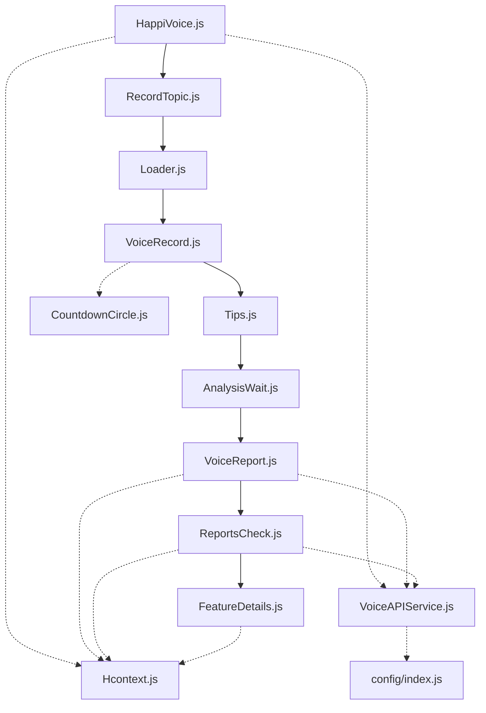
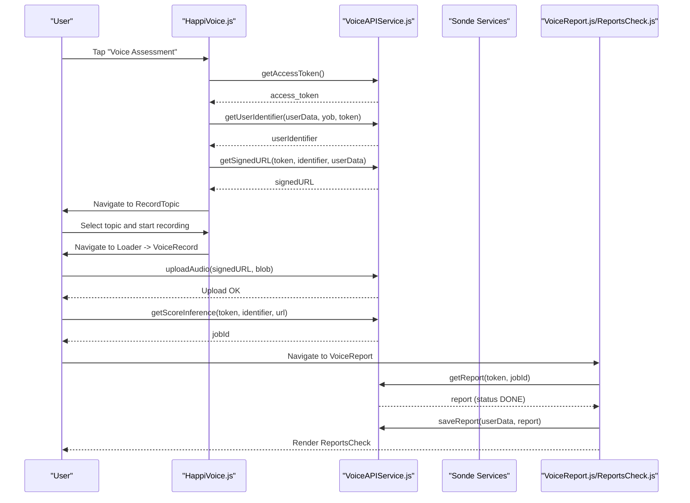
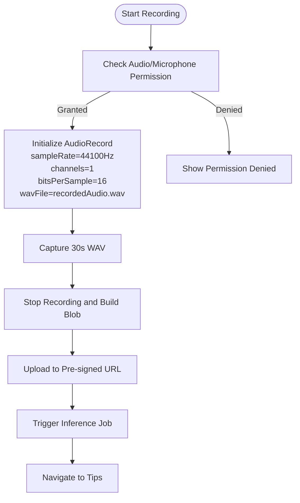
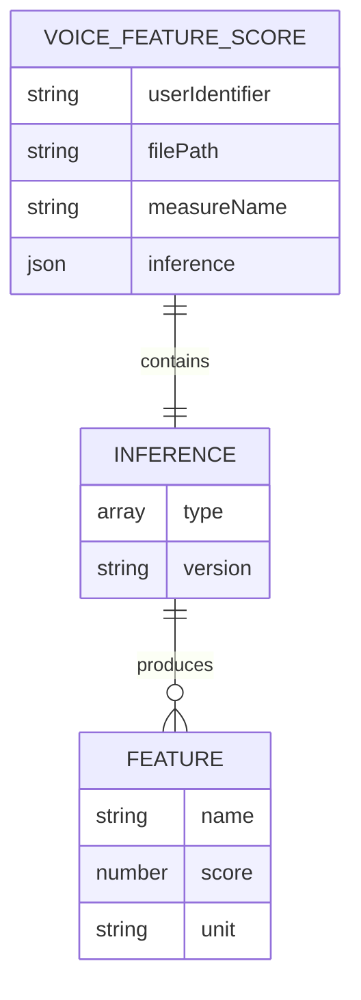
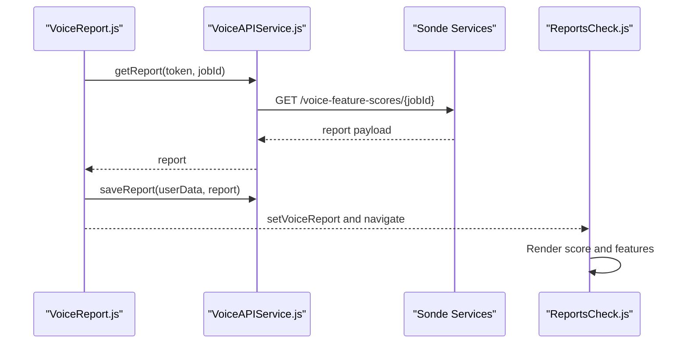
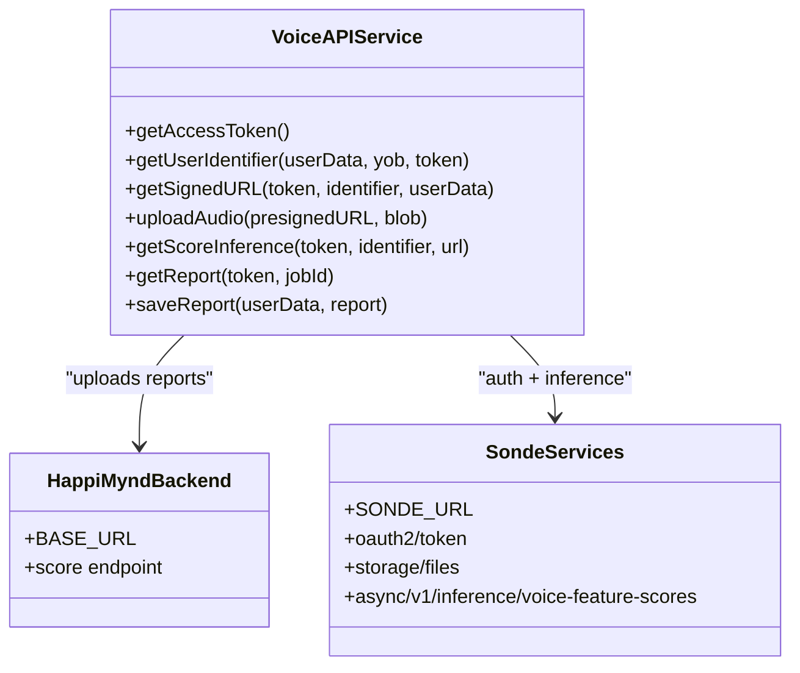
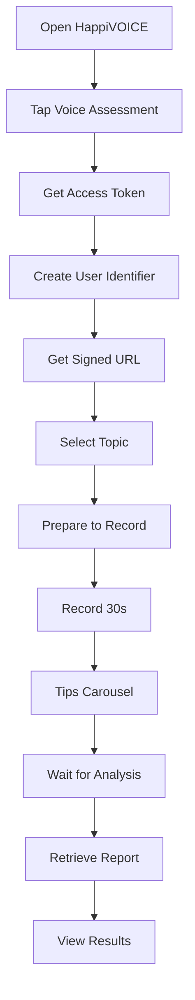
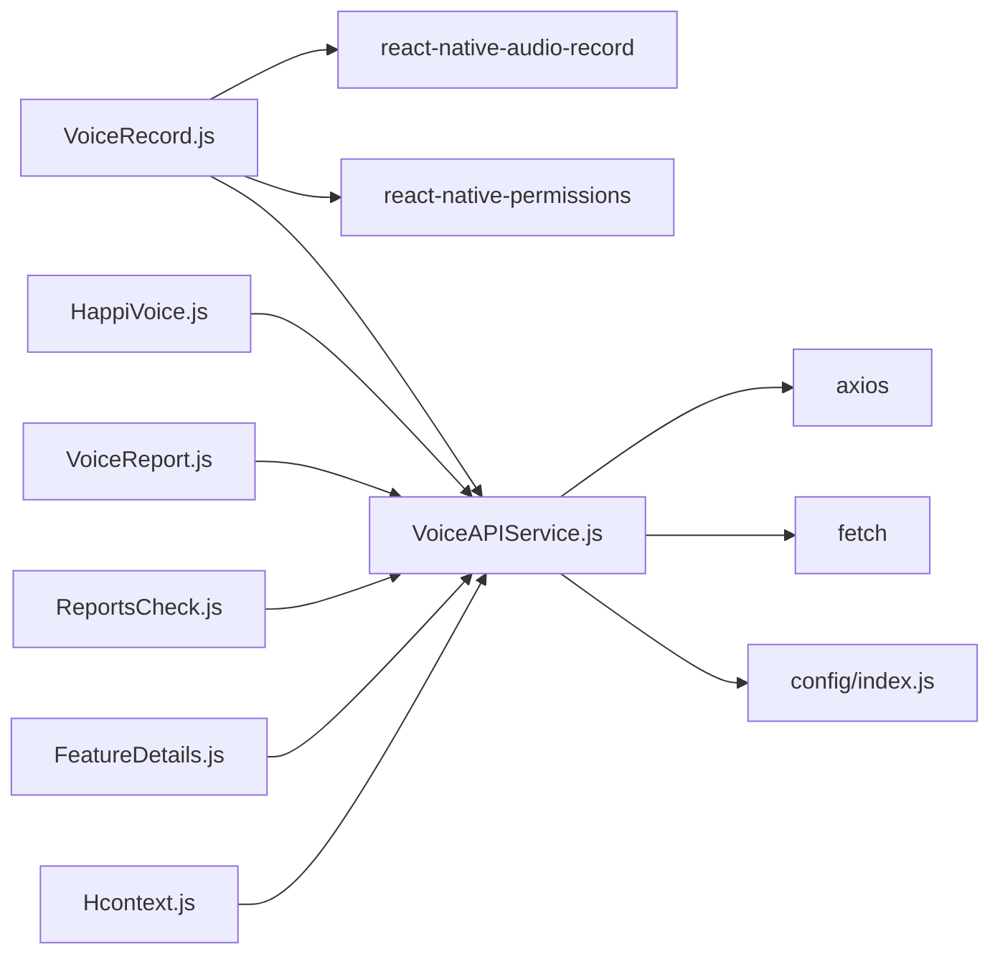

# HappiVOICE - Voice Analysis Module

<cite>
**Referenced Files in This Document**
- [HappiVoice.js](file://src/screens/HappiVOICE/HappiVoice.js)
- [VoiceRecord.js](file://src/screens/HappiVOICE/VoiceRecord.js)
- [VoiceAPIService.js](file://src/screens/HappiVOICE/VoiceAPIService.js)
- [VoiceReport.js](file://src/screens/HappiVOICE/VoiceReport.js)
- [RecordTopic.js](file://src/screens/HappiVOICE/RecordTopic.js)
- [Loader.js](file://src/screens/HappiVOICE/Loader.js)
- [AnalysisWait.js](file://src/screens/HappiVOICE/AnalysisWait.js)
- [Tips.js](file://src/screens/HappiVOICE/Tips.js)
- [ReportsCheck.js](file://src/screens/HappiVOICE/ReportsCheck.js)
- [FeatureDetails.js](file://src/screens/HappiVOICE/FeatureDetails.js)
- [CountdownCircle.js](file://src/screens/HappiVOICE/CountdownCircle.js)
- [index.js](file://src/assets/constants/index.js)
- [Hcontext.js](file://src/context/Hcontext.js)
- [index.js](file://src/config/index.js)
- [AudioCard.js](file://src/components/cards/AudioCard.js)
</cite>

## Table of Contents
1. [Introduction](#introduction)
2. [Project Structure](#project-structure)
3. [Core Components](#core-components)
4. [Architecture Overview](#architecture-overview)
5. [Detailed Component Analysis](#detailed-component-analysis)
6. [Dependency Analysis](#dependency-analysis)
7. [Performance Considerations](#performance-considerations)
8. [Troubleshooting Guide](#troubleshooting-guide)
9. [Privacy and Security Measures](#privacy-and-security-measures)
10. [Clinical Validation and Accuracy Metrics](#clinical-validation-and-accuracy-metrics)
11. [Interpretation Guidelines](#interpretation-guidelines)
12. [Subscription Model](#subscription-model)
13. [Conclusion](#conclusion)

## Introduction
HappiVOICE is the voice analysis module within HappiMynd designed to assess emotional health and cognitive function through brief 30-second voice recordings. It integrates with external voice analysis APIs and Sonde Services to deliver acoustic feature scores and actionable insights. The module supports guided recording prompts, secure audio upload via pre-signed URLs, asynchronous inference, and a comprehensive reporting interface with feature-level interpretations.

## Project Structure
The HappiVOICE module is organized around a clear user journey: assessment initiation, topic selection, recording preparation, audio capture, upload and inference, and report presentation. Supporting components include UI utilities, constants, and context providers for state management.

**Diagram sources**
- [HappiVoice.js:1-213](file://src/screens/HappiVOICE/HappiVoice.js#L1-L213)
- [RecordTopic.js:1-257](file://src/screens/HappiVOICE/RecordTopic.js#L1-L257)
- [Loader.js:1-146](file://src/screens/HappiVOICE/Loader.js#L1-L146)
- [VoiceRecord.js:1-245](file://src/screens/HappiVOICE/VoiceRecord.js#L1-L245)
- [Tips.js:1-74](file://src/screens/HappiVOICE/Tips.js#L1-L74)
- [AnalysisWait.js:1-70](file://src/screens/HappiVOICE/AnalysisWait.js#L1-L70)
- [VoiceReport.js:1-246](file://src/screens/HappiVOICE/VoiceReport.js#L1-L246)
- [ReportsCheck.js:1-282](file://src/screens/HappiVOICE/ReportsCheck.js#L1-L282)
- [FeatureDetails.js:1-306](file://src/screens/HappiVOICE/FeatureDetails.js#L1-L306)
- [CountdownCircle.js:1-48](file://src/screens/HappiVOICE/CountdownCircle.js#L1-L48)
- [VoiceAPIService.js:1-264](file://src/screens/HappiVOICE/VoiceAPIService.js#L1-L264)
- [index.js:1-13](file://src/config/index.js#L1-L13)
- [Hcontext.js:1-800](file://src/context/Hcontext.js#L1-L800)

**Section sources**
- [HappiVoice.js:1-213](file://src/screens/HappiVOICE/HappiVoice.js#L1-L213)
- [VoiceAPIService.js:1-264](file://src/screens/HappiVOICE/VoiceAPIService.js#L1-L264)
- [index.js:1-13](file://src/config/index.js#L1-L13)
- [Hcontext.js:1-800](file://src/context/Hcontext.js#L1-L800)

## Core Components
- HappiVoice: Entry screen presenting assessment details and initiating the flow.
- RecordTopic: Presents recorded topic prompts and allows custom topics.
- Loader: Countdown prior to recording.
- VoiceRecord: Handles audio permissions, starts/stops recording, captures WAV, and uploads to storage.
- Tips: Randomized tips during post-recording delay.
- AnalysisWait: Brief wait page before report retrieval.
- VoiceReport: Orchestrates report availability checks, subscription verification, and user verification states.
- ReportsCheck: Renders overall mental fitness score and feature list with interactive details.
- FeatureDetails: Provides detailed interpretation and ranges for each acoustic feature.
- VoiceAPIService: Encapsulates API interactions with HappiMynd backend and Sonde Services.
- Hcontext: Global state provider for tokens, identifiers, signed URLs, and reports.
- Constants: UI text and tips for voice assessment screens.

**Section sources**
- [HappiVoice.js:1-213](file://src/screens/HappiVOICE/HappiVoice.js#L1-L213)
- [RecordTopic.js:1-257](file://src/screens/HappiVOICE/RecordTopic.js#L1-L257)
- [Loader.js:1-146](file://src/screens/HappiVOICE/Loader.js#L1-L146)
- [VoiceRecord.js:1-245](file://src/screens/HappiVOICE/VoiceRecord.js#L1-L245)
- [Tips.js:1-74](file://src/screens/HappiVOICE/Tips.js#L1-L74)
- [AnalysisWait.js:1-70](file://src/screens/HappiVOICE/AnalysisWait.js#L1-L70)
- [VoiceReport.js:1-246](file://src/screens/HappiVOICE/VoiceReport.js#L1-L246)
- [ReportsCheck.js:1-282](file://src/screens/HappiVOICE/ReportsCheck.js#L1-L282)
- [FeatureDetails.js:1-306](file://src/screens/HappiVOICE/FeatureDetails.js#L1-L306)
- [VoiceAPIService.js:1-264](file://src/screens/HappiVOICE/VoiceAPIService.js#L1-L264)
- [Hcontext.js:1-800](file://src/context/Hcontext.js#L1-L800)
- [index.js:1-195](file://src/assets/constants/index.js#L1-L195)

## Architecture Overview
The HappiVOICE module follows a client-driven workflow:
- Initialization: User initiates assessment, retrieves access token, creates user identifier, obtains a pre-signed URL, and lists prompts.
- Recording: User selects a topic, prepares for recording, and records a 30-second WAV file.
- Upload and Inference: Audio is uploaded to cloud storage via pre-signed URL; Sonde Services performs asynchronous inference for acoustic features.
- Reporting: The app polls for completion, saves the report locally, and presents results with feature-level details.

**Diagram sources**
- [HappiVoice.js:112-165](file://src/screens/HappiVOICE/HappiVoice.js#L112-L165)
- [VoiceAPIService.js:26-201](file://src/screens/HappiVOICE/VoiceAPIService.js#L26-L201)
- [VoiceReport.js:117-155](file://src/screens/HappiVOICE/VoiceReport.js#L117-L155)
- [ReportsCheck.js:24-24](file://src/screens/HappiVOICE/ReportsCheck.js#L24-L24)

**Section sources**
- [HappiVoice.js:112-165](file://src/screens/HappiVOICE/HappiVoice.js#L112-L165)
- [VoiceAPIService.js:26-201](file://src/screens/HappiVOICE/VoiceAPIService.js#L26-L201)
- [VoiceReport.js:117-155](file://src/screens/HappiVOICE/VoiceReport.js#L117-L155)
- [ReportsCheck.js:24-24](file://src/screens/HappiVOICE/ReportsCheck.js#L24-L24)

## Detailed Component Analysis

### Audio Recording System
- Permissions and Setup: Requests microphone/audio permissions on Android and iOS before starting recording.
- Recording Configuration: Initializes audio recording with 44.1 kHz sample rate, mono channel, 16-bit depth, and WAV output.
- Capture and Blob Handling: Stops recording, constructs a Blob from the captured file, and stores it for upload.
- Submission Flow: Uploads the Blob to the pre-signed URL and triggers inference via Sonde Services.

**Diagram sources**
- [VoiceRecord.js:55-127](file://src/screens/HappiVOICE/VoiceRecord.js#L55-L127)
- [VoiceAPIService.js:129-151](file://src/screens/HappiVOICE/VoiceAPIService.js#L129-L151)

**Section sources**
- [VoiceRecord.js:55-127](file://src/screens/HappiVOICE/VoiceRecord.js#L55-L127)
- [CountdownCircle.js:1-48](file://src/screens/HappiVOICE/CountdownCircle.js#L1-L48)

### Voice Analysis Algorithms and Features
- Inference Type: Asynchronous acoustic inference labeled as "Acoustic v4".
- Target Metric: "mental-fitness" with a composite score derived from acoustic features.
- Feature Set: Smoothness, Liveliness, Control, Energy Range, Clarity, Crispness, Pause Duration, Speech Rate.
- Scoring Interpretation: Composite score mapped to categorical result bands; individual features carry units and ranges for contextualization.

**Diagram sources**
- [VoiceAPIService.js:154-185](file://src/screens/HappiVOICE/VoiceAPIService.js#L154-L185)
- [ReportsCheck.js:106-143](file://src/screens/HappiVOICE/ReportsCheck.js#L106-L143)

**Section sources**
- [VoiceAPIService.js:154-185](file://src/screens/HappiVOICE/VoiceAPIService.js#L154-L185)
- [ReportsCheck.js:106-143](file://src/screens/HappiVOICE/ReportsCheck.js#L106-L143)

### Report Generation and Presentation
- Availability Check: Polls Sonde Services for job completion and retrieves the report payload.
- Local Storage: Persists report data to HappiMynd backend for future access.
- UI Rendering: Displays overall mental fitness score with a radial indicator and a feature list. Each feature links to a detailed view with interpretation and acceptable ranges.

**Diagram sources**
- [VoiceReport.js:117-155](file://src/screens/HappiVOICE/VoiceReport.js#L117-L155)
- [VoiceAPIService.js:187-201](file://src/screens/HappiVOICE/VoiceAPIService.js#L187-L201)
- [ReportsCheck.js:24-149](file://src/screens/HappiVOICE/ReportsCheck.js#L24-L149)

**Section sources**
- [VoiceReport.js:117-155](file://src/screens/HappiVOICE/VoiceReport.js#L117-L155)
- [ReportsCheck.js:24-149](file://src/screens/HappiVOICE/ReportsCheck.js#L24-L149)

### Integration with External APIs and Sonde Services
- Authentication: OAuth2 client credentials flow against Sonde Services.
- User Identifier: Creates or retrieves a user identifier with demographic and device metadata.
- Storage: Uses pre-signed URLs for secure, direct uploads to cloud storage.
- Inference: Submits audio metadata for asynchronous acoustic scoring.
- Reporting: Retrieves inference results by job ID upon completion.

**Diagram sources**
- [VoiceAPIService.js:26-264](file://src/screens/HappiVOICE/VoiceAPIService.js#L26-L264)
- [index.js:1-13](file://src/config/index.js#L1-L13)

**Section sources**
- [VoiceAPIService.js:26-264](file://src/screens/HappiVOICE/VoiceAPIService.js#L26-L264)
- [index.js:1-13](file://src/config/index.js#L1-L13)

### User Workflow: From Recording to Report Delivery
- Assessment Entry: Review description and initiate flow.
- Prompt Selection: Choose a standardized topic or enter a custom topic.
- Preparation: Countdown and topic preview.
- Recording: 30-second capture with visual countdown.
- Post-recording: Tips carousel and automatic redirect to wait page.
- Report Retrieval: Wait page transitions to report screen upon completion.
- Results: Overall score and feature list with drill-down details.

**Diagram sources**
- [HappiVoice.js:112-165](file://src/screens/HappiVOICE/HappiVoice.js#L112-L165)
- [RecordTopic.js:148-154](file://src/screens/HappiVOICE/RecordTopic.js#L148-L154)
- [Loader.js:32-44](file://src/screens/HappiVOICE/Loader.js#L32-L44)
- [VoiceRecord.js:36-51](file://src/screens/HappiVOICE/VoiceRecord.js#L36-L51)
- [Tips.js:21-38](file://src/screens/HappiVOICE/Tips.js#L21-L38)
- [AnalysisWait.js:23-35](file://src/screens/HappiVOICE/AnalysisWait.js#L23-L35)
- [VoiceReport.js:117-155](file://src/screens/HappiVOICE/VoiceReport.js#L117-L155)
- [ReportsCheck.js:24-149](file://src/screens/HappiVOICE/ReportsCheck.js#L24-L149)

**Section sources**
- [HappiVoice.js:112-165](file://src/screens/HappiVOICE/HappiVoice.js#L112-L165)
- [RecordTopic.js:148-154](file://src/screens/HappiVOICE/RecordTopic.js#L148-L154)
- [Loader.js:32-44](file://src/screens/HappiVOICE/Loader.js#L32-L44)
- [VoiceRecord.js:36-51](file://src/screens/HappiVOICE/VoiceRecord.js#L36-L51)
- [Tips.js:21-38](file://src/screens/HappiVOICE/Tips.js#L21-L38)
- [AnalysisWait.js:23-35](file://src/screens/HappiVOICE/AnalysisWait.js#L23-L35)
- [VoiceReport.js:117-155](file://src/screens/HappiVOICE/VoiceReport.js#L117-L155)
- [ReportsCheck.js:24-149](file://src/screens/HappiVOICE/ReportsCheck.js#L24-L149)

## Dependency Analysis
- External Libraries: react-native-audio-record for native audio capture, react-native-permissions for runtime permissions, react-native-progress-circle for countdown UI, react-native-radial-slider for score visualization, expo-av for optional audio playback in other contexts.
- Network Layer: axios for HTTP requests; fetch for direct PUT to pre-signed URLs.
- State Management: Hcontext maintains tokens, identifiers, signed URLs, job IDs, and reports across screens.
- Configuration: Centralized base URLs for HappiMynd and Sonde Services.

**Diagram sources**
- [VoiceRecord.js:9-17](file://src/screens/HappiVOICE/VoiceRecord.js#L9-L17)
- [VoiceAPIService.js:1-9](file://src/screens/HappiVOICE/VoiceAPIService.js#L1-L9)
- [index.js:1-13](file://src/config/index.js#L1-L13)
- [Hcontext.js:1-800](file://src/context/Hcontext.js#L1-L800)

**Section sources**
- [VoiceRecord.js:9-17](file://src/screens/HappiVOICE/VoiceRecord.js#L9-L17)
- [VoiceAPIService.js:1-9](file://src/screens/HappiVOICE/VoiceAPIService.js#L1-L9)
- [index.js:1-13](file://src/config/index.js#L1-L13)
- [Hcontext.js:1-800](file://src/context/Hcontext.js#L1-L800)

## Performance Considerations
- Recording Quality: 44.1 kHz, 16-bit, mono ensures compatibility and reduces file size while preserving acoustic detail.
- Network Efficiency: Pre-signed URL uploads avoid proxying through the app server, minimizing latency and bandwidth usage.
- Asynchronous Inference: Offloads heavy computation to Sonde Services; the app polls for completion to keep UI responsive.
- UI Responsiveness: Countdown visuals and tip rotation occur on the UI thread; ensure timers are cleared on navigation to prevent leaks.

[No sources needed since this section provides general guidance]

## Troubleshooting Guide
- Permission Denial: If microphone or audio permissions are denied, recording will not start. Prompt users to enable permissions in system settings.
- Upload Failures: Verify pre-signed URL validity and network connectivity. Retry upload if the Blob is intact.
- Inference Not Ready: The report retrieval will fail until the job status reaches completion. Ensure polling logic runs until status indicates DONE.
- Subscription and Verification: Premium report access requires an active HappiVOICE subscription and verified phone number. Redirect accordingly if conditions are not met.

**Section sources**
- [VoiceRecord.js:65-79](file://src/screens/HappiVOICE/VoiceRecord.js#L65-L79)
- [VoiceAPIService.js:129-151](file://src/screens/HappiVOICE/VoiceAPIService.js#L129-L151)
- [VoiceReport.js:117-155](file://src/screens/HappiVOICE/VoiceReport.js#L117-L155)

## Privacy and Security Measures
- Data Handling: Audio is uploaded directly to cloud storage via pre-signed URLs, avoiding intermediate app servers.
- Authentication: OAuth2 client credentials are used for Sonde Services; tokens are scoped to storage and inference endpoints.
- Device Metadata: Minimal device and demographic data are sent to create user identifiers; ensure compliance with applicable privacy regulations.
- Secure Storage: Reports are persisted locally via HappiMynd backend after successful retrieval from Sonde Services.

**Section sources**
- [VoiceAPIService.js:26-88](file://src/screens/HappiVOICE/VoiceAPIService.js#L26-L88)
- [VoiceAPIService.js:89-151](file://src/screens/HappiVOICE/VoiceAPIService.js#L89-L151)
- [VoiceAPIService.js:187-201](file://src/screens/HappiVOICE/VoiceAPIService.js#L187-L201)

## Clinical Validation and Accuracy Metrics
- Feature Set: The module analyzes acoustic features aligned with established markers of mental fitness, including Smoothness, Liveliness, Control, Energy Range, Clarity, Crispness, Pause Duration, and Speech Rate.
- Interpretation Ranges: FeatureDetails provides acceptable ranges and contextual descriptions to guide interpretation.
- Composite Score: The overall mental fitness score is categorized into bands for quick assessment.

[No sources needed since this section synthesizes feature-level interpretation without quoting specific metrics]

## Interpretation Guidelines
- Healthcare Professionals:
  - Use the composite score as a screening indicator alongside clinical interviews.
  - Review feature trends over time to track changes in vocal dynamics.
  - Correlate findings with patient-reported outcomes and behavioral observations.
- Patients:
  - Treat the score as a daily snapshot of vocal health; consistency matters more than absolute values.
  - Pay attention to features flagged as “in-range” versus “needs attention.”
  - Use FeatureDetails to understand what changes in speech patterns might indicate.

**Section sources**
- [ReportsCheck.js:114-140](file://src/screens/HappiVOICE/ReportsCheck.js#L114-L140)
- [FeatureDetails.js:148-157](file://src/screens/HappiVOICE/FeatureDetails.js#L148-L157)

## Subscription Model
- Plans: HappiVOICE offers monthly and yearly subscription plans integrated with the HappiMynd billing system.
- Access Control: Users must have an active HappiVOICE subscription and verified phone number to access detailed reports.
- Navigation: If subscription is missing, the app navigates to the pricing screen to upgrade.

**Section sources**
- [VoiceReport.js:78-93](file://src/screens/HappiVOICE/VoiceReport.js#L78-L93)
- [VoiceReport.js:128-136](file://src/screens/HappiVOICE/VoiceReport.js#L128-L136)

## Conclusion
HappiVOICE delivers a streamlined, privacy-conscious pathway for daily vocal health monitoring. By combining robust audio capture, secure upload, asynchronous acoustic inference, and intuitive reporting, it empowers users to track changes in emotional and cognitive states. The module’s architecture supports scalability and maintainability while ensuring compliance with privacy expectations.