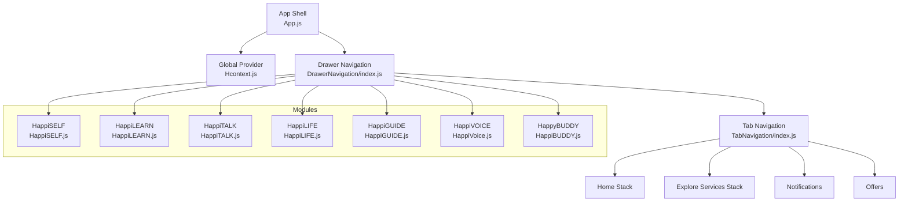
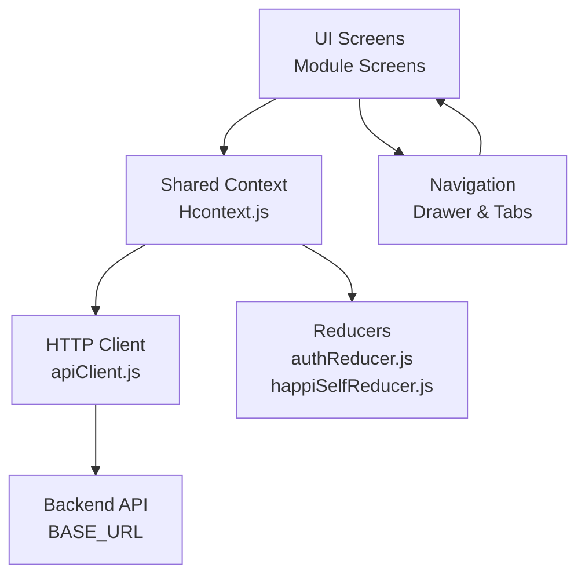
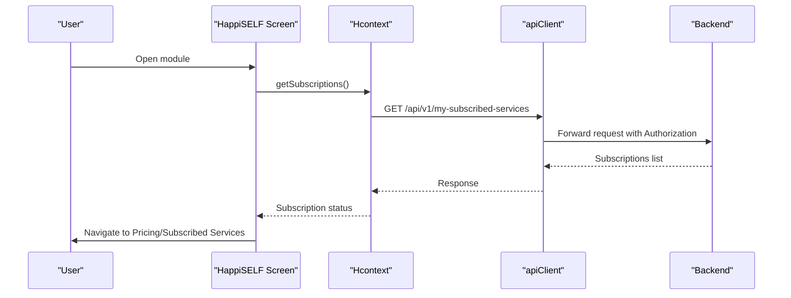
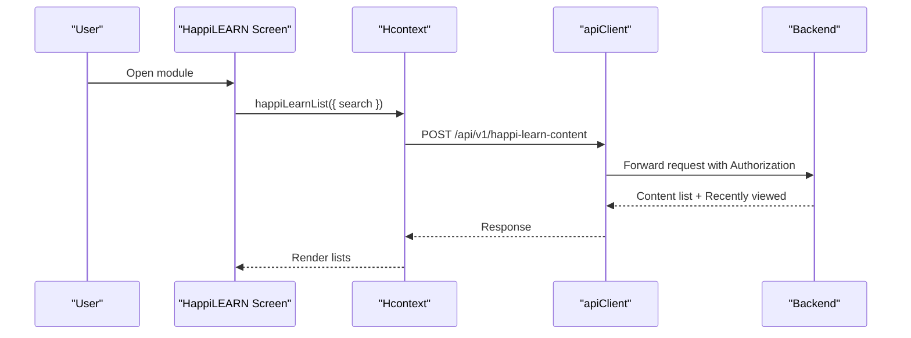
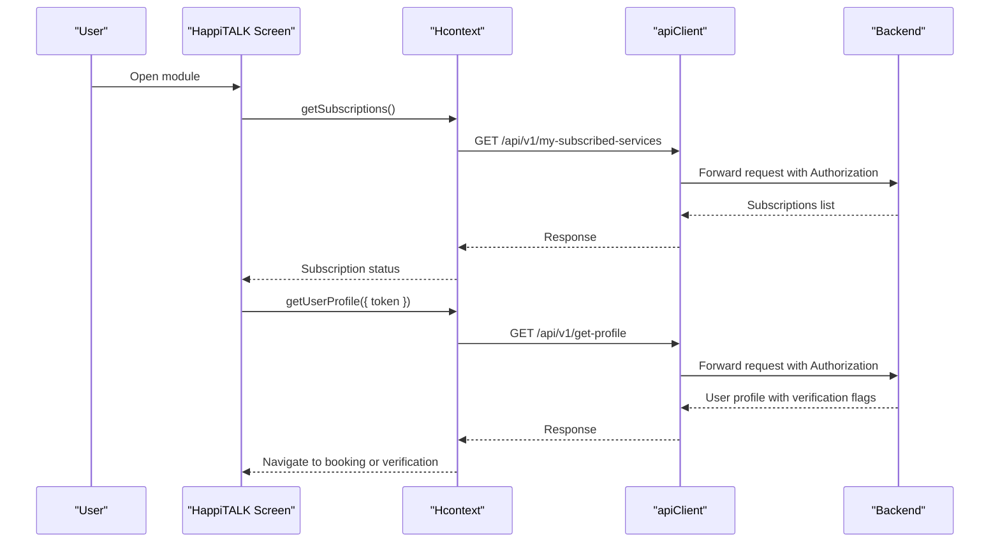
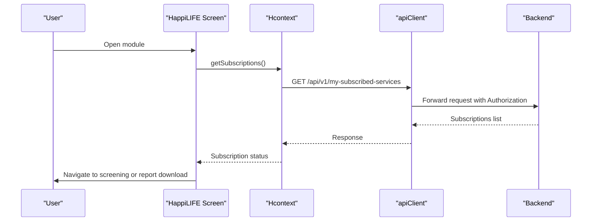
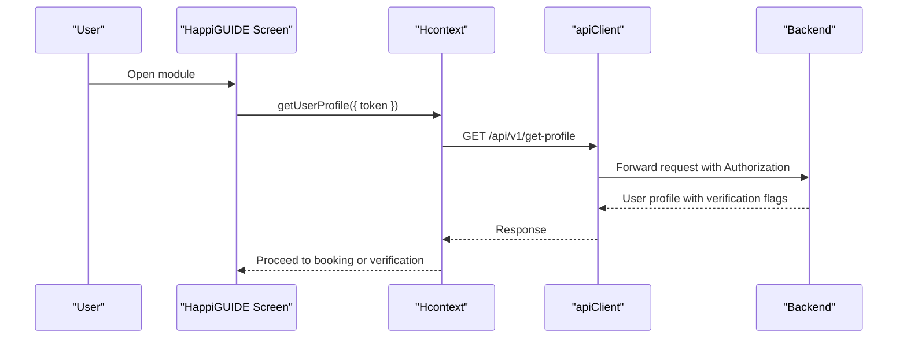
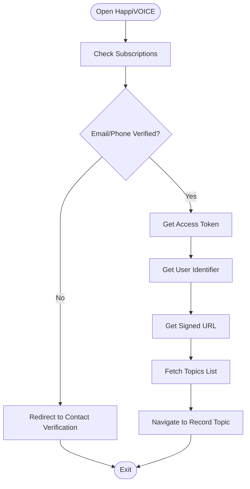
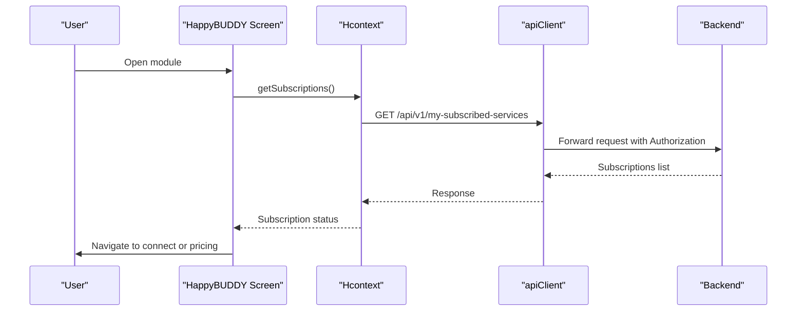
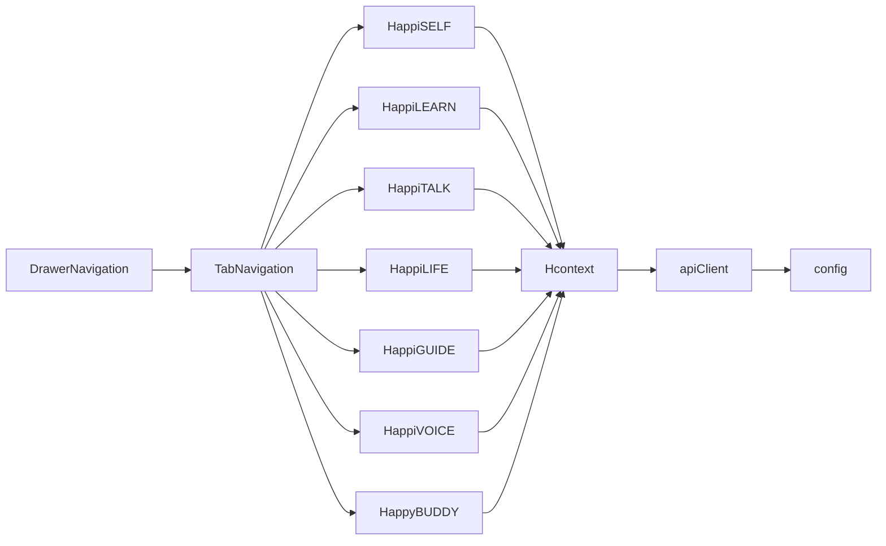

# Service Modules

<cite>
**Referenced Files in This Document**
- [App.js](file://App.js)
- [index.js](file://index.js)
- [src/config/index.js](file://src/config/index.js)
- [src/context/apiClient.js](file://src/context/apiClient.js)
- [src/context/Hcontext.js](file://src/context/Hcontext.js)
- [src/context/reducers/authReducer.js](file://src/context/reducers/authReducer.js)
- [src/context/reducers/happiSelfReducer.js](file://src/context/reducers/happiSelfReducer.js)
- [src/routes/TabNavigation/index.js](file://src/routes/TabNavigation/index.js)
- [src/routes/DrawerNavigation/index.js](file://src/routes/DrawerNavigation/index.js)
- [src/screens/HappiSELF/HappiSELF.js](file://src/screens/HappiSELF/HappiSELF.js)
- [src/screens/HappiLEARN/HappiLEARN.js](file://src/screens/HappiLEARN/HappiLEARN.js)
- [src/screens/HappiTALK/HappiTALK.js](file://src/screens/HappiTALK/HappiTALK.js)
- [src/screens/HappiLIFE/HappiLIFE.js](file://src/screens/HappiLIFE/HappiLIFE.js)
- [src/screens/HappiGUIDE/HappiGUIDE.js](file://src/screens/HappiGUIDE/HappiGUIDE.js)
- [src/screens/HappiVOICE/HappiVoice.js](file://src/screens/HappiVOICE/HappiVoice.js)
- [src/screens/HappyBUDDY/HappiBUDDY.js](file://src/screens/HappyBUDDY/HappiBUDDY.js)
</cite>

## Table of Contents
1. [Introduction](#introduction)
2. [Project Structure](#project-structure)
3. [Core Components](#core-components)
4. [Architecture Overview](#architecture-overview)
5. [Detailed Component Analysis](#detailed-component-analysis)
6. [Dependency Analysis](#dependency-analysis)
7. [Performance Considerations](#performance-considerations)
8. [Troubleshooting Guide](#troubleshooting-guide)
9. [Conclusion](#conclusion)
10. [Appendices](#appendices)

## Introduction
This document describes HappiMynd’s seven core service modules that compose the integrated mental health platform. Each module serves distinct user needs while operating within a unified navigation and authentication framework. The application follows a modular architecture enabling independent development and deployment of service components, with centralized authentication, analytics, and API communication handled through a shared context and HTTP client. Users navigate between modules via a bottom tab bar and a drawer-based navigation system, with cross-module integrations powered by shared state and API endpoints.

## Project Structure
The application entrypoint initializes the UI shell and provides a global provider that exposes shared state and APIs across screens. Navigation is organized into a bottom tab bar and a drawer menu, routing users to module-specific screens. Each module is implemented as a dedicated screen component that interacts with the shared context to perform authentication, subscriptions, assessments, and other backend operations.

**Diagram sources**
- [App.js:17-55](file://App.js#L17-L55)
- [src/routes/DrawerNavigation/index.js:39-284](file://src/routes/DrawerNavigation/index.js#L39-L284)
- [src/routes/TabNavigation/index.js:18-82](file://src/routes/TabNavigation/index.js#L18-L82)
- [src/screens/HappiSELF/HappiSELF.js:25-138](file://src/screens/HappiSELF/HappiSELF.js#L25-L138)
- [src/screens/HappiLEARN/HappiLEARN.js:66-226](file://src/screens/HappiLEARN/HappiLEARN.js#L66-L226)
- [src/screens/HappiTALK/HappiTALK.js:25-167](file://src/screens/HappiTALK/HappiTALK.js#L25-L167)
- [src/screens/HappiLIFE/HappiLIFE.js:25-142](file://src/screens/HappiLIFE/HappiLIFE.js#L25-L142)
- [src/screens/HappiGUIDE/HappiGUIDE.js:112-301](file://src/screens/HappiGUIDE/HappiGUIDE.js#L112-L301)
- [src/screens/HappiVOICE/HappiVoice.js:19-179](file://src/screens/HappiVOICE/HappiVoice.js#L19-L179)
- [src/screens/HappyBUDDY/HappiBUDDY.js:24-129](file://src/screens/HappyBUDDY/HappiBUDDY.js#L24-L129)

**Section sources**
- [App.js:17-55](file://App.js#L17-L55)
- [src/routes/DrawerNavigation/index.js:39-284](file://src/routes/DrawerNavigation/index.js#L39-L284)
- [src/routes/TabNavigation/index.js:18-82](file://src/routes/TabNavigation/index.js#L18-L82)

## Core Components
- Global Provider and State Management: Centralized state for authentication, subscriptions, notifications, and module-specific data (e.g., HappiSELF tasks) is managed via a provider and reducers. Authentication tokens are propagated to API requests automatically.
- API Client: A configured Axios client attaches bearer tokens and handles errors consistently across endpoints.
- Configuration: Base URLs for the backend, analytics, and third-party integrations are defined centrally.

Key responsibilities:
- Authentication and user lifecycle
- Subscription and pricing interactions
- Assessment orchestration and reporting
- Messaging and notifications
- Module-specific workflows (learning, therapy, voice analysis, peer support)

**Section sources**
- [src/context/Hcontext.js:26-102](file://src/context/Hcontext.js#L26-L102)
- [src/context/apiClient.js:6-58](file://src/context/apiClient.js#L6-L58)
- [src/config/index.js:1-13](file://src/config/index.js#L1-L13)

## Architecture Overview
The application enforces a modular architecture:
- Independent module screens consume shared context functions for authentication, subscriptions, assessments, and analytics.
- Navigation is decoupled from module logic; screens only trigger navigation actions.
- Backend integration is centralized through the API client and context functions, enabling independent deployments per module.

**Diagram sources**
- [src/context/Hcontext.js:26-102](file://src/context/Hcontext.js#L26-L102)
- [src/context/apiClient.js:6-58](file://src/context/apiClient.js#L6-L58)
- [src/config/index.js:1-13](file://src/config/index.js#L1-L13)
- [src/routes/DrawerNavigation/index.js:39-284](file://src/routes/DrawerNavigation/index.js#L39-L284)
- [src/routes/TabNavigation/index.js:18-82](file://src/routes/TabNavigation/index.js#L18-L82)

## Detailed Component Analysis

### HappiSELF
Purpose:
- Self-help and emotional resilience building through structured tasks and courses.

Target users:
- Individuals seeking guided self-reflection and habit-building tools.

Key functionality:
- Subscription gating to access module content.
- Navigation to subscribed services or pricing depending on subscription status.
- Integration with analytics for screen traffic.

Backend integration:
- Uses context functions for subscriptions and navigation.

**Diagram sources**
- [src/screens/HappiSELF/HappiSELF.js:44-57](file://src/screens/HappiSELF/HappiSELF.js#L44-L57)
- [src/context/Hcontext.js:639-647](file://src/context/Hcontext.js#L639-L647)
- [src/context/apiClient.js:12-44](file://src/context/apiClient.js#L12-L44)

**Section sources**
- [src/screens/HappiSELF/HappiSELF.js:25-138](file://src/screens/HappiSELF/HappiSELF.js#L25-L138)
- [src/context/Hcontext.js:639-647](file://src/context/Hcontext.js#L639-L647)

### HappiLEARN
Purpose:
- Curated learning content (articles, videos, infographics) tailored to user interests and recent activity.

Target users:
- Learners interested in mental health education and self-development.

Key functionality:
- Search and filter content.
- Display “Most Relevant” and “Recently Viewed” lists.
- Integration with analytics and content APIs.

Backend integration:
- Fetches content listings and manages search/filter state via context.

**Diagram sources**
- [src/screens/HappiLEARN/HappiLEARN.js:97-110](file://src/screens/HappiLEARN/HappiLEARN.js#L97-L110)
- [src/context/Hcontext.js:547-581](file://src/context/Hcontext.js#L547-L581)
- [src/context/apiClient.js:12-44](file://src/context/apiClient.js#L12-L44)

**Section sources**
- [src/screens/HappiLEARN/HappiLEARN.js:66-226](file://src/screens/HappiLEARN/HappiLEARN.js#L66-L226)
- [src/context/Hcontext.js:547-581](file://src/context/Hcontext.js#L547-L581)

### HappiTALK
Purpose:
- One-on-one expert therapy sessions with verification and booking workflows.

Target users:
- Users requiring professional therapeutic support.

Key functionality:
- Subscription gating and verification checks (email/mobile).
- Navigation to booking and contact verification flows.

Backend integration:
- Uses subscriptions, user profile retrieval, and verification helpers.

**Diagram sources**
- [src/screens/HappiTALK/HappiTALK.js:47-86](file://src/screens/HappiTALK/HappiTALK.js#L47-L86)
- [src/context/Hcontext.js:639-647](file://src/context/Hcontext.js#L639-L647)
- [src/context/Hcontext.js:293-301](file://src/context/Hcontext.js#L293-L301)
- [src/context/apiClient.js:12-44](file://src/context/apiClient.js#L12-L44)

**Section sources**
- [src/screens/HappiTALK/HappiTALK.js:25-167](file://src/screens/HappiTALK/HappiTALK.js#L25-L167)
- [src/context/Hcontext.js:293-301](file://src/context/Hcontext.js#L293-L301)

### HappiLIFE
Purpose:
- Awareness and screening tool to assess emotional wellbeing and guide next steps.

Target users:
- Users initiating their mental wellness journey.

Key functionality:
- Subscription gating and screening completion checks.
- Navigation to awareness tool or report download based on state.

Backend integration:
- Uses subscriptions and analytics for screen traffic.

**Diagram sources**
- [src/screens/HappiLIFE/HappiLIFE.js:46-62](file://src/screens/HappiLIFE/HappiLIFE.js#L46-L62)
- [src/context/Hcontext.js:639-647](file://src/context/Hcontext.js#L639-L647)
- [src/context/apiClient.js:12-44](file://src/context/apiClient.js#L12-L44)

**Section sources**
- [src/screens/HappiLIFE/HappiLIFE.js:25-142](file://src/screens/HappiLIFE/HappiLIFE.js#L25-L142)
- [src/context/Hcontext.js:639-647](file://src/context/Hcontext.js#L639-L647)

### HappiGUIDE
Purpose:
- Summary reading session with an emotional wellbeing expert following HappiLIFE awareness.

Target users:
- Users who completed HappiLIFE and want expert interpretation.

Key functionality:
- Session lookup and booking flow.
- Verification checks prior to booking.

Backend integration:
- Uses session retrieval and user profile verification.

**Diagram sources**
- [src/screens/HappiGUIDE/HappiGUIDE.js:161-183](file://src/screens/HappiGUIDE/HappiGUIDE.js#L161-L183)
- [src/context/Hcontext.js:293-301](file://src/context/Hcontext.js#L293-L301)
- [src/context/apiClient.js:12-44](file://src/context/apiClient.js#L12-L44)

**Section sources**
- [src/screens/HappiGUIDE/HappiGUIDE.js:112-301](file://src/screens/HappiGUIDE/HappiGUIDE.js#L112-L301)
- [src/context/Hcontext.js:293-301](file://src/context/Hcontext.js#L293-L301)

### HappiVOICE
Purpose:
- Voice-based emotional analysis and reporting via third-party integration.

Target users:
- Users interested in voice-based insights.

Key functionality:
- Subscription awareness and user verification.
- Integration with external voice analysis services for access token, user identifier, signed URL, and topics.

Backend integration:
- Uses subscriptions and user profile retrieval.
- Integrates with external Sonde services for voice analysis.

**Diagram sources**
- [src/screens/HappiVOICE/HappiVoice.js:45-80](file://src/screens/HappiVOICE/HappiVoice.js#L45-L80)
- [src/config/index.js:5-7](file://src/config/index.js#L5-L7)

**Section sources**
- [src/screens/HappiVOICE/HappiVoice.js:19-179](file://src/screens/HappiVOICE/HappiVoice.js#L19-L179)
- [src/config/index.js:5-7](file://src/config/index.js#L5-L7)

### HappyBUDDY
Purpose:
- Peer support and anonymous buddy chat for emotional connection.

Target users:
- Users seeking non-judgmental peer interaction.

Key functionality:
- Subscription gating and navigation to connect or pricing.

Backend integration:
- Uses subscriptions and analytics.

**Diagram sources**
- [src/screens/HappyBUDDY/HappiBUDDY.js:41-54](file://src/screens/HappyBUDDY/HappiBUDDY.js#L41-L54)
- [src/context/Hcontext.js:639-647](file://src/context/Hcontext.js#L639-L647)
- [src/context/apiClient.js:12-44](file://src/context/apiClient.js#L12-L44)

**Section sources**
- [src/screens/HappyBUDDY/HappiBUDDY.js:24-129](file://src/screens/HappyBUDDY/HappiBUDDY.js#L24-L129)
- [src/context/Hcontext.js:639-647](file://src/context/Hcontext.js#L639-L647)

## Dependency Analysis
- Navigation depends on Drawer and Tab navigators to route users to module screens.
- Module screens depend on the shared context for authentication, subscriptions, and backend operations.
- The API client depends on configuration for base URLs and attaches tokens from global or storage.

**Diagram sources**
- [src/routes/DrawerNavigation/index.js:39-284](file://src/routes/DrawerNavigation/index.js#L39-L284)
- [src/routes/TabNavigation/index.js:18-82](file://src/routes/TabNavigation/index.js#L18-L82)
- [src/screens/HappiSELF/HappiSELF.js:25-138](file://src/screens/HappiSELF/HappiSELF.js#L25-L138)
- [src/screens/HappiLEARN/HappiLEARN.js:66-226](file://src/screens/HappiLEARN/HappiLEARN.js#L66-L226)
- [src/screens/HappiTALK/HappiTALK.js:25-167](file://src/screens/HappiTALK/HappiTALK.js#L25-L167)
- [src/screens/HappiLIFE/HappiLIFE.js:25-142](file://src/screens/HappiLIFE/HappiLIFE.js#L25-L142)
- [src/screens/HappiGUIDE/HappiGUIDE.js:112-301](file://src/screens/HappiGUIDE/HappiGUIDE.js#L112-L301)
- [src/screens/HappiVOICE/HappiVoice.js:19-179](file://src/screens/HappiVOICE/HappiVoice.js#L19-L179)
- [src/screens/HappyBUDDY/HappiBUDDY.js:24-129](file://src/screens/HappyBUDDY/HappiBUDDY.js#L24-L129)
- [src/context/Hcontext.js:26-102](file://src/context/Hcontext.js#L26-L102)
- [src/context/apiClient.js:6-58](file://src/context/apiClient.js#L6-L58)
- [src/config/index.js:1-13](file://src/config/index.js#L1-L13)

**Section sources**
- [src/context/Hcontext.js:26-102](file://src/context/Hcontext.js#L26-L102)
- [src/context/apiClient.js:6-58](file://src/context/apiClient.js#L6-L58)
- [src/config/index.js:1-13](file://src/config/index.js#L1-L13)

## Performance Considerations
- Token caching: The API client caches tokens in memory to avoid repeated storage reads.
- Timeout configuration: Requests are bounded to prevent hanging operations.
- Conditional rendering: Loading states and early exits reduce unnecessary re-renders.
- Focus-driven data refresh: Some screens listen to navigation focus events to update content efficiently.

Recommendations:
- Implement pagination for content-heavy screens (e.g., HappiLEARN).
- Debounce search inputs to limit frequent backend calls.
- Use background sync for analytics and non-critical updates.

**Section sources**
- [src/context/apiClient.js:12-44](file://src/context/apiClient.js#L12-L44)
- [src/screens/HappiLEARN/HappiLEARN.js:87-95](file://src/screens/HappiLEARN/HappiLEARN.js#L87-L95)

## Troubleshooting Guide
Common issues and resolutions:
- Authentication failures: Errors during login or token acquisition are surfaced via snack notifications; ensure device token registration succeeds and permissions are granted.
- Subscription checks: If subscription status appears incorrect, verify backend responses and ensure the user is logged in.
- Assessment and reporting: Failures during assessment initiation or report retrieval are captured and shown to users; retry after verifying connectivity.
- Notifications: Ensure notification permissions are granted; otherwise, push tokens and notifications will not function.

Operational tips:
- Inspect request interceptors for Authorization headers and error logging.
- Validate base URLs and third-party endpoints (e.g., Sonde services).
- Monitor reducer state transitions for authentication and user updates.

**Section sources**
- [src/context/Hcontext.js:129-145](file://src/context/Hcontext.js#L129-L145)
- [src/context/Hcontext.js:382-401](file://src/context/Hcontext.js#L382-L401)
- [src/context/Hcontext.js:429-451](file://src/context/Hcontext.js#L429-L451)
- [src/context/apiClient.js:47-56](file://src/context/apiClient.js#L47-L56)
- [src/config/index.js:5-7](file://src/config/index.js#L5-L7)

## Conclusion
HappiMynd’s seven service modules are designed for modularity, scalability, and a consistent user experience. Shared context and API infrastructure enable independent development and deployment of each module while preserving seamless navigation and integrated workflows. Subscription and verification logic ensures appropriate access controls, and backend integration patterns provide robust communication with centralized services and third-party providers.

## Appendices

### Unified User Experience Across Modules
- Consistent navigation via drawer and tabs.
- Shared header components and styling constants.
- Centralized snack notifications and error handling.
- Analytics integration for screen traffic tracking.

**Section sources**
- [src/routes/DrawerNavigation/index.js:39-284](file://src/routes/DrawerNavigation/index.js#L39-L284)
- [src/routes/TabNavigation/index.js:18-82](file://src/routes/TabNavigation/index.js#L18-L82)
- [src/screens/HappiSELF/HappiSELF.js:60-135](file://src/screens/HappiSELF/HappiSELF.js#L60-L135)
- [src/screens/HappiLEARN/HappiLEARN.js:123-225](file://src/screens/HappiLEARN/HappiLEARN.js#L123-L225)
- [src/screens/HappiTALK/HappiTALK.js:89-165](file://src/screens/HappiTALK/HappiTALK.js#L89-L165)
- [src/screens/HappiLIFE/HappiLIFE.js:64-140](file://src/screens/HappiLIFE/HappiLIFE.js#L64-L140)
- [src/screens/HappiGUIDE/HappiGUIDE.js:186-300](file://src/screens/HappiGUIDE/HappiGUIDE.js#L186-L300)
- [src/screens/HappiVOICE/HappiVoice.js:83-179](file://src/screens/HappiVOICE/HappiVoice.js#L83-L179)
- [src/screens/HappyBUDDY/HappiBUDDY.js:56-128](file://src/screens/HappyBUDDY/HappiBUDDY.js#L56-L128)

### Backend Integration Patterns and Data Synchronization
- Authentication: Login, logout, and code-based login with device token propagation.
- Subscriptions: Centralized subscription retrieval and plan selection.
- Assessments: Start assessment, save answers, and retrieve reports.
- Messaging: Push notifications via FCM and chat message sending.
- Analytics: Screen traffic analytics via external service.

**Section sources**
- [src/context/Hcontext.js:129-172](file://src/context/Hcontext.js#L129-L172)
- [src/context/Hcontext.js:639-665](file://src/context/Hcontext.js#L639-L665)
- [src/context/Hcontext.js:382-451](file://src/context/Hcontext.js#L382-L451)
- [src/context/Hcontext.js:787-800](file://src/context/Hcontext.js#L787-L800)
- [src/context/Hcontext.js:80-102](file://src/context/Hcontext.js#L80-L102)

### Service Availability, Geographic Restrictions, and Compliance
- Service availability: Modules expose subscription gating and verification checks; backend determines eligibility and plan availability.
- Geographic restrictions: Not explicitly defined in the codebase; consult backend policies for region-specific offerings.
- Compliance: The application requests notification permissions and integrates with Firebase; ensure adherence to privacy and data protection regulations in deployment regions.

**Section sources**
- [src/screens/HappiTALK/HappiTALK.js:64-86](file://src/screens/HappiTALK/HappiTALK.js#L64-L86)
- [src/screens/HappiGUIDE/HappiGUIDE.js:161-183](file://src/screens/HappiGUIDE/HappiGUIDE.js#L161-L183)
- [src/context/Hcontext.js:80-102](file://src/context/Hcontext.js#L80-L102)

### Subscription and Payment Models
- Subscription retrieval: Centralized endpoint returns user’s subscribed services.
- Pricing and coupons: Plan selection and coupon application endpoints.
- Payments: Paid plans and free service access endpoints.

**Section sources**
- [src/context/Hcontext.js:639-665](file://src/context/Hcontext.js#L639-L665)
- [src/context/Hcontext.js:619-637](file://src/context/Hcontext.js#L619-L637)
- [src/context/Hcontext.js:649-665](file://src/context/Hcontext.js#L649-L665)