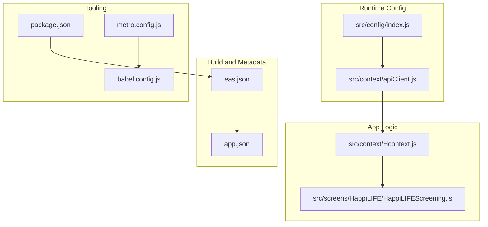
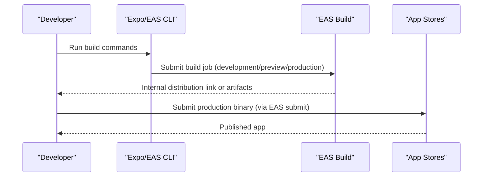
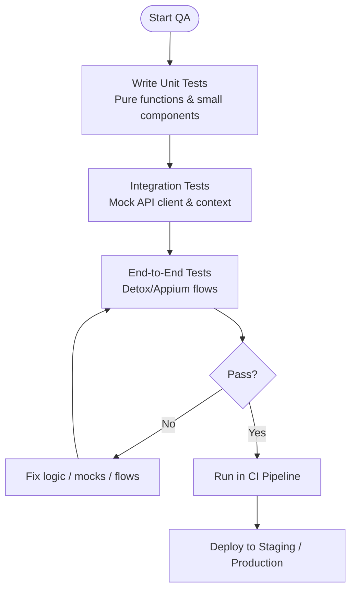
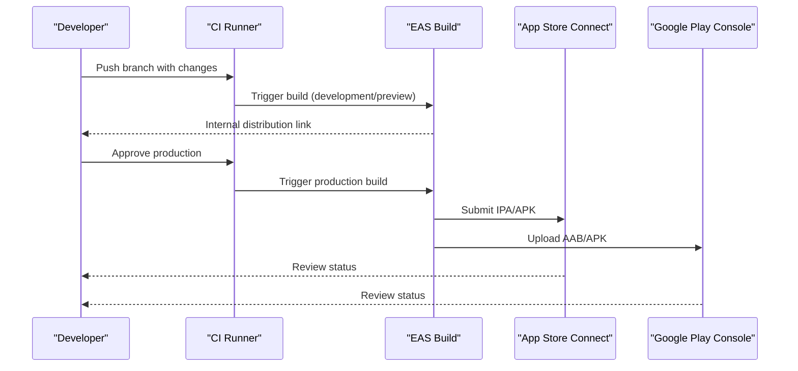
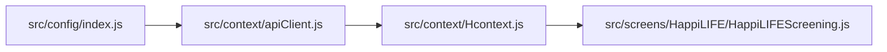
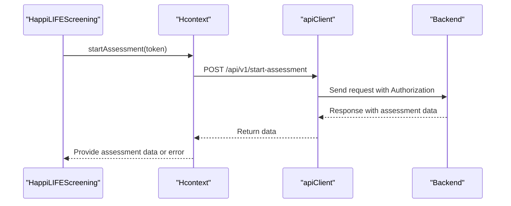

# Testing and Deployment

<cite>
**Referenced Files in This Document**
- [package.json](file://package.json)
- [eas.json](file://eas.json)
- [app.json](file://app.json)
- [test_endpoints.js](file://test_endpoints.js)
- [src/config/index.js](file://src/config/index.js)
- [src/context/apiClient.js](file://src/context/apiClient.js)
- [src/context/Hcontext.js](file://src/context/Hcontext.js)
- [src/screens/HappiLIFE/HappiLIFEScreening.js](file://src/screens/HappiLIFE/HappiLIFEScreening.js)
- [babel.config.js](file://babel.config.js)
- [metro.config.js](file://metro.config.js)
</cite>

## Table of Contents
1. [Introduction](#introduction)
2. [Project Structure](#project-structure)
3. [Core Components](#core-components)
4. [Architecture Overview](#architecture-overview)
5. [Detailed Component Analysis](#detailed-component-analysis)
6. [Dependency Analysis](#dependency-analysis)
7. [Performance Considerations](#performance-considerations)
8. [Troubleshooting Guide](#troubleshooting-guide)
9. [Conclusion](#conclusion)
10. [Appendices](#appendices)

## Introduction
This document describes HappiMynd’s testing and deployment processes with a focus on quality assurance, automated builds, staging and production releases, and operational post-release practices. It consolidates the current repository configuration for unit/integration/end-to-end testing, CI/CD via EAS Build and Expo Application Services, staging distribution, and production submission. Guidance is provided for extending the existing setup with formal unit tests, automated API validation, performance baselines, and security scanning.

## Project Structure
HappiMynd is an Expo-based React Native application. Key configuration and build artifacts relevant to testing and deployment include:
- Build and distribution configuration: eas.json
- App identity and metadata: app.json
- Scripts and dependencies: package.json
- API client and environment configuration: src/config/index.js, src/context/apiClient.js
- Example API usage and flows: src/context/Hcontext.js, src/screens/HappiLIFE/HappiLIFEScreening.js
- Metro bundler and Babel presets: metro.config.js, babel.config.js
- Manual API endpoint tester: test_endpoints.js

**Diagram sources**
- [eas.json:1-25](file://eas.json#L1-L25)
- [app.json:1-52](file://app.json#L1-L52)
- [src/config/index.js:1-13](file://src/config/index.js#L1-L13)
- [src/context/apiClient.js:1-58](file://src/context/apiClient.js#L1-L58)
- [src/context/Hcontext.js:361-414](file://src/context/Hcontext.js#L361-L414)
- [src/screens/HappiLIFE/HappiLIFEScreening.js:99-228](file://src/screens/HappiLIFE/HappiLIFEScreening.js#L99-L228)
- [package.json:1-101](file://package.json#L1-L101)
- [metro.config.js:1-5](file://metro.config.js#L1-L5)
- [babel.config.js:1-7](file://babel.config.js#L1-L7)

**Section sources**
- [eas.json:1-25](file://eas.json#L1-L25)
- [app.json:1-52](file://app.json#L1-L52)
- [package.json:1-101](file://package.json#L1-L101)
- [src/config/index.js:1-13](file://src/config/index.js#L1-L13)
- [src/context/apiClient.js:1-58](file://src/context/apiClient.js#L1-L58)
- [src/context/Hcontext.js:361-414](file://src/context/Hcontext.js#L361-L414)
- [src/screens/HappiLIFE/HappiLIFEScreening.js:99-228](file://src/screens/HappiLIFE/HappiLIFEScreening.js#L99-L228)
- [metro.config.js:1-5](file://metro.config.js#L1-L5)
- [babel.config.js:1-7](file://babel.config.js#L1-L7)

## Core Components
- EAS Build profiles define development, preview, and production distributions. Development builds enable internal distribution and Android Debug/ iOS Debug configurations. Preview builds target internal distribution. Production profile is empty and ready for final submission.
- App metadata and identifiers are centralized in app.json, including iOS bundle identifier, Android package name, versionCode/version, and permissions.
- API client encapsulates base URL, timeouts, and automatic Authorization header injection from persisted tokens.
- Environment configuration centralizes BASE_URL and third-party service URLs.
- Example API usage demonstrates assessment start flow and error handling in context and screen components.

**Section sources**
- [eas.json:5-24](file://eas.json#L5-L24)
- [app.json:17-35](file://app.json#L17-L35)
- [src/context/apiClient.js:1-58](file://src/context/apiClient.js#L1-L58)
- [src/config/index.js:1-13](file://src/config/index.js#L1-L13)
- [src/context/Hcontext.js:382-401](file://src/context/Hcontext.js#L382-L401)
- [src/screens/HappiLIFE/HappiLIFEScreening.js:120-151](file://src/screens/HappiLIFE/HappiLIFEScreening.js#L120-L151)

## Architecture Overview
The testing and deployment architecture integrates local development scripts, EAS Build for native binaries, and manual API validation. The app authenticates via a backend, obtains tokens, and invokes authenticated endpoints through the configured API client.

**Diagram sources**
- [eas.json:5-24](file://eas.json#L5-L24)
- [package.json:4-12](file://package.json#L4-L12)

## Detailed Component Analysis

### Testing Strategy
- Unit testing: The repository does not include Jest or React Native testing presets or test files. To establish unit tests:
  - Add Jest configuration via expo-jest preset or react-native preset.
  - Configure testMatch and transformIgnorePatterns in Jest config to align with Expo Metro.
  - Write unit tests for pure functions and small components using React Native Testing Library.
- Integration testing:
  - Use the existing API client and context to simulate authenticated flows.
  - Mock AsyncStorage and interceptors to isolate component logic.
  - Validate request/response shapes and error propagation.
- End-to-end testing:
  - Use Detox or Appium to automate user journeys (login, screening start, navigation).
  - Persist and restore test user sessions to avoid repeated auth steps.
  - Capture logs and screenshots on failure for diagnostics.

[No sources needed since this diagram shows conceptual workflow, not actual code structure]

### Test Environment Setup and Mock Data
- Environment configuration:
  - Centralized BASE_URL and analytics endpoints in src/config/index.js.
  - API client applies timeouts and attaches Authorization headers from persisted tokens.
- Mock data:
  - For unit/integration tests, create fixtures for API responses (authentication, assessments).
  - Use Jest spies or interceptors to stub axios responses and AsyncStorage reads.
- Manual API validation:
  - test_endpoints.js provides a script to exercise selected endpoints with optional auth token propagation.

**Section sources**
- [src/config/index.js:1-13](file://src/config/index.js#L1-L13)
- [src/context/apiClient.js:1-58](file://src/context/apiClient.js#L1-L58)
- [test_endpoints.js:1-70](file://test_endpoints.js#L1-L70)

### Automated Testing Pipelines
- Local scripts:
  - Expo scripts for start, android, ios, web, and build targets are defined in package.json.
- CI pipeline (recommended):
  - Install dependencies and run linters/tests before building.
  - Use EAS Build to produce development/preview artifacts.
  - Gate production submissions with test success and policy checks.
- Security scanning:
  - Integrate npm audit or Snyk in CI to scan dependencies.
  - Scan native Gradle and CocoaPods dependencies in CI jobs.

**Section sources**
- [package.json:4-12](file://package.json#L4-L12)
- [eas.json:5-24](file://eas.json#L5-L24)

### Continuous Integration and Continuous Deployment (CI/CD)
- EAS Build:
  - Development profile enables development clients and internal distribution for Android Debug and iOS Debug.
  - Preview profile targets internal distribution for pre-release testing.
  - Production profile is empty; configure submission targets and credentials as needed.
- Expo Application Services:
  - Use EAS submit to publish to Apple App Store Connect and Google Play Console.
  - Ensure app.json metadata and credentials are present for production builds.
- Versioning:
  - app.json defines iOS buildNumber and Android versionCode; increment per release.

**Diagram sources**
- [eas.json:5-24](file://eas.json#L5-L24)
- [app.json:23-32](file://app.json#L23-L32)

**Section sources**
- [eas.json:5-24](file://eas.json#L5-L24)
- [app.json:23-32](file://app.json#L23-L32)

### Staging Environment and Beta Distribution
- Internal distribution:
  - Use development and preview EAS profiles to distribute to testers.
  - Track build numbers and share links internally.
- Beta testing:
  - For Apple, consider TestFlight distribution via App Store Connect after successful submission.
  - For Google, use internal testing track or closed testing tracks via Play Console.

**Section sources**
- [eas.json:6-19](file://eas.json#L6-L19)

### Production Release Procedures
- Pre-submission checklist:
  - Validate app.json metadata (bundle identifiers, icons, permissions).
  - Confirm BASE_URL and third-party endpoints in src/config/index.js.
  - Ensure API client timeouts and error handling are appropriate.
- Submission:
  - Use EAS submit to upload to Apple and Google stores.
  - Provide store-specific metadata and compliance verifications as required.

**Section sources**
- [app.json:17-35](file://app.json#L17-L35)
- [src/config/index.js:1-13](file://src/config/index.js#L1-L13)
- [src/context/apiClient.js:1-58](file://src/context/apiClient.js#L1-L58)
- [eas.json:21-23](file://eas.json#L21-L23)

### Quality Assurance Processes
- Code coverage:
  - Enable coverage collection in Jest and enforce thresholds in CI.
- Accessibility:
  - Validate components with accessibility testing tools.
- Regression prevention:
  - Maintain a suite of integration tests that mirror user journeys (login, assessment start, navigation).

[No sources needed since this section provides general guidance]

### Performance Testing Strategies
- Baseline metrics:
  - Measure startup time, navigation latency, and API response times.
- Load simulation:
  - Use synthetic traffic to endpoints to detect regressions.
- Memory and CPU:
  - Monitor memory/CPU during long sessions and heavy navigation.

[No sources needed since this section provides general guidance]

### Security Scanning Implementation
- Dependency scanning:
  - Run npm audit or Snyk scans in CI to detect vulnerable packages.
- Secrets detection:
  - Scan for accidental commits of tokens or keys.
- Network security:
  - Ensure HTTPS endpoints and certificate pinning where applicable.

[No sources needed since this section provides general guidance]

### App Store Submission: iOS and Google Play
- iOS (Apple App Store):
  - Ensure app.json includes correct bundleIdentifier and buildNumber.
  - Use EAS submit to upload IPA to App Store Connect.
  - Provide required metadata and compliance documents.
- Google Play (Google Play Console):
  - Ensure app.json includes correct package and versionCode.
  - Use EAS submit to upload AAB/APK to Play Console.
  - Provide required metadata and compliance verifications.

**Section sources**
- [app.json:22-32](file://app.json#L22-L32)
- [eas.json:21-23](file://eas.json#L21-L23)

### Rollback Procedures
- Version rollback:
  - Maintain previous build artifacts and release notes.
  - Revert to prior production builds if critical issues are detected.
- Backend compatibility:
  - Coordinate with backend teams to roll back incompatible changes if needed.

[No sources needed since this section provides general guidance]

### Monitoring and Alerting
- Crash reporting:
  - Integrate crash reporting SDKs for React Native.
- Error tracking:
  - Log API errors and user-visible messages to centralized logging.
- Health checks:
  - Monitor key endpoints and push notification registration.

[No sources needed since this section provides general guidance]

### Post-Release Maintenance
- Hotfixes:
  - Use EAS Build to quickly patch critical issues.
- Feature toggles:
  - Use feature flags to disable problematic features until resolved.
- User feedback:
  - Collect and triage user-reported issues promptly.

[No sources needed since this section provides general guidance]

## Dependency Analysis
The app’s runtime depends on the API client and environment configuration to route requests to the live server. Authentication tokens are injected automatically, and error responses are normalized for consistent handling.

**Diagram sources**
- [src/config/index.js:1-13](file://src/config/index.js#L1-L13)
- [src/context/apiClient.js:1-58](file://src/context/apiClient.js#L1-L58)
- [src/context/Hcontext.js:382-401](file://src/context/Hcontext.js#L382-L401)
- [src/screens/HappiLIFE/HappiLIFEScreening.js:120-151](file://src/screens/HappiLIFE/HappiLIFEScreening.js#L120-L151)

**Section sources**
- [src/config/index.js:1-13](file://src/config/index.js#L1-L13)
- [src/context/apiClient.js:1-58](file://src/context/apiClient.js#L1-L58)
- [src/context/Hcontext.js:382-401](file://src/context/Hcontext.js#L382-L401)
- [src/screens/HappiLIFE/HappiLIFEScreening.js:120-151](file://src/screens/HappiLIFE/HappiLIFEScreening.js#L120-L151)

## Performance Considerations
- API timeouts:
  - The API client sets a 15-second timeout to prevent hanging requests.
- Startup and navigation:
  - Minimize heavy work on the main thread; defer non-critical tasks.
- Asset bundling:
  - Leverage Metro bundler defaults and asset patterns defined in app.json.

**Section sources**
- [src/context/apiClient.js:6-9](file://src/context/apiClient.js#L6-L9)
- [metro.config.js:1-5](file://metro.config.js#L1-L5)
- [app.json](file://app.json#L16)

## Troubleshooting Guide
- Authentication failures:
  - Verify Authorization header injection and persisted tokens.
  - Check error handling in context and screen components for user feedback.
- API connectivity:
  - Confirm BASE_URL and endpoint paths; validate timeouts and error normalization.
- Build issues:
  - Ensure EAS CLI version and build profiles match project configuration.

**Section sources**
- [src/context/apiClient.js:11-56](file://src/context/apiClient.js#L11-L56)
- [src/context/Hcontext.js:382-401](file://src/context/Hcontext.js#L382-L401)
- [src/screens/HappiLIFE/HappiLIFEScreening.js:120-151](file://src/screens/HappiLIFE/HappiLIFEScreening.js#L120-L151)
- [eas.json:2-4](file://eas.json#L2-L4)

## Conclusion
HappiMynd’s repository provides a solid foundation for testing and deployment using EAS Build and Expo Application Services. By adding unit and integration tests, establishing CI pipelines, and formalizing staging and production procedures, the team can improve reliability, accelerate releases, and maintain strong quality standards across iOS and Android.

## Appendices
- Example API usage flow:
  - The assessment start flow demonstrates authenticated endpoint invocation and error handling.

**Diagram sources**
- [src/screens/HappiLIFE/HappiLIFEScreening.js:120-151](file://src/screens/HappiLIFE/HappiLIFEScreening.js#L120-L151)
- [src/context/Hcontext.js:382-401](file://src/context/Hcontext.js#L382-L401)
- [src/context/apiClient.js:1-58](file://src/context/apiClient.js#L1-L58)