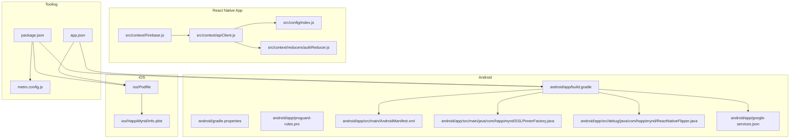
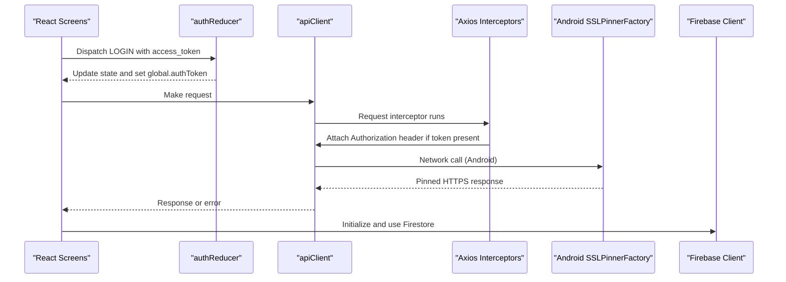
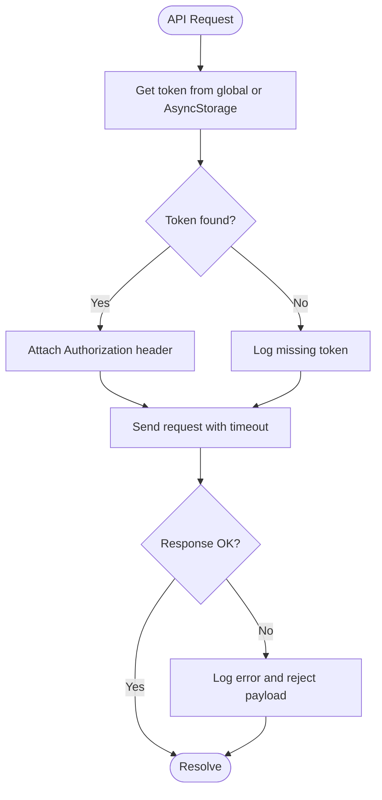
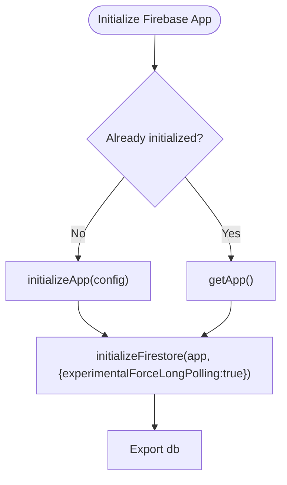
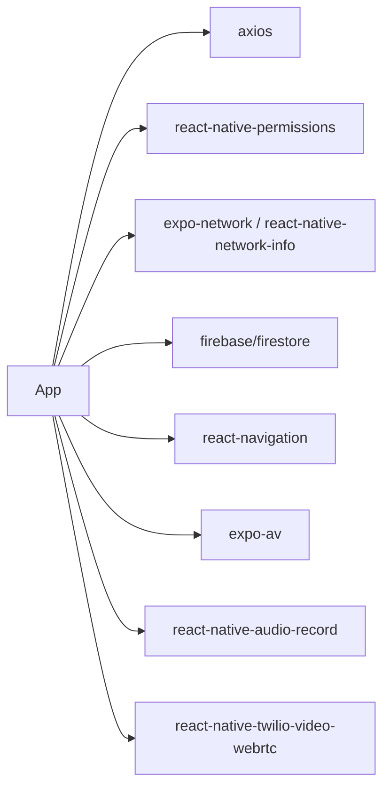

# Troubleshooting Guide

<cite>
**Referenced Files in This Document**
- [package.json](file://package.json)
- [metro.config.js](file://metro.config.js)
- [app.json](file://app.json)
- [android/app/build.gradle](file://android/app/build.gradle)
- [android/gradle.properties](file://android/gradle.properties)
- [android/app/proguard-rules.pro](file://android/app/proguard-rules.pro)
- [android/app/src/main/AndroidManifest.xml](file://android/app/src/main/AndroidManifest.xml)
- [android/app/src/main/java/com/happimynd/SSLPinnerFactory.java](file://android/app/src/main/java/com/happimynd/SSLPinnerFactory.java)
- [android/app/src/debug/java/com/happimynd/ReactNativeFlipper.java](file://android/app/src/debug/java/com/happimynd/ReactNativeFlipper.java)
- [ios/Podfile](file://ios/Podfile)
- [ios/HappiMynd/Info.plist](file://ios/HappiMynd/Info.plist)
- [src/config/index.js](file://src/config/index.js)
- [src/context/apiClient.js](file://src/context/apiClient.js)
- [src/context/Firebase.js](file://src/context/Firebase.js)
- [src/context/reducers/authReducer.js](file://src/context/reducers/authReducer.js)
- [android/app/google-services.json](file://android/app/google-services.json)
</cite>

## Table of Contents
1. [Introduction](#introduction)
2. [Project Structure](#project-structure)
3. [Core Components](#core-components)
4. [Architecture Overview](#architecture-overview)
5. [Detailed Component Analysis](#detailed-component-analysis)
6. [Dependency Analysis](#dependency-analysis)
7. [Performance Considerations](#performance-considerations)
8. [Troubleshooting Guide](#troubleshooting-guide)
9. [Conclusion](#conclusion)
10. [Appendices](#appendices)

## Introduction
This guide provides a comprehensive troubleshooting resource for HappiMynd across development, testing, and deployment phases. It covers build errors, dependency conflicts, platform-specific issues, authentication and API connectivity, Firebase integration, native module integration, permissions, memory and performance, crash analysis, and escalation procedures. The content is grounded in the repository’s configuration and source files to ensure accurate, actionable steps.

## Project Structure
HappiMynd is an Expo-based React Native project with native Android and iOS integrations. Key areas affecting troubleshooting:
- Build and packaging: Gradle, Metro, Expo configuration
- Platform permissions and security: Android Manifest, iOS Info.plist
- Networking and security: Axios client, SSL pinning, certificate policies
- Authentication and state: Auth reducer and global token caching
- Firebase integration: Client initialization and Firestore configuration
- Deployment metadata: EAS project ID, Google Services configuration

**Diagram sources**
- [package.json:1-101](file://package.json#L1-L101)
- [metro.config.js:1-5](file://metro.config.js#L1-L5)
- [app.json:1-52](file://app.json#L1-L52)
- [android/app/build.gradle:1-288](file://android/app/build.gradle#L1-L288)
- [android/gradle.properties:1-55](file://android/gradle.properties#L1-L55)
- [android/app/proguard-rules.pro:1-17](file://android/app/proguard-rules.pro#L1-L17)
- [android/app/src/main/AndroidManifest.xml:1-67](file://android/app/src/main/AndroidManifest.xml#L1-L67)
- [android/app/src/main/java/com/happimynd/SSLPinnerFactory.java:1-22](file://android/app/src/main/java/com/happimynd/SSLPinnerFactory.java#L1-L22)
- [android/app/src/debug/java/com/happimynd/ReactNativeFlipper.java:1-69](file://android/app/src/debug/java/com/happimynd/ReactNativeFlipper.java#L1-L69)
- [android/app/google-services.json:1-55](file://android/app/google-services.json#L1-L55)
- [ios/Podfile:1-124](file://ios/Podfile#L1-L124)
- [ios/HappiMynd/Info.plist:1-96](file://ios/HappiMynd/Info.plist#L1-L96)
- [src/config/index.js:1-13](file://src/config/index.js#L1-L13)
- [src/context/apiClient.js:1-58](file://src/context/apiClient.js#L1-L58)
- [src/context/Firebase.js:1-52](file://src/context/Firebase.js#L1-L52)
- [src/context/reducers/authReducer.js:1-79](file://src/context/reducers/authReducer.js#L1-L79)

**Section sources**
- [package.json:1-101](file://package.json#L1-L101)
- [metro.config.js:1-5](file://metro.config.js#L1-L5)
- [app.json:1-52](file://app.json#L1-L52)

## Core Components
- API client: Centralized HTTP client with request/response interceptors, token injection, and timeout configuration.
- Authentication reducer: Manages login state, guest mode, and global token caching for API requests.
- Firebase client: Initializes Firestore with long-polling fallback for RN compatibility.
- Android networking/security: SSL pinning factory and Flipper diagnostics for debug builds.
- iOS networking/security: App Transport Security exceptions and URL scheme configuration.
- Build configuration: Gradle and Expo settings, ProGuard rules, and platform permissions.

**Section sources**
- [src/context/apiClient.js:1-58](file://src/context/apiClient.js#L1-L58)
- [src/context/reducers/authReducer.js:1-79](file://src/context/reducers/authReducer.js#L1-L79)
- [src/context/Firebase.js:1-52](file://src/context/Firebase.js#L1-L52)
- [android/app/src/main/java/com/happimynd/SSLPinnerFactory.java:1-22](file://android/app/src/main/java/com/happimynd/SSLPinnerFactory.java#L1-L22)
- [android/app/src/debug/java/com/happimynd/ReactNativeFlipper.java:1-69](file://android/app/src/debug/java/com/happimynd/ReactNativeFlipper.java#L1-L69)
- [ios/HappiMynd/Info.plist:1-96](file://ios/HappiMynd/Info.plist#L1-L96)

## Architecture Overview
The app integrates React Native with native Android/iOS modules, secure HTTP communication, and Firebase services. The following diagram maps actual components and their relationships.

**Diagram sources**
- [src/context/reducers/authReducer.js:17-30](file://src/context/reducers/authReducer.js#L17-L30)
- [src/context/apiClient.js:11-44](file://src/context/apiClient.js#L11-L44)
- [android/app/src/main/java/com/happimynd/SSLPinnerFactory.java:9-22](file://android/app/src/main/java/com/happimynd/SSLPinnerFactory.java#L9-L22)
- [src/context/Firebase.js:33-51](file://src/context/Firebase.js#L33-L51)

## Detailed Component Analysis

### Android Build and Packaging
Common issues:
- Hermes/JSC engine mismatch
- ProGuard/R8 rules causing runtime crashes
- Debug vs release signing and manifest overrides
- Cleartext traffic and network security configuration

Resolution checklist:
- Confirm engine selection aligns with Gradle and Expo settings.
- Review ProGuard rules for reanimated, Hermes, SVG, and DevSupport classes.
- Validate signing configs and keystore environment variables.
- Ensure network security config allows intended domains and cleartext only when necessary.

**Section sources**
- [android/app/build.gradle:80-85](file://android/app/build.gradle#L80-L85)
- [android/gradle.properties:40-55](file://android/gradle.properties#L40-L55)
- [android/app/proguard-rules.pro:10-17](file://android/app/proguard-rules.pro#L10-L17)
- [android/app/build.gradle:154-186](file://android/app/build.gradle#L154-L186)
- [android/app/src/main/AndroidManifest.xml:35](file://android/app/src/main/AndroidManifest.xml#L35)

### iOS Build and Pods
Common issues:
- CocoaPods installation failures
- Hermes toggle mismatch
- FBReactNativeSpec cycle workaround
- Permission pods not linked

Resolution checklist:
- Run pod install with correct node/rn versions and use_flipper condition.
- Align Hermes flag with podfile_properties.
- Apply post-install workaround for FBReactNativeSpec if needed.
- Ensure permission pods are included and linked.

**Section sources**
- [ios/Podfile:65-81](file://ios/Podfile#L65-L81)
- [ios/Podfile:106-121](file://ios/Podfile#L106-L121)
- [ios/Podfile:19-87](file://ios/Podfile#L19-L87)

### API Connectivity and Authentication
Common issues:
- Missing Authorization header
- Token not persisted or cached globally
- Timeout exceeded or network errors
- CORS or backend availability

Resolution checklist:
- Verify global.authToken is set on LOGIN and cleared on LOGOUT.
- Ensure AsyncStorage retrieval fallback and caching in global.authToken.
- Increase timeout cautiously and add retry logic at caller level.
- Check BASE_URL and environment-specific endpoints.

**Diagram sources**
- [src/context/apiClient.js:11-56](file://src/context/apiClient.js#L11-L56)
- [src/context/reducers/authReducer.js:17-30](file://src/context/reducers/authReducer.js#L17-L30)

**Section sources**
- [src/context/apiClient.js:1-58](file://src/context/apiClient.js#L1-L58)
- [src/context/reducers/authReducer.js:17-30](file://src/context/reducers/authReducer.js#L17-L30)
- [src/config/index.js:1-13](file://src/config/index.js#L1-L13)

### Firebase Integration
Common issues:
- Firestore backend unreachable in RN
- Duplicate initialization on hot reload
- Incorrect project configuration

Resolution checklist:
- Keep long-polling enabled for RN Firestore.
- Handle duplicate app initialization gracefully.
- Verify google-services.json matches app bundle identifier.

**Diagram sources**
- [src/context/Firebase.js:33-51](file://src/context/Firebase.js#L33-L51)

**Section sources**
- [src/context/Firebase.js:1-52](file://src/context/Firebase.js#L1-L52)
- [android/app/google-services.json:1-55](file://android/app/google-services.json#L1-L55)

### Android Networking and Security
Common issues:
- SSL pinning mismatch
- Cleartext HTTP blocked
- Network security config conflicts

Resolution checklist:
- Verify certificate pins match the pinned hostname.
- Disable cleartext only if necessary and for limited domains.
- Ensure network security config aligns with app manifest.

**Section sources**
- [android/app/src/main/java/com/happimynd/SSLPinnerFactory.java:9-22](file://android/app/src/main/java/com/happimynd/SSLPinnerFactory.java#L9-L22)
- [android/app/src/main/AndroidManifest.xml:35](file://android/app/src/main/AndroidManifest.xml#L35)

### iOS Networking and Security
Common issues:
- ATS blocking development endpoints
- URL scheme not registered
- Unsupported deployment target

Resolution checklist:
- Add NSExceptionDomains for development servers in Info.plist.
- Confirm CFBundleURLSchemes includes the app scheme.
- Align deployment target with RN requirements.

**Section sources**
- [ios/HappiMynd/Info.plist:37-61](file://ios/HappiMynd/Info.plist#L37-L61)
- [ios/HappiMynd/Info.plist:23-31](file://ios/HappiMynd/Info.plist#L23-L31)

### Permissions and Platform-Specific Issues
Common issues:
- Missing runtime permissions
- Camera/Microphone usage descriptions
- Android backup and network permissions

Resolution checklist:
- Request permissions at runtime using react-native-permissions.
- Provide usage descriptions for camera and microphone.
- Confirm AndroidManifest permissions and feature declarations.

**Section sources**
- [android/app/src/main/AndroidManifest.xml:5-26](file://android/app/src/main/AndroidManifest.xml#L5-L26)
- [app.json:17-35](file://app.json#L17-L35)
- [ios/HappiMynd/Info.plist:64-67](file://ios/HappiMynd/Info.plist#L64-L67)

### Native Module Integration
Common issues:
- Pods not installed or linked
- Hermes-enabled mismatch
- Post-install script errors

Resolution checklist:
- Run pod install with correct node/rn versions.
- Toggle Hermes consistently across Gradle and Podfile.
- Apply post-install workarounds for RN 0.64 if needed.

**Section sources**
- [ios/Podfile:65-81](file://ios/Podfile#L65-L81)
- [ios/Podfile:106-121](file://ios/Podfile#L106-L121)
- [android/app/build.gradle:275-281](file://android/app/build.gradle#L275-L281)

## Dependency Analysis
Key external dependencies and their roles:
- Networking: axios, react-native-netinfo, expo-network
- Authentication: AsyncStorage, JWT tokens
- Firebase: firebase app/firestore, expo-firebase modules
- UI/Navigation: react-navigation stack and drawer
- Audio/Video: expo-av, react-native-audio-record, twilio-video-webrtc
- Permissions: react-native-permissions

**Diagram sources**
- [package.json:13-94](file://package.json#L13-L94)

**Section sources**
- [package.json:13-94](file://package.json#L13-L94)

## Performance Considerations
- Engine choice: Hermes vs JSC impacts startup and runtime performance; align Gradle and Podfile settings.
- Bundle size: Minimize unused assets and modules; review ProGuard rules.
- Network timeouts: Tune axios timeout to balance responsiveness and reliability.
- Memory: Avoid retaining large objects; clear global.authToken on logout.
- Diagnostics: Use Flipper for network inspection and React DevTools.

[No sources needed since this section provides general guidance]

## Troubleshooting Guide

### Build Errors
Symptoms:
- “Could not find” Gradle or RN modules
- CocoaPods install failures
- Hermes/JSC mismatch warnings

Steps:
- Clean caches and reinstall dependencies.
- For Android: sync Gradle, accept SDK licenses, and ensure JAVA_HOME is set.
- For iOS: run pod install with correct Xcode and Ruby versions; clean DerivedData if needed.
- Align Hermes flag in gradle.properties and Podfile.

**Section sources**
- [android/gradle.properties:40-55](file://android/gradle.properties#L40-L55)
- [ios/Podfile:65-81](file://ios/Podfile#L65-L81)

### Dependency Conflicts
Symptoms:
- Duplicate class errors
- ABI split conflicts
- Version mismatch warnings

Steps:
- Use AndroidX and Jetifier consistently.
- Align RN and Expo versions.
- Remove conflicting local or duplicate dependencies.

**Section sources**
- [android/gradle.properties:31-35](file://android/gradle.properties#L31-L35)
- [android/app/build.gradle:216-281](file://android/app/build.gradle#L216-L281)

### Platform-Specific Issues
Android:
- SSL pinning mismatch: verify certificate pins and hostname.
- Cleartext blocked: adjust network security config and manifest.
- Backup issues: confirm allowBackup=false and data extraction rules.

iOS:
- ATS exceptions: add NSExceptionDomains for dev endpoints.
- URL schemes: ensure CFBundleURLSchemes includes app scheme.
- Deployment target: align with RN 0.64 requirements.

**Section sources**
- [android/app/src/main/java/com/happimynd/SSLPinnerFactory.java:9-22](file://android/app/src/main/java/com/happimynd/SSLPinnerFactory.java#L9-L22)
- [android/app/src/main/AndroidManifest.xml:35](file://android/app/src/main/AndroidManifest.xml#L35)
- [ios/HappiMynd/Info.plist:37-61](file://ios/HappiMynd/Info.plist#L37-L61)
- [ios/HappiMynd/Info.plist:23-31](file://ios/HappiMynd/Info.plist#L23-L31)

### Authentication and API Connectivity
Symptoms:
- 401/403 Unauthorized
- Infinite loading or timeout
- Missing Authorization header

Steps:
- Ensure LOGIN dispatch sets global.authToken.
- Verify AsyncStorage token retrieval and caching.
- Confirm BASE_URL and environment endpoints.
- Increase axios timeout if needed; add retry logic at caller level.

**Section sources**
- [src/context/reducers/authReducer.js:17-30](file://src/context/reducers/authReducer.js#L17-L30)
- [src/context/apiClient.js:11-56](file://src/context/apiClient.js#L11-L56)
- [src/config/index.js:1-13](file://src/config/index.js#L1-L13)

### Firebase Integration Challenges
Symptoms:
- Firestore connection errors
- Duplicate app initialization errors

Steps:
- Keep long-polling enabled for RN.
- Handle duplicate initialization with getApp().
- Verify google-services.json and bundle identifiers.

**Section sources**
- [src/context/Firebase.js:33-51](file://src/context/Firebase.js#L33-L51)
- [android/app/google-services.json:1-55](file://android/app/google-services.json#L1-L55)

### Native Module Integration Issues
Symptoms:
- App fails to launch after adding a module
- Pods not linking or missing headers

Steps:
- Run pod install and rebuild.
- Ensure module is added to Podfile and linked.
- Apply RN 0.64 post-install workarounds if needed.

**Section sources**
- [ios/Podfile:65-81](file://ios/Podfile#L65-L81)
- [ios/Podfile:106-121](file://ios/Podfile#L106-L121)

### Permissions Problems
Symptoms:
- Camera/Microphone denied immediately
- No permission prompt

Steps:
- Request permissions at runtime using react-native-permissions.
- Provide usage descriptions in Info.plist and AndroidManifest.
- Test on physical devices for camera/microphone features.

**Section sources**
- [ios/HappiMynd/Info.plist:64-67](file://ios/HappiMynd/Info.plist#L64-L67)
- [android/app/src/main/AndroidManifest.xml:5-26](file://android/app/src/main/AndroidManifest.xml#L5-L26)

### Memory Management and Performance Bottlenecks
Symptoms:
- App sluggishness or ANRs
- Excessive memory usage

Steps:
- Avoid retaining large objects; clear global.authToken on logout.
- Use lazy loading for heavy components.
- Profile with Flipper and React DevTools; monitor network and memory.

**Section sources**
- [src/context/reducers/authReducer.js:65-74](file://src/context/reducers/authReducer.js#L65-L74)

### Crash Analysis and Error Reporting
Tools:
- Flipper: network, inspector, databases, shared preferences, crash reporter, Fresco.
- React DevTools: inspect component state and props.
- Console logs: API interceptor logs and Firebase initialization logs.

Steps:
- Enable Flipper in debug builds and attach network interceptor.
- Capture logs around failed requests and initialization.
- Use global.authToken and AsyncStorage logs to trace auth issues.

**Section sources**
- [android/app/src/debug/java/com/happimynd/ReactNativeFlipper.java:27-69](file://android/app/src/debug/java/com/happimynd/ReactNativeFlipper.java#L27-L69)
- [src/context/apiClient.js:34-50](file://src/context/apiClient.js#L34-L50)
- [src/context/Firebase.js:33-34](file://src/context/Firebase.js#L33-L34)

### Logging Strategies and Diagnostic Tools
- API client logs Authorization header presence and error payloads.
- Firebase logs app initialization status.
- Flipper network plugin captures HTTP traffic.
- Metro bundler logs and Expo CLI logs for build/run issues.

**Section sources**
- [src/context/apiClient.js:34-50](file://src/context/apiClient.js#L34-L50)
- [src/context/Firebase.js:33-34](file://src/context/Firebase.js#L33-L34)
- [metro.config.js:1-5](file://metro.config.js#L1-L5)

### Escalation Procedures for Complex Issues
- Collect logs from Flipper and console.
- Provide environment details: RN version, Expo SDK, OS versions, device model.
- Include relevant configuration excerpts: app.json, build.gradle, Podfile, Info.plist.
- Reproduce with minimal steps and share a diff of recent changes.

[No sources needed since this section provides general guidance]

## Conclusion
This guide consolidates actionable troubleshooting steps derived from HappiMynd’s configuration and source files. By aligning build settings, permissions, networking, authentication, and Firebase configuration, most issues can be resolved systematically. Use the provided diagrams and checklists to accelerate diagnosis and resolution.

## Appendices

### Quick Reference: Key Configuration Locations
- Android engine and signing: [android/gradle.properties:40-55](file://android/gradle.properties#L40-L55), [android/app/build.gradle:154-186](file://android/app/build.gradle#L154-L186)
- iOS Hermes and post-install: [ios/Podfile:65-81](file://ios/Podfile#L65-81), [ios/Podfile:106-121](file://ios/Podfile#L106-121)
- API base URL and timeouts: [src/config/index.js:1-13](file://src/config/index.js#L1-L13), [src/context/apiClient.js:6-9](file://src/context/apiClient.js#L6-L9)
- Auth token caching: [src/context/reducers/authReducer.js:17-30](file://src/context/reducers/authReducer.js#L17-30), [src/context/apiClient.js:11-44](file://src/context/apiClient.js#L11-L44)
- Firebase long-polling: [src/context/Firebase.js:37-49](file://src/context/Firebase.js#L37-L49)
- SSL pinning: [android/app/src/main/java/com/happimynd/SSLPinnerFactory.java:9-22](file://android/app/src/main/java/com/happimynd/SSLPinnerFactory.java#L9-L22)
- Flipper diagnostics: [android/app/src/debug/java/com/happimynd/ReactNativeFlipper.java:27-69](file://android/app/src/debug/java/com/happimynd/ReactNativeFlipper.java#L27-69)
- Android permissions and network: [android/app/src/main/AndroidManifest.xml:5-26](file://android/app/src/main/AndroidManifest.xml#L5-L26)
- iOS ATS and URL schemes: [ios/HappiMynd/Info.plist:37-61](file://ios/HappiMynd/Info.plist#L37-61), [ios/HappiMynd/Info.plist:23-31](file://ios/HappiMynd/Info.plist#L23-31)
- Expo/EAS metadata: [app.json:45-49](file://app.json#L45-L49)