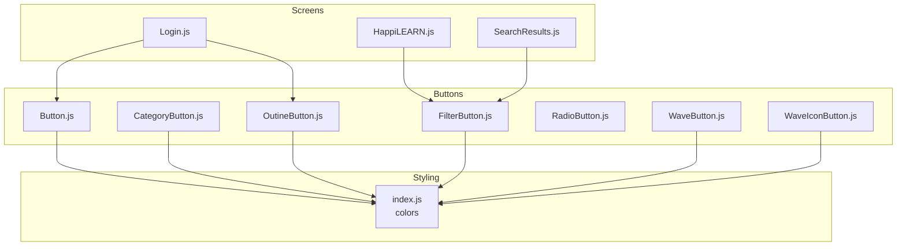
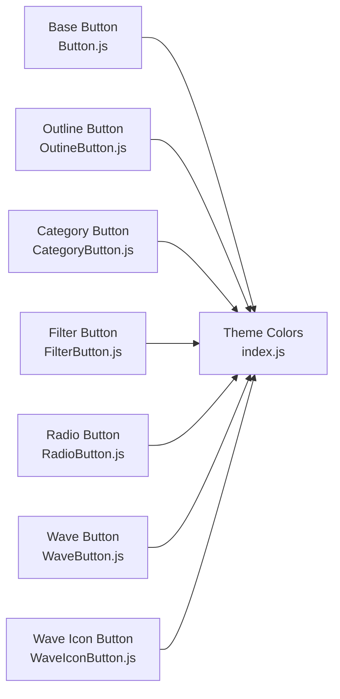
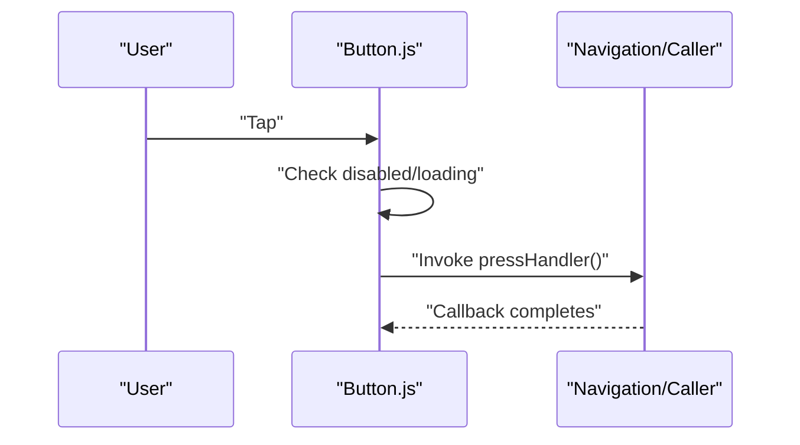
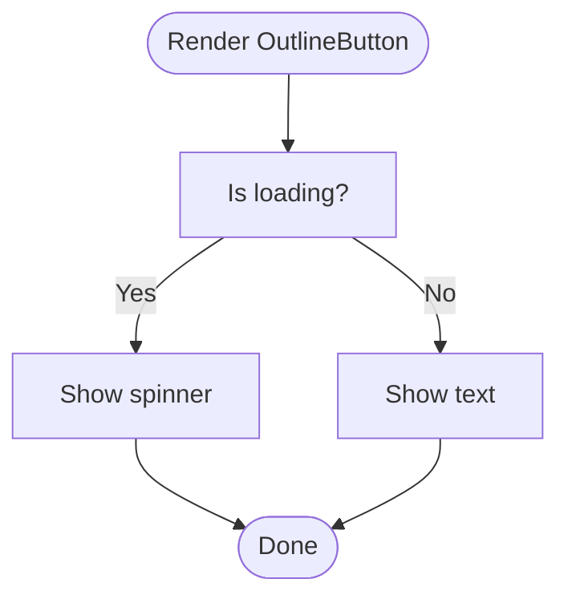
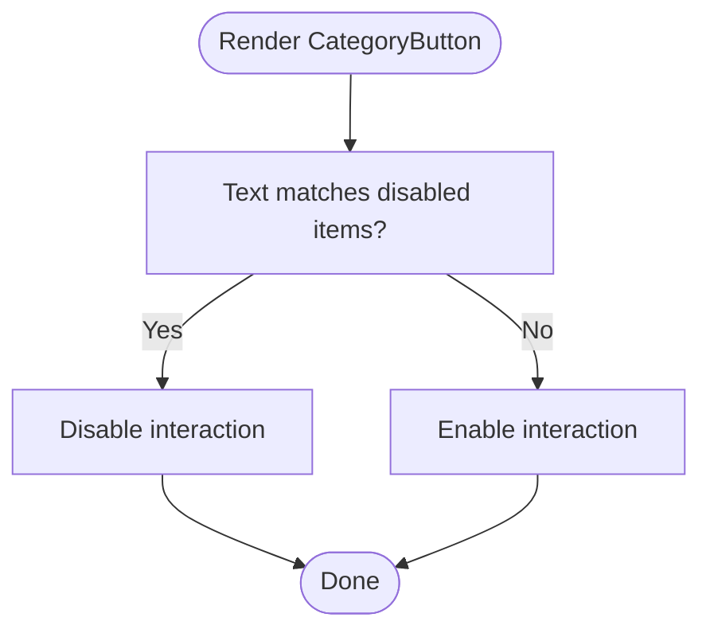
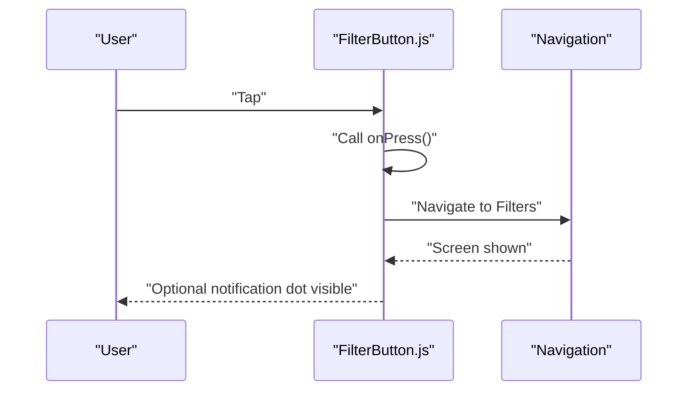
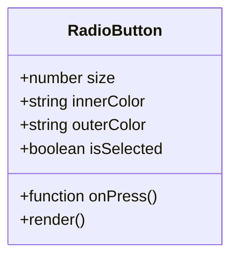
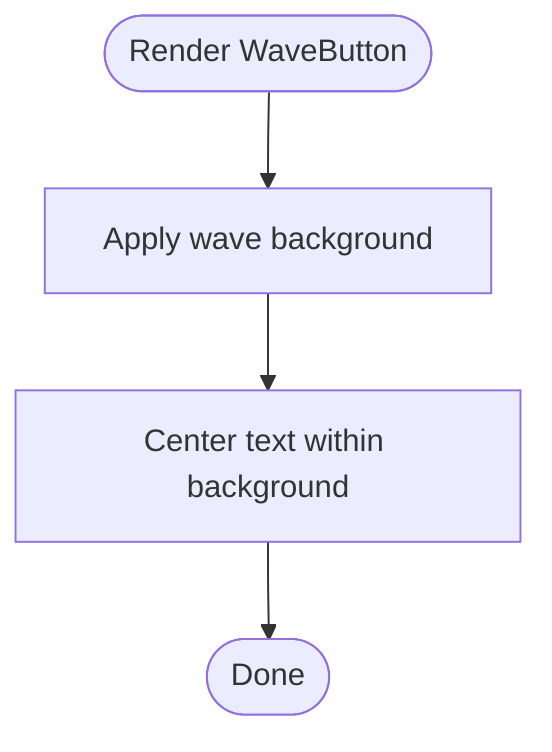
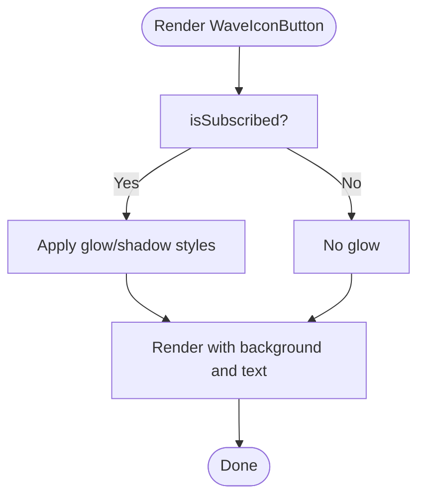
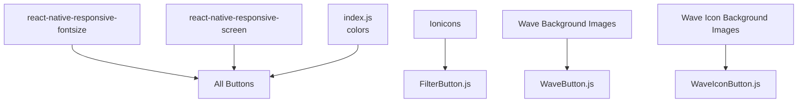

# Button Components

<cite>
**Referenced Files in This Document**
- [Button.js](file://src/components/buttons/Button.js)
- [CategoryButton.js](file://src/components/buttons/CategoryButton.js)
- [FilterButton.js](file://src/components/buttons/FilterButton.js)
- [OutineButton.js](file://src/components/buttons/OutineButton.js)
- [RadioButton.js](file://src/components/buttons/RadioButton.js)
- [WaveButton.js](file://src/components/buttons/WaveButton.js)
- [WaveIconButton.js](file://src/components/buttons/WaveIconButton.js)
- [index.js](file://src/assets/constants/index.js)
- [Login.js](file://src/screens/Auth/Login.js)
- [HappiLEARN.js](file://src/screens/HappiLEARN/HappiLEARN.js)
- [SearchResults.js](file://src/screens/HappiLEARN/SearchResults.js)
</cite>

## Table of Contents
1. [Introduction](#introduction)
2. [Project Structure](#project-structure)
3. [Core Components](#core-components)
4. [Architecture Overview](#architecture-overview)
5. [Detailed Component Analysis](#detailed-component-analysis)
6. [Dependency Analysis](#dependency-analysis)
7. [Performance Considerations](#performance-considerations)
8. [Accessibility Considerations](#accessibility-considerations)
9. [Usage Guidelines](#usage-guidelines)
10. [Troubleshooting Guide](#troubleshooting-guide)
11. [Conclusion](#conclusion)

## Introduction
This document describes the button component family used across HappiMynd. It covers the base Button component, CategoryButton for service selection, FilterButton for search and filtering, OutlineButton for secondary actions, RadioButton for single selection, and two animated variants: WaveButton and WaveIconButton. For each component, we explain props, behavior, styling, interaction patterns, accessibility considerations, and recommended usage contexts.

## Project Structure
The button components live under src/components/buttons/. They rely on:
- Responsive sizing utilities for consistent scaling across devices
- A centralized color palette for theme-consistent visuals
- Navigation helpers for filter-related actions

**Diagram sources**
- [Button.js:1-58](file://src/components/buttons/Button.js#L1-L58)
- [CategoryButton.js:1-69](file://src/components/buttons/CategoryButton.js#L1-L69)
- [FilterButton.js:1-61](file://src/components/buttons/FilterButton.js#L1-L61)
- [OutineButton.js:1-55](file://src/components/buttons/OutineButton.js#L1-L55)
- [RadioButton.js:1-62](file://src/components/buttons/RadioButton.js#L1-L62)
- [WaveButton.js:1-54](file://src/components/buttons/WaveButton.js#L1-L54)
- [WaveIconButton.js:1-107](file://src/components/buttons/WaveIconButton.js#L1-L107)
- [index.js:1-195](file://src/assets/constants/index.js#L1-L195)
- [Login.js:130-271](file://src/screens/Auth/Login.js#L130-L271)
- [HappiLEARN.js:20-219](file://src/screens/HappiLEARN/HappiLEARN.js#L20-L219)
- [SearchResults.js:20-219](file://src/screens/HappiLEARN/SearchResults.js#L20-L219)

**Section sources**
- [Button.js:1-58](file://src/components/buttons/Button.js#L1-L58)
- [index.js:1-195](file://src/assets/constants/index.js#L1-L195)
- [Login.js:130-271](file://src/screens/Auth/Login.js#L130-L271)
- [HappiLEARN.js:20-219](file://src/screens/HappiLEARN/HappiLEARN.js#L20-L219)
- [SearchResults.js:20-219](file://src/screens/HappiLEARN/SearchResults.js#L20-L219)

## Core Components
This section summarizes the base and specialized button components, focusing on props, behavior, and styling.

- Base Button
  - Purpose: Primary action button with optional loading state and disabled behavior.
  - Key props: text, pressHandler, loading, disabled.
  - Behavior: Renders a rounded touchable area with centered text; shows a spinner when loading; disables interaction when loading or disabled.
  - Styling: Uses primary background color and responsive sizing; text styled with a specific font family and size.
  - Accessibility: Inherits RN touchable opacity and disabled semantics.

- OutlineButton
  - Purpose: Secondary action with bordered appearance and transparent fill.
  - Key props: text, pressHandler, loading.
  - Behavior: Similar to base Button but styled with a border and background matching the theme.
  - Styling: Border and text color aligned with theme; responsive sizing.

- CategoryButton
  - Purpose: Visual category selection with iconography and background framing.
  - Key props: text, icon, iconSize, pressHandler.
  - Behavior: Wraps an icon inside a framed background; certain items are disabled via text matching.
  - Styling: Fixed-size background frame and proportional icon sizing; text styled with a smaller font.

- FilterButton
  - Purpose: Filter trigger with optional notification indicator.
  - Key props: navigation, notification, onPress.
  - Behavior: Renders a bordered container with an icon; displays a small dot when notification is true; navigates to filters by default.
  - Styling: White background with themed borders and a small active dot positioned absolutely.

- RadioButton
  - Purpose: Single-selection control with customizable size and colors.
  - Key props: size, innerColor, outerColor, isSelected, onPress.
  - Behavior: Displays an outer ring and an inner dot when selected; triggers onPress on interaction.
  - Styling: Outer ring and inner dot computed from size multipliers; center-aligned.

- WaveButton
  - Purpose: Decorative, wave-shaped button with background image and centered text.
  - Key props: width, height, text, pressHandler.
  - Behavior: Uses an image background to achieve a wave shape; centers text within the background bounds.
  - Styling: Background image sizing via responsive units; text styled with a medium font.

- WaveIconButton
  - Purpose: Icon-and-text button with wave background and optional glow for subscription state.
  - Key props: text, subText, icon, width, height, isSubscribed, pressHandler.
  - Behavior: Displays an icon and two lines of text layered over a wave background; applies a glow/shadow effect when subscribed.
  - Styling: Icon and text sections arranged with flexible layout; glow achieved via shadow and background.

**Section sources**
- [Button.js:18-58](file://src/components/buttons/Button.js#L18-L58)
- [OutineButton.js:18-55](file://src/components/buttons/OutineButton.js#L18-L55)
- [CategoryButton.js:16-69](file://src/components/buttons/CategoryButton.js#L16-L69)
- [FilterButton.js:13-61](file://src/components/buttons/FilterButton.js#L13-L61)
- [RadioButton.js:9-62](file://src/components/buttons/RadioButton.js#L9-L62)
- [WaveButton.js:14-54](file://src/components/buttons/WaveButton.js#L14-L54)
- [WaveIconButton.js:17-107](file://src/components/buttons/WaveIconButton.js#L17-L107)

## Architecture Overview
The button components share a common pattern:
- Props are destructured at the top of each component.
- TouchableOpacity wraps the visual content to provide press feedback and interaction.
- Styles are centralized via StyleSheet.create and use responsive units for cross-device consistency.
- Some components integrate with navigation or icons from external libraries.

**Diagram sources**
- [Button.js:18-58](file://src/components/buttons/Button.js#L18-L58)
- [OutineButton.js:18-55](file://src/components/buttons/OutineButton.js#L18-L55)
- [CategoryButton.js:16-69](file://src/components/buttons/CategoryButton.js#L16-L69)
- [FilterButton.js:13-61](file://src/components/buttons/FilterButton.js#L13-L61)
- [RadioButton.js:9-62](file://src/components/buttons/RadioButton.js#L9-L62)
- [WaveButton.js:14-54](file://src/components/buttons/WaveButton.js#L14-L54)
- [WaveIconButton.js:17-107](file://src/components/buttons/WaveIconButton.js#L17-L107)
- [index.js:1-195](file://src/assets/constants/index.js#L1-L195)

## Detailed Component Analysis

### Base Button
- Props
  - text: string, default "Button"
  - pressHandler: function, invoked on press
  - loading: boolean, shows spinner and disables interaction
  - disabled: boolean, disables interaction and reduces opacity
- Interaction
  - activeOpacity controls press visual
  - disabled flag prevents onPress
- Styling
  - Rounded container with primary background
  - Centered text with responsive font sizing and family
- Accessibility
  - Inherits RN disabled semantics; consider adding accessibilityLabel for screen readers

**Diagram sources**
- [Button.js:18-40](file://src/components/buttons/Button.js#L18-L40)

**Section sources**
- [Button.js:18-58](file://src/components/buttons/Button.js#L18-L58)

### OutlineButton
- Props
  - text, pressHandler, loading
- Behavior
  - Same interaction model as base Button but styled as a bordered outline
- Styling
  - Border and background derived from theme colors; responsive height and radius

**Diagram sources**
- [OutineButton.js:18-35](file://src/components/buttons/OutineButton.js#L18-L35)

**Section sources**
- [OutineButton.js:18-55](file://src/components/buttons/OutineButton.js#L18-L55)

### CategoryButton
- Props
  - text, icon, iconSize, pressHandler
- Special behavior
  - Certain items are disabled based on text matching
  - Background framing emphasizes the icon
- Styling
  - Proportional icon sizing via responsive height
  - Small text label below the icon

**Diagram sources**
- [CategoryButton.js:16-48](file://src/components/buttons/CategoryButton.js#L16-L48)

**Section sources**
- [CategoryButton.js:16-69](file://src/components/buttons/CategoryButton.js#L16-L69)

### FilterButton
- Props
  - navigation, notification, onPress
- Behavior
  - Default onPress navigates to "Filters"
  - Displays a small red dot when notification is true
- Styling
  - White container with themed border and rounded corners
  - Absolute dot positioned near the top-right

**Diagram sources**
- [FilterButton.js:13-37](file://src/components/buttons/FilterButton.js#L13-L37)

**Section sources**
- [FilterButton.js:13-61](file://src/components/buttons/FilterButton.js#L13-L61)

### RadioButton
- Props
  - size, innerColor, outerColor, isSelected, onPress
- Behavior
  - Renders an outer ring and an inner dot when selected
  - Calls onPress on press
- Styling
  - Outer ring and inner dot computed from size multipliers

**Diagram sources**
- [RadioButton.js:9-62](file://src/components/buttons/RadioButton.js#L9-L62)

**Section sources**
- [RadioButton.js:9-62](file://src/components/buttons/RadioButton.js#L9-L62)

### WaveButton
- Props
  - width, height, text, pressHandler
- Behavior
  - Uses an image background to create a wave shape
  - Centers text within the background
- Styling
  - Background image sizing via responsive units

**Diagram sources**
- [WaveButton.js:14-37](file://src/components/buttons/WaveButton.js#L14-L37)

**Section sources**
- [WaveButton.js:14-54](file://src/components/buttons/WaveButton.js#L14-L54)

### WaveIconButton
- Props
  - text, subText, icon, width, height, isSubscribed, pressHandler
- Behavior
  - Displays icon and two lines of text over a wave background
  - Applies a glow/shadow effect when isSubscribed is true
- Styling
  - Icon and text sections arranged with flexible layout

**Diagram sources**
- [WaveIconButton.js:17-61](file://src/components/buttons/WaveIconButton.js#L17-L61)

**Section sources**
- [WaveIconButton.js:17-107](file://src/components/buttons/WaveIconButton.js#L17-L107)

## Dependency Analysis
- Shared dependencies
  - All components depend on react-native-responsive-screen and react-native-responsive-fontsize for responsive sizing and font scaling.
  - Theme colors are imported from a central constants file.
- Component-specific dependencies
  - FilterButton imports an icon library for the filter icon.
  - WaveIconButton integrates a glow effect via shadow styles.

**Diagram sources**
- [Button.js:10-16](file://src/components/buttons/Button.js#L10-L16)
- [OutineButton.js:10-16](file://src/components/buttons/OutineButton.js#L10-L16)
- [CategoryButton.js:10-14](file://src/components/buttons/CategoryButton.js#L10-L14)
- [FilterButton.js:8](file://src/components/buttons/FilterButton.js#L8)
- [WaveButton.js:9-12](file://src/components/buttons/WaveButton.js#L9-L12)
- [WaveIconButton.js:14](file://src/components/buttons/WaveIconButton.js#L14)
- [index.js:1-195](file://src/assets/constants/index.js#L1-L195)

**Section sources**
- [Button.js:10-16](file://src/components/buttons/Button.js#L10-L16)
- [OutineButton.js:10-16](file://src/components/buttons/OutineButton.js#L10-L16)
- [CategoryButton.js:10-14](file://src/components/buttons/CategoryButton.js#L10-L14)
- [FilterButton.js:8](file://src/components/buttons/FilterButton.js#L8)
- [WaveButton.js:9-12](file://src/components/buttons/WaveButton.js#L9-L12)
- [WaveIconButton.js:14](file://src/components/buttons/WaveIconButton.js#L14)
- [index.js:1-195](file://src/assets/constants/index.js#L1-L195)

## Performance Considerations
- Prefer OutlineButton for low-priority actions to reduce visual weight.
- Use responsive units (heightPercentageToDP, widthPercentageToDP) consistently to avoid reflows on orientation changes.
- Avoid unnecessary re-renders by passing stable callbacks and avoiding inline prop objects.
- For lists with many buttons, consider memoizing child components and using FlatList’s built-in optimizations.

## Accessibility Considerations
- Provide meaningful accessibilityLabel for buttons without descriptive text.
- Ensure sufficient color contrast between foreground text and backgrounds.
- Test with TalkBack/VoiceOver to confirm that button states (selected, disabled, loading) are announced appropriately.
- Consider adjusting activeOpacity for better tactile feedback if needed.

## Usage Guidelines
- Primary actions
  - Use Base Button for main actions (e.g., login, submit).
  - Example usage: [Login.js:138-142](file://src/screens/Auth/Login.js#L138-L142)
- Secondary actions
  - Use OutlineButton for alternative actions (e.g., “Use code”).
  - Example usage: [Login.js:145-149](file://src/screens/Auth/Login.js#L145-L149)
- Service categories
  - Use CategoryButton for service tiles; disable specific items via text matching.
  - Example usage: [HappiLEARN.js:146](file://src/screens/HappiLEARN/HappiLEARN.js#L146)
- Filtering
  - Use FilterButton in search pages; pass notification to indicate active filters.
  - Example usage: [HappiLEARN.js:146](file://src/screens/HappiLEARN/HappiLEARN.js#L146), [SearchResults.js:180-184](file://src/screens/HappiLEARN/SearchResults.js#L180-L184)
- Single selection
  - Use RadioButton for mutually exclusive choices; manage selection externally.
  - Example usage: [Login.js:23-24](file://src/screens/Auth/Login.js#L23-L24)
- Decorative actions
  - Use WaveButton for onboarding or promotional actions.
  - Example usage: [HappiLEARN.js:25](file://src/screens/HappiLEARN/HappiLEARN.js#L25)
- Subscription states
  - Use WaveIconButton with isSubscribed to highlight subscribed items.
  - Example usage: [HappiLEARN.js:25](file://src/screens/HappiLEARN/HappiLEARN.js#L25)

**Section sources**
- [Login.js:138-149](file://src/screens/Auth/Login.js#L138-L149)
- [HappiLEARN.js:25](file://src/screens/HappiLEARN/HappiLEARN.js#L25)
- [HappiLEARN.js:146](file://src/screens/HappiLEARN/HappiLEARN.js#L146)
- [SearchResults.js:180-184](file://src/screens/HappiLEARN/SearchResults.js#L180-L184)

## Troubleshooting Guide
- Button does not respond
  - Check disabled or loading props; disabled buttons ignore presses.
  - Verify pressHandler is passed and stable.
- Loading spinner not visible
  - Confirm loading prop is true and pressHandler is not null.
- Filter dot not showing
  - Ensure notification prop is true; verify absolute positioning and theme colors.
- Radio button not highlighting
  - Ensure isSelected is true and innerColor contrasts with outerColor.
- Wave background looks pixelated
  - Use appropriate image sizes or switch to scalable vector backgrounds if possible.

## Conclusion
The HappiMynd button family provides a cohesive set of interactive elements tailored to different contexts: primary actions, secondary actions, filtering, selection, and decorative micro-interactions. By leveraging responsive utilities and a shared color system, these components maintain visual consistency and usability across screens. Follow the usage guidelines and accessibility recommendations to ensure reliable, inclusive experiences.