# Card Components

<cite>
**Referenced Files in This Document**
- [BookingCard.js](file://src/components/cards/BookingCard.js)
- [CourseCard.js](file://src/components/cards/CourseCard.js)
- [DocumentCard.js](file://src/components/cards/DocumentCard.js)
- [HappiLEARNCard.js](file://src/components/cards/HappiLEARNCard.js)
- [LockedBlogCard.js](file://src/components/cards/LockedBlogCard.js)
- [NotificationCard.js](file://src/components/cards/NotificationCard.js)
- [OfferCard.js](file://src/components/cards/OfferCard.js)
- [PricingCard.js](file://src/components/cards/PricingCard.js)
- [AudioCard.js](file://src/components/cards/AudioCard.js)
- [BlogCard.js](file://src/components/cards/BlogCard.js)
- [CreditsCard.js](file://src/components/cards/CreditsCard.js)
- [index.js](file://src/assets/constants/index.js)
- [Hcontext.js](file://src/context/Hcontext.js)
</cite>

## Table of Contents
1. [Introduction](#introduction)
2. [Project Structure](#project-structure)
3. [Core Components](#core-components)
4. [Architecture Overview](#architecture-overview)
5. [Detailed Component Analysis](#detailed-component-analysis)
6. [Dependency Analysis](#dependency-analysis)
7. [Performance Considerations](#performance-considerations)
8. [Troubleshooting Guide](#troubleshooting-guide)
9. [Conclusion](#conclusion)

## Introduction
This document describes the card component family used across HappiMynd’s content presentation surfaces. It covers the purpose, structure, and behavior of each card type, including:
- BookingCard for service booking displays with status indicators and action buttons
- CourseCard for educational content with progress tracking and completion states
- DocumentCard for file and resource displays with download capabilities
- HappiLEARNCard for content discovery with metadata and engagement metrics
- LockedBlogCard for premium content restriction and unlock mechanisms
- NotificationCard for user activity and system alerts
- OfferCard for promotional content and special deals
- PricingCard for subscription tiers and billing information
- AudioCard for audio resource playback
- BlogCard for blog content with lock indicators
- CreditsCard for psychologist session entitlement and balance

These components share common styling via centralized theme constants and integrate with shared application context for actions such as likes, posts, and navigation.

## Project Structure
The card components live under the components/cards directory and are organized by domain:
- Booking and scheduling: BookingCard, CreditsCard
- Learning and courses: CourseCard, HappiLEARNCard, BlogCard, LockedBlogCard
- Promotions and offers: OfferCard
- Payments and plans: PricingCard
- Media and resources: AudioCard, DocumentCard
- Notifications: NotificationCard

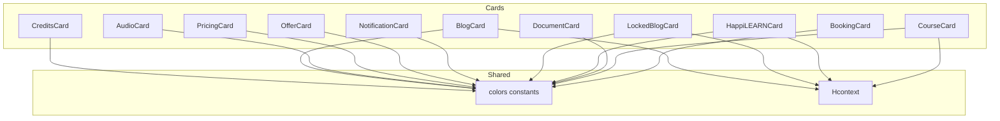

**Diagram sources**
- [BookingCard.js:14-307](file://src/components/cards/BookingCard.js#L14-L307)
- [CourseCard.js:17-297](file://src/components/cards/CourseCard.js#L17-L297)
- [DocumentCard.js:19-81](file://src/components/cards/DocumentCard.js#L19-L81)
- [HappiLEARNCard.js:17-192](file://src/components/cards/HappiLEARNCard.js#L17-L192)
- [LockedBlogCard.js:17-105](file://src/components/cards/LockedBlogCard.js#L17-L105)
- [NotificationCard.js:10-91](file://src/components/cards/NotificationCard.js#L10-L91)
- [OfferCard.js:19-191](file://src/components/cards/OfferCard.js#L19-L191)
- [PricingCard.js:15-346](file://src/components/cards/PricingCard.js#L15-L346)
- [AudioCard.js:18-106](file://src/components/cards/AudioCard.js#L18-L106)
- [BlogCard.js:17-130](file://src/components/cards/BlogCard.js#L17-L130)
- [CreditsCard.js:9-152](file://src/components/cards/CreditsCard.js#L9-L152)
- [index.js:1-195](file://src/assets/constants/index.js#L1-L195)
- [Hcontext.js:583-607](file://src/context/Hcontext.js#L583-L607)

**Section sources**
- [index.js:1-195](file://src/assets/constants/index.js#L1-L195)

## Core Components
This section outlines the responsibilities and key behaviors of each card component.

- BookingCard
  - Purpose: Presents a psychologist profile, pricing, and session plans; supports collapsible details and booking actions.
  - Key behaviors: Collapsible section toggling, conditional pricing display for individual vs organizational users, navigation to booking flows.
  - Notable props: navigation, user, userDetail.
  - Rendering: Uses responsive units and themed colors.

- CourseCard
  - Purpose: Displays learning content with state-aware actions (locked, unlocked, ongoing, completed).
  - Key behaviors: Like/unlike via Hcontext, navigation to module views, disabled overlay for locked items.
  - Notable props: id, title, type, pressHandler, isLiked, likesCount, fetchCourseList, course.

- DocumentCard
  - Purpose: Renders a downloadable document bubble with filename truncation and download trigger.
  - Key behaviors: Fetches Firebase download URL and opens it via system browser.

- HappiLEARNCard
  - Purpose: Content discovery card for HappiLEARN with type badges, like/unlike, and metadata.
  - Key behaviors: Like/unlike via Hcontext, navigation to content screens with type flags.

- LockedBlogCard
  - Purpose: Premium blog preview with lock overlay and upgrade modal trigger.
  - Key behaviors: Opens upgrade modal on press; renders title and thumbnail.

- NotificationCard
  - Purpose: User notification item with read dot and formatted timestamp.
  - Key behaviors: Read indicator reflects read state; minimal action handler placeholder.

- OfferCard
  - Purpose: Promotional offer display with state-specific icons and action button.
  - Key behaviors: Conditional rendering of locked/open/video/proceed states.

- PricingCard
  - Purpose: Subscription and plan selection with pricing, discounts, and add/remove bundle logic.
  - Key behaviors: Platform-specific add/remove handlers, subscription state, navigation for certain products.

- AudioCard
  - Purpose: Audio resource playback with play/stop toggle and loading state.
  - Key behaviors: Downloads audio from Firebase and plays via Audio.Sound; tracks playback duration.

- BlogCard
  - Purpose: Blog listing card with lock overlay for paid content and navigation to content screens.
  - Key behaviors: Conditionally shows lock based on subscription status; opens content with type flags.

- CreditsCard
  - Purpose: Psychologist session credits summary with navigation to booking.
  - Key behaviors: Displays entitled, used, and remaining sessions; navigates to booking flow.

**Section sources**
- [BookingCard.js:16-224](file://src/components/cards/BookingCard.js#L16-L224)
- [CourseCard.js:128-226](file://src/components/cards/CourseCard.js#L128-L226)
- [DocumentCard.js:22-54](file://src/components/cards/DocumentCard.js#L22-L54)
- [HappiLEARNCard.js:21-133](file://src/components/cards/HappiLEARNCard.js#L21-L133)
- [LockedBlogCard.js:20-56](file://src/components/cards/LockedBlogCard.js#L20-L56)
- [NotificationCard.js:13-54](file://src/components/cards/NotificationCard.js#L13-L54)
- [OfferCard.js:79-117](file://src/components/cards/OfferCard.js#L79-L117)
- [PricingCard.js:18-291](file://src/components/cards/PricingCard.js#L18-L291)
- [AudioCard.js:21-78](file://src/components/cards/AudioCard.js#L21-L78)
- [BlogCard.js:20-81](file://src/components/cards/BlogCard.js#L20-L81)
- [CreditsCard.js:12-87](file://src/components/cards/CreditsCard.js#L12-L87)

## Architecture Overview
The card components share a consistent styling system and often rely on shared context for actions and navigation. The central theme constants define color tokens used across cards. Some cards integrate with Hcontext for likes, posts, and navigation.

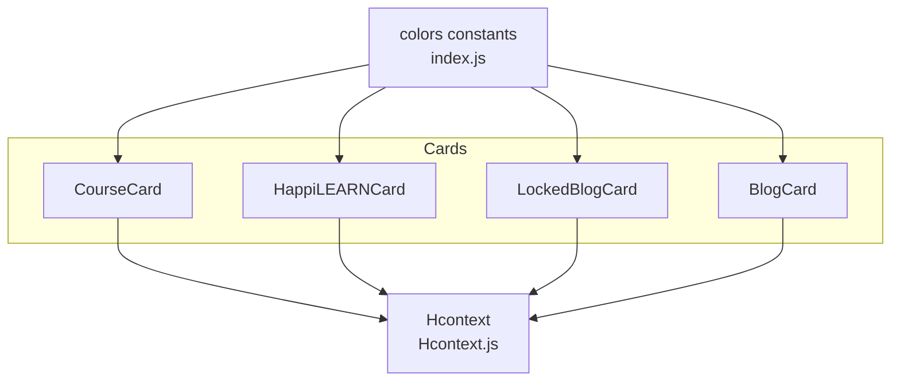

**Diagram sources**
- [index.js:1-195](file://src/assets/constants/index.js#L1-L195)
- [Hcontext.js:583-607](file://src/context/Hcontext.js#L583-L607)
- [CourseCard.js:17-144](file://src/components/cards/CourseCard.js#L17-L144)
- [HappiLEARNCard.js:18-41](file://src/components/cards/HappiLEARNCard.js#L18-L41)
- [LockedBlogCard.js:17-22](file://src/components/cards/LockedBlogCard.js#L17-L22)
- [BlogCard.js:17-22](file://src/components/cards/BlogCard.js#L17-L22)

## Detailed Component Analysis

### BookingCard
- Purpose: Display psychologist profile, pricing, and session plans; enable booking actions.
- Key interactions:
  - Collapsible section reveals specializations, schedule, and session offers.
  - Conditional booking flow for individual vs organizational users.
- Styling: Responsive sizing, themed typography, and primary action button.

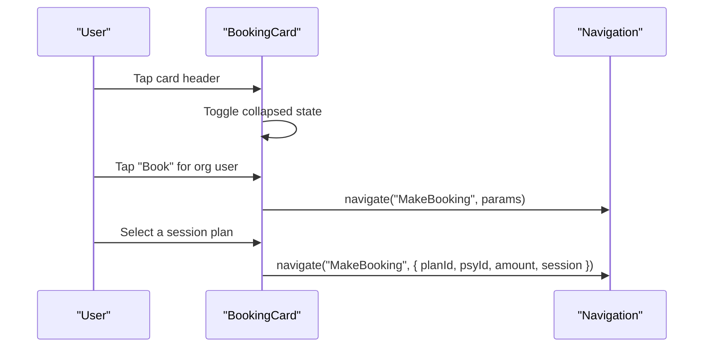

**Diagram sources**
- [BookingCard.js:48-223](file://src/components/cards/BookingCard.js#L48-L223)

**Section sources**
- [BookingCard.js:16-224](file://src/components/cards/BookingCard.js#L16-L224)

### CourseCard
- Purpose: Present course content with state-aware UI and actions.
- Key interactions:
  - Like/unlike via Hcontext; updates course list after mutation.
  - Navigation to module view; disabled overlay for locked items.
- States: locked, unlocked, video/audio, completed, proceed.

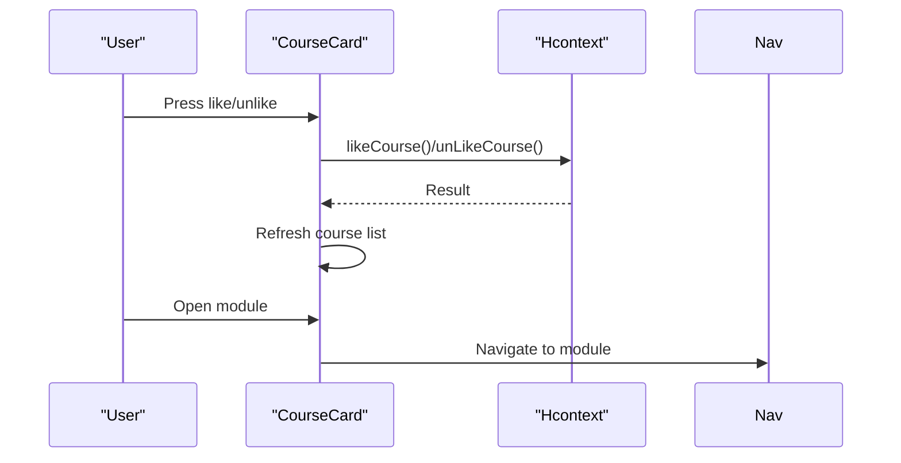

**Diagram sources**
- [CourseCard.js:146-166](file://src/components/cards/CourseCard.js#L146-L166)
- [Hcontext.js:915-938](file://src/context/Hcontext.js#L915-L938)

**Section sources**
- [CourseCard.js:128-226](file://src/components/cards/CourseCard.js#L128-L226)
- [Hcontext.js:915-938](file://src/context/Hcontext.js#L915-L938)

### DocumentCard
- Purpose: Render a document resource with a download action.
- Key interactions:
  - Fetch Firebase download URL and open via system browser.
  - Filename truncation for readability.

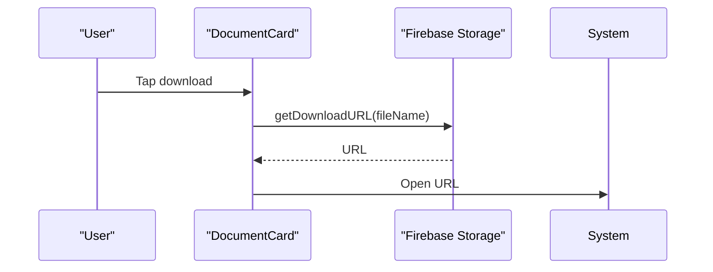

**Diagram sources**
- [DocumentCard.js:22-33](file://src/components/cards/DocumentCard.js#L22-L33)

**Section sources**
- [DocumentCard.js:22-54](file://src/components/cards/DocumentCard.js#L22-L54)

### HappiLEARNCard
- Purpose: Discover HappiLEARN content with type badges, likes, and metadata.
- Key interactions:
  - Like/unlike via Hcontext with loading state.
  - Navigate to content screen with type flags.

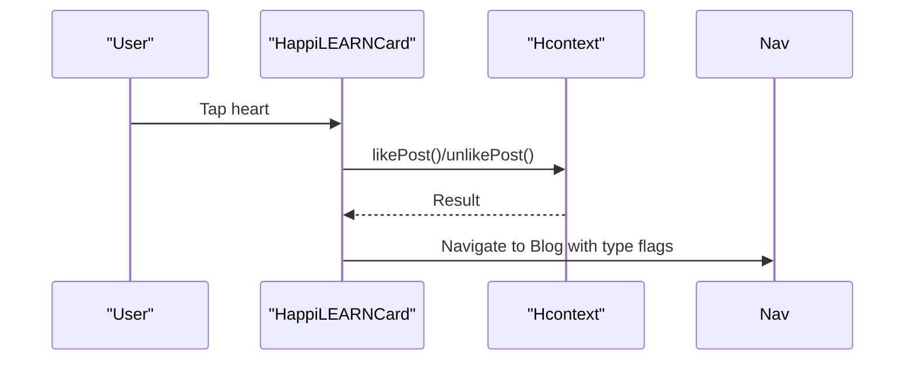

**Diagram sources**
- [HappiLEARNCard.js:48-78](file://src/components/cards/HappiLEARNCard.js#L48-L78)
- [Hcontext.js:583-607](file://src/context/Hcontext.js#L583-L607)

**Section sources**
- [HappiLEARNCard.js:21-133](file://src/components/cards/HappiLEARNCard.js#L21-L133)
- [Hcontext.js:583-607](file://src/context/Hcontext.js#L583-L607)

### LockedBlogCard
- Purpose: Preview premium blog content behind a lock overlay.
- Key interactions:
  - Opens upgrade modal on press.
  - Navigates to generic blog screen.

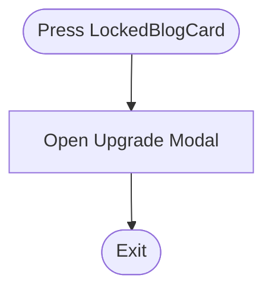

**Diagram sources**
- [LockedBlogCard.js:24-28](file://src/components/cards/LockedBlogCard.js#L24-L28)

**Section sources**
- [LockedBlogCard.js:20-56](file://src/components/cards/LockedBlogCard.js#L20-L56)

### NotificationCard
- Purpose: Display user/system notifications with read indicator and timestamp.
- Key interactions:
  - Minimal action handler placeholder; read dot reflects read state.

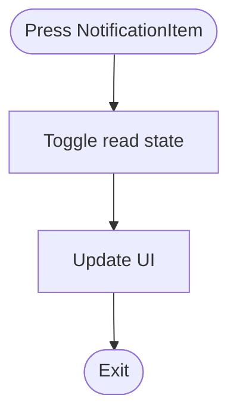

**Diagram sources**
- [NotificationCard.js:19-24](file://src/components/cards/NotificationCard.js#L19-L24)

**Section sources**
- [NotificationCard.js:13-54](file://src/components/cards/NotificationCard.js#L13-L54)

### OfferCard
- Purpose: Promote offers with state-specific icons and action button.
- Key states: locked, unlocked, video, proceed.

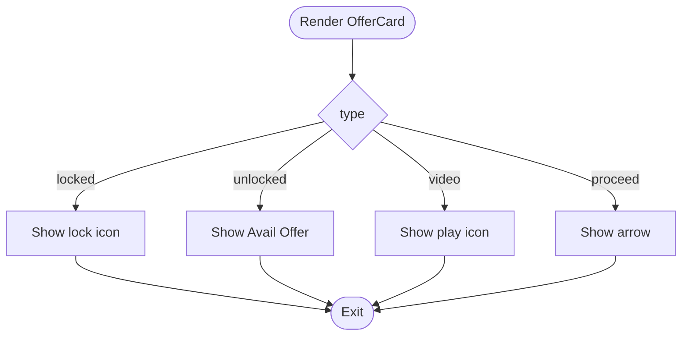

**Diagram sources**
- [OfferCard.js:79-117](file://src/components/cards/OfferCard.js#L79-L117)

**Section sources**
- [OfferCard.js:79-117](file://src/components/cards/OfferCard.js#L79-L117)

### PricingCard
- Purpose: Present subscription tiers and plan options with pricing and add/remove bundle logic.
- Key interactions:
  - Platform-specific handlers for Android/iOS.
  - Navigation for specific products; subscription state handling.

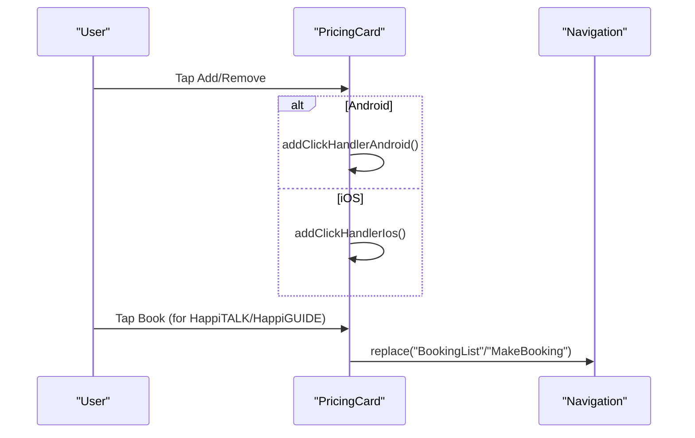

**Diagram sources**
- [PricingCard.js:47-122](file://src/components/cards/PricingCard.js#L47-L122)
- [PricingCard.js:230-254](file://src/components/cards/PricingCard.js#L230-L254)

**Section sources**
- [PricingCard.js:18-291](file://src/components/cards/PricingCard.js#L18-L291)

### AudioCard
- Purpose: Play audio resources inline with loading and playback state.
- Key interactions:
  - Download audio URL from Firebase and play via Audio.Sound.
  - Stop playback after duration and update state.

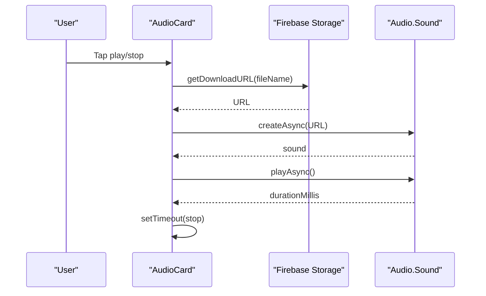

**Diagram sources**
- [AudioCard.js:26-47](file://src/components/cards/AudioCard.js#L26-L47)

**Section sources**
- [AudioCard.js:21-78](file://src/components/cards/AudioCard.js#L21-L78)

### BlogCard
- Purpose: Display blog previews with optional lock for paid content.
- Key interactions:
  - Conditional lock overlay based on subscription status.
  - Navigate to content screen with type flags.

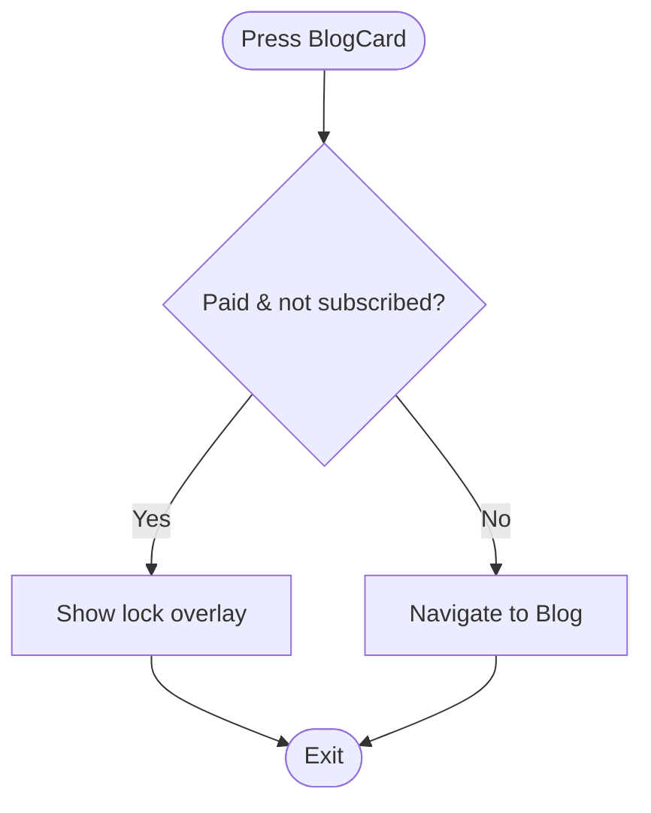

**Diagram sources**
- [BlogCard.js:27-34](file://src/components/cards/BlogCard.js#L27-L34)
- [BlogCard.js:48-71](file://src/components/cards/BlogCard.js#L48-L71)

**Section sources**
- [BlogCard.js:20-81](file://src/components/cards/BlogCard.js#L20-L81)

### CreditsCard
- Purpose: Summarize psychologist session credits and enable booking.
- Key interactions:
  - Displays entitled, used, and remaining sessions.
  - Navigates to booking flow with psychologist context.

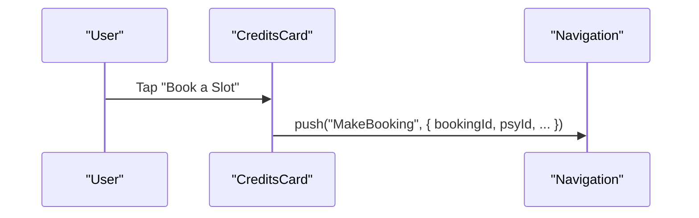

**Diagram sources**
- [CreditsCard.js:70-85](file://src/components/cards/CreditsCard.js#L70-L85)

**Section sources**
- [CreditsCard.js:12-87](file://src/components/cards/CreditsCard.js#L12-L87)

## Dependency Analysis
- Shared styling: All cards import colors from the centralized constants file to maintain visual consistency.
- Shared actions: CourseCard and HappiLEARNCard use Hcontext for likes/unlikes and navigation.
- External integrations:
  - Firebase Storage for downloads and uploads.
  - Expo Audio for audio playback.
  - Navigation helpers for routing.

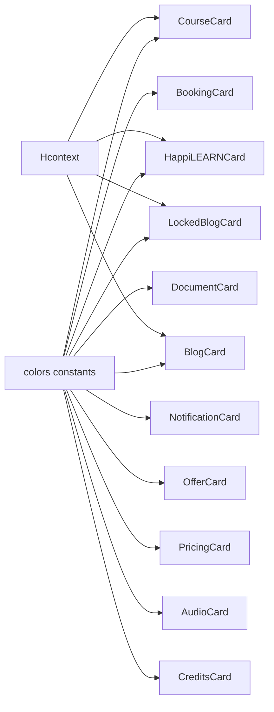

**Diagram sources**
- [index.js:1-195](file://src/assets/constants/index.js#L1-L195)
- [Hcontext.js:583-607](file://src/context/Hcontext.js#L583-L607)
- [CourseCard.js:14-144](file://src/components/cards/CourseCard.js#L14-L144)
- [HappiLEARNCard.js:18-41](file://src/components/cards/HappiLEARNCard.js#L18-L41)
- [LockedBlogCard.js:17-22](file://src/components/cards/LockedBlogCard.js#L17-L22)
- [BlogCard.js:17-22](file://src/components/cards/BlogCard.js#L17-L22)

**Section sources**
- [index.js:1-195](file://src/assets/constants/index.js#L1-L195)
- [Hcontext.js:583-607](file://src/context/Hcontext.js#L583-L607)

## Performance Considerations
- Avoid unnecessary re-renders by passing only required props to cards.
- Defer heavy computations (e.g., long filenames) to memoized helpers.
- For media cards (AudioCard, DocumentCard), handle loading states to prevent layout shifts.
- Use responsive units consistently to minimize layout thrashing on different screen sizes.

## Troubleshooting Guide
- Download failures (DocumentCard, AudioCard):
  - Verify Firebase storage rules and file paths.
  - Confirm URL retrieval and system browser availability.
- Like/unlike errors (CourseCard, HappiLEARNCard):
  - Ensure Hcontext endpoints are reachable and user is authenticated.
  - Check snack dispatch for error messages.
- Navigation issues:
  - Confirm route names and parameter shapes passed to navigation helpers.
- Pricing interactions (PricingCard):
  - Validate platform-specific handlers and bundle state updates.
- Booking flows (BookingCard, CreditsCard):
  - Ensure required props (user, userDetail, navigation) are present.

**Section sources**
- [DocumentCard.js:22-33](file://src/components/cards/DocumentCard.js#L22-L33)
- [AudioCard.js:26-47](file://src/components/cards/AudioCard.js#L26-L47)
- [Hcontext.js:583-607](file://src/context/Hcontext.js#L583-L607)
- [PricingCard.js:47-122](file://src/components/cards/PricingCard.js#L47-L122)
- [BookingCard.js:125-146](file://src/components/cards/BookingCard.js#L125-L146)
- [CreditsCard.js:70-85](file://src/components/cards/CreditsCard.js#L70-L85)

## Conclusion
The card component family in HappiMynd provides a cohesive, reusable foundation for content presentation across booking, learning, promotions, payments, media, and notifications. By leveraging shared styling and context-driven actions, these components remain consistent, maintainable, and extensible. When extending or integrating new cards, adhere to the established patterns for props, navigation, and state handling to preserve UX coherence.