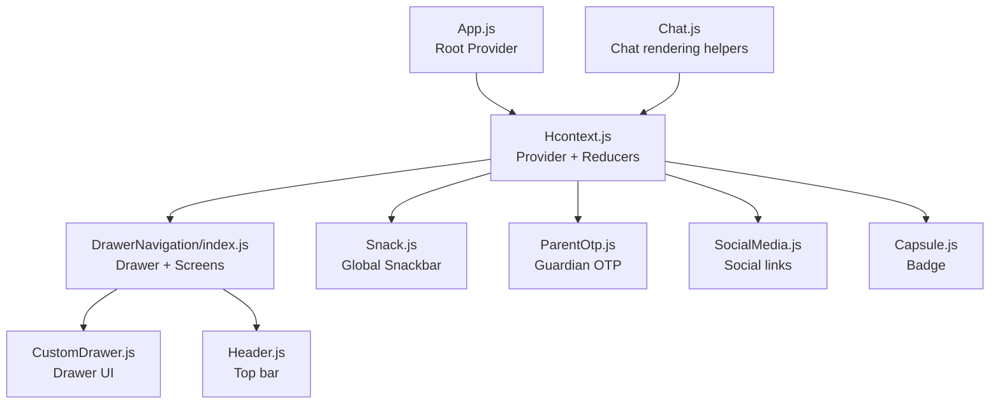
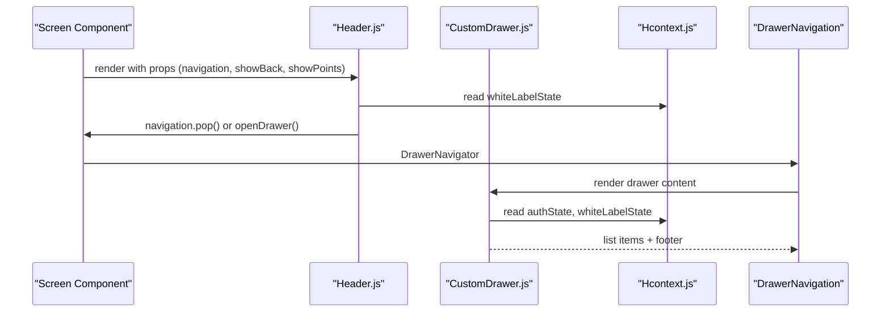
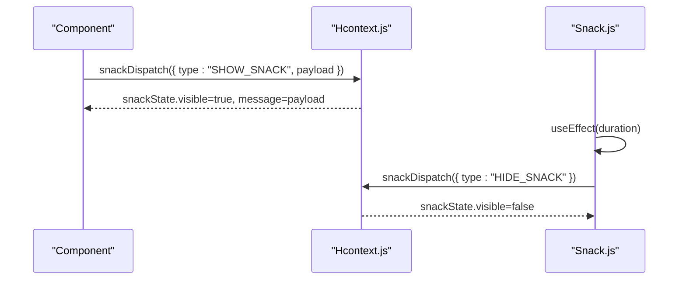
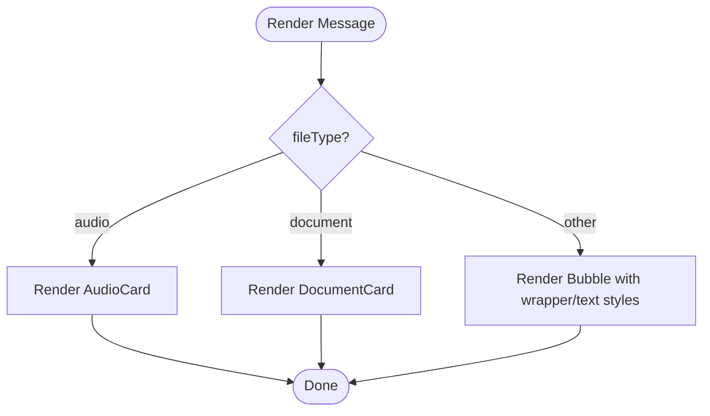
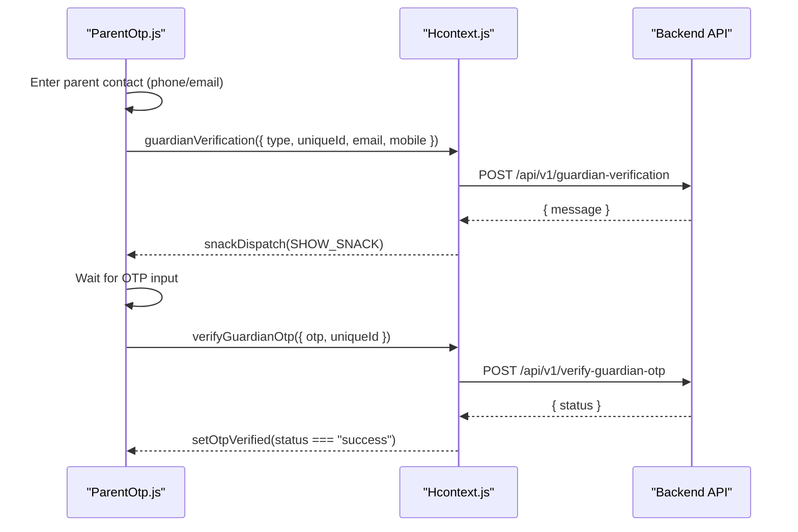
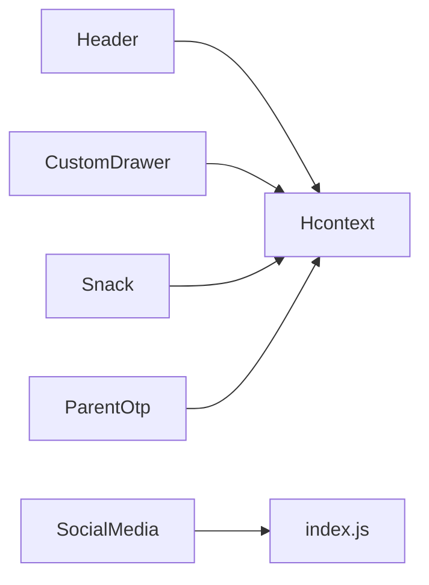

# Common Components

<cite>
**Referenced Files in This Document**
- [Header.js](file://src/components/common/Header.js)
- [CustomDrawer.js](file://src/components/common/CustomDrawer.js)
- [Snack.js](file://src/components/common/Snack.js)
- [Capsule.js](file://src/components/common/Capsule.js)
- [Chat.js](file://src/components/common/Chat.js)
- [ParentOtp.js](file://src/components/common/ParentOtp.js)
- [SocialMedia.js](file://src/components/common/SocialMedia.js)
- [Hcontext.js](file://src/context/Hcontext.js)
- [snackReducer.js](file://src/context/reducers/snackReducer.js)
- [authReducer.js](file://src/context/reducers/authReducer.js)
- [index.js](file://src/assets/constants/index.js)
- [DrawerNavigation/index.js](file://src/routes/DrawerNavigation/index.js)
- [App.js](file://App.js)
</cite>

## Table of Contents
1. [Introduction](#introduction)
2. [Project Structure](#project-structure)
3. [Core Components](#core-components)
4. [Architecture Overview](#architecture-overview)
5. [Detailed Component Analysis](#detailed-component-analysis)
6. [Dependency Analysis](#dependency-analysis)
7. [Performance Considerations](#performance-considerations)
8. [Troubleshooting Guide](#troubleshooting-guide)
9. [Conclusion](#conclusion)

## Introduction
This document describes the common components used across the HappiMynd application. It focuses on:
- Header: navigation patterns, branding, and responsive behavior
- CustomDrawer: main navigation drawer with user context integration
- Snack: notification system for user feedback and errors
- Capsule: status indicators and badges
- Chat: real-time messaging rendering utilities
- ParentOtp: parental verification workflow
- SocialMedia: social sharing and connectivity

It explains component props, styling options, accessibility features, and integration patterns with the overall navigation system.

## Project Structure
The common components live under src/components/common and are integrated via the Hcontext provider and routing layers.

**Diagram sources**
- [App.js:36-55](file://App.js#L36-L55)
- [Hcontext.js:1408-1549](file://src/context/Hcontext.js#L1408-L1549)
- [DrawerNavigation/index.js:37-284](file://src/routes/DrawerNavigation/index.js#L37-L284)
- [CustomDrawer.js:24-76](file://src/components/common/CustomDrawer.js#L24-L76)
- [Header.js:17-81](file://src/components/common/Header.js#L17-L81)
- [Snack.js:9-32](file://src/components/common/Snack.js#L9-L32)
- [ParentOtp.js:24-116](file://src/components/common/ParentOtp.js#L24-L116)
- [SocialMedia.js:19-65](file://src/components/common/SocialMedia.js#L19-L65)
- [Capsule.js:12-42](file://src/components/common/Capsule.js#L12-L42)
- [Chat.js:33-105](file://src/components/common/Chat.js#L33-L105)

**Section sources**
- [App.js:36-55](file://App.js#L36-L55)
- [Hcontext.js:1408-1549](file://src/context/Hcontext.js#L1408-L1549)
- [DrawerNavigation/index.js:37-284](file://src/routes/DrawerNavigation/index.js#L37-L284)

## Core Components
- Header: renders a top bar with optional back button, branded logo, and optional points display. Integrates with white-label branding and navigation actions.
- CustomDrawer: custom drawer UI with user avatar, username, powered-by footer, and version info. Uses white-label state and auth state.
- Snack: global snackbar bound to snackState/snackDispatch. Auto-hides after a configurable duration.
- Capsule: small pill-shaped badge displaying a title with consistent typography and colors.
- Chat: chat rendering helpers for bubbles, time styling, and specialized message cards.
- ParentOtp: OTP flow for parents via phone/email and verification, integrated with Hcontext actions.
- SocialMedia: social media icons linking to official pages.

**Section sources**
- [Header.js:17-81](file://src/components/common/Header.js#L17-L81)
- [CustomDrawer.js:24-76](file://src/components/common/CustomDrawer.js#L24-L76)
- [Snack.js:9-32](file://src/components/common/Snack.js#L9-L32)
- [Capsule.js:12-42](file://src/components/common/Capsule.js#L12-L42)
- [Chat.js:33-105](file://src/components/common/Chat.js#L33-L105)
- [ParentOtp.js:24-116](file://src/components/common/ParentOtp.js#L24-L116)
- [SocialMedia.js:19-65](file://src/components/common/SocialMedia.js#L19-L65)

## Architecture Overview
The common components rely on a centralized context provider (Hcontext) that exposes:
- Authentication state and actions
- White-label branding state
- Snack state and dispatch
- Messaging and chat utilities
- Parental verification endpoints

They integrate with:
- DrawerNavigation for main navigation
- Screen-level components for usage

**Diagram sources**
- [Header.js:17-81](file://src/components/common/Header.js#L17-L81)
- [CustomDrawer.js:24-76](file://src/components/common/CustomDrawer.js#L24-L76)
- [DrawerNavigation/index.js:37-284](file://src/routes/DrawerNavigation/index.js#L37-L284)
- [Hcontext.js:1408-1549](file://src/context/Hcontext.js#L1408-L1549)

## Detailed Component Analysis

### Header
- Purpose: Top navigation bar with branding and optional points display.
- Props:
  - navigation: required, used to navigate back or open drawer
  - showNav: boolean, toggles drawer icon
  - showLogo: boolean, toggles logo visibility
  - showBack: boolean, switches icon to back arrow
  - showPoints: boolean, shows points container
  - rewardPoints: number, displayed points value
- Behavior:
  - Back icon navigates back; otherwise opens drawer
  - Logo sourced from whiteLabelState or fallback asset
  - Points container navigates to Moods screen
- Styling:
  - Responsive sizing via percentage-based units
  - Typography and colors from constants
- Accessibility:
  - Touchable opacity for press feedback
  - Icon sizes scale with screen height

**Section sources**
- [Header.js:17-81](file://src/components/common/Header.js#L17-L81)
- [index.js:1-195](file://src/assets/constants/index.js#L1-L195)

### CustomDrawer
- Purpose: Custom drawer UI with user info, powered-by footer, and version info.
- Props: none (reads from context)
- Behavior:
  - Displays user avatar and username from authState
  - Conditionally shows powered-by text based on user type and whiteLabelState
  - Shows platform-specific version
- Styling:
  - Consistent typography and spacing
  - Colors from constants
- Integration:
  - Used as drawerContent in DrawerNavigation

**Section sources**
- [CustomDrawer.js:24-76](file://src/components/common/CustomDrawer.js#L24-L76)
- [DrawerNavigation/index.js:37-284](file://src/routes/DrawerNavigation/index.js#L37-L284)
- [index.js:1-195](file://src/assets/constants/index.js#L1-L195)

### Snack
- Purpose: Global snackbar for user feedback and error messages.
- Props:
  - duration: number, auto-hide delay (default 10000 ms)
- Behavior:
  - Reads snackState.visible/message
  - Auto-hides after duration
  - Dismiss action hides the snackbar
- Integration:
  - Dispatched via snackDispatch from Hcontext
  - Consumed by Snack component

**Diagram sources**
- [Snack.js:9-32](file://src/components/common/Snack.js#L9-L32)
- [snackReducer.js:1-16](file://src/context/reducers/snackReducer.js#L1-L16)
- [Hcontext.js:1408-1549](file://src/context/Hcontext.js#L1408-L1549)

**Section sources**
- [Snack.js:9-32](file://src/components/common/Snack.js#L9-L32)
- [snackReducer.js:1-16](file://src/context/reducers/snackReducer.js#L1-L16)
- [Hcontext.js:1408-1549](file://src/context/Hcontext.js#L1408-L1549)

### Capsule
- Purpose: Status indicator or badge with rounded pill shape.
- Props:
  - title: string, text content
- Styling:
  - Background color from constants
  - Responsive padding and font sizing
- Usage:
  - Suitable for tags, statuses, or small labels

**Section sources**
- [Capsule.js:12-42](file://src/components/common/Capsule.js#L12-L42)
- [index.js:1-195](file://src/assets/constants/index.js#L1-L195)

### Chat
- Purpose: Rendering utilities for chat messages and bubbles.
- Exports:
  - _renderChatBubble: renders audio/document cards or default bubble with wrapper styles and text styles
  - _renderBubbleTime: custom time styling per side
- Styling:
  - Bubble wrapper colors and shadows from constants
  - Text styles with font family and sizes
- Integration:
  - Intended for use with a chat library’s GiftedChat

**Diagram sources**
- [Chat.js:33-105](file://src/components/common/Chat.js#L33-L105)

**Section sources**
- [Chat.js:33-105](file://src/components/common/Chat.js#L33-L105)
- [index.js:1-195](file://src/assets/constants/index.js#L1-L195)

### ParentOtp
- Purpose: Parental verification workflow via phone or email OTP.
- Props:
  - otpVerified: boolean callback prop
  - setOtpVerified: setter for otpVerified
- Behavior:
  - Sends OTP to parent contact (phone or email)
  - Verifies OTP and updates otpVerified
  - Uses snackDispatch to surface messages
- Integration:
  - Uses Hcontext actions: guardianVerification, verifyGuardianOtp
  - Composed of SendPhoneOtp, SendEmailOtp, VerifyOtp

**Diagram sources**
- [ParentOtp.js:24-116](file://src/components/common/ParentOtp.js#L24-L116)
- [Hcontext.js:174-202](file://src/context/Hcontext.js#L174-L202)

**Section sources**
- [ParentOtp.js:24-116](file://src/components/common/ParentOtp.js#L24-L116)
- [Hcontext.js:174-202](file://src/context/Hcontext.js#L174-L202)

### SocialMedia
- Purpose: Social sharing and connectivity links.
- Behavior:
  - Opens official Facebook, Twitter, Instagram, LinkedIn, YouTube URLs
  - Touchable icons with consistent styling
- Styling:
  - Pill-shaped containers with spacing and colors from constants

**Section sources**
- [SocialMedia.js:19-65](file://src/components/common/SocialMedia.js#L19-L65)
- [index.js:1-195](file://src/assets/constants/index.js#L1-L195)

## Dependency Analysis
- Header depends on:
  - Hcontext for whiteLabelState
  - Icons and responsive units
- CustomDrawer depends on:
  - Hcontext for authState and whiteLabelState
  - DrawerItemList for navigation entries
- Snack depends on:
  - snackState/snackDispatch from Hcontext
  - snackReducer for state transitions
- ParentOtp depends on:
  - Hcontext actions for OTP lifecycle
  - Input components for OTP flow
- SocialMedia depends on:
  - Linking for external URLs
  - Constants for styling

**Diagram sources**
- [Header.js:17-81](file://src/components/common/Header.js#L17-L81)
- [CustomDrawer.js:24-76](file://src/components/common/CustomDrawer.js#L24-L76)
- [Snack.js:9-32](file://src/components/common/Snack.js#L9-L32)
- [ParentOtp.js:24-116](file://src/components/common/ParentOtp.js#L24-L116)
- [SocialMedia.js:19-65](file://src/components/common/SocialMedia.js#L19-L65)
- [index.js:1-195](file://src/assets/constants/index.js#L1-L195)

**Section sources**
- [Header.js:17-81](file://src/components/common/Header.js#L17-L81)
- [CustomDrawer.js:24-76](file://src/components/common/CustomDrawer.js#L24-L76)
- [Snack.js:9-32](file://src/components/common/Snack.js#L9-L32)
- [ParentOtp.js:24-116](file://src/components/common/ParentOtp.js#L24-L116)
- [SocialMedia.js:19-65](file://src/components/common/SocialMedia.js#L19-L65)
- [index.js:1-195](file://src/assets/constants/index.js#L1-L195)

## Performance Considerations
- Prefer lightweight rendering in Header and Capsule to minimize layout thrash.
- Defer heavy computations in Snack to avoid blocking UI during auto-hide.
- Keep Chat bubble rendering efficient; reuse components and avoid unnecessary re-renders.
- Use memoization for ParentOtp handlers when integrating into larger forms.
- Avoid frequent re-renders of CustomDrawer by keeping state local to the drawer.

## Troubleshooting Guide
- Snack not appearing:
  - Ensure snackDispatch is called with SHOW_SNACK and a message payload.
  - Confirm Snack component is rendered and Hcontext provider is active.
- Drawer not showing user info:
  - Verify authState.user exists and contains username.
  - Confirm whiteLabelState footer flag for powered-by text.
- Header logo missing:
  - Check whiteLabelState.logo presence; fallback asset is used when absent.
- ParentOtp not working:
  - Confirm guardianVerification and verifyGuardianOtp are invoked with correct params.
  - Inspect snack messages for error details.

**Section sources**
- [Snack.js:9-32](file://src/components/common/Snack.js#L9-L32)
- [CustomDrawer.js:24-76](file://src/components/common/CustomDrawer.js#L24-L76)
- [Header.js:17-81](file://src/components/common/Header.js#L17-L81)
- [ParentOtp.js:24-116](file://src/components/common/ParentOtp.js#L24-L116)

## Conclusion
The common components provide cohesive UI primitives and integration points across HappiMynd. They leverage a centralized context for state and actions, ensuring consistent behavior and easy maintenance. Their modular design supports responsive layouts, accessibility, and scalable extensions.