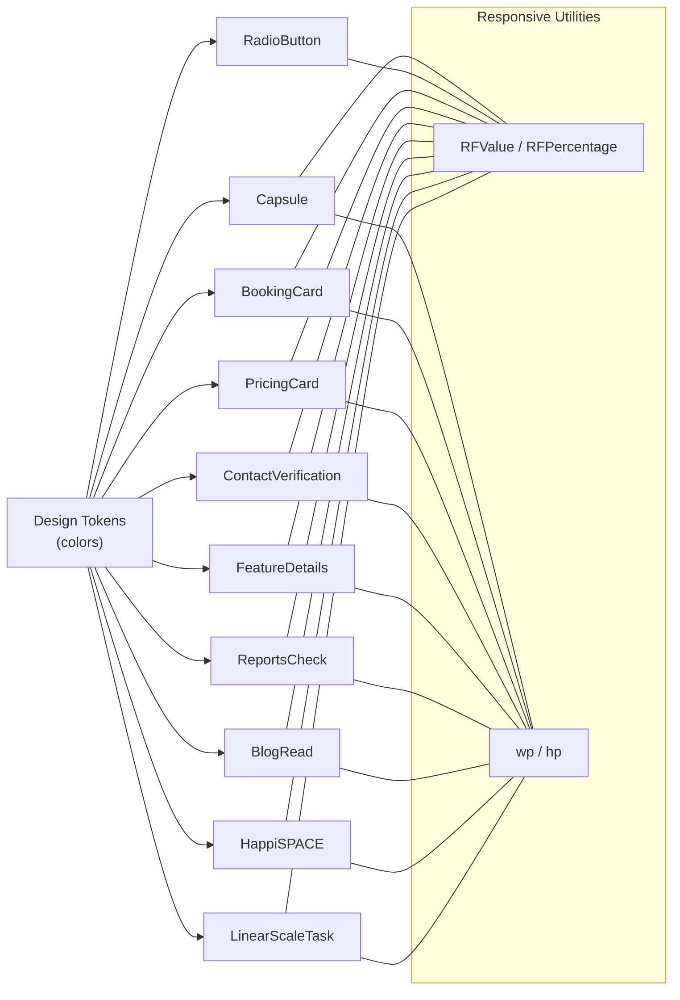
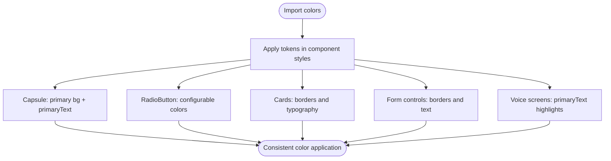
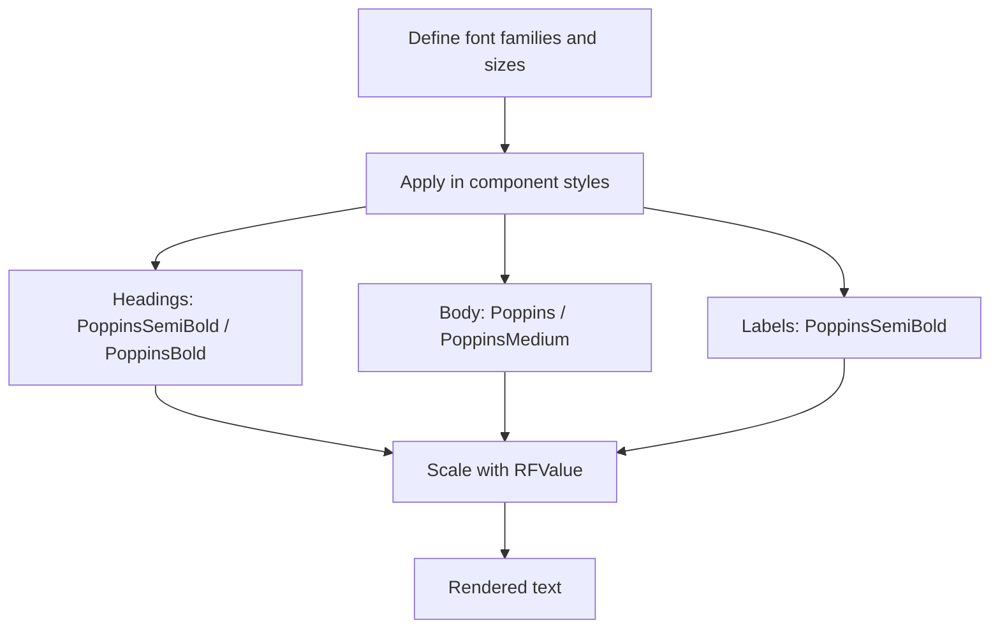
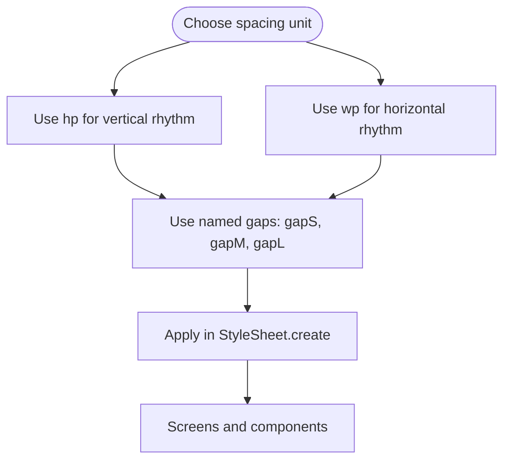
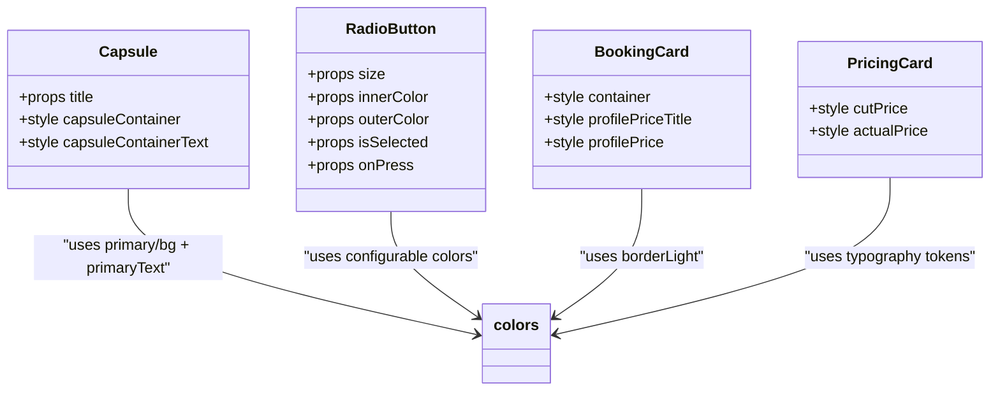
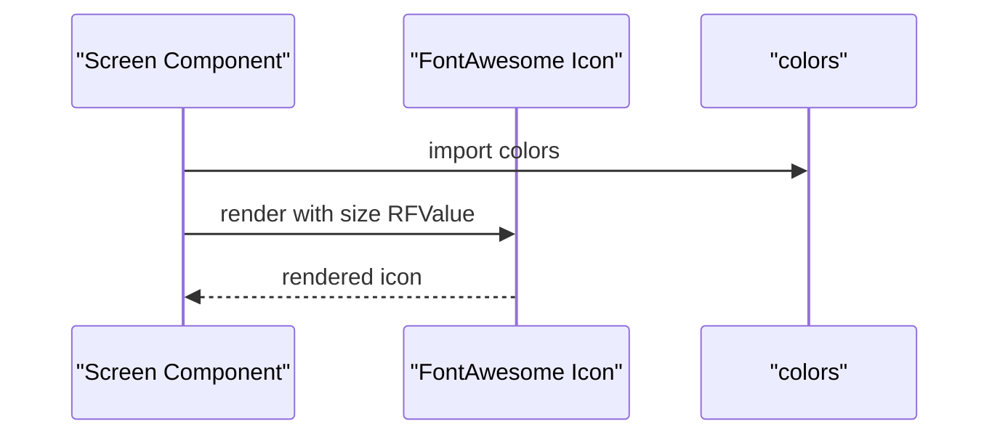

# Design System & Tokens

<cite>
**Referenced Files in This Document**
- [src/assets/constants/index.js](file://src/assets/constants/index.js)
- [src/components/common/Capsule.js](file://src/components/common/Capsule.js)
- [src/components/buttons/RadioButton.js](file://src/components/buttons/RadioButton.js)
- [src/components/cards/BookingCard.js](file://src/components/cards/BookingCard.js)
- [src/components/cards/PricingCard.js](file://src/components/cards/PricingCard.js)
- [src/screens/HappiLIFE/ContactVerification.js](file://src/screens/HappiLIFE/ContactVerification.js)
- [src/screens/HappiVOICE/FeatureDetails.js](file://src/screens/HappiVOICE/FeatureDetails.js)
- [src/screens/HappiVOICE/ReportsCheck.js](file://src/screens/HappiVOICE/ReportsCheck.js)
- [src/screens/Individual/BlogRead.js](file://src/screens/Individual/BlogRead.js)
- [src/screens/Individual/HappiSPACE.js](file://src/screens/Individual/HappiSPACE.js)
- [src/screens/HappiSELF/Tasks/LinearScaleTask.js](file://src/screens/HappiSELF/Tasks/LinearScaleTask.js)
- [src/components/common/SocialMedia.js](file://src/components/common/SocialMedia.js)
- [android/app/src/main/res/values/colors.xml](file://android/app/src/main/res/values/colors.xml)
- [app.json](file://app.json)
- [package.json](file://package.json)
</cite>

## Table of Contents
1. [Introduction](#introduction)
2. [Project Structure](#project-structure)
3. [Core Components](#core-components)
4. [Architecture Overview](#architecture-overview)
5. [Detailed Component Analysis](#detailed-component-analysis)
6. [Dependency Analysis](#dependency-analysis)
7. [Performance Considerations](#performance-considerations)
8. [Troubleshooting Guide](#troubleshooting-guide)
9. [Conclusion](#conclusion)
10. [Appendices](#appendices)

## Introduction
This document describes the HappiMynd design system and design tokens as implemented in the codebase. It focuses on the color palette, typography scale, spacing system, component variants, iconography, brand assets, and responsive design patterns. It also documents how components consume design tokens and outlines guidelines for maintaining consistency across the application.

## Project Structure
The design system is primarily centralized in a single constants module and consumed widely across components and screens. Typography and spacing are applied consistently via imported tokens and responsive utilities. Brand assets and native platform colors are configured in platform-specific resources and app metadata.

```mermaid
graph TB
subgraph "Design Tokens"
C["colors<br/>('src/assets/constants/index.js')"]
end
subgraph "Components"
CB["Capsule<br/>('src/components/common/Capsule.js')"]
RB["RadioButton<br/>('src/components/buttons/RadioButton.js')"]
BK["BookingCard<br/>('src/components/cards/BookingCard.js')"]
PC["PricingCard<br/>('src/components/cards/PricingCard.js')"]
end
subgraph "Screens"
CV["ContactVerification<br/>('src/screens/HappiLIFE/ContactVerification.js')"]
FD["FeatureDetails<br/>('src/screens/HappiVOICE/FeatureDetails.js')"]
RC["ReportsCheck<br/>('src/screens/HappiVOICE/ReportsCheck.js')"]
BR["BlogRead<br/>('src/screens/Individual/BlogRead.js')"]
HS["HappiSPACE<br/>('src/screens/Individual/HappiSPACE.js')"]
LT["LinearScaleTask<br/>('src/screens/HappiSELF/Tasks/LinearScaleTask.js')"]
end
subgraph "Brand & Platform"
AND["Android Colors<br/>('android/app/src/main/res/values/colors.xml')"]
APP["App Config<br/>('app.json')"]
end
C --> CB
C --> RB
C --> BK
C --> PC
C --> CV
C --> FD
C --> RC
C --> BR
C --> HS
C --> LT
AND --> APP
```

**Diagram sources**
- [src/assets/constants/index.js:1-14](file://src/assets/constants/index.js#L1-L14)
- [src/components/common/Capsule.js:23-39](file://src/components/common/Capsule.js#L23-L39)
- [src/components/buttons/RadioButton.js:55-61](file://src/components/buttons/RadioButton.js#L55-L61)
- [src/components/cards/BookingCard.js:225-233](file://src/components/cards/BookingCard.js#L225-L233)
- [src/components/cards/PricingCard.js:181-220](file://src/components/cards/PricingCard.js#L181-L220)
- [src/screens/HappiLIFE/ContactVerification.js:549-591](file://src/screens/HappiLIFE/ContactVerification.js#L549-L591)
- [src/screens/HappiVOICE/FeatureDetails.js:236-306](file://src/screens/HappiVOICE/FeatureDetails.js#L236-L306)
- [src/screens/HappiVOICE/ReportsCheck.js:229-282](file://src/screens/HappiVOICE/ReportsCheck.js#L229-L282)
- [src/screens/Individual/BlogRead.js:204-228](file://src/screens/Individual/BlogRead.js#L204-L228)
- [src/screens/Individual/HappiSPACE.js:87-117](file://src/screens/Individual/HappiSPACE.js#L87-L117)
- [src/screens/HappiSELF/Tasks/LinearScaleTask.js:89-125](file://src/screens/HappiSELF/Tasks/LinearScaleTask.js#L89-L125)
- [android/app/src/main/res/values/colors.xml:1-6](file://android/app/src/main/res/values/colors.xml#L1-L6)
- [app.json:1-52](file://app.json#L1-L52)

**Section sources**
- [src/assets/constants/index.js:1-14](file://src/assets/constants/index.js#L1-L14)
- [package.json:13-94](file://package.json#L13-L94)
- [app.json:1-52](file://app.json#L1-L52)
- [android/app/src/main/res/values/colors.xml:1-6](file://android/app/src/main/res/values/colors.xml#L1-L6)

## Core Components
This section documents the design tokens and how they are applied across components.

- Color palette tokens
  - Background and surfaces: background, backgroundLight, backgroundModal
  - Borders: borderDim, borderLight, borderDark
  - Primary and semantic: primary, primaryText, pageTitle, loaderColor
  - Messaging bubbles: receiverBubble, senderBubble

- Typography scale
  - Font families observed: Poppins, PoppinsMedium, PoppinsSemiBold, PoppinsBold
  - Responsive sizing via react-native-responsive-fontsize (RFValue, RFPercentage)
  - Line heights expressed as responsive units (e.g., hp for lineHeight)

- Spacing scale
  - Consistent use of responsive units: hp (height percentage) and wp (width percentage)
  - Named gaps for readability: gapS, gapM, gapL

- Component variants
  - Capsule: styled with primary background and primaryText color
  - Radio button: configurable size, innerColor, outerColor, isSelected
  - Cards/pricing: apply border colors and typography tokens for pricing and discount text
  - Forms/terms: borderDim and borderLight used for input-like controls and borders

- Iconography
  - Vector icons used via @expo/vector-icons (FontAwesome)
  - Icons are sized using RFValue for responsiveness

- Brand assets and native colors
  - Android colorPrimary and related values
  - App splash and adaptive icon configuration in app.json

**Section sources**
- [src/assets/constants/index.js:1-14](file://src/assets/constants/index.js#L1-L14)
- [src/components/common/Capsule.js:23-39](file://src/components/common/Capsule.js#L23-L39)
- [src/components/buttons/RadioButton.js:9-24](file://src/components/buttons/RadioButton.js#L9-L24)
- [src/components/cards/BookingCard.js:225-233](file://src/components/cards/BookingCard.js#L225-L233)
- [src/components/cards/PricingCard.js:181-220](file://src/components/cards/PricingCard.js#L181-L220)
- [src/screens/HappiLIFE/ContactVerification.js:549-591](file://src/screens/HappiLIFE/ContactVerification.js#L549-L591)
- [src/screens/HappiVOICE/FeatureDetails.js:236-306](file://src/screens/HappiVOICE/FeatureDetails.js#L236-L306)
- [src/screens/HappiVOICE/ReportsCheck.js:229-282](file://src/screens/HappiVOICE/ReportsCheck.js#L229-L282)
- [src/screens/Individual/BlogRead.js:204-228](file://src/screens/Individual/BlogRead.js#L204-L228)
- [src/screens/Individual/HappiSPACE.js:87-117](file://src/screens/Individual/HappiSPACE.js#L87-L117)
- [src/screens/HappiSELF/Tasks/LinearScaleTask.js:89-125](file://src/screens/HappiSELF/Tasks/LinearScaleTask.js#L89-L125)
- [src/components/common/SocialMedia.js:1-17](file://src/components/common/SocialMedia.js#L1-L17)
- [android/app/src/main/res/values/colors.xml:1-6](file://android/app/src/main/res/values/colors.xml#L1-L6)
- [app.json:1-52](file://app.json#L1-L52)

## Architecture Overview
The design system follows a centralized token model:
- Tokens are defined in a single constants module and imported wherever needed.
- Components and screens consume tokens for colors, typography, and spacing.
- Responsive utilities ensure consistent scaling across devices.

**Diagram sources**
- [src/assets/constants/index.js:1-14](file://src/assets/constants/index.js#L1-L14)
- [src/components/common/Capsule.js:23-39](file://src/components/common/Capsule.js#L23-L39)
- [src/components/buttons/RadioButton.js:9-24](file://src/components/buttons/RadioButton.js#L9-L24)
- [src/components/cards/BookingCard.js:225-233](file://src/components/cards/BookingCard.js#L225-L233)
- [src/components/cards/PricingCard.js:181-220](file://src/components/cards/PricingCard.js#L181-L220)
- [src/screens/HappiLIFE/ContactVerification.js:549-591](file://src/screens/HappiLIFE/ContactVerification.js#L549-L591)
- [src/screens/HappiVOICE/FeatureDetails.js:236-306](file://src/screens/HappiVOICE/FeatureDetails.js#L236-L306)
- [src/screens/HappiVOICE/ReportsCheck.js:229-282](file://src/screens/HappiVOICE/ReportsCheck.js#L229-L282)
- [src/screens/Individual/BlogRead.js:204-228](file://src/screens/Individual/BlogRead.js#L204-L228)
- [src/screens/Individual/HappiSPACE.js:87-117](file://src/screens/Individual/HappiSPACE.js#L87-L117)
- [src/screens/HappiSELF/Tasks/LinearScaleTask.js:89-125](file://src/screens/HappiSELF/Tasks/LinearScaleTask.js#L89-L125)

## Detailed Component Analysis

### Color Palette System
- Centralized tokens: background, backgroundLight, backgroundModal, borderDim, borderLight, borderDark, primary, primaryText, pageTitle, loaderColor, receiverBubble, senderBubble
- Usage patterns:
  - Capsule uses primary background and primaryText for contrast
  - LinearScaleTask uses pageTitle for slider tint
  - ContactVerification uses borderDim and borderLight for form controls
  - FeatureDetails and ReportsCheck use primaryText for highlighted scores

**Diagram sources**
- [src/assets/constants/index.js:1-14](file://src/assets/constants/index.js#L1-L14)
- [src/components/common/Capsule.js:23-39](file://src/components/common/Capsule.js#L23-L39)
- [src/components/buttons/RadioButton.js:9-24](file://src/components/buttons/RadioButton.js#L9-L24)
- [src/screens/HappiSELF/Tasks/LinearScaleTask.js:66-76](file://src/screens/HappiSELF/Tasks/LinearScaleTask.js#L66-L76)
- [src/screens/HappiLIFE/ContactVerification.js:549-591](file://src/screens/HappiLIFE/ContactVerification.js#L549-L591)
- [src/screens/HappiVOICE/FeatureDetails.js:245-250](file://src/screens/HappiVOICE/FeatureDetails.js#L245-L250)
- [src/screens/HappiVOICE/ReportsCheck.js:250-255](file://src/screens/HappiVOICE/ReportsCheck.js#L250-L255)

**Section sources**
- [src/assets/constants/index.js:1-14](file://src/assets/constants/index.js#L1-L14)
- [src/components/common/Capsule.js:23-39](file://src/components/common/Capsule.js#L23-L39)
- [src/components/buttons/RadioButton.js:9-24](file://src/components/buttons/RadioButton.js#L9-L24)
- [src/screens/HappiSELF/Tasks/LinearScaleTask.js:66-76](file://src/screens/HappiSELF/Tasks/LinearScaleTask.js#L66-L76)
- [src/screens/HappiLIFE/ContactVerification.js:549-591](file://src/screens/HappiLIFE/ContactVerification.js#L549-L591)
- [src/screens/HappiVOICE/FeatureDetails.js:245-250](file://src/screens/HappiVOICE/FeatureDetails.js#L245-L250)
- [src/screens/HappiVOICE/ReportsCheck.js:250-255](file://src/screens/HappiVOICE/ReportsCheck.js#L250-L255)

### Typography Scale
- Families: Poppins, PoppinsMedium, PoppinsSemiBold, PoppinsBold
- Sizing: RFValue/RFPercentage for responsive font scaling
- Line heights: hp-based values for readable rhythm
- Examples:
  - FeatureDetails: PoppinsSemiBold/PoppinsBold for titles/scores
  - ReportsCheck: PoppinsMedium for normal text and PoppinsSemiBold for ranges
  - BlogRead: Poppins/PoppinsSemiBold for body and labels
  - HappiSPACE: PoppinsSemiBold/PoppinsMedium for headings and details

**Diagram sources**
- [src/screens/HappiVOICE/FeatureDetails.js:236-306](file://src/screens/HappiVOICE/FeatureDetails.js#L236-L306)
- [src/screens/HappiVOICE/ReportsCheck.js:229-282](file://src/screens/HappiVOICE/ReportsCheck.js#L229-L282)
- [src/screens/Individual/BlogRead.js:204-228](file://src/screens/Individual/BlogRead.js#L204-L228)
- [src/screens/Individual/HappiSPACE.js:87-117](file://src/screens/Individual/HappiSPACE.js#L87-L117)

**Section sources**
- [src/screens/HappiVOICE/FeatureDetails.js:236-306](file://src/screens/HappiVOICE/FeatureDetails.js#L236-L306)
- [src/screens/HappiVOICE/ReportsCheck.js:229-282](file://src/screens/HappiVOICE/ReportsCheck.js#L229-L282)
- [src/screens/Individual/BlogRead.js:204-228](file://src/screens/Individual/BlogRead.js#L204-L228)
- [src/screens/Individual/HappiSPACE.js:87-117](file://src/screens/Individual/HappiSPACE.js#L87-L117)

### Spacing System
- Units: hp (height percentage) and wp (width percentage)
- Named gaps: gapS, gapM, gapL for consistent rhythm
- Examples:
  - BlogRead: gapS/gapM/gapL for vertical spacing
  - HappiSPACE: hp-based paddings and borderRadius
  - ContactVerification: hp-based margins and paddings for layout

**Diagram sources**
- [src/screens/Individual/BlogRead.js:225-228](file://src/screens/Individual/BlogRead.js#L225-L228)
- [src/screens/Individual/HappiSPACE.js:87-117](file://src/screens/Individual/HappiSPACE.js#L87-L117)
- [src/screens/HappiLIFE/ContactVerification.js:549-591](file://src/screens/HappiLIFE/ContactVerification.js#L549-L591)

**Section sources**
- [src/screens/Individual/BlogRead.js:225-228](file://src/screens/Individual/BlogRead.js#L225-L228)
- [src/screens/Individual/HappiSPACE.js:87-117](file://src/screens/Individual/HappiSPACE.js#L87-L117)
- [src/screens/HappiLIFE/ContactVerification.js:549-591](file://src/screens/HappiLIFE/ContactVerification.js#L549-L591)

### Component Variant System
- Capsule: variant achieved via background color and text color tokens
- RadioButton: configurable via props (size, innerColor, outerColor, isSelected)
- Cards/Pricing: variant achieved via typography tokens for prices and discount text
- Forms: variant achieved via border colors and text colors for validation states

**Diagram sources**
- [src/components/common/Capsule.js:12-39](file://src/components/common/Capsule.js#L12-L39)
- [src/components/buttons/RadioButton.js:9-24](file://src/components/buttons/RadioButton.js#L9-L24)
- [src/components/cards/BookingCard.js:225-233](file://src/components/cards/BookingCard.js#L225-L233)
- [src/components/cards/PricingCard.js:181-220](file://src/components/cards/PricingCard.js#L181-L220)
- [src/assets/constants/index.js:1-14](file://src/assets/constants/index.js#L1-L14)

**Section sources**
- [src/components/common/Capsule.js:12-39](file://src/components/common/Capsule.js#L12-L39)
- [src/components/buttons/RadioButton.js:9-24](file://src/components/buttons/RadioButton.js#L9-L24)
- [src/components/cards/BookingCard.js:225-233](file://src/components/cards/BookingCard.js#L225-L233)
- [src/components/cards/PricingCard.js:181-220](file://src/components/cards/PricingCard.js#L181-L220)

### Iconography and Visual Identity
- Icons: FontAwesome via @expo/vector-icons
- Sizing: RFValue for responsive icon sizing
- Brand assets: splash image, adaptive icon, and app icon configured in app.json
- Native colors: Android colorPrimary and related values

**Diagram sources**
- [src/components/common/SocialMedia.js:1-17](file://src/components/common/SocialMedia.js#L1-L17)
- [src/assets/constants/index.js:1-14](file://src/assets/constants/index.js#L1-L14)
- [app.json:8-12](file://app.json#L8-L12)
- [android/app/src/main/res/values/colors.xml:1-6](file://android/app/src/main/res/values/colors.xml#L1-L6)

**Section sources**
- [src/components/common/SocialMedia.js:1-17](file://src/components/common/SocialMedia.js#L1-L17)
- [app.json:8-12](file://app.json#L8-L12)
- [android/app/src/main/res/values/colors.xml:1-6](file://android/app/src/main/res/values/colors.xml#L1-L6)

## Dependency Analysis
- Token dependency: All components depend on the centralized colors module.
- Responsive utilities: Components rely on react-native-responsive-fontsize and react-native-responsive-screen for consistent scaling.
- Platform colors: Android colorPrimary influences native theming.

```mermaid
graph TB
Colors["colors<br/>(src/assets/constants/index.js)"] --> Capsule["Capsule"]
Colors --> RadioButton["RadioButton"]
Colors --> BookingCard["BookingCard"]
Colors --> PricingCard["PricingCard"]
Colors --> ContactVerification["ContactVerification"]
Colors --> FeatureDetails["FeatureDetails"]
Colors --> ReportsCheck["ReportsCheck"]
Colors --> BlogRead["BlogRead"]
Colors --> HappiSPACE["HappiSPACE"]
Colors --> LinearScaleTask["LinearScaleTask"]
RF["react-native-responsive-fontsize"] --> Capsule
RF --> RadioButton
RF --> BookingCard
RF --> PricingCard
RF --> ContactVerification
RF --> FeatureDetails
RF --> ReportsCheck
RF --> BlogRead
RF --> HappiSPACE
RF --> LinearScaleTask
RS["react-native-responsive-screen"] --> Capsule
RS --> RadioButton
RS --> BookingCard
RS --> PricingCard
RS --> ContactVerification
RS --> FeatureDetails
RS --> ReportsCheck
RS --> BlogRead
RS --> HappiSPACE
RS --> LinearScaleTask
AND["Android Colors.xml"] --> AppJson["app.json"]
```

**Diagram sources**
- [src/assets/constants/index.js:1-14](file://src/assets/constants/index.js#L1-L14)
- [package.json:81-82](file://package.json#L81-L82)
- [android/app/src/main/res/values/colors.xml:1-6](file://android/app/src/main/res/values/colors.xml#L1-L6)
- [app.json:1-52](file://app.json#L1-L52)

**Section sources**
- [src/assets/constants/index.js:1-14](file://src/assets/constants/index.js#L1-L14)
- [package.json:81-82](file://package.json#L81-L82)
- [android/app/src/main/res/values/colors.xml:1-6](file://android/app/src/main/res/values/colors.xml#L1-L6)
- [app.json:1-52](file://app.json#L1-L52)

## Performance Considerations
- Prefer centralized tokens to reduce duplication and improve maintainability.
- Use responsive units (hp/wp, RFValue) to avoid recalculating sizes per device.
- Keep component props minimal; pass tokens directly to avoid extra computation.
- Avoid excessive nested styles; consolidate repeated patterns into reusable style objects.

## Troubleshooting Guide
- Color mismatches: Verify imports of colors and ensure the correct token is used for the intended UI element.
- Typography inconsistencies: Confirm font family names match installed families and that RFValue is applied consistently.
- Spacing anomalies: Check hp/wp usage and ensure named gaps are applied uniformly.
- Icon sizing issues: Ensure RFValue is used for icon sizes and that @expo/vector-icons is properly installed.

**Section sources**
- [src/assets/constants/index.js:1-14](file://src/assets/constants/index.js#L1-L14)
- [package.json:32-32](file://package.json#L32-L32)
- [src/components/common/SocialMedia.js:1-17](file://src/components/common/SocialMedia.js#L1-L17)

## Conclusion
HappiMynd’s design system centers on a small set of color tokens and consistent typography/spacings applied via responsive utilities. Components consume tokens directly, ensuring uniformity across screens. Extending the system involves adding new tokens to the central module and adopting them in components and screens.

## Appendices

### Design Token Specifications
- Colors
  - Surface/background: background, backgroundLight, backgroundModal
  - Borders: borderDim, borderLight, borderDark
  - Primary/semantic: primary, primaryText, pageTitle, loaderColor
  - Messaging: receiverBubble, senderBubble

- Typography
  - Families: Poppins, PoppinsMedium, PoppinsSemiBold, PoppinsBold
  - Sizing: RFValue/RFPercentage
  - Line heights: hp-based values

- Spacing
  - Units: hp, wp
  - Named gaps: gapS, gapM, gapL

- Platform colors
  - Android: colorPrimary, colorPrimaryDark, splashscreen_background, iconBackground

- Brand assets
  - Splash image, adaptive icon foreground/background, app icon

**Section sources**
- [src/assets/constants/index.js:1-14](file://src/assets/constants/index.js#L1-L14)
- [android/app/src/main/res/values/colors.xml:1-6](file://android/app/src/main/res/values/colors.xml#L1-L6)
- [app.json:8-12](file://app.json#L8-L12)