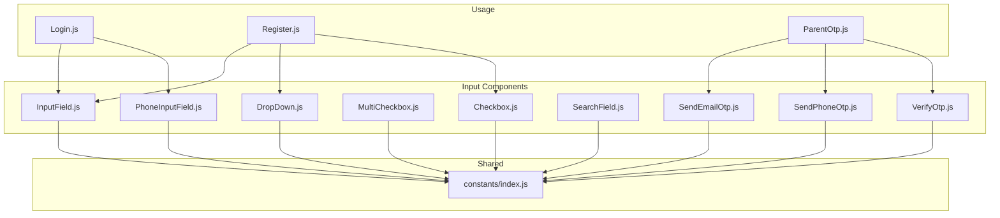
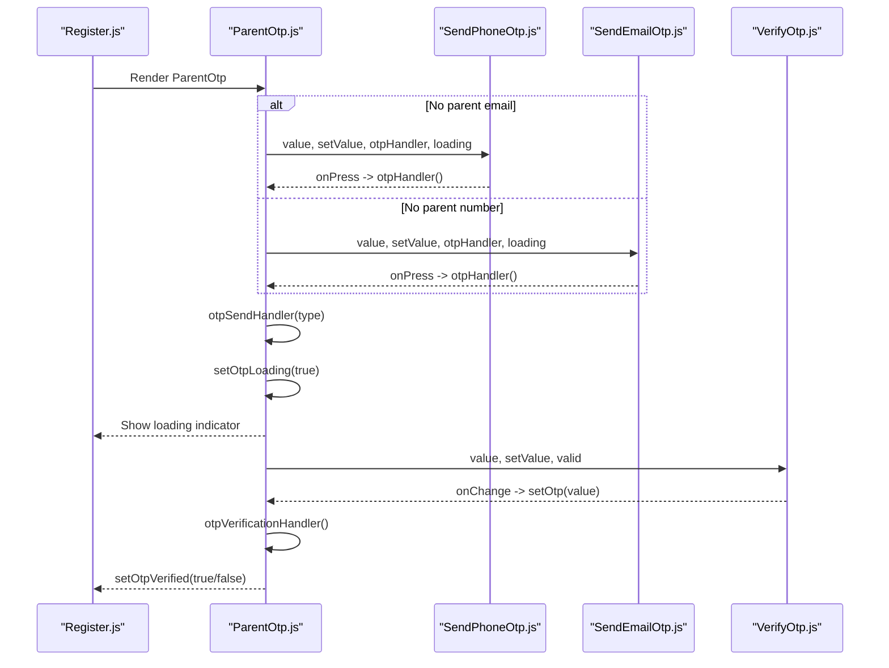
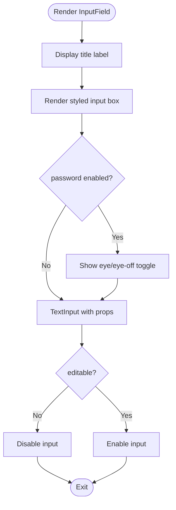
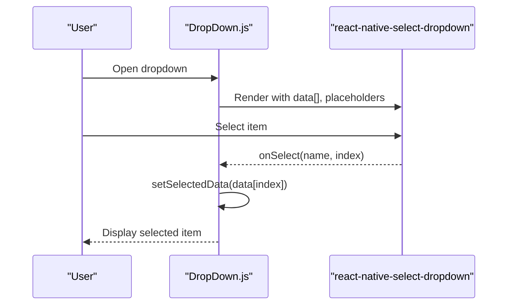
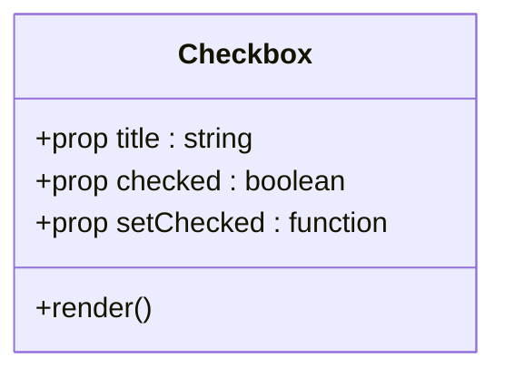
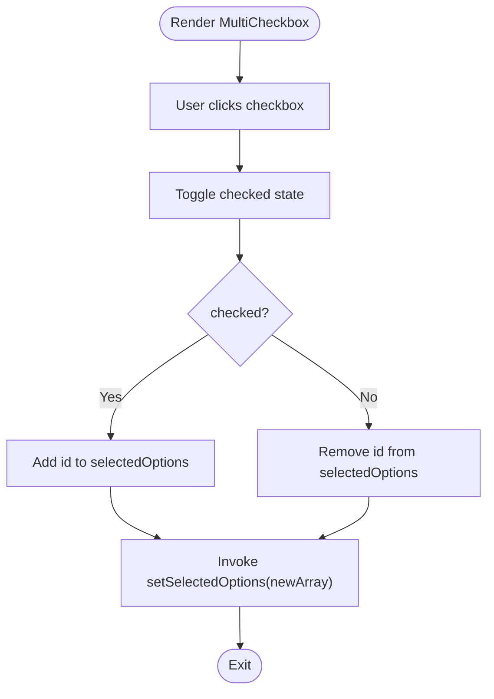
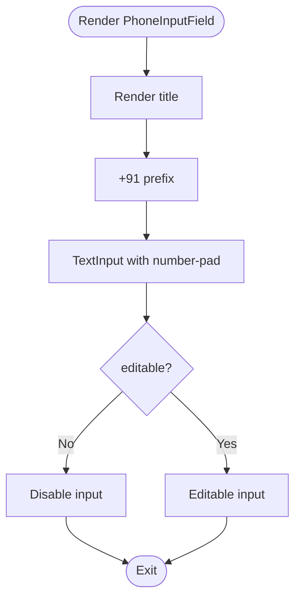
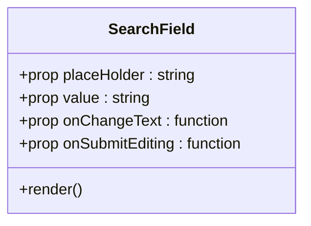
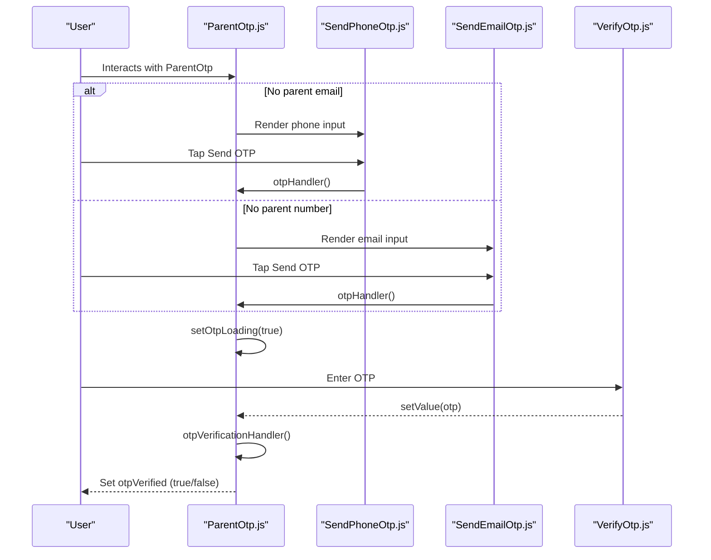
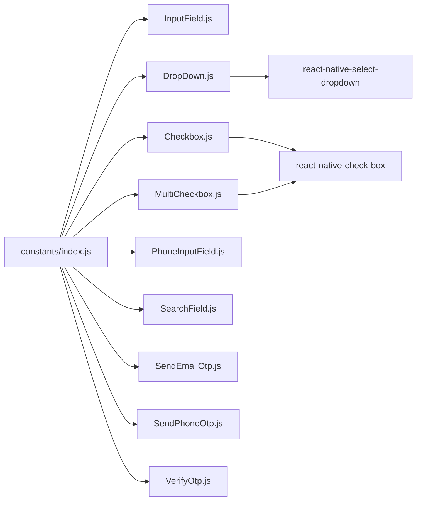

# Input Components

<cite>
**Referenced Files in This Document**
- [InputField.js](file://src/components/input/InputField.js)
- [DropDown.js](file://src/components/input/DropDown.js)
- [Checkbox.js](file://src/components/input/Checkbox.js)
- [MultiCheckbox.js](file://src/components/input/MultiCheckbox.js)
- [PhoneInputField.js](file://src/components/input/PhoneInputField.js)
- [SearchField.js](file://src/components/input/SearchField.js)
- [SendEmailOtp.js](file://src/components/input/SendEmailOtp.js)
- [SendPhoneOtp.js](file://src/components/input/SendPhoneOtp.js)
- [VerifyOtp.js](file://src/components/input/VerifyOtp.js)
- [ParentOtp.js](file://src/components/common/ParentOtp.js)
- [index.js](file://src/assets/constants/index.js)
- [Login.js](file://src/screens/Auth/Login.js)
- [Register.js](file://src/screens/Auth/Register.js)
</cite>

## Table of Contents
1. [Introduction](#introduction)
2. [Project Structure](#project-structure)
3. [Core Components](#core-components)
4. [Architecture Overview](#architecture-overview)
5. [Detailed Component Analysis](#detailed-component-analysis)
6. [Dependency Analysis](#dependency-analysis)
7. [Performance Considerations](#performance-considerations)
8. [Troubleshooting Guide](#troubleshooting-guide)
9. [Conclusion](#conclusion)
10. [Appendices](#appendices)

## Introduction
This document describes the input component suite used across HappiMynd’s forms and authentication flows. It covers:
- InputField: Base text input with optional password visibility toggle
- DropDown: Selection interface with dynamic options and optional search
- Checkbox and MultiCheckbox: Single and multiple selection controls
- PhoneInputField: International phone number input with country code prefix
- SearchField: Filter/discovery input with iconography
- OTP components: SendEmailOtp, SendPhoneOtp, VerifyOtp integrated via ParentOtp for guardian verification

Each component’s props, behavior, state management, accessibility considerations, and integration patterns are documented to support both developers and form library integrations.

## Project Structure
The input components live under src/components/input and are consumed by various screens and modals. Shared constants (colors, typography) are centralized under src/assets/constants.

**Diagram sources**
- [InputField.js:1-103](file://src/components/input/InputField.js#L1-L103)
- [DropDown.js:1-110](file://src/components/input/DropDown.js#L1-L110)
- [Checkbox.js:1-61](file://src/components/input/Checkbox.js#L1-L61)
- [MultiCheckbox.js:1-79](file://src/components/input/MultiCheckbox.js#L1-L79)
- [PhoneInputField.js:1-93](file://src/components/input/PhoneInputField.js#L1-L93)
- [SearchField.js:1-82](file://src/components/input/SearchField.js#L1-L82)
- [SendEmailOtp.js:1-96](file://src/components/input/SendEmailOtp.js#L1-L96)
- [SendPhoneOtp.js:1-106](file://src/components/input/SendPhoneOtp.js#L1-L106)
- [VerifyOtp.js:1-57](file://src/components/input/VerifyOtp.js#L1-L57)
- [ParentOtp.js:1-139](file://src/components/common/ParentOtp.js#L1-L139)
- [index.js:1-195](file://src/assets/constants/index.js#L1-L195)
- [Login.js:110-168](file://src/screens/Auth/Login.js#L110-L168)
- [Register.js:210-409](file://src/screens/Auth/Register.js#L210-L409)

**Section sources**
- [InputField.js:1-103](file://src/components/input/InputField.js#L1-L103)
- [DropDown.js:1-110](file://src/components/input/DropDown.js#L1-L110)
- [Checkbox.js:1-61](file://src/components/input/Checkbox.js#L1-L61)
- [MultiCheckbox.js:1-79](file://src/components/input/MultiCheckbox.js#L1-L79)
- [PhoneInputField.js:1-93](file://src/components/input/PhoneInputField.js#L1-L93)
- [SearchField.js:1-82](file://src/components/input/SearchField.js#L1-L82)
- [SendEmailOtp.js:1-96](file://src/components/input/SendEmailOtp.js#L1-L96)
- [SendPhoneOtp.js:1-106](file://src/components/input/SendPhoneOtp.js#L1-L106)
- [VerifyOtp.js:1-57](file://src/components/input/VerifyOtp.js#L1-L57)
- [ParentOtp.js:1-139](file://src/components/common/ParentOtp.js#L1-L139)
- [index.js:1-195](file://src/assets/constants/index.js#L1-L195)
- [Login.js:110-168](file://src/screens/Auth/Login.js#L110-L168)
- [Register.js:210-409](file://src/screens/Auth/Register.js#L210-L409)

## Core Components
- InputField: Provides labeled text input with optional password masking and secureTextEntry toggling. Props include title, placeHolder, password, keyboardType, onChangeText, value, and editable.
- DropDown: Renders a labeled dropdown with selectable items. Accepts title, placeHolder, data (array of objects with name), setSelectedData, and optional search configuration.
- Checkbox: Single-selection checkbox with custom visuals and right-aligned label.
- MultiCheckbox: Individual option in a multi-select group; updates a shared selectedOptions array via id and checked state.
- PhoneInputField: Labeled phone input with fixed country code prefix (+91) and numeric keyboard.
- SearchField: Icon-enhanced single-line input suitable for search and filter UX.
- OTP components: SendEmailOtp, SendPhoneOtp, VerifyOtp encapsulate OTP send and verification UX; orchestrated by ParentOtp.

Validation and accessibility:
- Validation is not enforced inside components themselves; pass-through handlers and values are used. Integrate with form libraries (e.g., validation schemas) externally.
- Accessibility features observed: autoCapitalize none for sensitive inputs, autoCorrect disabled for search, explicit keyboard types, and focusable touch targets.

Integration with form libraries:
- Components expose controlled props (value, onChangeText) enabling binding to external state and validation libraries.

**Section sources**
- [InputField.js:19-63](file://src/components/input/InputField.js#L19-L63)
- [DropDown.js:14-66](file://src/components/input/DropDown.js#L14-L66)
- [Checkbox.js:13-35](file://src/components/input/Checkbox.js#L13-L35)
- [MultiCheckbox.js:13-52](file://src/components/input/MultiCheckbox.js#L13-L52)
- [PhoneInputField.js:19-53](file://src/components/input/PhoneInputField.js#L19-L53)
- [SearchField.js:19-48](file://src/components/input/SearchField.js#L19-L48)
- [SendEmailOtp.js:19-67](file://src/components/input/SendEmailOtp.js#L19-L67)
- [SendPhoneOtp.js:19-77](file://src/components/input/SendPhoneOtp.js#L19-L77)
- [VerifyOtp.js:13-41](file://src/components/input/VerifyOtp.js#L13-L41)
- [ParentOtp.js:24-116](file://src/components/common/ParentOtp.js#L24-L116)

## Architecture Overview
The OTP workflow composes three input components under a coordinator that manages loading, state, and verification callbacks.

**Diagram sources**
- [ParentOtp.js:43-70](file://src/components/common/ParentOtp.js#L43-L70)
- [SendPhoneOtp.js:19-77](file://src/components/input/SendPhoneOtp.js#L19-L77)
- [SendEmailOtp.js:19-67](file://src/components/input/SendEmailOtp.js#L19-L67)
- [VerifyOtp.js:13-41](file://src/components/input/VerifyOtp.js#L13-L41)
- [Register.js:244-249](file://src/screens/Auth/Register.js#L244-L249)

## Detailed Component Analysis

### InputField
- Purpose: Labeled text input with optional password visibility toggle.
- Props:
  - title: Label text
  - placeHolder: Placeholder text
  - password: Boolean to enable secure entry and toggle icon
  - keyboardType: Keyboard type (default text)
  - onChangeText: Callback receiving changed text
  - value: Controlled value
  - editable: Disable editing if false
- Behavior:
  - Toggles secureTextEntry based on password flag and internal showPassword state
  - Uses responsive units for sizing and typography
- Accessibility:
  - autoCapitalize set to none
  - editable prop allows disabling input
- Integration:
  - Used in Login and Registration flows for username/password and nicknames

**Diagram sources**
- [InputField.js:19-63](file://src/components/input/InputField.js#L19-L63)

**Section sources**
- [InputField.js:19-63](file://src/components/input/InputField.js#L19-L63)
- [Login.js:114-126](file://src/screens/Auth/Login.js#L114-L126)
- [Register.js:220-241](file://src/screens/Auth/Register.js#L220-L241)

### DropDown
- Purpose: Labeled dropdown with optional search and selection callback.
- Props:
  - title: Label text
  - placeHolder: Default button text
  - data: Array of selectable items (expects objects with name)
  - setSelectedData: Callback receiving the selected data object
  - search: Optional search configuration passed to the underlying dropdown
- Behavior:
  - Maps data to display names for selection
  - Invokes setSelectedData with the original data object on select
  - Provides search UI with custom icons and placeholder
- Accessibility:
  - Uses accessible dropdown styles and text sizes
- Integration:
  - Used in registration to choose profile type

**Diagram sources**
- [DropDown.js:14-66](file://src/components/input/DropDown.js#L14-L66)

**Section sources**
- [DropDown.js:14-66](file://src/components/input/DropDown.js#L14-L66)
- [Register.js:227-232](file://src/screens/Auth/Register.js#L227-L232)

### Checkbox
- Purpose: Single checkbox with custom visuals and right-aligned label.
- Props:
  - title: Label text
  - checked: Boolean state
  - setChecked: Setter for checked state
- Behavior:
  - Toggles checked state on click
  - Renders custom unchecked/checked visuals
- Integration:
  - Used in registration for terms agreement

**Diagram sources**
- [Checkbox.js:13-35](file://src/components/input/Checkbox.js#L13-L35)

**Section sources**
- [Checkbox.js:13-35](file://src/components/input/Checkbox.js#L13-L35)
- [Register.js:346-376](file://src/screens/Auth/Register.js#L346-L376)

### MultiCheckbox
- Purpose: Individual option in a multi-select group.
- Props:
  - id: Unique identifier for the option
  - title: Label text
  - selectedOptions: Array of currently selected ids
  - setSelectedOptions: Callback to update selected ids
- Behavior:
  - Tracks local checked state
  - Syncs with parent via useEffect when checked flips
  - Adds/removes id from selectedOptions accordingly
- Integration:
  - Used to model multi-option selections in forms

**Diagram sources**
- [MultiCheckbox.js:13-52](file://src/components/input/MultiCheckbox.js#L13-L52)

**Section sources**
- [MultiCheckbox.js:13-52](file://src/components/input/MultiCheckbox.js#L13-L52)

### PhoneInputField
- Purpose: Labeled phone input with fixed country code prefix.
- Props:
  - title: Label text
  - placeHolder: Placeholder text
  - keyboardType: Defaults to number-pad
  - onChangeText: Receives changed text
  - value: Controlled value
  - editable: Disable editing if false
- Behavior:
  - Displays fixed country code (+91) inline
  - Numeric keypad for phone input
- Accessibility:
  - autoCapitalize none
  - editable prop supports read-only modes
- Integration:
  - Used in OTP parent verification flow

**Diagram sources**
- [PhoneInputField.js:19-53](file://src/components/input/PhoneInputField.js#L19-L53)

**Section sources**
- [PhoneInputField.js:19-53](file://src/components/input/PhoneInputField.js#L19-L53)
- [SendPhoneOtp.js:19-77](file://src/components/input/SendPhoneOtp.js#L19-L77)

### SearchField
- Purpose: Icon-enhanced single-line input for search/filter UX.
- Props:
  - placeHolder: Placeholder text
  - value: Controlled value
  - onChangeText: Receives changed text
  - onSubmitEditing: Callback triggered on submit
- Behavior:
  - Left-aligned search icon
  - Disables auto-correction
  - Single-line input
- Integration:
  - Suitable for discovery/search screens

**Diagram sources**
- [SearchField.js:19-48](file://src/components/input/SearchField.js#L19-L48)

**Section sources**
- [SearchField.js:19-48](file://src/components/input/SearchField.js#L19-L48)

### OTP Components and ParentOtp Coordinator
- SendPhoneOtp
  - Props: value, setValue, otpHandler, loading
  - Behavior: Displays +91 prefix and number input; triggers otpHandler on press; shows spinner when loading
- SendEmailOtp
  - Props: value, setValue, otpHandler, loading
  - Behavior: Email input with send OTP button; disables when loading
- VerifyOtp
  - Props: value, setValue, valid
  - Behavior: Number-pad input; shows green check or red warning based on valid flag
- ParentOtp
  - Orchestrates OTP flow: conditionally renders phone/email input, manages loading, sends OTP via context, verifies OTP, and sets otpVerified

**Diagram sources**
- [ParentOtp.js:24-116](file://src/components/common/ParentOtp.js#L24-L116)
- [SendPhoneOtp.js:19-77](file://src/components/input/SendPhoneOtp.js#L19-L77)
- [SendEmailOtp.js:19-67](file://src/components/input/SendEmailOtp.js#L19-L67)
- [VerifyOtp.js:13-41](file://src/components/input/VerifyOtp.js#L13-L41)

**Section sources**
- [SendPhoneOtp.js:19-77](file://src/components/input/SendPhoneOtp.js#L19-L77)
- [SendEmailOtp.js:19-67](file://src/components/input/SendEmailOtp.js#L19-L67)
- [VerifyOtp.js:13-41](file://src/components/input/VerifyOtp.js#L13-L41)
- [ParentOtp.js:24-116](file://src/components/common/ParentOtp.js#L24-L116)
- [Register.js:244-249](file://src/screens/Auth/Register.js#L244-L249)

## Dependency Analysis
- Internal dependencies:
  - All input components depend on shared colors from constants/index.js for consistent theming.
  - OTP components are composed by ParentOtp to coordinate state and context-driven actions.
- External dependencies:
  - react-native-select-dropdown powers DropDown
  - react-native-check-box powers Checkbox and MultiCheckbox
  - Vector icons (Feather, FontAwesome, FontAwesome5, AntDesign, MaterialIcons) for UI affordances

**Diagram sources**
- [index.js:1-195](file://src/assets/constants/index.js#L1-L195)
- [DropDown.js](file://src/components/input/DropDown.js#L8)
- [Checkbox.js](file://src/components/input/Checkbox.js#L8)
- [MultiCheckbox.js](file://src/components/input/MultiCheckbox.js#L8)

**Section sources**
- [index.js:1-195](file://src/assets/constants/index.js#L1-L195)
- [DropDown.js](file://src/components/input/DropDown.js#L8)
- [Checkbox.js](file://src/components/input/Checkbox.js#L8)
- [MultiCheckbox.js](file://src/components/input/MultiCheckbox.js#L8)

## Performance Considerations
- Prefer controlled props (value + setter) to avoid unnecessary re-renders and keep inputs predictable.
- For DropDown, limit data size or implement virtualization if lists grow large.
- Debounce SearchField input if used for server-side filtering to reduce network requests.
- Avoid heavy computations in selection callbacks; memoize data transformations.
- Keep icon rendering lightweight; reuse vector icons sparingly in dense lists.

## Troubleshooting Guide
- Password toggle not working:
  - Ensure password prop is true and secureTextEntry toggles accordingly.
  - Confirm showPassword state updates on toggle press.
- Dropdown selection not reflected:
  - Verify setSelectedData receives the original data object (not just the display name).
  - Ensure data is an array of objects with name property.
- Checkbox visuals not updating:
  - Confirm checked prop is boolean and setChecked is a function.
  - Ensure custom checked/unchecked images are present.
- PhoneInputField not accepting digits:
  - Confirm keyboardType is number-pad and editable is true.
- OTP not sending:
  - Check loading flag prevents multiple submissions; ensure otpHandler is provided and uniqueId is generated.
- VerifyOtp icon not appearing:
  - valid prop must be true/false; ensure value is truthy to trigger icon rendering.

**Section sources**
- [InputField.js:38-59](file://src/components/input/InputField.js#L38-L59)
- [DropDown.js:26-31](file://src/components/input/DropDown.js#L26-L31)
- [Checkbox.js:17-33](file://src/components/input/Checkbox.js#L17-L33)
- [PhoneInputField.js:41-49](file://src/components/input/PhoneInputField.js#L41-L49)
- [SendPhoneOtp.js:53-77](file://src/components/input/SendPhoneOtp.js#L53-L77)
- [VerifyOtp.js:24-39](file://src/components/input/VerifyOtp.js#L24-L39)

## Conclusion
The input component suite provides a cohesive, theme-consistent set of form controls. They emphasize controlled inputs, accessibility-friendly defaults, and composability. For robust validation and complex workflows, integrate with external form libraries and orchestrate OTP flows via ParentOtp. These components are designed for reuse across screens and modals, ensuring a consistent user experience.

## Appendices
- Color palette used across components:
  - Backgrounds, borders, and primary text colors are defined centrally and applied consistently.

**Section sources**
- [index.js:1-14](file://src/assets/constants/index.js#L1-L14)