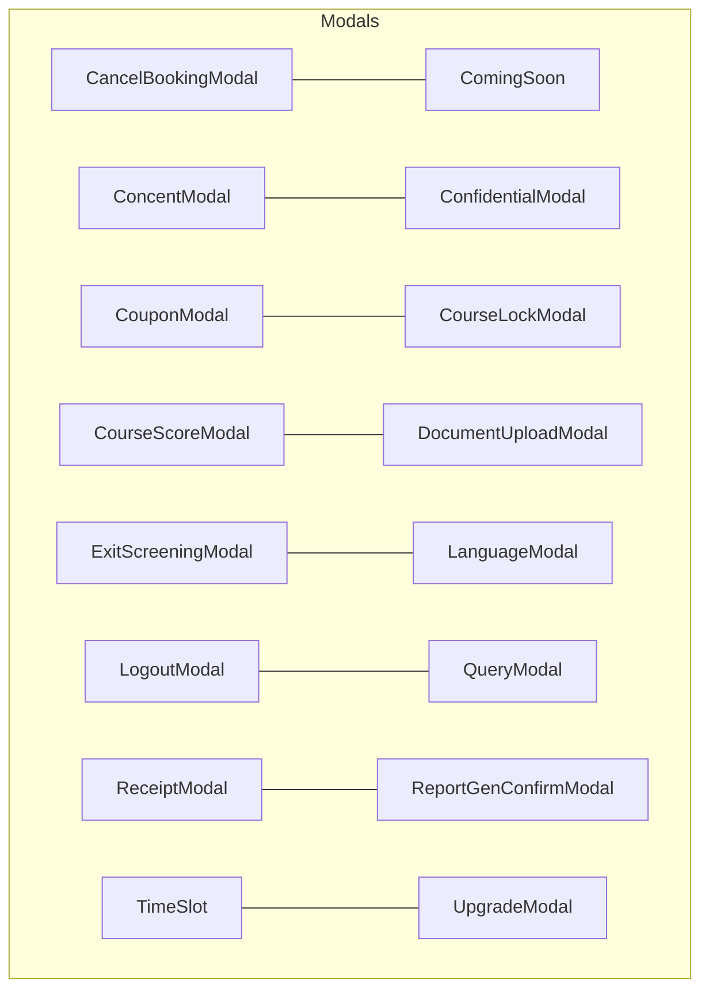
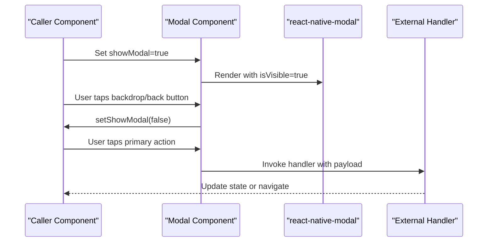
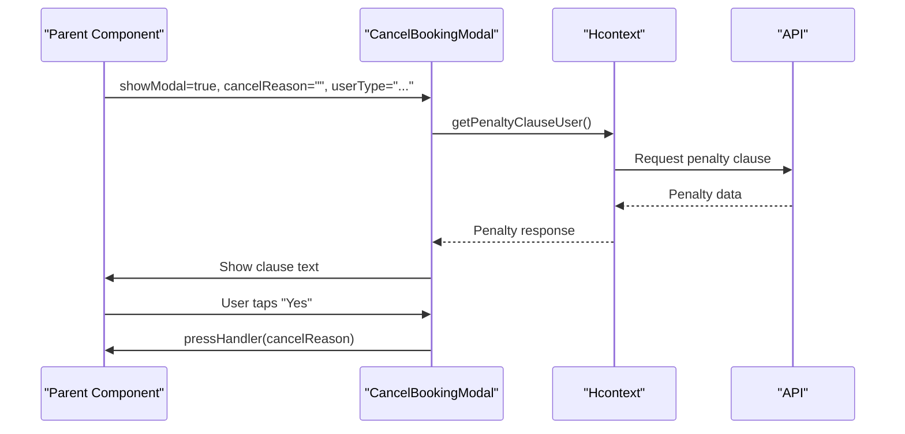
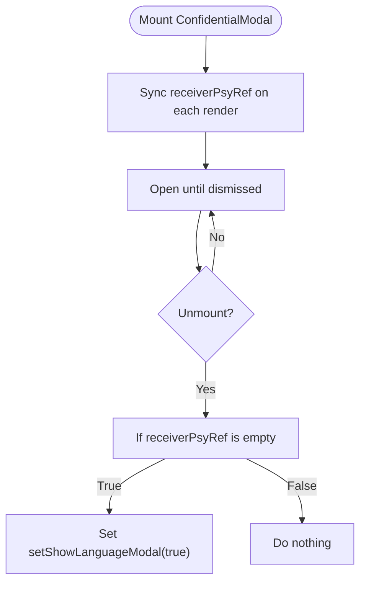
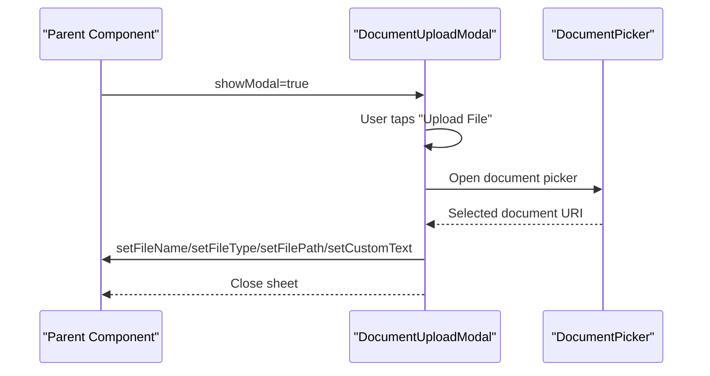
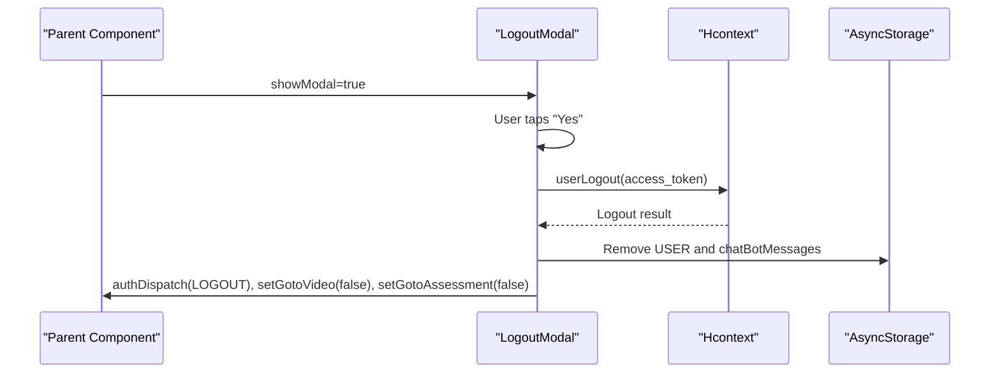
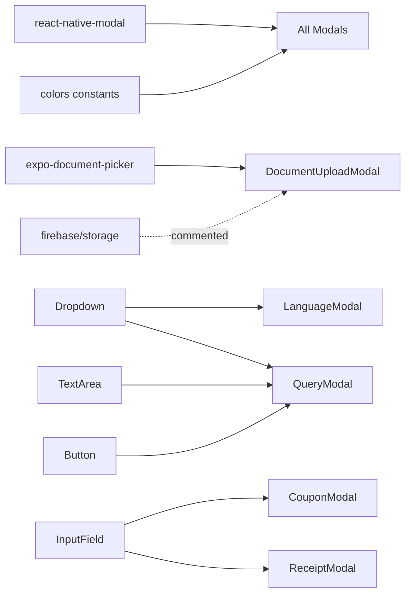

# Modal Components

<cite>
**Referenced Files in This Document**
- [CancelBookingModal.js](file://src/components/Modals/CancelBookingModal.js)
- [ComingSoon.js](file://src/components/Modals/ComingSoon.js)
- [ConcentModal.js](file://src/components/Modals/ConcentModal.js)
- [ConfidentialModal.js](file://src/components/Modals/ConfidentialModal.js)
- [CouponModal.js](file://src/components/Modals/CouponModal.js)
- [CourseLockModal.js](file://src/components/Modals/CourseLockModal.js)
- [CourseScoreModal.js](file://src/components/Modals/CourseScoreModal.js)
- [DocumentUploadModal.js](file://src/components/Modals/DocumentUploadModal.js)
- [ExitScreeningModal.js](file://src/components/Modals/ExitScreeningModal.js)
- [LanguageModal.js](file://src/components/Modals/LanguageModal.js)
- [LogoutModal.js](file://src/components/Modals/LogoutModal.js)
- [QueryModal.js](file://src/components/Modals/QueryModal.js)
- [ReceiptModal.js](file://src/components/Modals/ReceiptModal.js)
- [ReportGenConfirmModal.js](file://src/components/Modals/ReportGenConfirmModal.js)
- [TimeSlot.js](file://src/components/Modals/TimeSlot.js)
- [UpgradeModal.js](file://src/components/Modals/UpgradeModal.js)
</cite>

## Table of Contents
1. [Introduction](#introduction)
2. [Project Structure](#project-structure)
3. [Core Components](#core-components)
4. [Architecture Overview](#architecture-overview)
5. [Detailed Component Analysis](#detailed-component-analysis)
6. [Dependency Analysis](#dependency-analysis)
7. [Performance Considerations](#performance-considerations)
8. [Troubleshooting Guide](#troubleshooting-guide)
9. [Conclusion](#conclusion)

## Introduction
This document describes the modal component system in HappiMynd. It explains how modals are structured, how overlays are managed, and how user interactions are handled. It also documents specific modal types and their workflows, including:
- Service cancellation with confirmation and penalty clause display
- Feature availability notifications
- Consent and agreement workflows
- Sensitive information handling
- Promotional offers and discounts
- Educational progress management
- File submission processes
- Assessment termination
- Localization settings
- Session termination
- Additional modals: Query, Receipt, Report generation confirmation, Time slot selection, and Upgrade prompts

## Project Structure
The modal components live under src/components/Modals and share a consistent pattern:
- They accept props for visibility and callbacks
- They use react-native-modal for overlay rendering
- They define responsive styles and typography via shared constants
- Many integrate reusable UI components (buttons, dropdowns, text areas)

**Diagram sources**
- [CancelBookingModal.js:24-135](file://src/components/Modals/CancelBookingModal.js#L24-L135)
- [ComingSoon.js:21-69](file://src/components/Modals/ComingSoon.js#L21-L69)
- [ConcentModal.js:13-96](file://src/components/Modals/ConcentModal.js#L13-L96)
- [ConfidentialModal.js:13-79](file://src/components/Modals/ConfidentialModal.js#L13-L79)
- [CouponModal.js:16-78](file://src/components/Modals/CouponModal.js#L16-L78)
- [CourseLockModal.js:13-61](file://src/components/Modals/CourseLockModal.js#L13-L61)
- [CourseScoreModal.js:21-63](file://src/components/Modals/CourseScoreModal.js#L21-L63)
- [DocumentUploadModal.js:15-94](file://src/components/Modals/DocumentUploadModal.js#L15-L94)
- [ExitScreeningModal.js:13-68](file://src/components/Modals/ExitScreeningModal.js#L13-L68)
- [LanguageModal.js:17-87](file://src/components/Modals/LanguageModal.js#L17-L87)
- [LogoutModal.js:24-101](file://src/components/Modals/LogoutModal.js#L24-L101)
- [QueryModal.js:25-84](file://src/components/Modals/QueryModal.js#L25-L84)
- [ReceiptModal.js:16-67](file://src/components/Modals/ReceiptModal.js#L16-L67)
- [ReportGenConfirmModal.js:21-72](file://src/components/Modals/ReportGenConfirmModal.js#L21-L72)
- [TimeSlot.js:73-159](file://src/components/Modals/TimeSlot.js#L73-L159)
- [UpgradeModal.js:13-69](file://src/components/Modals/UpgradeModal.js#L13-L69)

**Section sources**
- [CancelBookingModal.js:1-183](file://src/components/Modals/CancelBookingModal.js#L1-L183)
- [ComingSoon.js:1-111](file://src/components/Modals/ComingSoon.js#L1-L111)
- [ConcentModal.js:1-153](file://src/components/Modals/ConcentModal.js#L1-L153)
- [ConfidentialModal.js:1-116](file://src/components/Modals/ConfidentialModal.js#L1-L116)
- [CouponModal.js:1-116](file://src/components/Modals/CouponModal.js#L1-L116)
- [CourseLockModal.js:1-94](file://src/components/Modals/CourseLockModal.js#L1-L94)
- [CourseScoreModal.js:1-119](file://src/components/Modals/CourseScoreModal.js#L1-L119)
- [DocumentUploadModal.js:1-119](file://src/components/Modals/DocumentUploadModal.js#L1-L119)
- [ExitScreeningModal.js:1-107](file://src/components/Modals/ExitScreeningModal.js#L1-L107)
- [LanguageModal.js:1-125](file://src/components/Modals/LanguageModal.js#L1-L125)
- [LogoutModal.js:1-139](file://src/components/Modals/LogoutModal.js#L1-L139)
- [QueryModal.js:1-106](file://src/components/Modals/QueryModal.js#L1-L106)
- [ReceiptModal.js:1-105](file://src/components/Modals/ReceiptModal.js#L1-L105)
- [ReportGenConfirmModal.js:1-122](file://src/components/Modals/ReportGenConfirmModal.js#L1-L122)
- [TimeSlot.js:1-211](file://src/components/Modals/TimeSlot.js#L1-L211)
- [UpgradeModal.js:1-108](file://src/components/Modals/UpgradeModal.js#L1-L108)

## Core Components
- Overlay management: All modals use react-native-modal with isVisible bound to showModal and callbacks for onBackButtonPress/onBackdropPress to close.
- Focus trapping and keyboard navigation: The base modal library handles backdrop/back button behavior; no explicit focus trap is implemented in these files.
- Styling and responsiveness: Styles use widthPercentageToDP and heightPercentageToDP for layout and RFValue/RFPercentage for font sizes, ensuring consistent scaling across devices.
- Shared constants: colors are imported from a central constants file to maintain theme consistency.

Common prop patterns across modals:
- navigation, showModal, setShowModal
- Optional handlers: pressHandler, handleSubmit, fetchPsycologist, userLogout, etc.
- Optional flags: loading, isCouponApplied, userType, points, etc.

**Section sources**
- [CancelBookingModal.js:24-70](file://src/components/Modals/CancelBookingModal.js#L24-L70)
- [ComingSoon.js:21-29](file://src/components/Modals/ComingSoon.js#L21-L29)
- [ConcentModal.js:13-27](file://src/components/Modals/ConcentModal.js#L13-L27)
- [ConfidentialModal.js:13-55](file://src/components/Modals/ConfidentialModal.js#L13-L55)
- [CouponModal.js:16-32](file://src/components/Modals/CouponModal.js#L16-L32)
- [CourseLockModal.js:13-27](file://src/components/Modals/CourseLockModal.js#L13-L27)
- [CourseScoreModal.js:21-34](file://src/components/Modals/CourseScoreModal.js#L21-L34)
- [DocumentUploadModal.js:15-26](file://src/components/Modals/DocumentUploadModal.js#L15-L26)
- [ExitScreeningModal.js:13-21](file://src/components/Modals/ExitScreeningModal.js#L13-L21)
- [LanguageModal.js:17-23](file://src/components/Modals/LanguageModal.js#L17-L23)
- [LogoutModal.js:24-34](file://src/components/Modals/LogoutModal.js#L24-L34)
- [QueryModal.js:25-38](file://src/components/Modals/QueryModal.js#L25-L38)
- [ReceiptModal.js:16-24](file://src/components/Modals/ReceiptModal.js#L16-L24)
- [ReportGenConfirmModal.js:21-29](file://src/components/Modals/ReportGenConfirmModal.js#L21-L29)
- [TimeSlot.js:73-82](file://src/components/Modals/TimeSlot.js#L73-L82)
- [UpgradeModal.js:13-21](file://src/components/Modals/UpgradeModal.js#L13-L21)

## Architecture Overview
The modal architecture follows a consistent pattern:
- Visibility controlled by showModal state
- Dismissal via backdrop or back button triggers setShowModal(false)
- Action buttons trigger external handlers (pressHandler, handleSubmit, logoutHandler, etc.)
- Some modals integrate reusable components (Dropdown, TextArea, InputField, Button)

**Diagram sources**
- [CancelBookingModal.js:72-135](file://src/components/Modals/CancelBookingModal.js#L72-L135)
- [LogoutModal.js:54-101](file://src/components/Modals/LogoutModal.js#L54-L101)
- [QueryModal.js:39-84](file://src/components/Modals/QueryModal.js#L39-L84)

## Detailed Component Analysis

### CancelBookingModal
Purpose: Confirm booking cancellation, collect a reason, and display a penalty clause based on user type.

Key behaviors:
- Fetches penalty clause text on mount using a context method
- Displays a text input for cancellation reason
- Provides Yes/No actions; Yes invokes a passed handler and optionally shows a loader
- Shows a clause message derived from user type

**Diagram sources**
- [CancelBookingModal.js:46-70](file://src/components/Modals/CancelBookingModal.js#L46-L70)
- [CancelBookingModal.js:112-118](file://src/components/Modals/CancelBookingModal.js#L112-L118)

**Section sources**
- [CancelBookingModal.js:24-135](file://src/components/Modals/CancelBookingModal.js#L24-L135)

### ComingSoon
Purpose: Notify users that a feature is coming soon and provide a quick link to WhatsApp support.

Key behaviors:
- Displays a hero image and informational text
- Provides an OK action to dismiss
- Includes a WhatsApp link for immediate assistance

**Section sources**
- [ComingSoon.js:21-69](file://src/components/Modals/ComingSoon.js#L21-L69)

### ConcentModal
Purpose: Obtain consent for session recording during therapy.

Key behaviors:
- Presents a title and bullet points explaining benefits
- Offers Yes/No actions routed to a parent-provided handler
- Uses a distinct hero image and styling

**Section sources**
- [ConcentModal.js:13-96](file://src/components/Modals/ConcentModal.js#L13-L96)

### ConfidentialModal
Purpose: Assure confidentiality and conditionally open a language selection modal if no buddy is assigned.

Key behaviors:
- Keeps a ref to the latest receiverPsy prop to avoid stale closure issues
- On unmount, if no buddy is present, opens the language modal
- Confirm action invokes a provided handler

**Diagram sources**
- [ConfidentialModal.js:25-47](file://src/components/Modals/ConfidentialModal.js#L25-L47)
- [ConfidentialModal.js:50-79](file://src/components/Modals/ConfidentialModal.js#L50-L79)

**Section sources**
- [ConfidentialModal.js:13-79](file://src/components/Modals/ConfidentialModal.js#L13-L79)

### CouponModal
Purpose: Allow users to apply promotional coupon codes.

Key behaviors:
- Integrates an InputField for coupon code entry
- Apply button is disabled when a coupon is applied
- Cancel action closes the modal
- Submit handler invoked on Apply

**Section sources**
- [CouponModal.js:16-78](file://src/components/Modals/CouponModal.js#L16-L78)

### CourseLockModal
Purpose: Inform users that a course module is locked and guide them to resume or go back.

Key behaviors:
- Displays a message about progression rules
- Offers Go Back and Resume actions routed to a handler

**Section sources**
- [CourseLockModal.js:13-61](file://src/components/Modals/CourseLockModal.js#L13-L61)

### CourseScoreModal
Purpose: Display points earned after completing a course task.

Key behaviors:
- Shows a hero image and a highlighted points box
- Confirm action dismisses the modal

**Section sources**
- [CourseScoreModal.js:21-63](file://src/components/Modals/CourseScoreModal.js#L21-L63)

### DocumentUploadModal
Purpose: Provide a bottom sheet-style action menu for file uploads.

Key behaviors:
- Opens a bottom sheet with Upload File and Cancel actions
- Upload File action opens the device document picker, extracts filename and metadata, and populates parent state fields
- Cancel action dismisses the modal

**Diagram sources**
- [DocumentUploadModal.js:27-58](file://src/components/Modals/DocumentUploadModal.js#L27-L58)
- [DocumentUploadModal.js:61-94](file://src/components/Modals/DocumentUploadModal.js#L61-L94)

**Section sources**
- [DocumentUploadModal.js:15-94](file://src/components/Modals/DocumentUploadModal.js#L15-L94)

### ExitScreeningModal
Purpose: Encourage completion of screening questions or allow saving and exiting.

Key behaviors:
- Presents Continue and Save and Exit actions
- Save and Exit navigates to HomeScreen

**Section sources**
- [ExitScreeningModal.js:13-68](file://src/components/Modals/ExitScreeningModal.js#L13-L68)

### LanguageModal
Purpose: Allow users to select a language for communication and fetch a matching buddy.

Key behaviors:
- Fetches supported languages on mount
- Uses a Dropdown component to select a language
- Confirms selection to fetch a buddy and then closes

**Section sources**
- [LanguageModal.js:17-87](file://src/components/Modals/LanguageModal.js#L17-L87)

### LogoutModal
Purpose: Confirm session termination and perform logout.

Key behaviors:
- Calls a logout handler that dispatches LOGOUT, clears AsyncStorage, resets flags, and navigates
- Provides Yes/No actions with optional loader

**Diagram sources**
- [LogoutModal.js:35-52](file://src/components/Modals/LogoutModal.js#L35-L52)
- [LogoutModal.js:54-101](file://src/components/Modals/LogoutModal.js#L54-L101)

**Section sources**
- [LogoutModal.js:24-101](file://src/components/Modals/LogoutModal.js#L24-L101)

### QueryModal
Purpose: Collect user queries with category and description.

Key behaviors:
- Uses a Dropdown for category selection and a TextArea for description
- Submits via a Button; handler receives category and description

**Section sources**
- [QueryModal.js:25-84](file://src/components/Modals/QueryModal.js#L25-L84)

### ReceiptModal
Purpose: Capture an email address for receipts.

Key behaviors:
- Displays explanatory text and an InputField for email
- Confirm action invokes a handler with the email value

**Section sources**
- [ReceiptModal.js:16-67](file://src/components/Modals/ReceiptModal.js#L16-L67)

### ReportGenConfirmModal
Purpose: Confirm report generation and offer Continue/Cancel actions.

Key behaviors:
- Displays a message and two actions
- Both actions dismiss the modal

**Section sources**
- [ReportGenConfirmModal.js:21-72](file://src/components/Modals/ReportGenConfirmModal.js#L21-L72)

### TimeSlot
Purpose: Select a time slot from a predefined list.

Key behaviors:
- Renders a scrollable grid of time slots
- Tracks selected slot and allows Confirm or Cancel
- Supports loading state on Confirm

**Section sources**
- [TimeSlot.js:73-159](file://src/components/Modals/TimeSlot.js#L73-L159)

### UpgradeModal
Purpose: Prompt users to upgrade for premium content access.

Key behaviors:
- Displays messaging about subscription requirements
- Buy action navigates to Pricing with a preselected plan
- Cancel action dismisses the modal

**Section sources**
- [UpgradeModal.js:13-69](file://src/components/Modals/UpgradeModal.js#L13-L69)

## Dependency Analysis
- External libraries:
  - react-native-modal for overlay rendering
  - expo-document-picker for file selection
  - firebase/storage (commented usage in DocumentUploadModal)
- Internal dependencies:
  - Shared constants (colors)
  - Reusable UI components (Dropdown, TextArea, InputField, Button)
  - Context (Hcontext) for state and API calls in several modals

**Diagram sources**
- [DocumentUploadModal.js:9-10](file://src/components/Modals/DocumentUploadModal.js#L9-L10)
- [LanguageModal.js:15-15](file://src/components/Modals/LanguageModal.js#L15-L15)
- [QueryModal.js:14-16](file://src/components/Modals/QueryModal.js#L14-L16)
- [CouponModal.js:14-14](file://src/components/Modals/CouponModal.js#L14-L14)
- [ReceiptModal.js:14-14](file://src/components/Modals/ReceiptModal.js#L14-L14)

**Section sources**
- [DocumentUploadModal.js:9-10](file://src/components/Modals/DocumentUploadModal.js#L9-L10)
- [LanguageModal.js:15-15](file://src/components/Modals/LanguageModal.js#L15-L15)
- [QueryModal.js:14-16](file://src/components/Modals/QueryModal.js#L14-L16)
- [CouponModal.js:14-14](file://src/components/Modals/CouponModal.js#L14-L14)
- [ReceiptModal.js:14-14](file://src/components/Modals/ReceiptModal.js#L14-L14)

## Performance Considerations
- Rendering cost: TimeSlot renders a large list of time slots; consider virtualization or pagination for very long lists.
- Network calls: CancelBookingModal and LanguageModal perform network requests on mount; ensure caching and minimal re-renders.
- Modal stacking: Avoid nesting multiple modals to reduce layout thrashing.
- Image assets: Ensure images are appropriately sized to minimize memory usage.

## Troubleshooting Guide
- Modal does not close on backdrop or back button:
  - Ensure showModal is toggled via setShowModal(false) in onBackButtonPress/onBackdropPress.
- Stale props in cleanup:
  - Use refs to track the latest prop values (as seen in ConfidentialModal) to prevent stale closures.
- Document picker errors:
  - Wrap document selection in try/catch and log errors for diagnostics.
- Logout not clearing state:
  - Verify AsyncStorage removal and authDispatch(LOGOUT) are executed in order.

**Section sources**
- [ConfidentialModal.js:25-47](file://src/components/Modals/ConfidentialModal.js#L25-L47)
- [DocumentUploadModal.js:55-58](file://src/components/Modals/DocumentUploadModal.js#L55-L58)
- [LogoutModal.js:35-52](file://src/components/Modals/LogoutModal.js#L35-L52)

## Conclusion
The modal system in HappiMynd is standardized around a simple, predictable contract: visibility state, dismissal callbacks, and action handlers. Each modal encapsulates a focused user intent, integrates reusable UI components, and leverages shared constants for consistent styling. The documented workflows provide clear guidance for extending or modifying modals while preserving UX consistency.