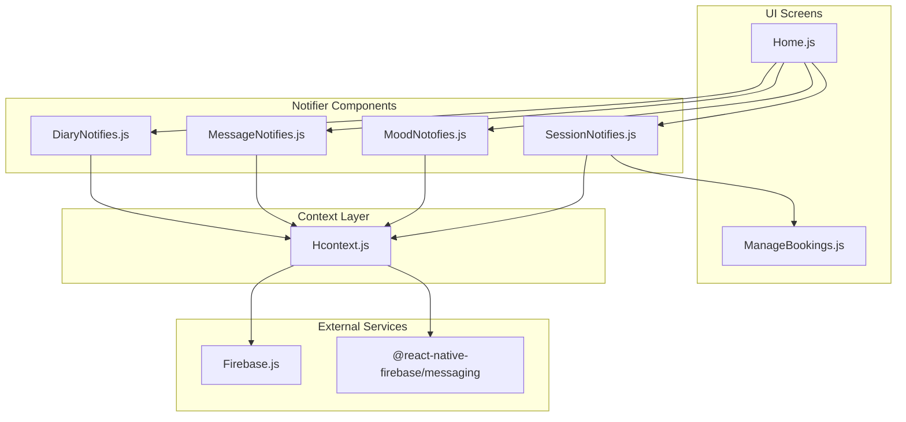
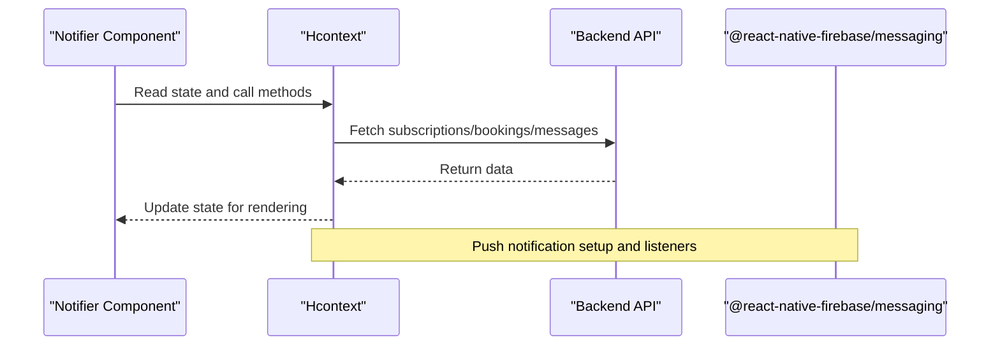
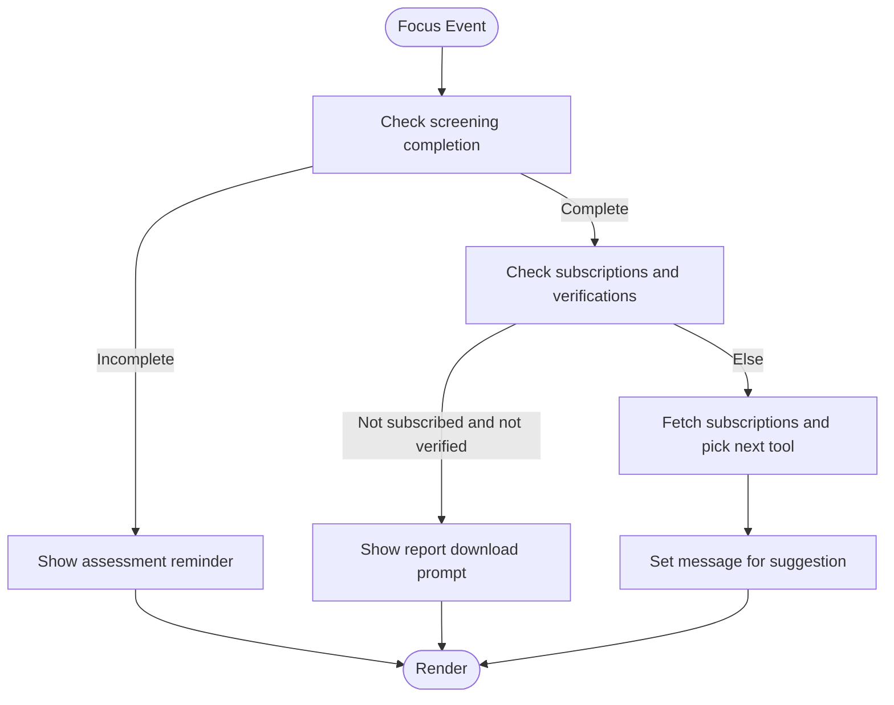
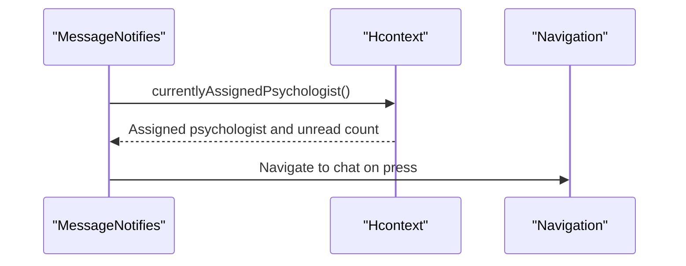
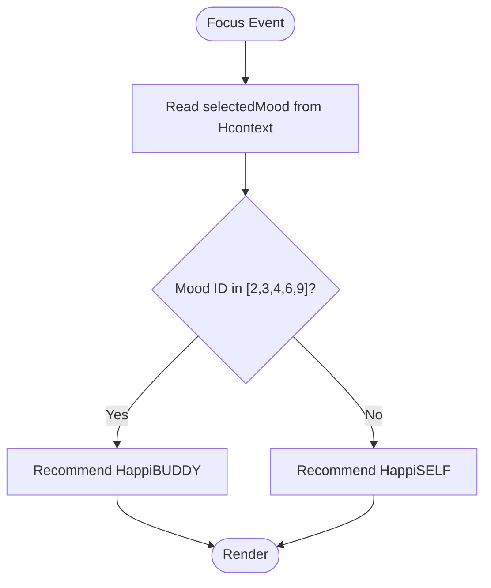
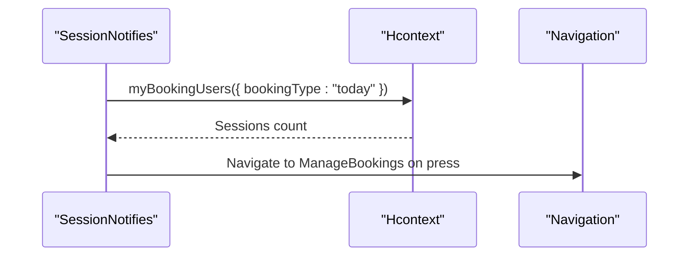
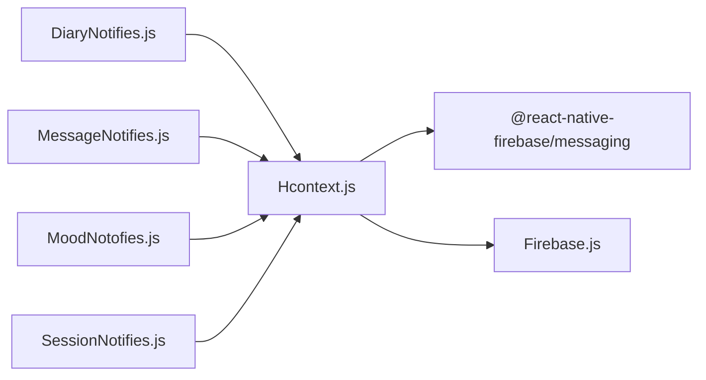

# Notifier Components

<cite>
**Referenced Files in This Document**
- [DiaryNotifies.js](file://src/components/notifiers/DiaryNotifies.js)
- [MessageNotifies.js](file://src/components/notifiers/MessageNotifies.js)
- [MoodNotofies.js](file://src/components/notifiers/MoodNotofies.js)
- [SessionNotifies.js](file://src/components/notifiers/SessionNotifies.js)
- [Hcontext.js](file://src/context/Hcontext.js)
- [Home.js](file://src/screens/Home/Home.js)
- [ManageBookings.js](file://src/screens/HappiTALK/ManageBookings.js)
- [Firebase.js](file://src/context/Firebase.js)
- [App.js](file://App.js)
- [Main.js](file://src/screens/Main.js)
</cite>

## Table of Contents
1. [Introduction](#introduction)
2. [Project Structure](#project-structure)
3. [Core Components](#core-components)
4. [Architecture Overview](#architecture-overview)
5. [Detailed Component Analysis](#detailed-component-analysis)
6. [Dependency Analysis](#dependency-analysis)
7. [Performance Considerations](#performance-considerations)
8. [Troubleshooting Guide](#troubleshooting-guide)
9. [Conclusion](#conclusion)

## Introduction
This document explains the notifier component system used for contextual alerts and reminders in HappiMynd. It focuses on four components:
- DiaryNotifies: Daily journal and habit tracking suggestions and reminders
- MessageNotifies: Messaging and communication alerts for ongoing chats
- MoodNotofies: Mood tracking and emotional well-being recommendations
- SessionNotifies: Therapy session reminders and scheduling alerts

It covers component implementation patterns, notification scheduling, user preference management, and integration with the application’s reminder system. It also explains how notifiers integrate with Firebase messaging and local notification services.

## Project Structure
Notifier components are located under src/components/notifiers and are integrated into the Home screen. They rely on the Hcontext provider for state and API access. Firebase is initialized separately for Firestore, while push notifications are handled via @react-native-firebase/messaging within Hcontext.

**Diagram sources**
- [Home.js:641-650](file://src/screens/Home/Home.js#L641-L650)
- [DiaryNotifies.js:31-145](file://src/components/notifiers/DiaryNotifies.js#L31-L145)
- [MessageNotifies.js:21-112](file://src/components/notifiers/MessageNotifies.js#L21-L112)
- [MoodNotofies.js:21-70](file://src/components/notifiers/MoodNotofies.js#L21-L70)
- [SessionNotifies.js:22-97](file://src/components/notifiers/SessionNotifies.js#L22-L97)
- [Hcontext.js:1-102](file://src/context/Hcontext.js#L1-L102)
- [Firebase.js:1-52](file://src/context/Firebase.js#L1-L52)

**Section sources**
- [Home.js:622-676](file://src/screens/Home/Home.js#L622-L676)
- [App.js:47-51](file://App.js#L47-L51)
- [Main.js:96-146](file://src/screens/Main.js#L96-L146)

## Core Components
- DiaryNotifies: Displays contextual suggestions for Happi services based on screening completion, subscription status, and verification state. It fetches subscriptions via Hcontext and conditionally sets a message.
- MessageNotifies: Shows an alert for continuing an ongoing chat with a psychologist, displaying unread message count and linking to the chat screen.
- MoodNotofies: Provides a recommendation based on the selected mood emoji (e.g., directing to HappiBUDDY or HappiSELF).
- SessionNotifies: Displays upcoming therapy sessions for today and navigates to ManageBookings when tapped.

Each component uses React hooks for lifecycle and state, consumes Hcontext for data, and renders a styled notification card with optional unread indicators.

**Section sources**
- [DiaryNotifies.js:31-145](file://src/components/notifiers/DiaryNotifies.js#L31-L145)
- [MessageNotifies.js:21-112](file://src/components/notifiers/MessageNotifies.js#L21-L112)
- [MoodNotofies.js:21-70](file://src/components/notifiers/MoodNotofies.js#L21-L70)
- [SessionNotifies.js:22-97](file://src/components/notifiers/SessionNotifies.js#L22-L97)

## Architecture Overview
The notifier system follows a unidirectional data flow:
- Components read from Hcontext state and call Hcontext methods.
- Hcontext manages device tokens, notification listeners, and exposes APIs for subscriptions, bookings, and messaging.
- Firebase initialization is separate for Firestore; push notifications are handled via @react-native-firebase/messaging inside Hcontext.

**Diagram sources**
- [Hcontext.js:80-127](file://src/context/Hcontext.js#L80-L127)
- [DiaryNotifies.js:64-100](file://src/components/notifiers/DiaryNotifies.js#L64-L100)
- [MessageNotifies.js:44-62](file://src/components/notifiers/MessageNotifies.js#L44-L62)
- [SessionNotifies.js:40-53](file://src/components/notifiers/SessionNotifies.js#L40-L53)

## Detailed Component Analysis

### DiaryNotifies
Implements contextual suggestion logic:
- On focus, checks screening completion and subscription/verification states to decide a message.
- If eligible, queries subscriptions and selects the next recommended Happi service.
- Uses navigation props to integrate with the app flow.

**Diagram sources**
- [DiaryNotifies.js:48-100](file://src/components/notifiers/DiaryNotifies.js#L48-L100)

**Section sources**
- [DiaryNotifies.js:31-145](file://src/components/notifiers/DiaryNotifies.js#L31-L145)
- [Home.js:641-646](file://src/screens/Home/Home.js#L641-L646)

### MessageNotifies
Displays an alert for continuing an ongoing chat:
- On focus, retrieves the currently assigned psychologist and unread message count.
- Renders a message card with an unread indicator and navigates to the chat screen on press.

**Diagram sources**
- [MessageNotifies.js:33-62](file://src/components/notifiers/MessageNotifies.js#L33-L62)
- [Hcontext.js:512-520](file://src/context/Hcontext.js#L512-L520)

**Section sources**
- [MessageNotifies.js:21-112](file://src/components/notifiers/MessageNotifies.js#L21-L112)
- [Home.js:649](file://src/screens/Home/Home.js#L649)

### MoodNotofies
Provides a recommendation based on the selected mood:
- Reads selectedMood from Hcontext.
- Conditionally recommends HappiBUDDY or HappiSELF depending on the mood selection.

**Diagram sources**
- [MoodNotofies.js:28-67](file://src/components/notifiers/MoodNotofies.js#L28-L67)
- [Hcontext.js:1497-1500](file://src/context/Hcontext.js#L1497-L1500)

**Section sources**
- [MoodNotofies.js:21-70](file://src/components/notifiers/MoodNotofies.js#L21-L70)
- [Home.js:647](file://src/screens/Home/Home.js#L647)

### SessionNotifies
Shows upcoming therapy sessions for today:
- On focus, calls myBookingUsers with bookingType "today".
- Displays a session count indicator and navigates to ManageBookings on press.

**Diagram sources**
- [SessionNotifies.js:33-53](file://src/components/notifiers/SessionNotifies.js#L33-L53)
- [Hcontext.js:1117-1128](file://src/context/Hcontext.js#L1117-L1128)
- [ManageBookings.js:474-494](file://src/screens/HappiTALK/ManageBookings.js#L474-L494)

**Section sources**
- [SessionNotifies.js:22-97](file://src/components/notifiers/SessionNotifies.js#L22-L97)
- [Home.js:649-650](file://src/screens/Home/Home.js#L649-L650)

## Dependency Analysis
- Components depend on Hcontext for:
  - Authentication and screening state
  - Subscription listings
  - Psychologist assignment and messaging
  - Booking retrieval
  - Device token and push notification setup
- Firebase initialization is present for Firestore; push notifications are configured via @react-native-firebase/messaging inside Hcontext.

**Diagram sources**
- [Hcontext.js:5-7](file://src/context/Hcontext.js#L5-L7)
- [Firebase.js:1-52](file://src/context/Firebase.js#L1-L52)

**Section sources**
- [Hcontext.js:80-127](file://src/context/Hcontext.js#L80-L127)
- [App.js:47-51](file://App.js#L47-L51)
- [Main.js:96-146](file://src/screens/Main.js#L96-L146)

## Performance Considerations
- Prefer minimal re-renders by using useFocusEffect for focused-triggered logic and avoiding unnecessary state updates.
- Debounce or cache subscription and booking queries to reduce network overhead.
- Keep message generation lightweight; avoid heavy computations in render paths.
- Use navigation guards to prevent redundant navigation calls.

## Troubleshooting Guide
Common issues and resolutions:
- Notifications not appearing:
  - Ensure notification permission is granted and device token is retrieved during Hcontext initialization.
  - Verify onMessage and onNotificationOpenedApp listeners are registered.
- Incorrect unread counts:
  - Confirm currentlyAssignedPsychologist returns the expected structure and unread message field.
- No sessions shown:
  - Validate myBookingUsers is called with the correct bookingType and that the response contains session_detail.
- Subscription suggestions not updating:
  - Ensure getSubscriptions is called after state changes and that the component re-focuses to trigger the effect.

**Section sources**
- [Hcontext.js:80-127](file://src/context/Hcontext.js#L80-L127)
- [MessageNotifies.js:44-62](file://src/components/notifiers/MessageNotifies.js#L44-L62)
- [SessionNotifies.js:40-53](file://src/components/notifiers/SessionNotifies.js#L40-L53)
- [DiaryNotifies.js:64-100](file://src/components/notifiers/DiaryNotifies.js#L64-L100)

## Conclusion
The notifier components provide contextual, timely reminders and suggestions across HappiMynd’s core journeys: journaling, messaging, mood tracking, and therapy sessions. They integrate tightly with Hcontext for state and API access, and leverage @react-native-firebase/messaging for push notification capabilities. The system is structured to be modular, testable, and maintainable, with clear separation of concerns between UI, state, and external services.