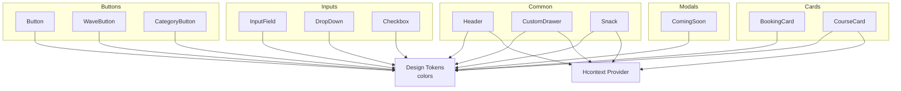
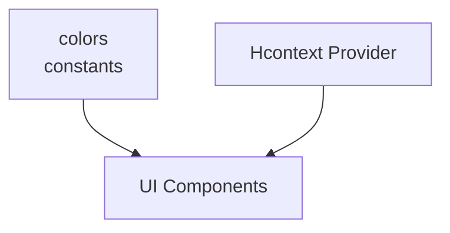
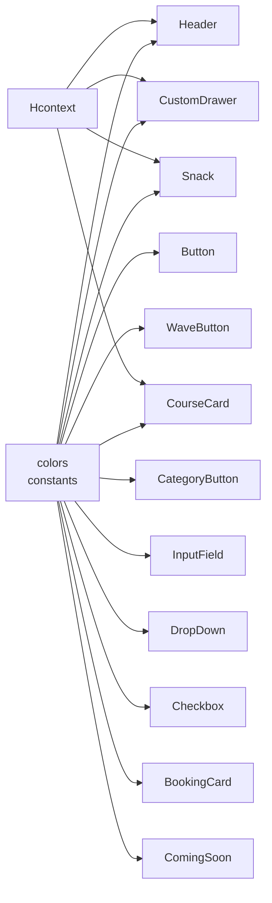
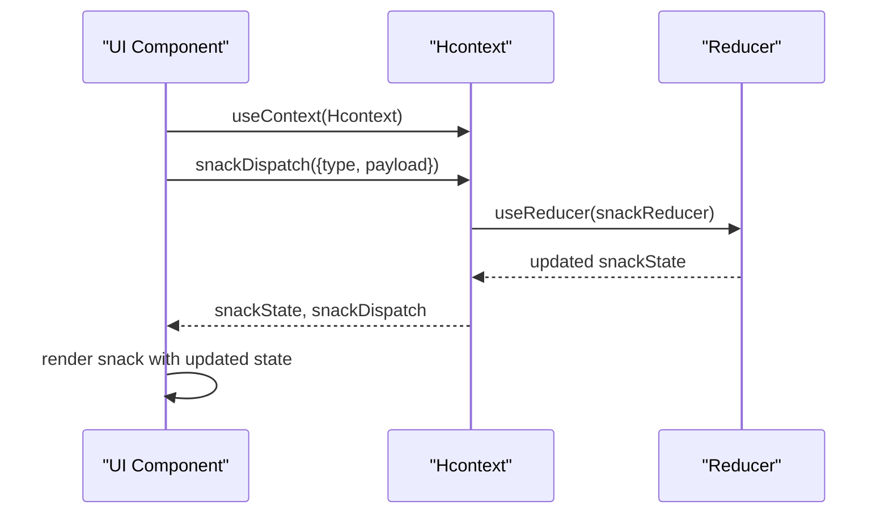

# UI Components System

<cite>
**Referenced Files in This Document**
- [src/assets/constants/index.js](file://src/assets/constants/index.js)
- [src/context/Hcontext.js](file://src/context/Hcontext.js)
- [src/components/common/Header.js](file://src/components/common/Header.js)
- [src/components/common/CustomDrawer.js](file://src/components/common/CustomDrawer.js)
- [src/components/common/Snack.js](file://src/components/common/Snack.js)
- [src/components/buttons/Button.js](file://src/components/buttons/Button.js)
- [src/components/buttons/WaveButton.js](file://src/components/buttons/WaveButton.js)
- [src/components/buttons/CategoryButton.js](file://src/components/buttons/CategoryButton.js)
- [src/components/input/InputField.js](file://src/components/input/InputField.js)
- [src/components/input/DropDown.js](file://src/components/input/DropDown.js)
- [src/components/input/Checkbox.js](file://src/components/input/Checkbox.js)
- [src/components/cards/BookingCard.js](file://src/components/cards/BookingCard.js)
- [src/components/cards/CourseCard.js](file://src/components/cards/CourseCard.js)
- [src/components/Modals/ComingSoon.js](file://src/components/Modals/ComingSoon.js)
</cite>

## Table of Contents
1. [Introduction](#introduction)
2. [Project Structure](#project-structure)
3. [Core Components](#core-components)
4. [Architecture Overview](#architecture-overview)
5. [Detailed Component Analysis](#detailed-component-analysis)
6. [Dependency Analysis](#dependency-analysis)
7. [Performance Considerations](#performance-considerations)
8. [Accessibility Guidelines](#accessibility-guidelines)
9. [Internationalization Support](#internationalization-support)
10. [Responsive Design Patterns](#responsive-design-patterns)
11. [Component Composition Strategies](#component-composition-strategies)
12. [State Management Integration](#state-management-integration)
13. [Design Tokens and Theme System](#design-tokens-and-theme-system)
14. [Component Variants and Customization](#component-variants-and-customization)
15. [Testing Strategies](#testing-strategies)
16. [Maintenance Best Practices](#maintenance-best-practices)
17. [Troubleshooting Guide](#troubleshooting-guide)
18. [Conclusion](#conclusion)

## Introduction
This document describes the HappiMynd UI component library and design system. It covers component architecture patterns, reusable and accessible components, responsive design, and the design system including color palettes, typography scales, spacing systems, and component variants. It also documents component categories (common, interactive, content), props/events, styling options, accessibility guidelines, internationalization, responsive patterns, composition strategies, state management integration, design tokens/theme customization, and maintenance practices.

## Project Structure
The UI components are organized by category under src/components:
- common: Header, CustomDrawer, Snack
- buttons: Button, WaveButton, CategoryButton
- input: InputField, DropDown, Checkbox
- cards: BookingCard, CourseCard
- Modals: Various modal components

Design tokens and global constants live under src/assets/constants. Global state and cross-cutting concerns are centralized via the Hcontext provider under src/context.

**Diagram sources**
- [src/components/common/Header.js:17-81](file://src/components/common/Header.js#L17-L81)
- [src/components/common/CustomDrawer.js:24-76](file://src/components/common/CustomDrawer.js#L24-L76)
- [src/components/common/Snack.js:9-32](file://src/components/common/Snack.js#L9-L32)
- [src/components/buttons/Button.js:18-40](file://src/components/buttons/Button.js#L18-L40)
- [src/components/buttons/WaveButton.js:14-37](file://src/components/buttons/WaveButton.js#L14-L37)
- [src/components/buttons/CategoryButton.js:16-48](file://src/components/buttons/CategoryButton.js#L16-L48)
- [src/components/input/InputField.js:19-63](file://src/components/input/InputField.js#L19-L63)
- [src/components/input/DropDown.js:14-66](file://src/components/input/DropDown.js#L14-L66)
- [src/components/input/Checkbox.js:13-35](file://src/components/input/Checkbox.js#L13-L35)
- [src/components/cards/BookingCard.js:16-224](file://src/components/cards/BookingCard.js#L16-L224)
- [src/components/cards/CourseCard.js:128-227](file://src/components/cards/CourseCard.js#L128-L227)
- [src/components/Modals/ComingSoon.js:21-70](file://src/components/Modals/ComingSoon.js#L21-L70)
- [src/assets/constants/index.js:1-14](file://src/assets/constants/index.js#L1-L14)
- [src/context/Hcontext.js:24-40](file://src/context/Hcontext.js#L24-L40)

**Section sources**
- [src/assets/constants/index.js:1-14](file://src/assets/constants/index.js#L1-L14)
- [src/context/Hcontext.js:24-40](file://src/context/Hcontext.js#L24-L40)

## Core Components
This section summarizes the primary building blocks and their roles:
- Header: Navigation affordances, branding, optional reward points display, integrated with white-label branding.
- CustomDrawer: Drawer content scaffold with user info and navigation items, brand footer based on white-label state.
- Snack: Global snackbar integration using a context-managed snack state.
- Button: Primary action with loading and disabled states.
- WaveButton: Decorative wave-styled button with background image.
- CategoryButton: Category selection with icon and background.
- InputField: Labeled input with optional password visibility toggle.
- DropDown: Select dropdown with search and placeholder behavior.
- Checkbox: Styled checkbox with custom visuals.
- BookingCard: Expandable booking card with collapsible details and pricing.
- CourseCard: Course tile with variant states (locked/open/video/completed) and actions.
- ComingSoon: Modal dialog with informational content and external link support.

**Section sources**
- [src/components/common/Header.js:17-81](file://src/components/common/Header.js#L17-L81)
- [src/components/common/CustomDrawer.js:24-76](file://src/components/common/CustomDrawer.js#L24-L76)
- [src/components/common/Snack.js:9-32](file://src/components/common/Snack.js#L9-L32)
- [src/components/buttons/Button.js:18-40](file://src/components/buttons/Button.js#L18-L40)
- [src/components/buttons/WaveButton.js:14-37](file://src/components/buttons/WaveButton.js#L14-L37)
- [src/components/buttons/CategoryButton.js:16-48](file://src/components/buttons/CategoryButton.js#L16-L48)
- [src/components/input/InputField.js:19-63](file://src/components/input/InputField.js#L19-L63)
- [src/components/input/DropDown.js:14-66](file://src/components/input/DropDown.js#L14-L66)
- [src/components/input/Checkbox.js:13-35](file://src/components/input/Checkbox.js#L13-L35)
- [src/components/cards/BookingCard.js:16-224](file://src/components/cards/BookingCard.js#L16-L224)
- [src/components/cards/CourseCard.js:128-227](file://src/components/cards/CourseCard.js#L128-L227)
- [src/components/Modals/ComingSoon.js:21-70](file://src/components/Modals/ComingSoon.js#L21-L70)

## Architecture Overview
The system follows a centralized design-token and state-driven architecture:
- Design tokens (colors) are imported by components to maintain visual consistency.
- Hcontext provides global state and actions, enabling cross-component communication and centralized behavior (e.g., snack notifications, white-label branding).
- Components are categorized and organized by feature domain, promoting reuse and discoverability.

**Diagram sources**
- [src/assets/constants/index.js:1-14](file://src/assets/constants/index.js#L1-L14)
- [src/context/Hcontext.js:24-40](file://src/context/Hcontext.js#L24-L40)

## Detailed Component Analysis

### Header Component
Purpose: Provide navigation affordances, logo rendering (brand-aware), and optional reward points display.

Key behaviors:
- Conditionally renders back arrow or drawer menu opener based on props.
- Renders white-labeled logo when available; otherwise uses default asset.
- Optional reward points display with navigation target.

Props:
- navigation: Navigation object for pop/openDrawer.
- showNav: Boolean to show/hide nav icon.
- showLogo: Boolean to show/hide logo.
- showBack: Boolean to switch icon to back behavior.
- showPoints: Boolean to show reward points area.
- rewardPoints: Numeric value to display.

Styling and responsiveness:
- Uses percentage-based dimensions for width/height and font scaling utilities.
- Uses vector icons for navigation affordances.

Integration:
- Consumes whiteLabelState from Hcontext to drive branding.

Accessibility:
- Uses touchable targets with explicit activeOpacity.
- Font families and sizes are defined via responsive units.

**Section sources**
- [src/components/common/Header.js:17-81](file://src/components/common/Header.js#L17-L81)
- [src/assets/constants/index.js:1-14](file://src/assets/constants/index.js#L1-L14)
- [src/context/Hcontext.js:24-40](file://src/context/Hcontext.js#L24-L40)

### CustomDrawer Component
Purpose: Drawer scaffold with user avatar, username, navigation list, and brand/footer metadata.

Key behaviors:
- Displays current username from auth state.
- Conditionally shows "Powered by HappiMynd" based on whiteLabelState.
- Shows platform-specific version string.

Props:
- None explicitly destructured; uses props spread to DrawerContentScrollView.

Styling and responsiveness:
- Percentage-based layout with consistent typography scale.

Integration:
- Reads authState and whiteLabelState from Hcontext.

**Section sources**
- [src/components/common/CustomDrawer.js:24-76](file://src/components/common/CustomDrawer.js#L24-L76)
- [src/context/Hcontext.js:24-40](file://src/context/Hcontext.js#L24-L40)

### Snack Component
Purpose: Global snackbar notification bound to snackState/snackDispatch.

Key behaviors:
- Automatically hides after a configurable duration.
- Dismiss action handled via dispatch.

Props:
- duration: Auto-hide delay.

Integration:
- Consumes snackState and snackDispatch from Hcontext.

**Section sources**
- [src/components/common/Snack.js:9-32](file://src/components/common/Snack.js#L9-L32)
- [src/context/Hcontext.js:24-40](file://src/context/Hcontext.js#L24-L40)

### Button Component
Purpose: Primary action with loading and disabled states.

Props:
- text: Button label.
- pressHandler: Callback for press.
- loading: Boolean to show spinner.
- disabled: Boolean to disable interaction.

Styling:
- Uses primary color from tokens and responsive sizing.

**Section sources**
- [src/components/buttons/Button.js:18-40](file://src/components/buttons/Button.js#L18-L40)
- [src/assets/constants/index.js:1-14](file://src/assets/constants/index.js#L1-L14)

### WaveButton Component
Purpose: Decorative wave-styled button with background image.

Props:
- width: Width percentage.
- height: Height percentage.
- text: Button label.
- pressHandler: Callback for press.

Styling:
- Background image applied via ImageBackground with percentage-based sizing.

**Section sources**
- [src/components/buttons/WaveButton.js:14-37](file://src/components/buttons/WaveButton.js#L14-L37)

### CategoryButton Component
Purpose: Category selection tile with background and icon.

Props:
- text: Category label.
- icon: Icon asset.
- iconSize: Icon size multiplier.
- pressHandler: Callback for press.

Behavior:
- Some categories are intentionally disabled.

**Section sources**
- [src/components/buttons/CategoryButton.js:16-48](file://src/components/buttons/CategoryButton.js#L16-L48)

### InputField Component
Purpose: Labeled input with optional password visibility toggle.

Props:
- title: Label text.
- placeHolder: Placeholder text.
- password: Boolean to enable secure entry and toggle.
- keyboardType: Keyboard type.
- onChangeText: Value change handler.
- value: Controlled value.
- editable: Editable flag.

Behavior:
- Password visibility toggle controlled internally.

**Section sources**
- [src/components/input/InputField.js:19-63](file://src/components/input/InputField.js#L19-L63)

### DropDown Component
Purpose: Select dropdown with optional search and placeholder.

Props:
- title: Label text.
- placeHolder: Default text.
- data: Array of selectable items.
- setSelectedData: Selection callback receiving the full item.
- search: Boolean to enable search.

Behavior:
- Maps data items to display names for dropdown and selection callbacks receive the original item.

**Section sources**
- [src/components/input/DropDown.js:14-66](file://src/components/input/DropDown.js#L14-L66)

### Checkbox Component
Purpose: Styled checkbox with custom visuals.

Props:
- title: Label text.
- checked: Checked state.
- setChecked: Toggle handler.

**Section sources**
- [src/components/input/Checkbox.js:13-35](file://src/components/input/Checkbox.js#L13-L35)

### BookingCard Component
Purpose: Expandable booking card with collapsible details and pricing.

Props:
- navigation: Navigation object.
- user: Psychologist/user data.
- userDetail: User context (e.g., individual vs organization).

Behavior:
- Collapsible section toggled by user interaction.
- Displays pricing and session details.
- Navigation to booking flow based on user type.

**Section sources**
- [src/components/cards/BookingCard.js:16-224](file://src/components/cards/BookingCard.js#L16-L224)

### CourseCard Component
Purpose: Course tile with variant states and actions.

Props:
- id, title, showIcon, type, pressHandler, disabled, isLiked, likesCount, fetchCourseList, course, navigation.

Variants:
- locked, unlocked/open, video/audio, completed, default/progress.

Actions:
- Like/unlike integration via Hcontext.
- Disabled state shows overlay and snack feedback.

**Section sources**
- [src/components/cards/CourseCard.js:128-227](file://src/components/cards/CourseCard.js#L128-L227)
- [src/context/Hcontext.js:24-40](file://src/context/Hcontext.js#L24-L40)

### ComingSoon Modal Component
Purpose: Informative modal with external link support.

Props:
- navigation, showModal, setShowModal.

Behavior:
- Backdrop and back button close the modal.
- Opens external WhatsApp link when tapped.

**Section sources**
- [src/components/Modals/ComingSoon.js:21-70](file://src/components/Modals/ComingSoon.js#L21-L70)

## Dependency Analysis
Components depend on:
- Design tokens (colors) for consistent theming.
- Hcontext for state and actions (e.g., snack notifications, white-label branding).
- Vector icons and third-party libraries for UI affordances.

**Diagram sources**
- [src/assets/constants/index.js:1-14](file://src/assets/constants/index.js#L1-L14)
- [src/context/Hcontext.js:24-40](file://src/context/Hcontext.js#L24-L40)
- [src/components/common/Header.js:17-81](file://src/components/common/Header.js#L17-L81)
- [src/components/common/CustomDrawer.js:24-76](file://src/components/common/CustomDrawer.js#L24-L76)
- [src/components/common/Snack.js:9-32](file://src/components/common/Snack.js#L9-L32)
- [src/components/buttons/Button.js:18-40](file://src/components/buttons/Button.js#L18-L40)
- [src/components/buttons/WaveButton.js:14-37](file://src/components/buttons/WaveButton.js#L14-L37)
- [src/components/buttons/CategoryButton.js:16-48](file://src/components/buttons/CategoryButton.js#L16-L48)
- [src/components/input/InputField.js:19-63](file://src/components/input/InputField.js#L19-L63)
- [src/components/input/DropDown.js:14-66](file://src/components/input/DropDown.js#L14-L66)
- [src/components/input/Checkbox.js:13-35](file://src/components/input/Checkbox.js#L13-L35)
- [src/components/cards/BookingCard.js:16-224](file://src/components/cards/BookingCard.js#L16-L224)
- [src/components/cards/CourseCard.js:128-227](file://src/components/cards/CourseCard.js#L128-L227)
- [src/components/Modals/ComingSoon.js:21-70](file://src/components/Modals/ComingSoon.js#L21-L70)

**Section sources**
- [src/assets/constants/index.js:1-14](file://src/assets/constants/index.js#L1-L14)
- [src/context/Hcontext.js:24-40](file://src/context/Hcontext.js#L24-L40)

## Performance Considerations
- Prefer percentage-based sizing and responsive font utilities to reduce layout thrash across devices.
- Avoid unnecessary re-renders by passing memoized handlers and stable objects to components.
- Use controlled inputs (value/onChangeText) to prevent redundant updates.
- Collapse expensive computations in components (e.g., formatting lists) to mount/useEffect.
- Keep modals lightweight; avoid heavy assets unless needed.
- Use ImageBackground sparingly; prefer scalable vector icons for performance.

## Accessibility Guidelines
- Touch targets: Ensure interactive elements meet minimum size thresholds.
- Focus order: Maintain logical tab order in forms and navigations.
- Color contrast: Use tokens to preserve sufficient contrast against backgrounds.
- Screen readers: Provide meaningful labels and announce state changes (e.g., snack messages).
- Disabled states: Respect disabled props and communicate disabled status visually and semantically.
- Keyboard navigation: Ensure all interactive elements are reachable via keyboard where applicable.

## Internationalization Support
- Centralize static text in constants/modules for translation keys.
- Use a translation library to resolve labels at render time.
- Parameterize dynamic content (e.g., counts, names) for pluralization and formatting.
- Avoid hard-coded strings inside components; pass translated strings via props.

## Responsive Design Patterns
- Use percentage-based widths/heights and responsive font utilities for scalable layouts.
- Maintain aspect ratios for images and backgrounds.
- Adjust paddings and margins proportionally across breakpoints.
- Test on multiple device sizes and orientations.

## Component Composition Strategies
- Favor small, single-responsibility components and compose them into larger structures.
- Pass minimal props; avoid prop drilling by using Hcontext for shared state.
- Encapsulate stateful logic (e.g., modals, dropdowns) within dedicated components.
- Use render props or children composition for flexible layouts.

## State Management Integration
- Hcontext aggregates global state and actions (auth, snack, white-label, filters, etc.).
- Components consume state via useContext and dispatch actions via dispatch functions.
- Keep state normalized and update via reducers to ensure predictable updates.

**Diagram sources**
- [src/context/Hcontext.js:24-40](file://src/context/Hcontext.js#L24-L40)

**Section sources**
- [src/context/Hcontext.js:24-40](file://src/context/Hcontext.js#L24-L40)

## Design Tokens and Theme System
Design tokens:
- colors: Backgrounds, borders, primary palette, loader, and chat bubble colors.

Typography scale:
- Poppins family is used across components with responsive font sizing.

Spacing system:
- Percentage-based spacing (wp/hp) and fixed paddings for consistent rhythm.

Theme customization:
- White-label branding is driven by whiteLabelState (logo, footer visibility).
- Override tokens per tenant by replacing the constants file or wrapping provider with overrides.

Brand consistency:
- All components import colors from a central constants file to ensure uniformity.

**Section sources**
- [src/assets/constants/index.js:1-14](file://src/assets/constants/index.js#L1-L14)
- [src/context/Hcontext.js:24-40](file://src/context/Hcontext.js#L24-L40)

## Component Variants and Customization
- Buttons: Primary, decorative wave style, category tiles.
- Inputs: Standard field, dropdown, checkbox.
- Cards: Booking and course variants with state-dependent actions.
- Modals: Informational dialogs with actionable outcomes.

Customization levers:
- Props for labels, icons, sizes, and handlers.
- Token overrides for colors and typography.
- Conditional rendering based on state (e.g., locked/open/completed).

## Testing Strategies
- Unit tests: Validate component rendering with different prop sets and state transitions.
- Interaction tests: Simulate user interactions (press, toggle, select) and assert side effects (dispatches, navigation).
- Accessibility tests: Verify focus order, labels, and contrast.
- Responsive tests: Snapshot test across device sizes using percentage-based layouts.
- Integration tests: Verify Hcontext-connected components update state correctly.

## Maintenance Best Practices
- Keep design tokens centralized and versioned.
- Normalize component APIs; prefer consistent prop naming across similar components.
- Document props/events/styling options per component.
- Refactor shared logic into custom hooks or higher-order components.
- Regularly audit unused assets and remove dead code.

## Troubleshooting Guide
- Snack not appearing: Ensure snackState/snackDispatch are wired and provider wraps the app.
- Logo not showing: Verify whiteLabelState.logo availability; fallback to default asset is automatic.
- Dropdown selection not updating: Confirm setSelectedData receives the full item and is used to update parent state.
- Button disabled unexpectedly: Check disabled/loading props and ensure pressHandler is passed.
- Modal not closing: Verify showModal/setShowModal bindings and backdrop/back button handlers.

**Section sources**
- [src/components/common/Snack.js:9-32](file://src/components/common/Snack.js#L9-L32)
- [src/components/common/Header.js:17-81](file://src/components/common/Header.js#L17-L81)
- [src/components/input/DropDown.js:14-66](file://src/components/input/DropDown.js#L14-L66)
- [src/components/buttons/Button.js:18-40](file://src/components/buttons/Button.js#L18-L40)
- [src/components/Modals/ComingSoon.js:21-70](file://src/components/Modals/ComingSoon.js#L21-L70)

## Conclusion
The HappiMynd UI component library emphasizes consistency, reusability, and scalability through centralized design tokens, a robust context provider, and modular components organized by category. By following the composition strategies, accessibility guidelines, and maintenance practices outlined here, teams can extend the system confidently while preserving brand identity and user experience across devices and locales.